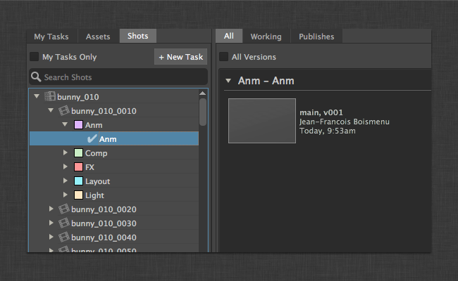
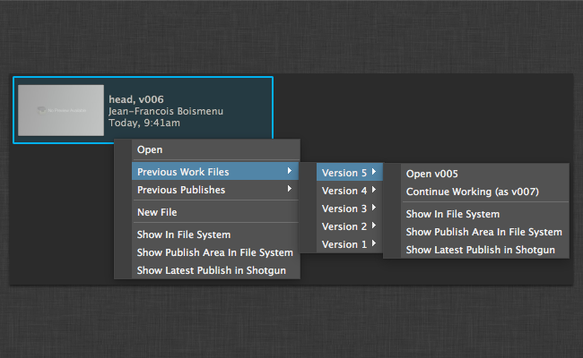
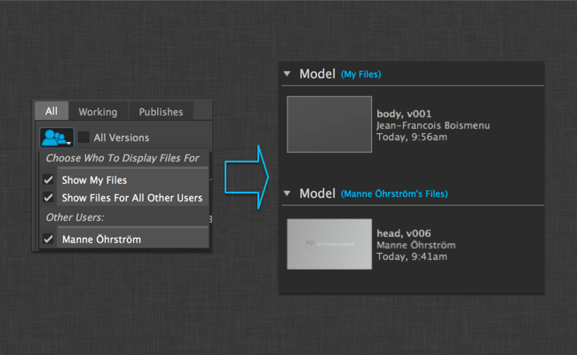
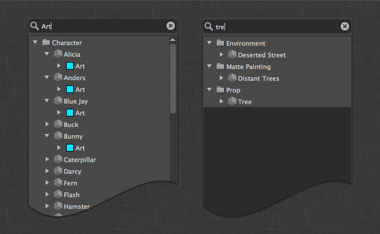
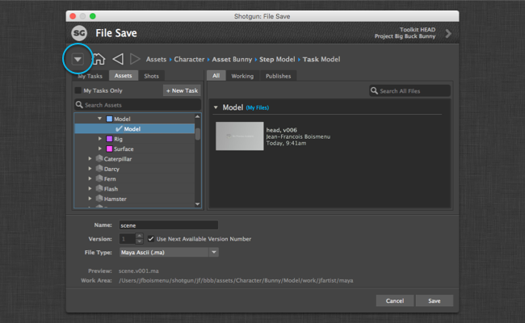
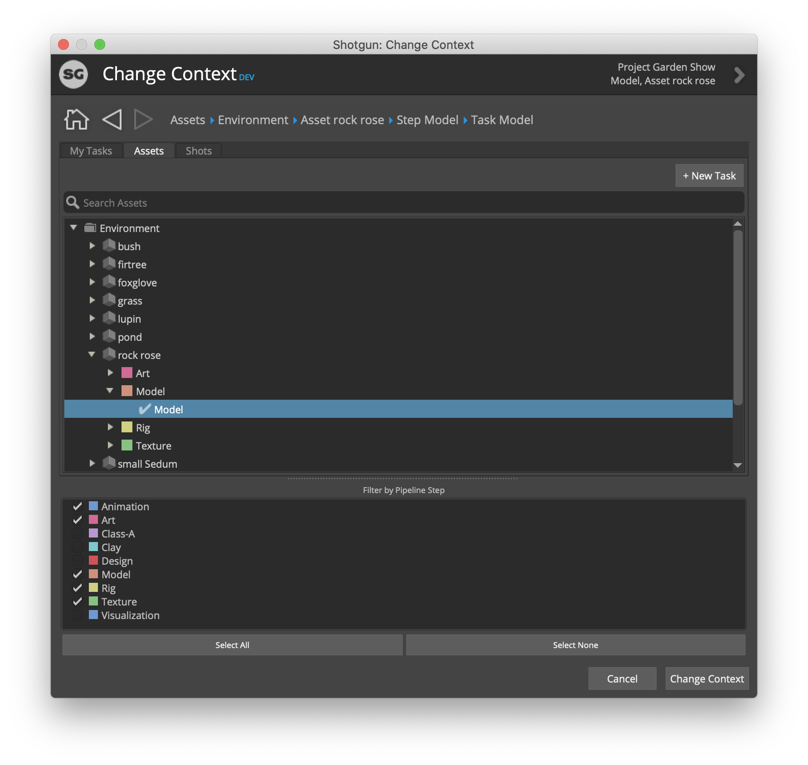
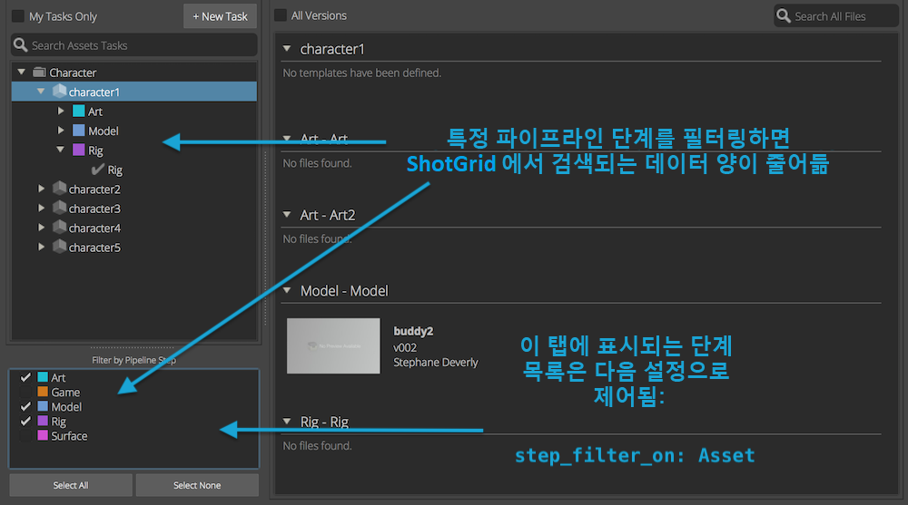
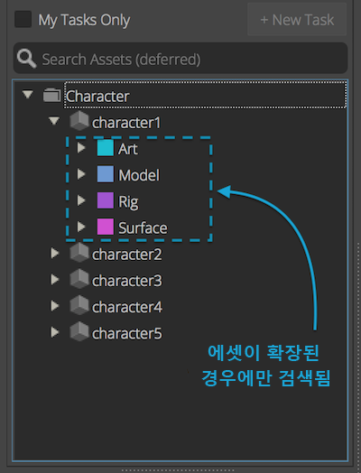

# Workfiles

## 파일 열기 대화상자

### 작업 영역 탐색


기본 대화상자는 두 부분으로 나뉩니다. 왼쪽에는 일련의 탭이 있습니다. 첫 번째 탭은 "내 태스크(My Tasks)"이며 현재 사용자에게 할당된 모든 태스크를 표시합니다.  웹 사이트의 "내 태스크(My Tasks)" 페이지를 연상케 합니다.

또는 엔티티 탭을 사용하여  엔티티를 탐색할 수도 있습니다. 기본적으로 작업 파일 응용프로그램은 해당 탭을 확인하여 샷 또는 에셋과 관련된 모든 태스크를 검색할 수 있습니다.

탭 세트는 환경 파일의 `entities` 설정을 통해 완전히 구성할 수 있습니다.

앱 설정에서 `show_file_open: true/false`를 설정하여 이 대화상자를 비활성화/활성화할 수 있습니다.

### 파일 찾기



오른쪽에는 왼쪽의 선택 항목과 관련된 작업 파일 및 게시가 표시됩니다. 작업 파일 및 게시는 "전체(All)", "작업(Working)" 및 "게시(Publishes)" 탭을 사용하여 함께 또는 각각 볼 수 있습니다.

### 이전 버전에 액세스



이전 버전에 액세스하는 방법에는 두 가지가 있습니다. 먼저 브라우저 상단에 있는 "모든 버전(All versions)" 상자를 클릭하면 버전을 확장하여 브라우저에 개별적으로 모두 나열할 수 있습니다. 또 다른 옵션으로는, 파일을 마우스 오른쪽 버튼으로 클릭하여 마지막 10개 버전에 액세스할 수 있습니다.

### 사용자 샌드박스



파이프라인 구성에서 사용자 샌드박스를 사용하는 경우 기본적으로 현재 사용자의 파일만 표시됩니다. 사용자가 다른 사용자 샌드박스의 파일을 보려면 맨 위에 있는 버튼을 사용하여 파일을 표시할 샌드박스를 선택할 수 있습니다.

### 결과 좁히기



텍스트를 입력하여 모든 뷰의 결과를 좁힐 수 있습니다. 검색은 항목의 이름과 일치합니다.

## 파일 저장 대화상자

기본적으로 "파일 저장(File Save)" 대화상자를 통해 사용자는 현재 컨텍스트에 파일을 저장할 수 있습니다. 씬 이름, 버전 번호 및 선택적 파일 확장자(사용 가능한 경우)를 묻는 메시지가 표시되고 "저장(Save)" 버튼이 회색으로 표시됩니다. 응용프로그램이 씬 이름에 대한 사용 가능한 다음 버전 번호를 확인한 후에야 오른쪽 하단에 있는 저장(Save) 버튼이 활성화됩니다.

앱 설정에서 `show_file_save: true/false`를 설정하여 이 대화상자를 비활성화/활성화할 수 있습니다.

### 다른 컨텍스트에 저장



다른 컨텍스트에 파일을 저장하려면, 대화상자의 왼쪽 상단에 있는 확장 버튼을 클릭하면 "파일 저장(File Save)" 대화상자가 확장되고 저장할 다른 컨텍스트를 선택할 수 있습니다.

### 파일 확장자 드롭다운 추가


새로운 파일 저장 대화상자를 사용하여 저장할 파일의 확장자를 선택할 수 있습니다. 이를 활성화하려면 파이프라인 구성의 `templates.yml` 파일을 조정해야 합니다. 먼저 토큰이 `templates.yml` 내의 토큰 목록에 정의되어야 합니다.

```yaml
maya_extension:
  type: str
  choices:
    ma: Maya Ascii (.ma)
    mb: Maya Binary (.mb)
  default: ma
  alias: extension
```

`maya_extension`은 토큰의 이름입니다. `choices`는 드롭다운에 표시될 파일 형식 사전입니다. 키(`ma` 및 `mb`)는 이 템플릿 토큰이 가질 수 있는 가능한 값입니다. 값(`Maya Ascii (.ma)` 및 `Maya Binary (.mb)`)은 툴킷 응용프로그램에서 사용할 수 있는 UI 설명입니다. `alias`는 작업 파일 응용프로그램에 필요한 힌트입니다. 응용프로그램에 이 토큰은 확장자이며 드롭다운 위젯에 표시되어야 함을 알려 줍니다.

그런 다음 이 토큰을 Maya 특정 템플릿에 추가할 수 있습니다.

```yaml
maya_shot_work:
  definition: "@shot_root/work/maya/{name}.v{version}.{maya_extension}"
  root_name: "primary"
```

## 컨텍스트 변경 대화상자



컨텍스트 변경 대화상자는 오른쪽에 파일 찾아보기 부분이 없다는 점을 제외하고 열기 대화상자와 비슷합니다. 태스크 또는 엔티티를 선택하고 컨텍스트 변경 버튼을 눌러 현재 엔진 컨텍스트를 변경할 수 있습니다.

앱 설정에서 `show_change_context: true/false`를 설정하여 이 대화상자를 비활성화/활성화할 수 있습니다.

## 단계 필터링

태스크를 검색할 때 `step`이 계층에 포함되어 있는 경우 파이프라인 단계 필터링을 사용하면 선택한 단계 목록에 링크된 태스크만 검색되므로 에서 검색되는 데이터의 양을 줄일 수 있습니다.

탭에 표시되는 단계 목록은 `step_filter_on` 설정으로 제어됩니다. 설정하지 않을 경우 기존의 모든 파이프라인 단계가 표시됩니다.

아래 예는 에셋 및 샷에 대한 태스크를 각각 표시하는 두 개의 탭을 정의합니다.

```yaml
- caption: Assets Tasks
  entity_type: Task
  step_filter_on: Asset
  filters:
    - [entity, type_is, Asset]
  hierarchy: [entity.Asset.sg_asset_type, entity, step, content]
- caption: Shots Tasks
  entity_type: Task
  step_filter_on: Shot
  filters:
    - [entity, type_is, Shot]
  hierarchy: [entity.Shot.sg_sequence, entity, step, content]
```



## 유예 쿼리

성능 향상을 위해 엔티티 트리를 빌드하는 과정을 두 단계의 쿼리로 나눌 수 있습니다.

- 첫 번째 쿼리는 에서 레코드를 검색하여 트리 상단을 채우는 데 사용됩니다.
- 두 번째 쿼리를 사용하여 사용자가 트리를 확장할 때 하위를 검색합니다.

다음 설정을 사용하면 앱이 시작될 때 에서 에셋 및 샷이 검색됩니다. 특정 에셋 또는 샷에 링크된 태스크는 트리 뷰에서 이 에셋 또는 샷을 선택하거나 확장한 경우에만 검색됩니다.

```yaml
entities:
  - caption: Assets
    entity_type: Asset
    hierarchy: [sg_asset_type, code]
    filters:
    sub_hierarchy:
      entity_type: Task
      filters:
      link_field: entity
      hierarchy: [step]
  - caption: Shots
    entity_type: Shot
    filters:
    hierarchy: [sg_sequence, code]
    sub_hierarchy:
      entity_type: Task
      filters:
      link_field: entity
      hierarchy: [step]
```


