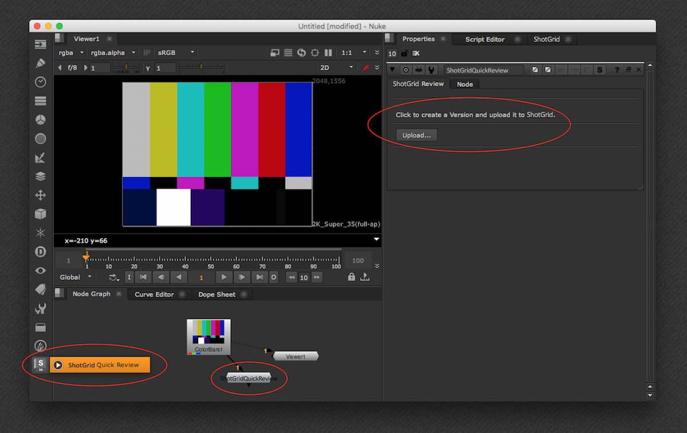
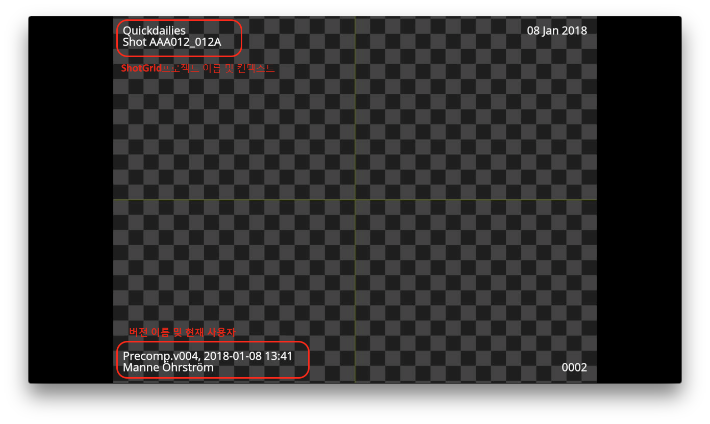

# Nuke Quickreview

Quickreview 앱을 사용하면 에서 리뷰를 위해 Nuke 렌더를 간편하게 제출할 수 있습니다. 각 Quickreview를 제출할 때마다 에 **버전**이 생성되어  Node 메뉴에 있는 Nuke의 노드로 나타납니다. 새 노드를 만들고 Nuke 네트워크에 연결하여 두 번 클릭한 후 Upload 버튼을 클릭하면 됩니다.

에서 버전이 생성되는 방법을 제어할 수 있도록 다음 UI가 제공됩니다.

다음 항목을 제어할 수 있습니다.

- 버전 이름은 현재 로드된 Nuke 스크립트를 기반으로 미리 입력되며 필요한 경우 조정할 수 있습니다.
- 버전과 관련된 엔티티 링크 및 태스크는 현재 컨텍스트를 기반으로 하며 조정할 수 있습니다.
- 제출할 프레임 범위를 조정할 수 있습니다.
- 생성된 버전을 재생 목록에 추가할 수 있습니다. 최근 재생 목록이 포함된 드롭다운이 표시됩니다.

업로드(Upload) 버튼을 누르면 Nuke에 Quicktime이 생성된 다음 에 업로드됩니다. 업로드되고 나면 다음 화면이 표시되며 Nuke의 기본 제공  Panel 또는 웹 오버레이 플레이어에 버전을 표시할 수 있습니다.

## 번인 및 슬레이트

기본적으로 앱은 슬레이트 및 번인 기능이 있는 Quicktime을 생성합니다.

## 커스터마이즈

대부분의 리뷰 제출 특성은 후크를 사용하여 조정할 수 있습니다. 설명서는 [여기](http://developer.shotgridsoftware.com/tk-nuke-quickreview)에서 찾을 수 있습니다.
