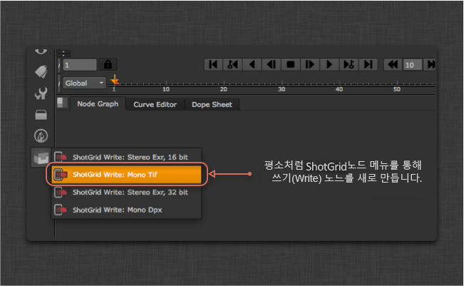
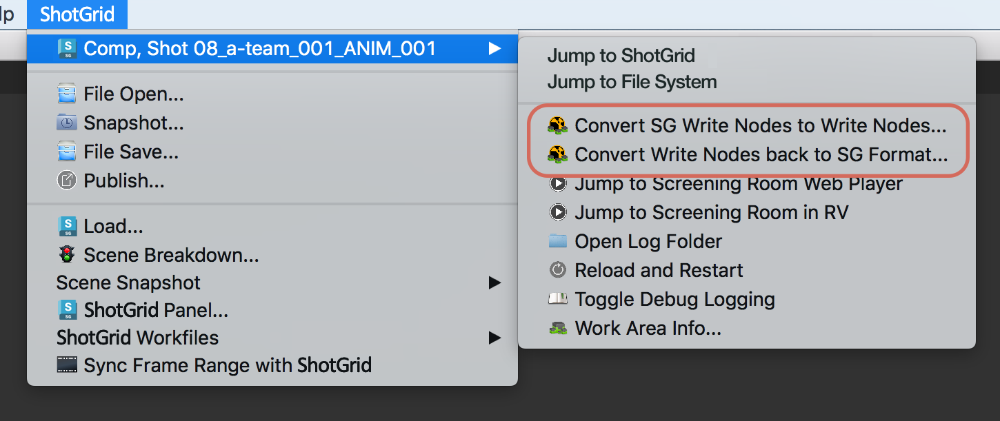

# Nuke Write Node

Nuke Write Node 앱은 이미지를 렌더링할 위치를 쉽게 표준화할 수 있는 커스텀  Write node를 제공합니다.  각 환경에 맞게 구성할 수 있습니다. 경로 외에도 구성에 따라 사용할 렌더 형식이 결정됩니다.

## 일반적인 사용

 Write Node를 사용하려면 먼저 스크립트를 툴킷 작업 파일로 저장한 다음 Nuke 메뉴를 통해 새 노드를 만듭니다. 이렇게 하면 일반적인 쓰기 노드와 비슷한 노드가 생성됩니다.


직접 경로를 입력하는 대신 출력 이름을 지정하면 툴킷이 나머지 경로를 자동으로 계산합니다. UI에서 계산된 경로를 보고 *파일 시스템에 표시(Show in File System)* 버튼을 클릭하여 디스크의 위치를 열 수 있습니다. 렌더가 작성되는 위치는 툴킷 구성에 따라 다릅니다.

렌더 버전이 지정되고 버전 번호의 경우 항상 Multi Publish를 사용하여 게시할 때 자동으로 증가되는 현재 Nuke 스크립트 버전을 따릅니다.

## 렌더 경로 재설정

Write Node는 현재 경로를 캐시하므로 파일이 툴킷 작업 영역 외부에서 열리는 경우에도 유효합니다. 경우에 따라 경로가 동기화되지 않고 '잠김' 상태가 될 수 있습니다. 렌더 경로가 잠겨 있으면 이 Write Node로 만든 렌더를 게시할 수 없습니다.

렌더 경로를 재설정하려면 Work-files 앱의 '씬 버전 올림(Version Up Scene)' 명령을 사용하여 씬의 버전을 증가시키거나 개별적으로 쓰기 노드를 선택하고 특성에서 **경로 재설정(Reset Path)**을 클릭합니다.


## 다른 Write Node 프로파일 추가

 Write Node는 Nuke의 기본 제공 쓰기 노드를 래핑하므로 Nuke에서 지원하는 모든 형식을 앱에서 사용할 수 있으며 구성을 통해 노드를 더 추가할 수 있습니다.  가장 간단한 시작 방법은 원하는 매개변수로 간단한 Nuke Write node를 설정하는 것입니다. 예를 들어 LZW 압축을 사용하는 16비트 tif를 작성한다고 가정해 보겠습니다. 텍스트 편집기에서 Nuke 스크립트를 보면 쓰기 노드는 다음과 같습니다.

```
Write {
    file /Users/ryanmayeda/Desktop/test.%04d.tif
    file_type tiff
    datatype "16 bit"
    compression LZW
    checkHashOnRead false
    name Write1
    xpos -145
    ypos -61
}
```

이 텍스트는 필요한 매개변수 이름과 값이 무엇인지 알려 줍니다. 이 경우에는 `datatype`과 `compression`입니다. 다음으로 환경 구성(예: `/path/to/pipeline/config/env/shot_step.yml`)으로 이동하여 `tk-nuke-writenode` 앱이 구성된 영역을 찾습니다. `settings`에서 다음 두 개의 매개변수를 사용하여 다른 Write Node를 추가합니다.

```yaml
tk-nuke-writenode:
  location: {name: tk-nuke-writenode, type: app_store, version: v0.1.6}
  template_script_work: nuke_shot_work
  ...
  write_nodes:
  - file_type: exr
    ...
  - file_type: dpx
    ...
  - file_type: tiff
    name: Mono Tif
    publish_template: nuke_shot_render_pub_mono_tif
    render_template: nuke_shot_render_mono_tif
    proxy_publish_template: null
    proxy_render_template: null
    settings: {datatype: 16 bit, compression: LZW}
    tank_type: Rendered Image
    tile_color: []
    promote_write_knobs: []
```

업데이트된 구성으로 인해 다음과 같이 Nuke에 추가  Write Node가 나타납니다.



__참고:__ 프로젝트 구성에서 찾을 수 있는 `templates.yml` 파일(`<configuration root>/config/core/templates.yml`)에 새 템플릿(예: nuke_shot_render_mono_tif)을 추가해야 합니다.

0.5 압축 및 4:2:2 하위 샘플링을 사용하여 JPEG로 출력하는  Write Node를 추가하는 방법을 보여 주는 또 다른 예가 아래에 나와 있습니다. 이 프로파일은 또한 "promote_write_knobs" 옵션을 사용하여 jpeg 품질 노브를 기즈모의 사용자 인터페이스로 승격합니다. 이렇게 하면 프로파일이 품질의 기본값을 설정할 수 있지만 사용자에게 직접 설정을 변경할 수 있는 슬라이더도 제공합니다.

```yaml
tk-nuke-writenode:
  write_nodes:
    - file_type: jpeg
      name: Compressed JPEG
      publish_template: nuke_shot_render_pub_jpeg
      render_template: nuke_shot_render_jpeg
      proxy_publish_template: null
      proxy_render_template: null
      settings: {_jpeg_quality: 0.5, _jpeg_sub_sampling: "4:2:2"}
      tank_type: Rendered Image
      tile_color: []
      promote_write_knobs: [_jpeg_quality]
```

### 쓰기 노브 승격

위의 프로파일 예에서 볼 수 있듯이 캡슐화된 쓰기 노드의 노브는  Write Node의 특성 패널에 표시되도록 승격될 수 있습니다. 승격된 쓰기 노브는 프로파일의 일부로 정의되며 노브 이름으로 식별됩니다. 여러 개의 노브를 승격할 수 있습니다.

## 렌더 팜 통합

스튜디오에서는 [Deadline](https://deadline.thinkboxsoftware.com/)과 같이 작업 관리 도구를 실행하는 렌더 팜을 사용하는 것이 일반적이며, 렌더링할 때 일반적으로 Nuke를 직접 시작합니다. 이러한 도구는  인식 방식(예: 데스크톱 또는 `tank` 명령을 통해)으로 Nuke를 시작하지 않기 때문에  Write node에는 실행에 필요한 정보가 없습니다. 이 제한을 해결하기 위한 몇 가지 옵션을 제공합니다.

###  Write node를 표준 Nuke Write node로 변환

간단한 솔루션은 렌더링할 스크립트를 보내기 전에  Write node를 일반 Nuke Write node로 변환하는 것입니다. 두 가지 옵션이 있습니다. 1. 변환 메뉴 옵션을 활성화하여 사용할 수 있습니다. 2. 앱에서 API 변환 방식을 사용할 수 있습니다.

#### 변환 메뉴 옵션 활성화

환경 yml 파일에는 앱 설정에 추가할 수 있는 `show_convert_actions`라는 구성 옵션이 있습니다. `show_convert_actions: True` 설정을 추가할 경우 *SG Write Node를 Write Node로 변환..*(Convert SG Write Nodes to Write Nodes...) 및 *Write Node를 다시 SG 형식으로 변환...*(Convert Write Nodes back to SG format...) 메뉴 옵션을 사용할 수 있습니다.



그러나 쓰기 노브를 승격하는 것으로 정의된  Write node 프로파일이 있는 경우에는 `show_convert_actions`가 `True`로 설정된 경우에도 이러한 메뉴 옵션이 숨겨집니다. 이는 현재 다시 변환 기능이 승격된 노브를 지원하지 않기 때문입니다.

#### API를 사용하여 변환

`tk-nuke-writenode` 앱에서 `convert_to_write_nodes()` 방식을 사용하여 이 변환을 수행할 수 있습니다.

스크립트의 모든  Write node를 일반 Nuke Write node로 변환하려면 Nuke 내부에서 다음 코드를 실행합니다.

```python
import sgtk
eng = sgtk.platform.current_engine()
app = eng.apps["tk-nuke-writenode"]
if app:
    app.convert_to_write_nodes()
```

이렇게 하면 씬에서  Write node가 제거되므로 렌더링할 스크립트의 복사본을 만들어 복사본에 대한 변환을 수행하고 복사본을 팜에 제출하는 것이 좋습니다. 씬에는 더 이상 툴킷 참조가 없으므로 렌더 팜에서 Nuke 스크립트가 열린 경우 툴킷이 필요하지 않습니다.

**참고:** 해당 `convert_from_write_nodes()` 방식을 사용할 수 있지만 데이터 무결성을 보장하기 위해 파이프라인의 일부가 아닌 디버깅용으로만 사용하는 것이 좋습니다.

### init.py를 사용하여  Pipeline Toolkit 엔진 부트스트랩(Bootstrap)

Nuke는 플러그인 경로에 있는 `init.py` 스크립트를 실행합니다. 이 옵션은 `init.py`에 코드를 추가하는 것으로 구성되어 `tk-nuke` 엔진의 최소 부트스트랩(Bootstrap)을 수행하므로  Write node가 렌더 팜에서 예상대로 작동합니다.

이 워크플로우에는 몇 가지 단계가 있습니다. 첫째,  인식 Nuke 세션에서 실행되는 "사전" 제출 스크립트는 팜 작업 환경을 설정하는 데 사용되는 데이터를 가져옵니다. 다음으로 렌더 팜에서  세션을 인증하는 데 사용되는 추가 환경 변수는 렌더 팜 관리자가 설정합니다. 마지막으로,  부트스트랩(Bootstrap) 코드가 있는 `init.py`는 렌더 팜의 Nuke 세션이 탐지하고 실행하는 위치에 배치되어 세션 내에서 `tk-nuke` 엔진을 부트스트랩하고  Write node가 제대로 작동하도록 할 수 있습니다.

#### 1. 사전 제출 스크립트

이 접근법은 아티스트가 Nuke의  인식 세션에서 팜 작업을 제출한다고 가정합니다. 제출 시간에 다음 코드를 실행해야 합니다. 현재 Nuke 세션에서 툴킷 컨텍스트, 파이프라인 구성 URI, Toolkit Core API 위치 등과 같은 환경 정보를 가져와 렌더 작업에 전달될 사전에 입력되며 환경 변수를 설정하는 데 사용됩니다.

```python
# Populating environment variables from running Nuke:
# http://developer.shotgridsoftware.com/tk-core/platform.html#sgtk.platform.create_engine_launcher
current_engine = sgtk.platform.current_engine()
launcher = sgtk.platform.create_engine_launcher(
     current_engine.sgtk,
     current_engine.context,
     current_engine.name
)

# Get a dictionary with the following keys:
# SHOTGUN_SITE: The  site url
# SHOTGUN_ENTITY_TYPE: The  Entity type, e.g. Shot
# SHOTGUN_ENTITY_ID: The  Entity id, e.g. 1234
environment = launcher.get_standard_plugin_environment()

# Get the current pipeline config descriptor
environment["SHOTGUN_CONFIG_URI"] = os.path.join(current_engine.sgtk.configuration_descriptor.get_uri(),"config")

# Get the current tk-core installation path
environment["SHOTGUN_SGTK_MODULE_PATH"] = sgtk.get_sgtk_module_path()
```

이 정보를 수집하면 렌더 제출 도구로 전달할 수 있습니다. 이 프로세스는 사용 중인 렌더 팜 관리 시스템에 따라 다릅니다. 렌더 제출 스크립트를 작성하는 방법에 대한 자세한 정보는 팜 관리 시스템 문서를 참조하십시오.

#### 2.  인증

초기화하려면 부트스트랩(Bootstrap) API의 툴킷 관리자에게 스크립트 사용자가 필요합니다. 이 예에서는 사이트 이름, 스크립트 사용자 및 스크립트 키가 팜 컴퓨터에 환경 변수로 존재한다고 가정합니다. 일반적으로 렌더 팜 관리자가 관리합니다. 다음은 코드에서 예상하는 환경 변수 이름과 샘플 값입니다.

```
SHOTGUN_SITE = “https://mysitename.shotgunstudio.com”
SHOTGUN_FARM_SCRIPT_USER = “sg_api_user”
SHOTGUN_FARM_SCRIPT_KEY = “xxxxxxxxxxxxxxxxxxxxxxxxxxxxxxxxxxxxxxxxxxxxxxxxxxxxxxx”
```

인증에 대한 자세한 정보는 [개발자 문서](http://developer.shotgridsoftware.com/tk-core/authentication.html)를 참조하십시오.

**스크립트 사용자 보안에 대한 참고 사항:** 관리자(Admin) 레벨의 권한을 갖지 않도록 팜에서 사용하는 스크립트 사용자를 잠그는 것이 좋습니다. [API 사용자 권한에 대한 자세한 정보는 여기를 참조하십시오.](https://developer.shotgridsoftware.com/bbae2ca7/)

#### 3. init.py 스크립트

이 시점에서 툴킷 환경 데이터는 렌더 제출 도구에서 전달되고 인증 데이터는 렌더 팜 컴퓨터에서 환경 변수에 있습니다. 렌더 작업 내에서 툴킷을 부트스트랩(Bootstrapping)하는 마지막 단계는 Nuke의 플러그인 경로에 다음 예제 `init.py` 코드를 배치하여 Nuke가 시작될 때 이를 시작하도록 하는 것입니다. (자세한 정보는 [시작 스크립트에 대한 Foundry의 문서](http://docs.thefoundry.co.uk/nuke/63/pythondevguide/startup.html)를 참조하십시오.)

```python
# This script shows how a Toolkit as a plugin approach could be used to bootstrap
# Toolkit in Nuke on the render farm.
# http://developer.shotgridsoftware.com/tk-core/bootstrap.html#bootstrapping-toolkit

import sys
import os

# If your render nodes can access the same tk-core install location as
# artist workstations, retrieve its path from the environment and ensure
# it is in the PYTHONPATH
TK_CORE_PATH = os.environ["SHOTGUN_SGTK_MODULE_PATH"]
if TK_CORE_PATH not in sys.path:
    sys.path.append(TK_CORE_PATH)

# If your render nodes don’t have access to the Toolkit Core API in the same filesystem location as artist workstations, you have to make sure that it is available in the PYTHONPATH, so that render nodes can import it. An easy way
# to install tk-core in a centralized location is with pip. You can read more
# about it here:
# http://developer.shotgridsoftware.com/tk-core/bootstrap.html#installing-the-sgtk-module-using-pip

import sgtk

# Authenticate using a pre-defined script user.
sa = sgtk.authentication.ShotgunAuthenticator()

# Here we retrieve credentials from environment variables, assuming a script user
# will be used when rendering. This should be typically be handled by your render
# farm administrators.
SG_SITE_URL = os.environ["SHOTGUN_SITE"]
SG_SCRIPT_USER = os.environ["SHOTGUN_FARM_SCRIPT_USER"]
SG_SCRIPT_KEY = os.environ["SHOTGUN_FARM_SCRIPT_KEY"]
user = sa.create_script_user(
    api_script=SG_SCRIPT_USER,
    api_key=SG_SCRIPT_KEY,
    host=SG_SITE_URL
)

# Start up a Toolkit Manager with our script user
mgr = sgtk.bootstrap.ToolkitManager(sg_user=user)

# Set the base pipeline configuration from the environment variable:
mgr.base_configuration = os.environ["SHOTGUN_CONFIG_URI"]

# Disable  lookup to ensure that we are getting the Pipeline
# Configuration defined in SHOTGUN_CONFIG_URI, and not a dev or override
# Pipeline Configuration defined in .
mgr.do_shotgun_config_lookup = False

# Set a plugin id to indicate to the bootstrap that we are starting
# up a standard Nuke integration
mgr.plugin_id = "basic.nuke"

# Retrieve the Toolkit context from environment variables:
# SHOTGUN_SITE: The  site url
# SHOTGUN_ENTITY_TYPE: The  Entity type, e.g. Shot
# SHOTGUN_ENTITY_ID: The  Entity id, e.g. 1234
sg_entity = mgr.get_entity_from_environment()

# Now start up the Nuke engine for a given  Entity
nuke_engine = mgr.bootstrap_engine("tk-nuke", entity=sg_entity)
```

구성이 이 예제보다 복잡하거나 Nuke(`.nk`) 스크립트 대신 `-t` 플래그를 사용하여 명령행에 Python 스크립트를 전달하는 경우 이를 확장해야 할 수도 있습니다.

#### Deadline 관련 단계

Deadline은 렌더링 시 Nuke 스크립트를 임시 위치에 복사할 수 있습니다. 이렇게 하면 파일이 더 이상 인식할 수 있는 디스크 위치에 있지 않으므로 툴킷에 문제가 발생합니다. 이 동작을 비활성화하고 원본 위치에서 스크립트를 로드하려면 다음을 수행합니다.

1. Deadline에서 도구(Tools) > 플러그인 구성(Configure Plugin)으로 이동합니다(수퍼 유저 모드에서).
2. '경로 매핑 활성화(Enable Path Mapping)' 옵션을 비활성화합니다.

## 기술적 상세 정보

다음은 앱에서 사용할 수 있는 API 방식입니다.

### get_write_nodes()

현재 씬의 모든  Write node 목록을 반환합니다.

`list` app.get_write_nodes()

**매개변수 및 반환값**

* **반환값:** `list` - 씬에서 발견되는 툴킷 쓰기 노드 목록입니다.

**예시**

```python
>>> import sgtk
>>> eng = sgtk.platform.current_engine()
>>> app = eng.apps["tk-nuke-writenode"]
>>> nodes = app.get_write_nodes()
```

### get_node_name()

지정된 쓰기 노드의 이름을 반환합니다.

`string` get_node_name(`node` 노드)

**매개변수 및 반환값**

* `node` **노드** - 쿼리할 쓰기 노드입니다.
* **반환값:** `string` - 노드의 이름입니다.

**예시**
```python
>>> import sgtk
>>> eng = sgtk.platform.current_engine()
>>> app = eng.apps["tk-nuke-writenode"]
>>> nodes = app.get_write_nodes()
>>> app.get_node_name(nodes[0])
```

### get_node_profile_name()

지정된 쓰기 노드에서 사용하는 구성 프로파일의 이름을 가져옵니다.

`string` get_node_profile_name(`node` 노드)

**매개변수 및 반환값**

* `node` **노드** - 쿼리할 쓰기 노드입니다.
* **반환값:** `string` - 구성에 정의된 대로 이 쓰기 노드에 대한 프로파일 이름입니다.

**예시**
```python
>>> import sgtk
>>> eng = sgtk.platform.current_engine()
>>> app = eng.apps["tk-nuke-writenode"]
>>> nodes = app.get_write_nodes()
>>> app.get_node_profile_name(nodes[0])
```

### get_node_render_path()

지정된 쓰기 노드가 이미지를 렌더링할 경로를 가져옵니다.

`string` get_node_render_path(`node` 노드)

**매개변수 및 반환값**

* `node` **노드** - 쿼리할 쓰기 노드입니다.
* **반환값:** `string` - 이 노드의 렌더 경로입니다.

**예시**
```python
>>> import sgtk
>>> eng = sgtk.platform.current_engine()
>>> app = eng.apps["tk-nuke-writenode"]
>>> nodes = app.get_write_nodes()
>>> app.get_node_render_path(nodes[0])
```

### get_node_render_files()

지정된 쓰기 노드에 대해 렌더링된 모든 이미지 파일 목록을 가져옵니다.

`list` get_node_render_files(`node` 노드)

**매개변수 및 반환값**

* `node` **노드** - 쿼리할 쓰기 노드입니다.
* **반환값:**`list` - 이 쓰기 노드에 의해 렌더링된 이미지 파일의 목록입니다.

**예시**
```python
>>> import sgtk
>>> eng = sgtk.platform.current_engine()
>>> app = eng.apps["tk-nuke-writenode"]
>>> nodes = app.get_write_nodes()
>>> app.get_node_render_files(nodes[0])
```

### get_node_render_template()

구성에 정의된 대로 지정된 쓰기 노드에 대해 렌더링된 이미지를 기록할 위치를 결정하는 템플릿을 가져옵니다.

`template` get_node_render_template(`node` 노드)

**매개변수 및 반환값**

* `node` **노드** - 쿼리할 쓰기 노드입니다.
* **반환값:** `template` - 이 노드를 사용하도록 구성된 렌더 템플릿입니다.

**예시**
```python
>>> import sgtk
>>> eng = sgtk.platform.current_engine()
>>> app = eng.apps["tk-nuke-writenode"]
>>> nodes = app.get_write_nodes()
>>> app.get_node_render_template(nodes[0])
```

### get_node_publish_template()

구성에 정의된 대로 지정된 쓰기 노드에 대해 렌더링된 이미지를 게시할 위치를 결정하는 템플릿을 가져옵니다.

`template` get_node_publish_template(`node` 노드)

**매개변수 및 반환값**

* `node` **노드** - 쿼리할 쓰기 노드입니다.
* **반환값:** `template` - 이 노드를 사용하도록 구성된 게시 템플릿입니다.

**예시**
```python
>>> import sgtk
>>> eng = sgtk.platform.current_engine()
>>> app = eng.apps["tk-nuke-writenode"]
>>> nodes = app.get_write_nodes()
>>> app.get_node_publish_template(nodes[0])
```

### get_node_proxy_render_path()

지정된 쓰기 노드가 프록시 이미지를 렌더링할 경로를 가져옵니다.

`string` get_node_proxy_render_path(`node` 노드)

**매개변수 및 반환값**

* `node` **노드** - 쿼리할 쓰기 노드입니다.
* **반환값:** `string` - 이 노드의 프록시 렌더 경로입니다.

**예시**
```python
>>> import sgtk
>>> eng = sgtk.platform.current_engine()
>>> app = eng.apps["tk-nuke-writenode"]
>>> nodes = app.get_write_nodes()
>>> app.get_node_proxy_render_path(nodes[0])
```

### get_node_proxy_render_files()

지정된 쓰기 노드에 대해 렌더링된 모든 프록시 이미지 파일 목록을 가져옵니다.

`list` get_node_proxy_render_files(`node` 노드)

**매개변수 및 반환값**

* `node` **노드** - 쿼리할 쓰기 노드입니다.
* **반환값:** `list` - 이 쓰기 노드에 의해 렌더링된 프록시 이미지 파일의 목록입니다.

**예시**
```python
>>> import sgtk
>>> eng = sgtk.platform.current_engine()
>>> app = eng.apps["tk-nuke-writenode"]
>>> nodes = app.get_write_nodes()
>>> app.get_node_proxy_render_files(nodes[0])
```

### get_node_proxy_render_template()

구성에 정의된 대로 지정된 쓰기 노드에 대해 렌더링된 프록시 이미지를 기록할 위치를 결정하는 템플릿을 가져옵니다.

지정된 노드에 대해 프록시 렌더 템플릿이 구성되어 있지 않으면 대신 일반 렌더 템플릿이 반환됩니다.

`template` get_node_proxy_render_template(`node` 노드)

**매개변수 및 반환값**

* `node` **노드** - 쿼리할 쓰기 노드입니다.
* **반환값:** `template` - 이 노드를 사용하도록 구성된 프록시 렌더 템플릿입니다.

**예시**
```python
>>> import sgtk
>>> eng = sgtk.platform.current_engine()
>>> app = eng.apps["tk-nuke-writenode"]
>>> nodes = app.get_write_nodes()
>>> app.get_node_proxy_render_template(nodes[0])
```

### get_node_proxy_publish_template()

구성에 정의된 대로 지정된 쓰기 노드에 대해 렌더링된 프록시 이미지를 게시할 위치를 결정하는 템플릿을 가져옵니다.

지정된 노드에 대해 프록시 게시 템플릿이 구성되어 있지 않으면 대신 일반 게시 템플릿이 반환됩니다.

`template` get_node_proxy_publish_template(`node` 노드)

**매개변수 및 반환값**

* `node` **노드** - 쿼리할 쓰기 노드입니다.
* **반환값:** `template` - 이 노드를 사용하도록 구성된 프록시 게시 템플릿입니다.

**예시**
```python
>>> import sgtk
>>> eng = sgtk.platform.current_engine()
>>> app = eng.apps["tk-nuke-writenode"]
>>> nodes = app.get_write_nodes()
>>> app.get_node_proxy_publish_template(nodes[0])
```

### get_node_published_file_type()

구성에 정의된 대로 지정된 쓰기 노드에 의해 렌더링된 이미지에 대해 게시된 파일을 만들 때 사용할 게시된 파일 형식을 가져옵니다.

`string` get_node_published_file_type(`node` 노드)

**매개변수 및 반환값**

* `node` **노드** - 쿼리할 쓰기 노드입니다.
* **반환값:** `string` - 이 노드를 사용하도록 구성된 게시된 파일 형식입니다.

**예시**
```python
>>> import sgtk
>>> eng = sgtk.platform.current_engine()
>>> app = eng.apps["tk-nuke-writenode"]
>>> nodes = app.get_write_nodes()
>>> app.get_node_published_file_type(nodes[0])
```

### generate_node_thumbnail()

지정된 쓰기 노드에 대한 썸네일을 생성합니다. 그러면 최대 크기 800x800px의 시퀀스 중간에서 임시 파일(.png)로 프레임이 렌더링됩니다. 이 파일이 더 이상 필요하지 않을 경우 호출자가 정리해야 합니다.

`string` generate_node_thumbnail(`node` 노드)

**매개변수 및 반환값**

* `node` **노드** - 쿼리할 쓰기 노드입니다.
* **반환값:** `string` - 디스크상의 렌더링된 썸네일 이미지에 대한 경로입니다.

**예시**
```python
>>> import sgtk
>>> eng = sgtk.platform.current_engine()
>>> app = eng.apps["tk-nuke-writenode"]
>>> nodes = app.get_write_nodes()
>>> app.generate_node_thumbnail(nodes[0])
```

### reset_node_render_path()

지정된 쓰기 노드의 렌더 경로를 현재 스크립트와 일치하도록 재설정합니다.

`None` reset_node_render_path(`node` 노드)

**매개변수 및 반환값**

* `node` **노드** - 쿼리할 쓰기 노드입니다.
* **반환값:** `None` - 값이 반환되지 않습니다.

**예시**
```python
>>> import sgtk
>>> eng = sgtk.platform.current_engine()
>>> app = eng.apps["tk-nuke-writenode"]
>>> nodes = app.get_write_nodes()
>>> app.reset_node_render_path(nodes[0])
```

### is_node_render_path_locked()

지정된 쓰기 노드의 렌더 경로가 잠겨 있는지 여부를 결정합니다.

`bool` is_node_render_path_locked(`node` 노드)

**매개변수 및 반환값**

* `node` **노드** - 쿼리할 쓰기 노드입니다.
* **반환값:** `bool` - 렌더 경로가 잠겨 있으면 True이고, 그렇지 않으면 False입니다.

**예시**
```python
>>> import sgtk
>>> eng = sgtk.platform.current_engine()
>>> app = eng.apps["tk-nuke-writenode"]
>>> nodes = app.get_write_nodes()
>>> app.is_node_render_path_locked(nodes[0])
```

### convert_to_write_nodes()

현재 스크립트에 있는 모든  Write node를 일반 Nuke Write node로 변환합니다.  추가 툴킷 정보는 'tk_*'라는 사용자 노브에 저장됩니다.

`None` convert_to_write_nodes()

**예시**
```python
>>> import sgtk
>>> eng = sgtk.platform.current_engine()
>>> app = eng.apps["tk-nuke-writenode"]
>>> app.convert_to_write_nodes()
```

### convert_from_write_nodes()

이전에  Write node에서 변환된 모든 일반 Nuke Write node를 다시  Write node로 변환합니다.

`None` convert_from_write_nodes()

**예시**
```python
>>> import sgtk
>>> eng = sgtk.platform.current_engine()
>>> app = eng.apps["tk-nuke-writenode"]
>>> app.convert_from_write_nodes()
```

### process_placeholder_nodes()

모든 자리 표시자 노드를 전체  Write node로 변환합니다.  이 방식은 주로 Nuke에서 스크립트를 처음 열 때 Hiero 툴킷 스크립트 내보내기로 만든 자리 표시자 노드를 변환하는 데 사용됩니다.

`None` process_placeholder_nodes()

**예시**
```python
>>> import sgtk
>>> eng = sgtk.platform.current_engine()
>>> app = eng.apps["tk-nuke-writenode"]
>>> app.process_placeholder_nodes()
```
