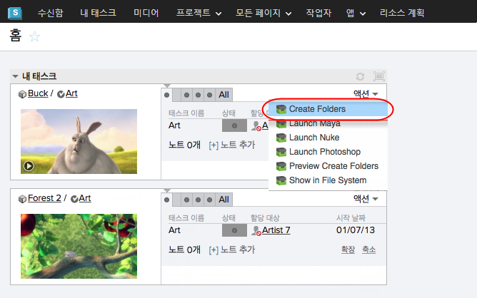
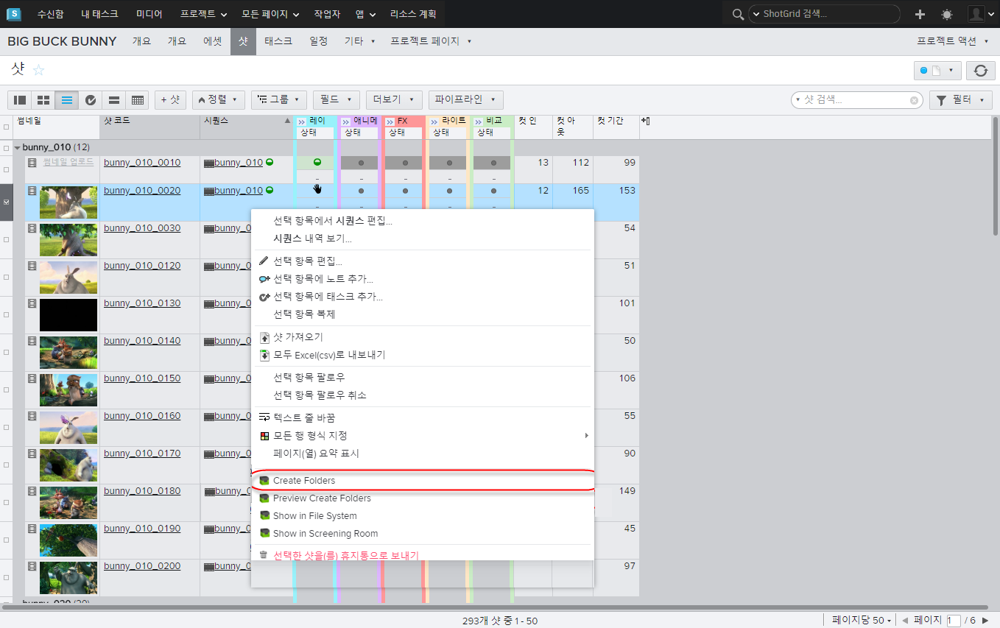

# Shotgun Folders

 Toolkit에는 구성을 기반으로 표준화된 디렉토리 구조를 만드는 시스템이 내장되어 있습니다. 따라서 여러 샷에 대해 일관된 파일 시스템 레이아웃을 쉽고 빠르게 생성할 수 있습니다.

이 앱은 를 사용하여 Sgtk Core API의 파일 시스템 생성 API 방식을 후크합니다. 덕분에 폴더 생성이 쉬워집니다. 샷 또는 에셋 집합을 선택하고 폴더 만들기(Create Folders) 액션을 클릭하기만 하면 됩니다.

## 작동 방식
구성에 따라 하나 이상의 태스크, 샷 또는 다른 엔티티를 선택하기만 하면 됩니다. 이제 액션(Actions) 메뉴에서 폴더 만들기(Create Folders)를 선택합니다. 프로세스가 완료되면 생성된 폴더 수에 대한 보고서가 제공됩니다.

