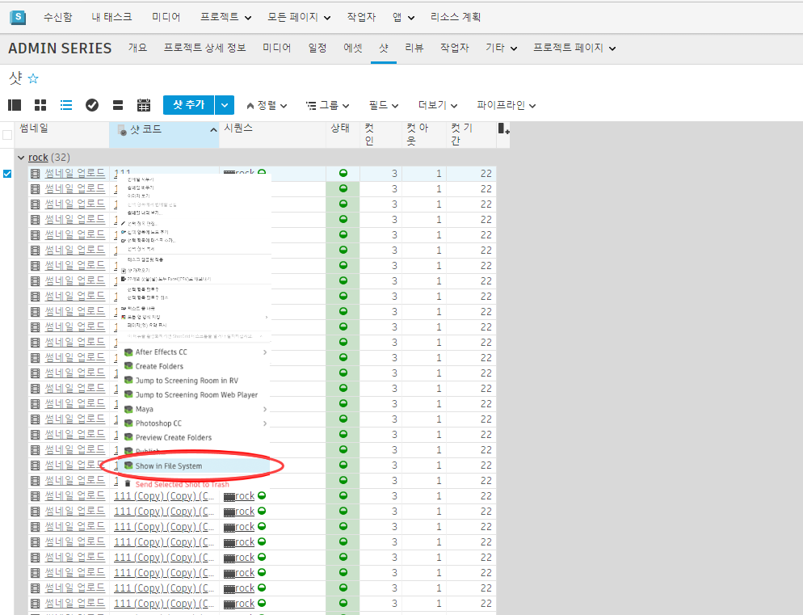

# ShotGrid Launch Folder

Launch Folder 앱은 에서 파일 시스템으로 이동할 수 있는  유틸리티입니다.

## 작동 방식

Launch Folder 앱을 사용하면 에서 파일 시스템으로 이동할 수 있습니다. 샷, 에셋 및 시퀀스와 같은  엔티티 유형에 등록할 수 있습니다. 활성화되면 액션(Action) 메뉴에 표시됩니다.

에서 하나 또는 여러 항목을 선택할 수 있으며 메뉴 액션을 클릭하면 표준 파일 브라우저가 시작됩니다(Windows의 탐색기, Mac의 Finder 등).
