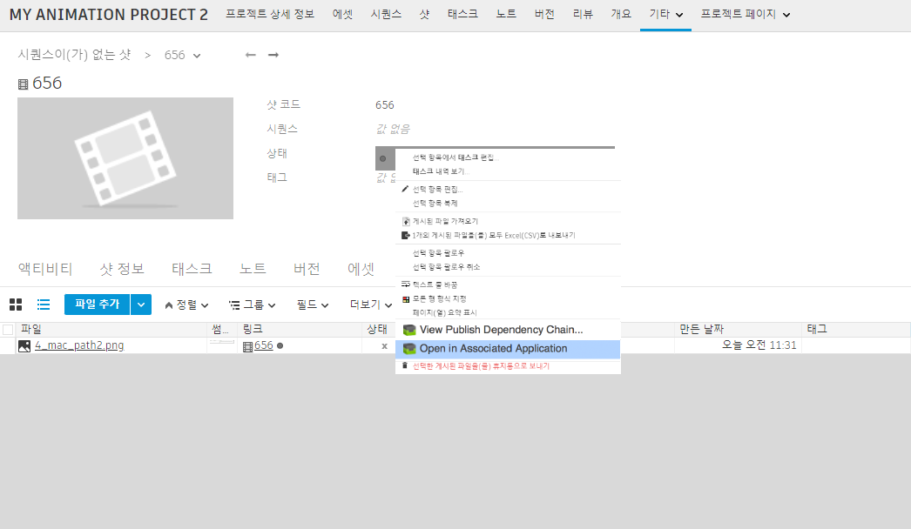

# ShotGrid Launch Publish

이 앱은 의 게시된 파일 엔티티에 "연결된 응용프로그램에서 열기(Open in Associated Application)" 액션을 추가합니다. 이렇게 하면 이미 게시된 파일을 쉽게 열 수 있습니다. 해당 파일을 찾아 마우스 오른쪽 버튼으로 클릭한 다음 액션을 선택하면 됩니다.

이 앱을 사용하면 여러 파일에 대해 다양한 앱 실행 시퀀스를 간편하게 구성할 수 있으며 이 모든 작업은 후크 내에서 수행됩니다. 또한 뷰어(예: RV)에 이미지 시퀀스를 디스패치합니다. 후크에서 인식되지 않는 파일은 OS 수준의 앱으로 디스패치됩니다.