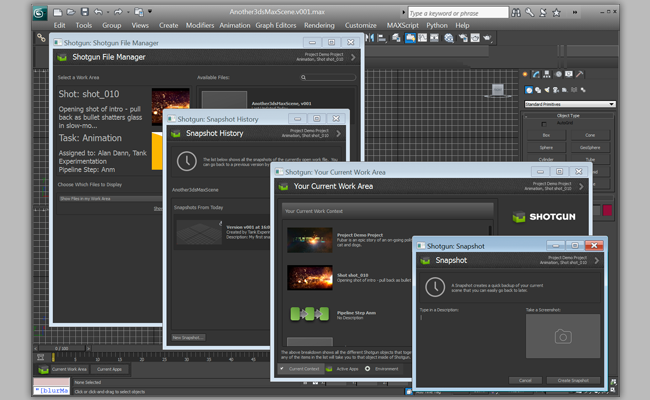
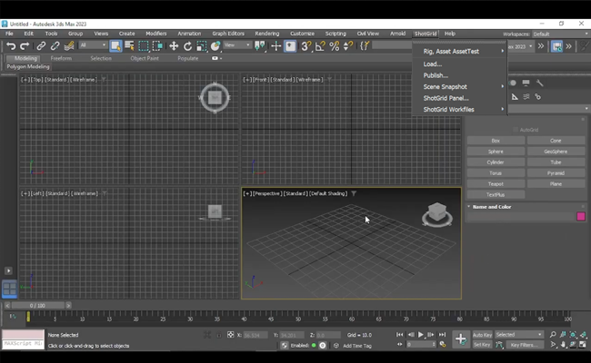

# 3dsMax Plus

3ds Max Plus용  엔진은 3ds Max 응용프로그램과  Pipeline Toolkit을 연결합니다. 이 엔진은 PySide 및 모든 다중 앱을 지원합니다. 즉, 3ds Max 내부에서 표준 앱(Maya, Nuke 등에서도 작동하는 동일한 앱)을 실행할 수 있습니다. 이 엔진은 3ds Max Plus Python API를 사용합니다.




## 지원되는 응용프로그램 버전

이 항목은 테스트를 거쳐 다음 응용프로그램 버전에서 작동하는 것으로 알려져 있습니다.



## 문서화

이 엔진은 Max Plus의 Python 지원을 통해  Pipeline Toolkit(Sgtk)과 3ds Max를 연결합니다.



## 설치 및 업데이트

###  Pipeline Toolkit에 이 엔진 추가

asset 환경의 XYZ 프로젝트에 이 엔진을 추가하려면 다음 명령을 실행합니다.

```
> tank Project XYZ install_engine asset tk-3dsmaxplus
```

### 최신 버전으로 업데이트

프로젝트에 이 항목이 이미 설치되어 있는 경우 최신 버전을 얻으려면 update 명령을 실행할 수 있습니다. 특정 프로젝트와 함께 제공되는 tank 명령을 탐색하여 다음과 같이 실행할 수 있습니다.

```
> cd /my_tank_configs/project_xyz
> ./tank updates
```

또는 스튜디오 tank 명령을 실행하고 업데이트 확인을 실행할 프로젝트 이름을 지정할 수 있습니다.

```
> tank Project XYZ updates
```


## 협업 및 개선

 Pipeline Toolkit에 액세스할 수 있다면 모든 앱, 엔진 및 프레임워크가 저장 및 관리되는 Github에서 그 소스 코드에도 액세스할 수 있습니다. 이러한 항목을 자유롭게 개선하여 향후 독립적인 개발을 위한 기반으로 사용하고 변경 후 다시 사용자 요청을 제출하거나, 아니면 그냥 조금만 손을 보고 어떻게 빌드되었는지, 툴킷이 어떻게 작동하는지 확인해 보십시오. https://github.com/shotgunsoftware/tk-3dsmaxplus에서 이 코드 리포지토리에 액세스할 수 있습니다.

## 특별 요구 사항

이 기능을 이용하려면  Pipeline Toolkit Core API 버전 v0.19.18 이상이 필요합니다.
