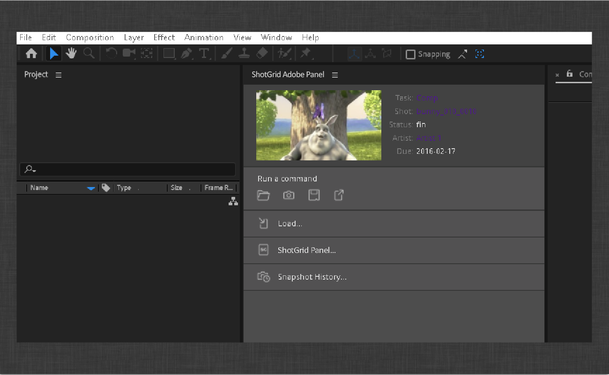
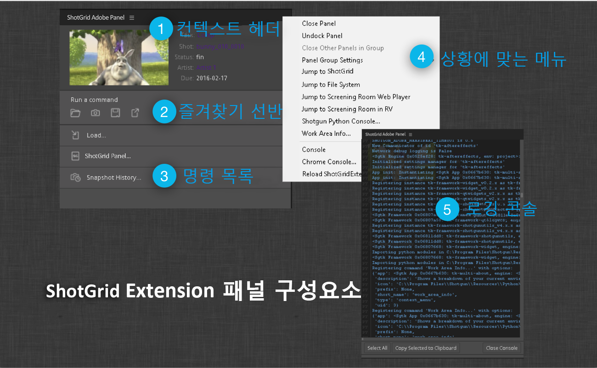
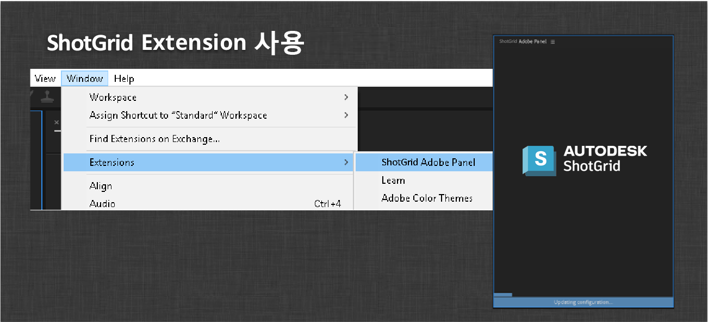
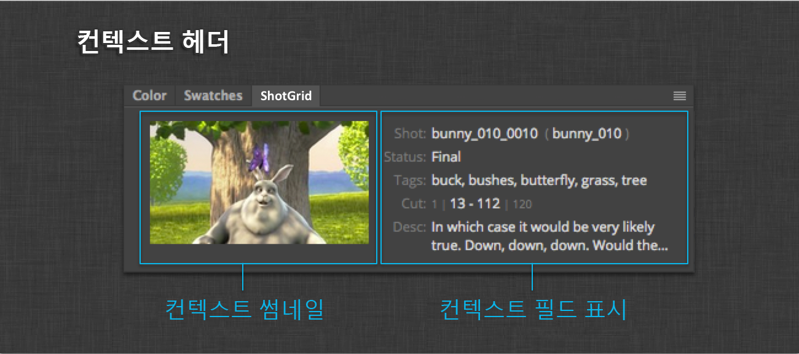
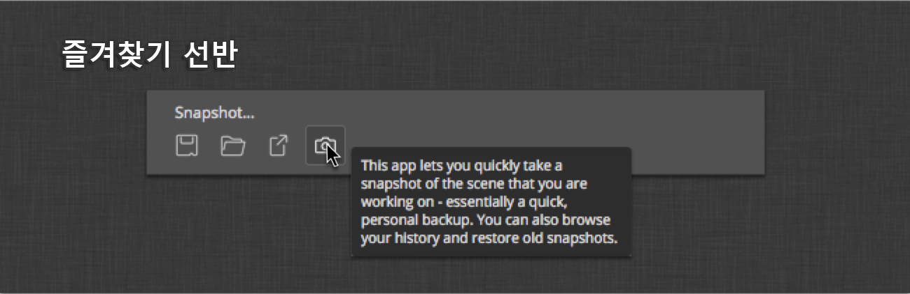
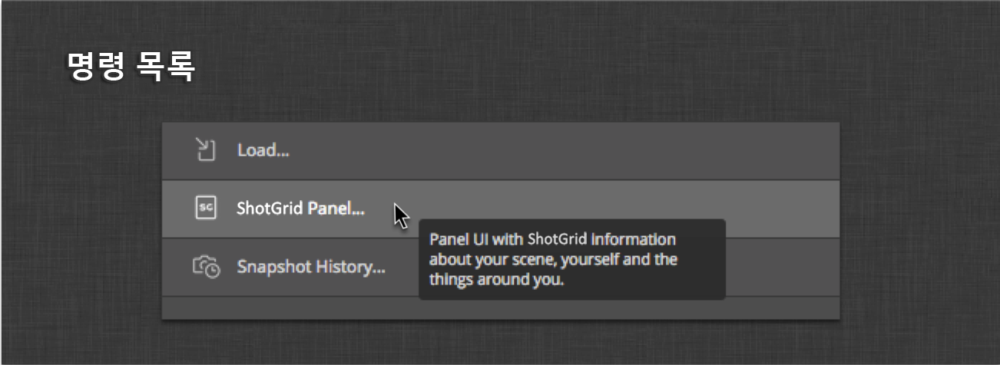
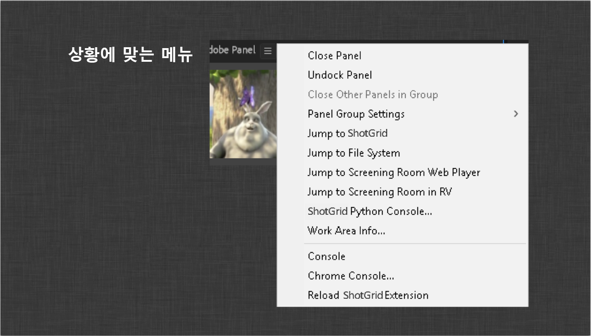
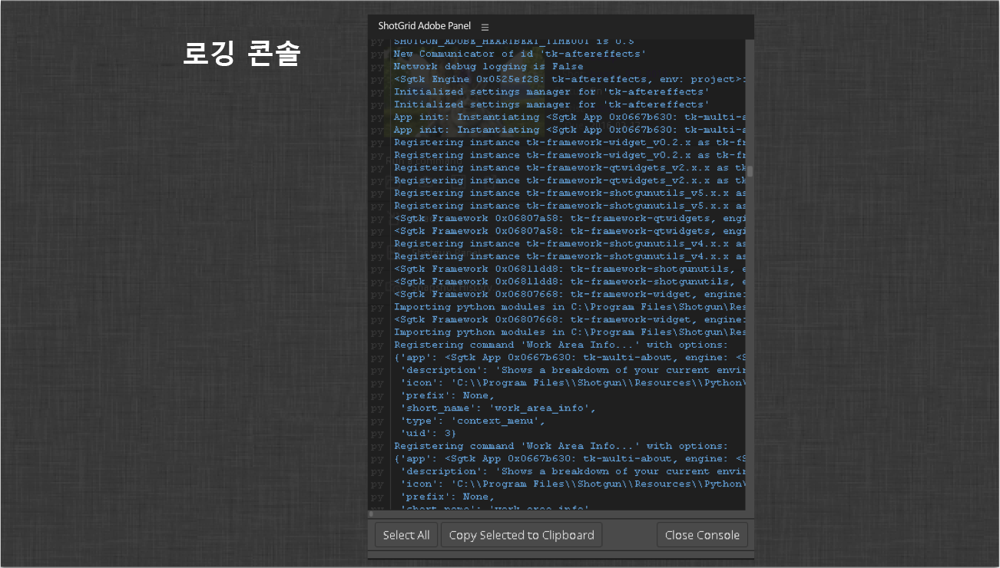

# After Effects

After Effects용  엔진은 After Effects 워크플로우에 를 통합하기 위한 플랫폼을 제공합니다. 이는 표준  Toolkit 엔진으로 구성되며 [tk-framework-adobe](https://github.com/shotgunsoftware/tk-framework-adobe)(CEP)를 사용합니다.

일단 활성화되면 After Effects에서 ** Adobe Panel**을 이용할 수 있게 됩니다.  컨텍스트에 대한 정보와 현재 해당 컨텍스트에 설치된 앱에 등록된 명령을 표시합니다.



# 인터페이스 개요

 익스텐션 패널은 기본 After Effects 패널과 동일한 색상 팔레트 및 기본 레이아웃을 사용합니다. 익스텐션 패널은 다음 다섯 가지 구성요소로 이루어져 있습니다.



1. **컨텍스트 헤더** - 현재 컨텍스트에 대한 썸네일 및 필드입니다.
2. **즐겨찾기 쉘프** - 현재 컨텍스트에서 가장 많이 사용되는 앱을 표시하도록 디자인되었습니다.
3. **명령 목록** - 현재 컨텍스트에서 자주 사용되지 않는 모든 명령입니다.
4. **상황에 맞는 메뉴** - 추가 컨텍스트 관련 명령 및 디버깅 도구입니다.
5. **로깅 콘솔** - 디버깅용 로깅 출력을 표시하는 콘솔 오버레이입니다.

# 설치

After Effects용  엔진의 설치는 다른  통합과 동일한 방식을 따릅니다. 엔진 및 앱 설치에 대한 자세한 정보는 [툴킷 관리](https://support.shotgunsoftware.com/hc/ko/articles/219033178-Administering-Toolkit) 문서를 참조하십시오. 또한 통합 구성 방법의 예로 [기본 툴킷 구성](https://github.com/shotgunsoftware/tk-config-default2)을 참조할 수 있습니다.

# 익스텐션 활성화

익스텐션이 설치되면 After Effects의 익스텐션 메뉴를 통해 익스텐션을 실행해야 합니다.



이 작업은 한 번만 수행하면 되고  익스텐션 패널은 이후에는 시작할 때 활성화하지 않아도 After Effects 레이아웃에 표시됩니다.

활성화하고 이후에 시작하면  통합이 부트스트랩(Bootstrapping)되는 동안 익스텐션 패널에 로딩 화면이 표시됩니다.

이 화면은 일반적으로 현재 컨텍스트가 결정되고 명령이 표시되기까지 몇 초 동안 표시됩니다.

# 인터페이스 구성요소

다음 섹션에서는  After Effects 통합의 구성요소를 간략하게 설명합니다.

## 컨텍스트 헤더

컨텍스트 헤더는 현재  컨텍스트에 대한 정보를 표시할 수 있는 커스터마이즈 가능 영역입니다.



컨텍스트는 현재 활성 문서에 의해 결정됩니다. 엔진에서 컨텍스트가 결정되면 헤더가 업데이트되어 컨텍스트의 썸네일 필드 상세 정보가 표시됩니다. 필드 정보는 후크로 제어됩니다. 필드 표시를 커스터마이즈하는 방법에 대한 자세한 정보는 아래의 **컨텍스트 필드 표시 후크** 섹션을 참조하십시오.

또한  열기가 사용된 경우에만 컨텍스트 전환이 인식된다는 것도 유의해야 합니다.

## 즐겨찾기 쉘프

즐겨찾기 쉘프는 Maya 및 Houdini와 같은 다른  DCC 통합에서 사용할 수 있는 메뉴 즐겨찾기와 유사합니다. 이 인터페이스 섹션에서는 가장 일반적으로 사용되는 툴킷 앱을 컨텍스트 헤더 바로 아래에서 쉽게 사용할 수 있고 쉽게 찾습니다.



쉘프는 즐겨찾는 명령을 버튼으로 표시하며, 버튼 위에 마우스 커서를 놓으면 회색 음영에서 색상으로 전환되고 상단의 레이블에 이름이 표시됩니다. 버튼 위에 마우스 커서를 놓으면 버튼에 대한 툴팁이 표시됩니다.

버튼 중 하나를 클릭하면 실행하도록 등록된 명령에 대한 콜백이 트리거됩니다.

명령 즐겨찾기를 지정하는 방법에 대한 자세한 정보는 아래의 **쉘프 즐겨찾기** 섹션을 참조하십시오.

## 명령 목록

명령 목록에는 현재 컨텍스트에 대해 등록된 다른 "일반" 명령이 표시됩니다.



일반적으로 파이프라인 구성 내에 설치된 앱은 여기에 표시되는 하나 이상의 명령을 등록합니다. 명령이 즐겨찾기로 식별되지 않고 상황에 맞는 메뉴 명령으로도 식별되지 않는 경우 여기에 표시됩니다.

명령 목록 버튼은 즐겨찾기 쉘프의 버튼과 비슷한 방식으로 동작합니다. 유일한 차이점은 아이콘의 오른쪽에 전체 이름이 있는 목록으로 표시된다는 점입니다.

## 상황에 맞는 메뉴

상황에 맞는 메뉴 명령으로 등록된 모든 명령은  익스텐션 패널의 상황에 맞는 메뉴에 표시됩니다.



다른 명령 영역과 마찬가지로 이러한 명령은 컨텍스트와 함께 변경됩니다. **(으)로 이동(Jump to )** 및 **파일 시스템으로 이동(Jump to Filesystem)**과 같은 명령은 항상 여기에서 사용할 수 있습니다.

## 로깅 콘솔

로깅 콘솔에는 CEP Javascript 인터프리터 및 툴킷의 Python 프로세스의 모든 로깅 출력이 표시됩니다.



익스텐션에 문제가 있어 지원이 필요한 경우 로깅 콘솔 출력은  지원 팀이 문제를 디버깅하는 데 매우 유용합니다.

# 구성 및 기술 상세 정보

다음 섹션에서는 스튜디오 파이프라인의 특정 요구 사항으로 통합을 구성할 수 있는 통합의 보다 기술적인 측면에 대해 설명합니다.

## PySide

After Effects용  엔진은 PySide를 사용합니다. [PySide 설치](http://pyside.readthedocs.io/en/latest/installing/index.html)에 대한 공식 지침을 참조하십시오.

## CEP 익스텐션

익스텐션 자체는 엔진과 함께 번들로 제공되며 엔진은 After Effects를 처음 시작할 때 자동으로 설치를 처리합니다. 익스텐션은 아티스트의 로컬 컴퓨터에 OS별 CEP 익스텐션 표준 디렉토리에 설치됩니다.

```shell
# Windows
> C:\Users\[user name]\AppData\Roaming\Adobe\CEP\extensions\

# OS X
> ~/Library/Application Support/Adobe/CEP/extensions/
```

After Effects를 시작할 때마다 엔진 부트스트랩(Bootstrap) 코드는 엔진과 함께 번들로 제공되는 익스텐션 버전을 컴퓨터에 설치된 버전과 비교하여 검사합니다. 즉, 엔진 업데이트 후 새 익스텐션 버전이 함께 제공된 경우 설치된 익스텐션이 번들로 제공되는 새 버전으로 자동 업데이트됩니다.

## 즐겨찾기 구성

**즐겨찾기 쉘프**는 설치된 앱에 등록된 모든 명령을 표시하도록 구성할 수 있습니다. 이렇게 하려면 환경 설정의 `tk-aftereffects` 섹션에 `shelf_favorites` 구성을 추가하면 됩니다. 다음은 예입니다.

```yaml
shelf_favorites:
    - {app_instance: tk-multi-workfiles2, name: File Save...}
    - {app_instance: tk-multi-workfiles2, name: File Open...}
    - {app_instance: tk-multi-publish, name: Publish...}
    - {app_instance: tk-multi-snapshot, name: Snapshot...}
```

설정의 값은 구성에 설치된 앱 중 하나에서 제공하는 등록된 명령을 식별하는 사전 목록입니다. `app_instance` 키는 설치된 특정 앱을 식별하고 `name` 키는 해당 앱에서 등록된 명령의 표시 이름과 일치합니다. 위의 예에서 즐겨찾는 네 가지 명령, `tk-multi-workfiles2` 앱의 파일 열기 및 저장 대화상자와 표준 툴킷 게시 및 스냅샷 대화상자를 볼 수 있습니다. 이제 이 네 가지 명령이 즐겨찾기 쉘프에 표시됩니다.

## 환경 변수

디버깅을 돕기 위해 엔진의 일부 기본값을 변경하는 일련의 환경 변수가 있습니다.

- `SHOTGUN_ADOBE_HEARTBEAT_INTERVAL` - Python heartbeat 간격(초)입니다(기본값: 1초).
- `SHOTGUN_ADOBE_HEARTBEAT_TOLERANCE` - 종료하기 전 heartbeat 오류 수입니다(기본값: 2). 기존 환경 변수
- 또한 설정된 경우 `SGTK_PHOTOSHOP_HEARTBEAT_TOLERANCE`도 적용됩니다.
- `SHOTGUN_ADOBE_NETWORK_DEBUG` - 출력 로깅 시 추가 네트워킹 디버그 메시지를 포함합니다. 기존 환경 변수
- 또한 설정된 경우 `SGTK_PHOTOSHOP_NETWORK_DEBUG`도 적용됩니다.
- `SHOTGUN_ADOBE_PYTHON` - 엔진을 시작할 때 사용할 Python 실행 파일의 경로입니다. 설정되지 않은 경우 시스템 Python이 사용됩니다. Photoshop이  데스크톱과 같은 Python 프로세스에서 또는 tk-shell 엔진을 통해 시작되면 해당 프로세스에서 사용되는 Python이 Photoshop 통합에서 사용됩니다.

참고: Adobe 프레임워크에 추가 환경 변수가 존재합니다. 자세한 내용은 [개발자 설명서](https://developer.shotgunsoftware.com/tk-framework-adobe/)를 참조하십시오.


## 컨텍스트 필드 표시 후크

엔진에는 패널의 **컨텍스트 헤더** 섹션에 표시되는 필드를 제어하는 후크가 제공됩니다. 후크에서 표시되는 항목을 커스터마이즈하기 위해 재지정할 수 있는 두 가지 방식이 있습니다.

첫 번째는 `get_entity_fields()` 방식입니다. 이 방식은 현재  컨텍스트를 나타내는 엔티티 유형을 적용합니다. 예상되는 반환값은 표시를 위해 쿼리해야 하는 해당 엔티티의 필드 목록입니다. 엔진 자체는 비동기적으로 데이터 쿼리를 처리합니다.

에서 데이터를 쿼리하면 후크의 두 번째 방식이 호출됩니다. 이 `get_context_html()` 방식은 `get_entity_fields()` 방식에서 지정된 쿼리된 필드로 채워진 컨텍스트 엔티티 사전을 수신합니다. 예상되는 반환값은 쿼리된 엔티티 필드를 표시하도록 형식이 지정된 HTML을 포함하는 문자열입니다.

[기본 후크 구현](https://github.com/shotgunsoftware/tk-aftereffects/blob/master/hooks/context_fields_display.py)은 이러한 방식에 필요한 사항에 대한 좋은 참조 자료입니다.

엔진은 엔티티 썸네일을 사용할 수 있는 경우 항상 이를 표시합니다.

## Footage 후크 가져오기

엔진은 특정 파일 유형의 가져오기 동작을 제어할 수 있는 후크와 함께 제공됩니다. psd 파일을 구성 대신 단일 레이어로 가져오려는 경우가 있을 수 있습니다. 이 경우 이 후크는 이 동작을 재정의하는 데 사용될 수 있습니다.

[기본 후크 구현](https://github.com/shotgunsoftware/tk-aftereffects/blob/master/hooks/import_footage.py)

## After Effects API

After Effects API에 대한 자세한 내용은 [개발자 설명서](https://developer.shotgunsoftware.com/tk-aftereffects)에서 참조하십시오.


