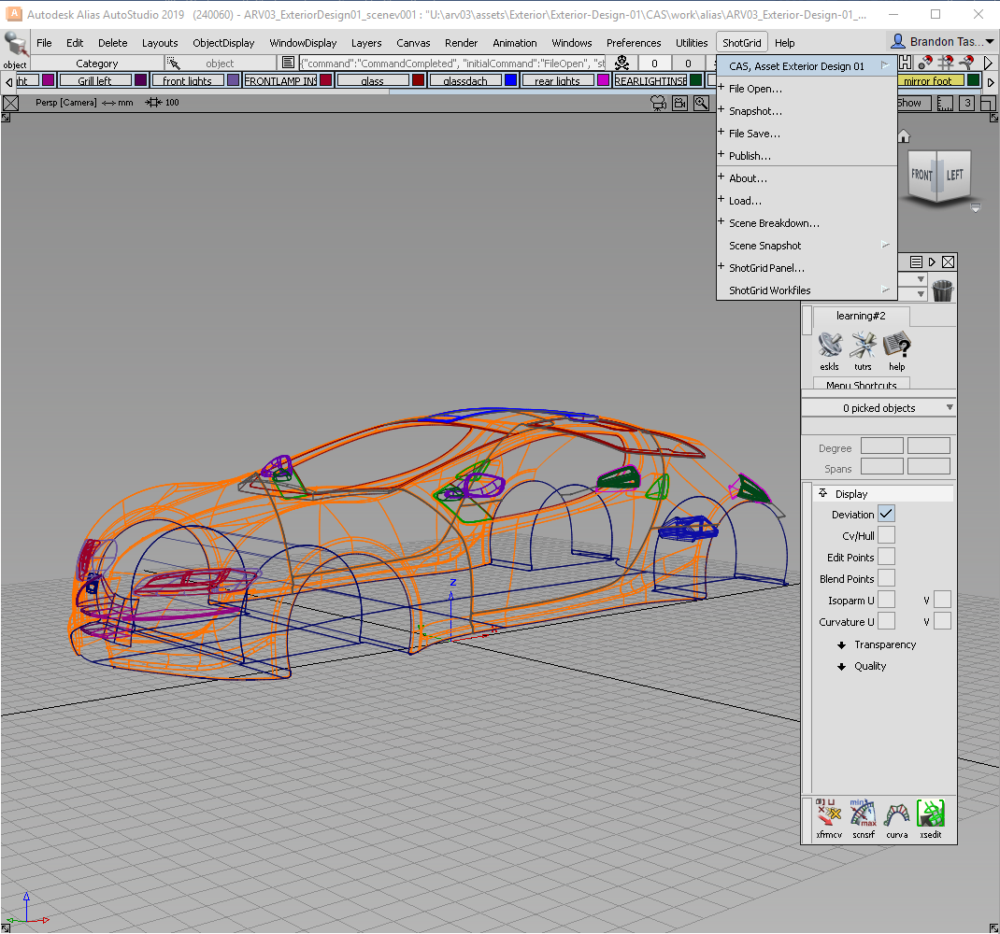
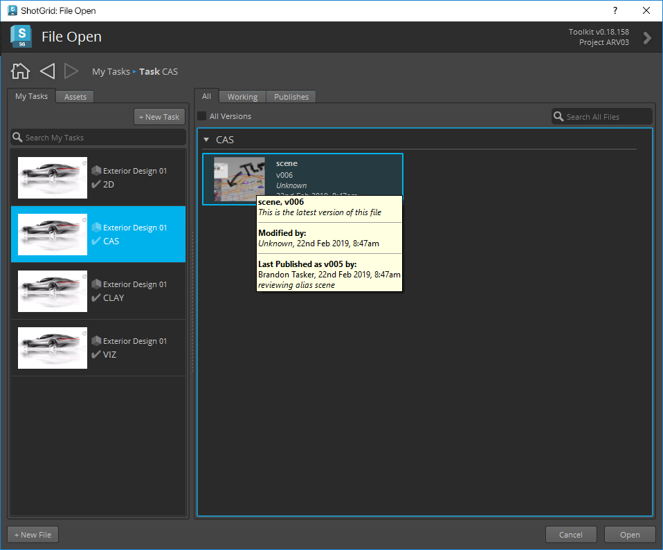
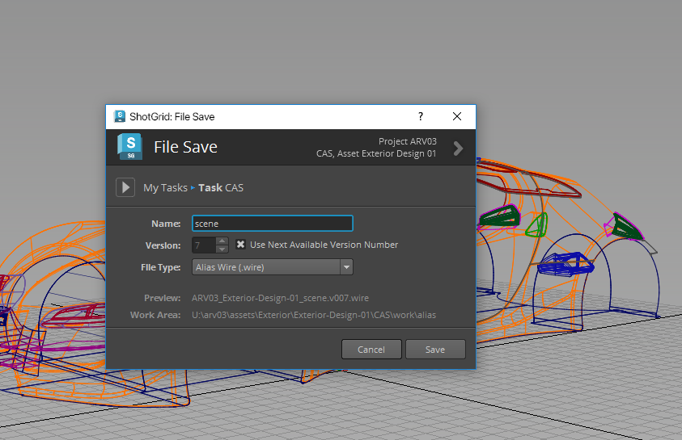
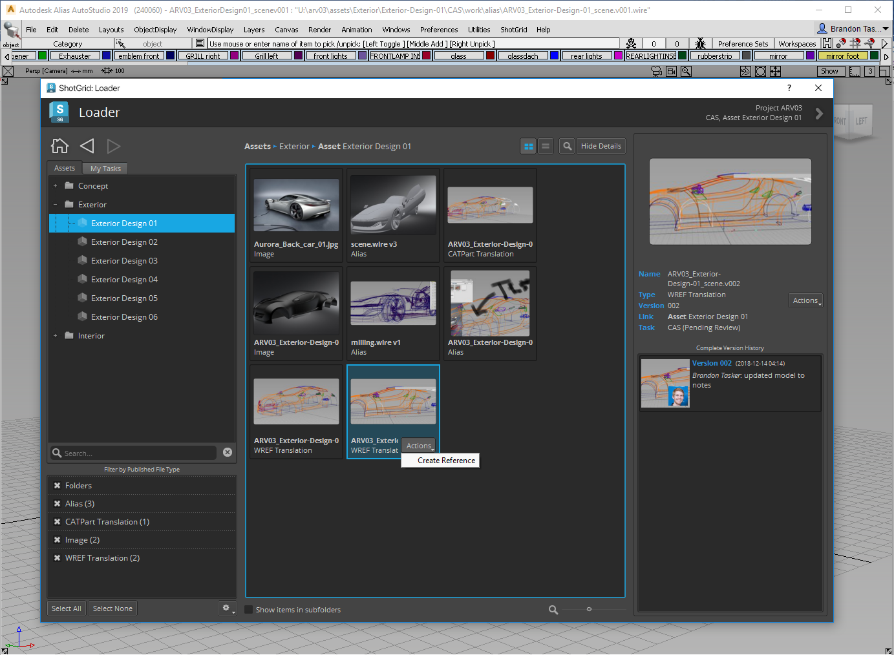
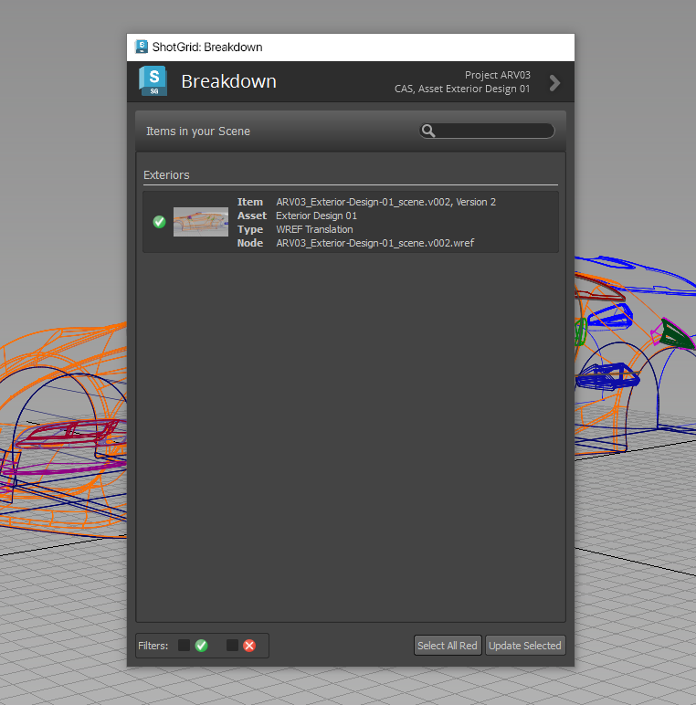

# Alias

Alias용  엔진에는  앱을 Alias에 통합하기 위한 표준 플랫폼이 포함되어 있습니다. 직접적으로 실행되는 경량의 플랫폼으로, Alias 메뉴에  메뉴를 추가합니다.

## 지원되는 응용프로그램 버전

이 항목은 테스트를 거쳐 다음 응용프로그램 버전에서 작동하는 것으로 알려져 있습니다. 



최신 릴리즈에서는 더 완벽하게 작동할 수 있지만 이러한 버전에서 아직 공식적으로 테스트되지는 않았습니다.

## Python 버전 지원

# 중요

Alias ShotGrid 툴킷 엔진의 v2.1.5 버전부터 Python v2.7.x 지원이 중단됩니다.

Python 3이 기본 버전으로 사용되도록 하려면 ShotGrid 데스크톱 v1.7.3 이상을 다운로드하십시오.

https://community.shotgridsoftware.com/t/a-new-version-of-shotgrid-desktop-has-been-released/13877/14

***

## 이전 버전

Alias 툴킷 엔진은 ShotGrid 데스크톱과 함께 제공되는 Python 인터프리터 또는 _로컬로 설치된 인터프리터를 사용합니다(참고 참조)._

|tk-alias 엔진 버전 | ShotGrid 데스크톱 응용프로그램 버전 | ShotGrid 데스크톱 엔진 버전 | Python 인터프리터 버전 |
| ---------------------- |--------------------------------------|---------------------------------| -------------------------- |
|  v2.0.5 이하       | v1.5.8 이하                      | v2.4.14 이하                | v2.7.x                     |
|  v2.0.6 ~ v2.1.4      | v1.6.0 ~ v1.7.2                     | v2.5.0 ~ v2.6.2                | v2.7.x 및 v3.7.x            |
|  v2.1.5 이상       | v1.7.3 이상                      | v2.6.3 이상                 | v3.7.x                     |

로컬에 설치된 Python 인터프리터 v3.7.4 테스트됨

***
### 참고

로컬로 설치된 인터프리터는 예기치 않은 동작을 초래할 수 있습니다. 스튜디오 환경에서 이 기능을 사용하려면 [지원 팀에 문의](https://knowledge.autodesk.com/ko/contact-support)하십시오.

## 앱 개발자를 위한 정보
    
### PySide

Alias용  엔진은  데스크톱과 함께 제공되는 PySide 설치를 사용하며 필요할 때마다 활성화됩니다. 

### Alias 프로젝트 관리

Alias용  엔진이 시작되면 Alias 프로젝트가 이 엔진 설정에서 정의된 위치를 가리키도록 설정됩니다. 즉, 새 파일을 열면 프로젝트가 변경될 수도 있습니다. 파일을 기반으로 Alias 프로젝트가 설정되는 방법과 관련된 상세 정보는 템플릿 시스템을 사용하여 구성 파일에서 구성할 수 있습니다.

***

## tk-alias 작업

이  통합은 Alias 응용프로그램 제품군(Concept, Surface 및 AutoStudio)을 지원합니다.

Alias가 열리면  메뉴(Alias 엔진)가 메뉴 막대에 추가됩니다.

### 파일 열기 및 저장

내 태스크(My Tasks) 및 에셋(Assets) 탭을 사용하여 할당된 모든 태스크를 보고 에셋을 찾을 수 있습니다. 오른쪽에서 이 탭을 사용하여 왼쪽에 선택된 항목과 연관된 모든 파일, 작업 파일 또는 게시된 파일을 볼 수 있습니다.

### 게시

파일을 에 게시하기 위한 게시(Publish) 대화상자를 엽니다. 게시하면 아티스트 다운스트림에서 사용할 수 있습니다. 자세한 내용은 [Alias에서 게시](https://github.com/shotgunsoftware/tk-alias/wiki/Publishing)를 참조하십시오. 

### Loader

Alias로 데이터를 로드할 수 있는 Content Loader 앱을 엽니다. 자세한 내용은 [Alias에서 로드](https://github.com/shotgunsoftware/tk-alias/wiki/Loading)를 참조하십시오.

### 씬 분할

기한이 만료된 씬의 항목과 함께 또는 PublishedFile의 대체 버전을 사용하여 참조된 (WREF 참조) 컨텐츠 목록을 표시하는 분할(Breakdown) 대화상자를 엽니다. 자세한 내용은 [Alias에서 씬 분할](https://github.com/shotgunsoftware/tk-alias/wiki/Scene-Breakdown)을 참조하십시오.

