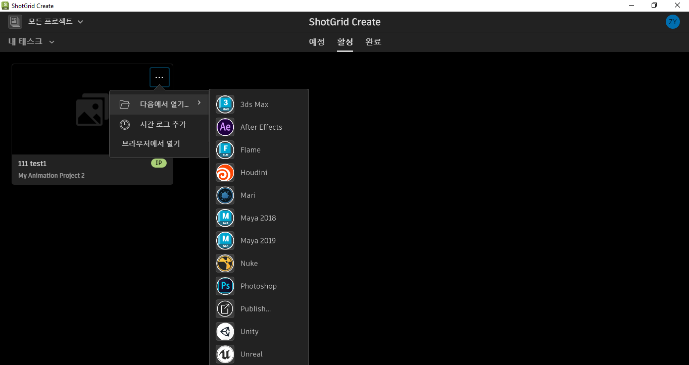
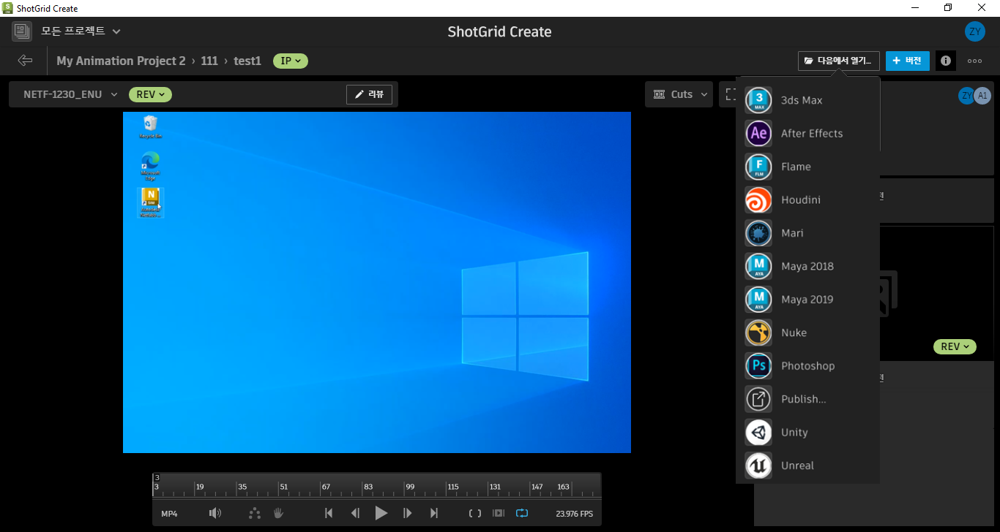

#  Create

데스크톱2 엔진은 [ Create](https://help.autodesk.com/view/SGSUB/KOR/?guid=SG_Supervisor_Artist_sa_create_sa_intro_create_html) 응용프로그램 내부에서 실행되는 엔진입니다. 브라우저 통합을 통해  웹 응용프로그램에서뿐만 아니라  Create에서도 DCC 시작을 처리합니다.

tk-desktop2 엔진은  Create와 툴킷을 통합할 수 있도록 합니다.  Create는 [DCC 시작](https://help.autodesk.com/view/SGSUB/ENU/?guid=SG_Supervisor_Artist_sa_create_sa_create_artists_html#launching-your-creative-apps)을 포함하여 툴킷 사용자에게 익숙한 기능을 지원합니다.





## 설치 및 업데이트

###  Pipeline Toolkit에 이 엔진 추가

asset 환경의 XYZ 프로젝트에 이 엔진을 추가하려면 다음 명령을 실행합니다.

```
> tank Project XYZ install_engine asset tk-desktop2
Updating to the latest version
```

프로젝트에 이 항목이 이미 설치되어 있는 경우 최신 버전을 얻으려면 `update` 명령을 실행할 수 있습니다. 특정 프로젝트와 함께 제공되는 tank 명령을 탐색하여 다음과 같이 실행할 수 있습니다.

```
> cd /my_tank_configs/project_xyz
> ./tank updates
```

또는 스튜디오 `tank` 명령을 실행하고 업데이트 확인을 실행할 프로젝트 이름을 지정할 수 있습니다.

```
> tank Project XYZ updates
```

## 협업 및 개선
	
 Pipeline Toolkit에 액세스할 수 있다면 모든 앱, 엔진 및 프레임워크가 저장 및 관리되는 Github에서 그 소스 코드에도 액세스할 수 있습니다. 이러한 항목을 자유롭게 개선하여 향후 독립적인 개발을 위한 기반으로 사용하고 변경 후 다시 사용자 요청을 제출하거나, 아니면 그냥 조금만 손을 보고 어떻게 빌드되었는지, 툴킷이 어떻게 작동하는지 확인해 보십시오. 이 코드 리포지토리는 https://github.com/shotgunsoftware/tk-desktop2에서 액세스할 수 있습니다.

## 특별 요구 사항

이 기능을 이용하려면  Pipeline Toolkit Core API 버전 v0.19.1 이상이 필요합니다.

##  통합 오류 수정

사용자에게 다음과 같은 오류 메시지가 표시됩니다. *통합을 초기화하지 못했습니다. ValueError - 의 localhost 인증서 데이터가 잘못되었습니다. 지원 팀에 문의하십시오.* 이 오류 메시지는  Toolkit 통합을 사용하도록  인스턴스가 구성되지 않은 상태에서  툴킷 기능에 액세스하려는 경우를 나타냅니다. 

사용자가  툴킷에 액세스하지 못하도록 하고 오류 메시지가 표시되지 않도록 하려면 환경 변수 `SHOTGUN_CREATE_DISABLE_TOOLKIT_INTEGRATION`을 활성화합니다. 이 환경 변수는 Create에서  툴킷 통합을 완전히 비활성화합니다.

실수로 이 환경 변수를 활성화한 경우 다시 비활성화하면  툴킷 통합이 복원됩니다.
