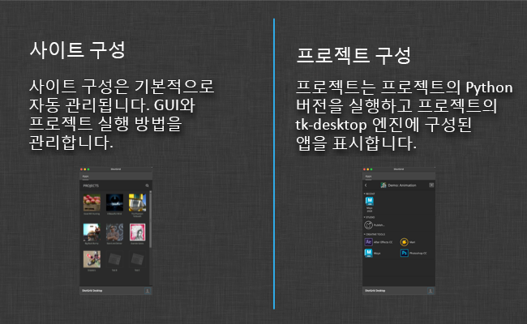

# 데스크톱

tk-desktop 엔진은 툴킷 앱을 쉽게 실행할 수 있게 해 주는 응용프로그램입니다. 툴킷을 시작하고 툴킷용 프로젝트를 설정하고 프로젝트의 파이프라인에 액세스하는 작업을 쉽게 수행할 수 있도록 하는 시스템 트레이 기반 창입니다.

## 사이트 구성 및 프로젝트 구성



데스크톱 응용프로그램을 시작하면 사이트 구성을 위한 tk-desktop 엔진이 시작됩니다. 이 구성은 대개 자동으로 관리되지만 해당 동작을 비활성화하고 해당 환경을 제어할 수 있습니다.

툴킷의 기본 원칙 중 하나는 프로젝트가 서로 완전히 격리될 수 있다는 것입니다. 이는 일반적으로 한 프로젝트의 변경 사항이 다른 프로젝트(곧 전달 가능)에 악영향을 미치지 않도록 하기 위해 수행됩니다. 이 프로젝트 격리 기능을 제공하기 위해 데스크톱 엔진은 사용자가 특정 프로젝트에 대한 명령을 볼 때마다 해당 프로젝트의 초기화된 별도의 python 인터프리터에서 명령을 실행할 수 있도록 합니다.

프로젝트를 클릭하면 백그라운드에서 python 인터프리터가 시작됩니다. 프로젝트가 이 python 인터프리터를 사용하도록 구성되어 있으면 시작 시 해당 프로젝트의 tk-desktop을 초기화합니다. 해당 엔진 인스턴스는 실행할 수 있는 GUI 명령에 다시 연결합니다.

명령을 클릭하면 해당 백그라운드 python 프로세스가 명령을 실행합니다. 이렇게 하면 예를 들어 하나의 프로젝트에서 python 2.7을 테스트하는 동안 다른 프로젝트가 python 2.6을 실행할 수 있습니다.

## 커스텀 패널 등록

[패널 기반 UI](http://developer.shotgunsoftware.com/tk-core/platform.html#sgtk.platform.Engine.show_panel)가 있는 툴킷 앱은 실행 시 데스크톱 내부의 탭에 자동으로 고정됩니다.

 Panel과 같은 패널 기반 앱이 있고  데스크톱에 탭으로 표시하려면 시작 시 실행되도록 구성하면 됩니다. 데스크톱이 사이트 컨텍스트 모드(모든 프로젝트 표시)에서 시작되면 자동 시작으로 등록된 모든 항목이 시작됩니다. 이러한 항목 중 하나가 패널이면 패널이 고정됩니다. 항목은 구성에서 정의된 순서대로 처리되며 탭 순서도 지정됩니다.

예를 들어  Panel을  데스크톱의 탭으로 표시하려면 사이트 레벨 환경에 다음 구성을 추가합니다.

```yaml
tk-desktop:
  apps:
    tk-multi-shotgunpanel:
      actions_hook: ...
      action_mappings: ...
      location: ...
  location: ...
  run_at_startup:
  - {app_instance: '', name: Apps}
  - {app_instance: tk-multi-shotgunpanel, name: ''}
```

`Apps` 항목은 탭 순서대로 기본 `Apps` 탭이 표시되는 위치를 제어합니다.

