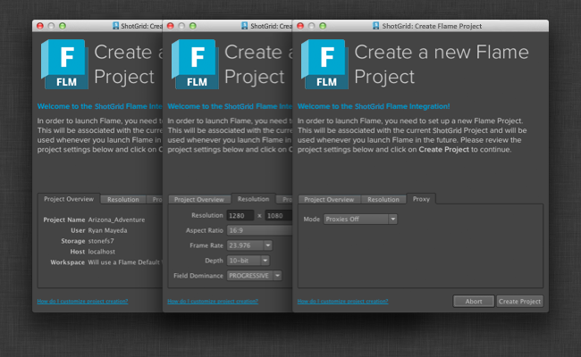

# Flame

## 설치

Flame용  엔진은 Flame 2015 Extension 2에 추가된 새 통합 후크를 사용합니다.  엔진이 작동하려면 *반드시* 이 Flame 버전을 사용해야 합니다. Flame 2015 Extension 2에 대한 자세한 정보(얻는 방법 포함)는 [Flame 지원 팀](https://knowledge.autodesk.com/ko/support/flame-products/troubleshooting/caas/sfdcarticles/sfdcarticles/KOR/Contacting-Autodesk-Flame-or-Smoke-Customer-Support.html)에 문의하십시오.

Flame용  엔진을 시작하는 가장 간단한 방법은 예제 파이프라인 구성을 사용하여 새 테스트 프로젝트를 설정하는 것입니다.  데스크톱을 시작하고 새 프로젝트에 대한 프로젝트 설정을 실행하여 기본 구성 섹션에서 기본 Flame 구성을 선택하면 이 작업을 수행할 수 있습니다.

## 지원되는 응용프로그램 버전

이 항목은 테스트를 거쳐 다음 응용프로그램 버전에서 작동하는 것으로 알려져 있습니다.



## Flame 프로젝트 설정

Flame용  엔진은  프로젝트를 Flame 프로젝트와 연결하는 데 도움을 주며 필요한 경우 Flame 프로젝트를 생성합니다.  Flame의 데이터가 의 올바른 데이터와 연결되도록 하므로 이 설정이 통합의 핵심입니다.  추가 기능으로 엔진은 Flame 프로젝트의 명명 규칙 및 프로젝트의 다른 여러 설정을 관리하는 기능을 제공합니다.

를 통해 Flame이 처음 시작되면 아티스트가 표준 Flame 프로젝트 생성 화면에서 일반적인 설정을 편집할 수 있는 Flame 프로젝트 생성 UI가 나타납니다.

그러나  통합을 통해 파이프라인 관련 값으로 설정에 미리 입력할 수 있으므로 아티스트는 고민할 필요 없이 신속하게 올바른 결과를 얻을 수 있습니다.  기본값은 `project_setup_hook`를 통해 커스터마이즈할 수 있으며 다음 옵션을 지원합니다.

`use_project_settings_ui` `True`로 설정된 경우 프로젝트 생성 UI가 나타납니다. `False`로 설정된 경우 Flame 프로젝트는 후크의 나머지 기본값을 기반으로 자동으로 생성됩니다.

`get_server_hostname`
기본적으로 'localhost'로 설정되어 있지만 원하는 경우 재지정할 수 있습니다.

`get_project_name`
기본적으로  프로젝트와 동일한 값으로 설정되지만 원하는 경우 재지정할 수 있습니다.

`get_volume`
기본적으로 사용 가능한 첫 번째 저장소로 설정되지만 원하는 경우 재지정할 수 있습니다.

`get_workspace`
기본적으로 Flame은 표준 작업공간 생성 로직에 따라 기본 작업공간을 만들지만 원하는 경우 재지정할 수 있습니다.

`get_user`
이 설정은 Flame 컴퓨터에 로그인한 사용자와 의 사용자의 연결을 시도합니다.

`get_project_settings`
이 설정을 통해 기본 Flame 설정이 구성되고 후크가 Flame 프로젝트 XML 스트림을 빌드합니다. 다음 매개변수를 *반드시* 제공해야 합니다.

* FrameWidth(예: `1280`)
* FrameHeight(예: `1080`)
* FrameDepth(`16-bit fp`, `12-bit`, `12-bit u`, `10-bit`, `8-bit`)
* FieldDominance(`PROGRESSIVE`, `FIELD_1`, `FIELD_2`)
* AspectRatio(`4:3`, `16:9` 또는 문자열 부동 소수점 값)

프록시 설정을 제공할 수도 있습니다. 자세한 정보는 [Autodesk Wiretap SDK 문서](https://www.autodesk.com/developer-network/platform-technologies/wiretap)를 참조하십시오.

project_setup 후크의 전체 코드베이스를 보려면 [엔진에 대한 Github 리포지토리](https://github.com/shotgunsoftware/tk-flame/blob/master/hooks/project_startup.py)를 참조하십시오.

