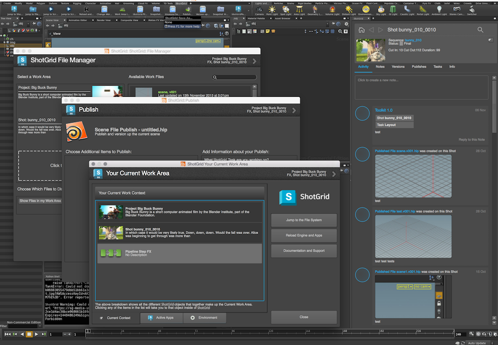
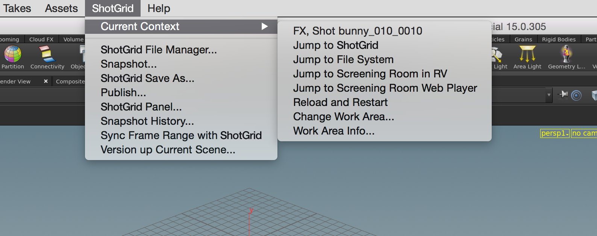
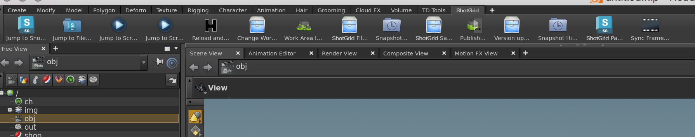
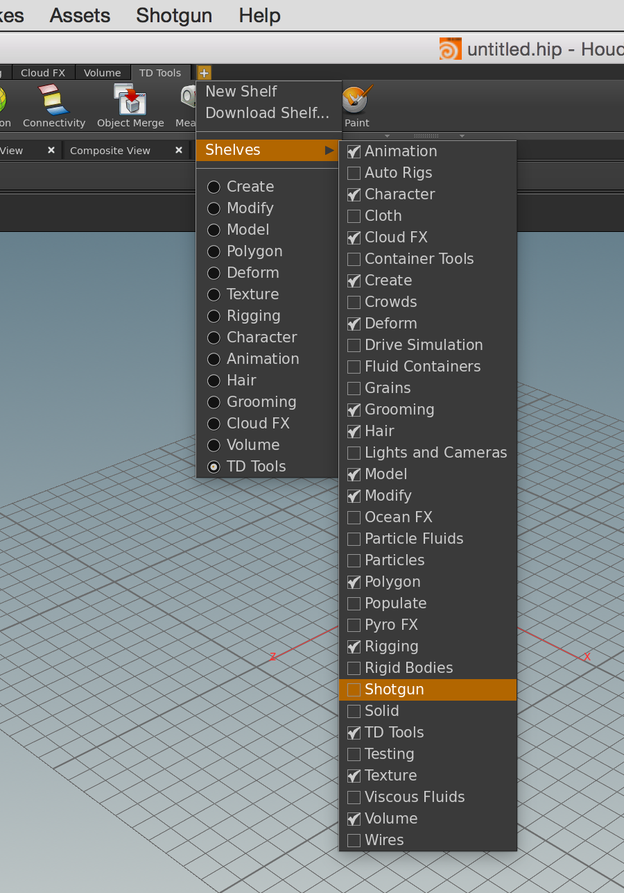

# Houdini

Houdini용  엔진에는  앱을 Houdini에 통합하기 위한 표준 플랫폼이 포함되어 있습니다.




# 앱 개발자를 위한 정보

## 지원되는 플랫폼

Houdini용  엔진은 현재 Windows, Linux 및 OSX에서 지원됩니다.

## 지원되는 응용프로그램 버전

이 항목은 테스트를 거쳐 다음 응용프로그램 버전에서 작동하는 것으로 알려져 있습니다.



## PySide

Houdini의 이전 버전(13 이하)은 PySide의 외부 빌드가 필요합니다. Windows에서는 Houdini가 실행되는 Python에서 작동하는 호환 가능한 PySide 빌드가 번들로 제공됩니다. Linux에서 Houdini는 PySide 또는 PyQt를 지원해야 하는 시스템 Python(http://www.sidefx.com/docs/houdini12.0/hom/)을 사용합니다.

## 메뉴 로드



Houdini 15의 파생 효과로 동적 메뉴 시스템이 도입되어 이제 엔진은 컨텍스트 스위치에서  메뉴를 다시 작성할 수 있습니다.

Houdini 14 이하에서는 Houdini의  메뉴가 Houdini가 시작되기 전에 생성되며 세션 전체에서 정적입니다. 이로 인해 메뉴에 등록된 툴킷 명령은 컨텍스트 변경 시 업데이트되지 않습니다.

##  쉘프



**v0.2.4** 릴리즈는 엔진에 동적  쉘프를 도입했습니다. 쉘프에는 등록된 모든 앱 명령이 도구 버튼으로 표시됩니다. 버튼은 메뉴 명령과 거의 동일한 순서로 표시됩니다.

`enable_sg_shelf` 설정을 사용하여 환경 내에서 쉘프를 켭니다. 동적 메뉴를 지원하지 않는 Houdini 버전(14 이하)을 사용하는 경우 쉘프 사용 시  메뉴를 끌 수도 있습니다. 이 작업은 `enable_sg_menu` 설정을 `false`로 설정하여 수행할 수 있습니다.

쉘프를 통해 컨텍스트 전환을 활성화하려면 엔진 구성에서 `tk-multi-workfiles` 앱의 `sg_entity_types` 설정에 엔티티 유형도 추가해야 합니다.

 쉘프와 관련된 설정을 살펴보겠습니다.

```yaml
tk-houdini:
  apps:
    # ... other app definitions
    tk-multi-workfiles:
       # ... other app settings
       sg_entity_types: [Shot, Asset] # allow context switching to Shots or Assets
       # ... other app settings
  enable_sg_shelf: true
  enable_sg_menu: false
  # ... other engine settings
```

 쉘프를 활성화한 후에는 수동으로 houdini 내부의 쉘프 세트에 추가해야 합니다.



쉘프 세트에 추가되면  쉘프는 houdini 세션 간에 유지되며  컨텍스트가 변경되면 동적으로 업데이트됩니다.

## 패널

**v0.2.8**부터 엔진은 포함된 툴킷 패널에 대한 지원을 추가합니다.

적절한 내장 패널을 지원하려면 현재 Houdini 버전 **15.0.272** 이상이 필요합니다. 등록된 패널은 지원되는 Houdini 버전의 창 메뉴에 창으로 표시됩니다.

Houdini의 이전 버전은 등록된 패널을 대화상자로 표시합니다. SESI는 몇 가지 버그 수정을 Houdini 14의 최신 빌드로 백포팅할 수 있습니다. 그러면 해당 버전에도 내장 패널을 사용할 수 있습니다.

## OTL을 사용하는 앱

Houdini용  엔진을 사용하면 응용프로그램에서 제공하는 OTL을 쉽게 로드할 수 있습니다. OTL을 사용하는 앱을 작성하는 경우 **otls**라는 폴더에 OTL을 배치하기만 하면 엔진에서 자동으로 세션에 로드합니다.


그런 다음 일반적인 Houdini 방법을 통해 노드에 쉽게 액세스할 수 있습니다.

**경고:** OTL을 사용하는 것이 편리할 수 있지만 씬에 지속되는 노드를 만들려는 경우에는 일반적으로 적절한 솔루션이 아닙니다. 그 이유는 씬에 OTL을 추가하면 씬과 OTL 코드 간에 종속성이 발생하기 때문입니다. 씬을 로드할 때마다  툴킷을 로드해야 할 뿐만 아니라 코드를 업데이트해도 씬에서 사용 중인 이전 OTL이 손상되지 않도록 신중하게 코드를 관리해야 합니다.

## OSX에서 터미널을 통한 디버깅 시작

OS X에서 `tk-houdini` 엔진의 `debug_logging`을 켜면 모든 디버그 메시지를 터미널로 전송하지 않습니다. 이는 기본적으로 [`tk-multi-launchapp`](https://github.com/shotgunsoftware/tk-multi-launchapp) 앱에서 `open` 명령을 사용하여 실행 파일을 시작하기 때문입니다. 이는 터미널에서 새로운 하위 프로세스를 생성하지 않지만 OS X의 시작 서비스를 사용하여 다른 곳에서 새 프로세스를 만듭니다. 결과적으로 로그 문은 표시되지 않습니다. Houdini에서 사용자의 기본 데스크톱에 python 셸이 저장되어 있어도 시작 중에 디버깅 문을 표시하지 않는 것처럼 보입니다. 시작 후 내장 python 셸은 디버그 로깅 문을 표시하지만 시작 중에 사용 가능한 출력과 차이가 있습니다. 엔진 시작 중에 디버그 로깅 문에 액세스해야 하는 경우 두 가지를 변경할 수 있습니다.

먼저 테스트 구성에서 `houdini_mac` 경로를 Houdini 앱 번들 내부의 실행 파일을 가리키도록 임시로 변경합니다. 예를 들면 다음과 같습니다.

```yaml
#houdini_mac: /Applications/Houdini 15.0.272/Houdini Apprentice.app
houdini_mac: /Applications/Houdini\ 15.0.272/Houdini\ Apprentice.app/Contents/MacOS/happrentice
```

다음으로 테스트 구성의 `config/hooks` 디렉토리에서 `tk-multi-launchapp` 앱의 `app_launch` 후크 복사본을 만들어 `config/env/includes/app_launchers.yml` 파일에서 이를 지정할 수 있습니다.

```yaml
launch_houdini:
  defer_keyword: ''
  engine: tk-houdini
  extra: {}
  hook_app_launch: app_launch    # <----- use a custom app_launch hook
  hook_before_app_launch: default
  icon: '{target_engine}/icon_256.png'
  linux_args: ''
  linux_path: '@houdini_linux'
  location: {name: tk-multi-launchapp, type: app_store, version: v0.6.6}
  mac_args: ''
  mac_path: '@houdini_mac'
  menu_name: Launch Houdini
  versions: []
  windows_args: ''
  windows_path: '@houdini_windows'
```

그런 다음 실행 파일을 직접 시작하도록 시작 로직을 수정하기만 하면 됩니다. 예를 들어 디렉토리(응용프로그램 번들)에 대한 이전 동작을 유지하고 명령을 직접 실행할 수 있습니다. 다음은 예입니다.

```python
        elif system == "darwin":
            # on the mac, the executable paths are normally pointing
            # to the application bundle and not to the binary file
            # embedded in the bundle, meaning that we should use the
            # built-in mac open command to execute it
            if os.path.isdir(app_path):
                cmd = "open -n \"%s\"" % (app_path)
                if app_args:
                    cmd += " --args \"%s\"" % app_args.replace("\"", "\\\"")

            # not a directory, execute directly
            else:
                cmd = "%s %s" % (app_path, app_args.replace("\"", "\\\""))
```

다음에 터미널에서 `tank`를 통해 `launch_houdini`를 실행하면 모든 디버그 출력이 표시됩니다. 테스트가 끝나면 경로를 되돌리고 앱 시작 변경 사항을 취소해야 합니다. 디버깅이 완료되었습니다.
