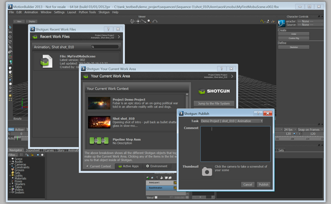
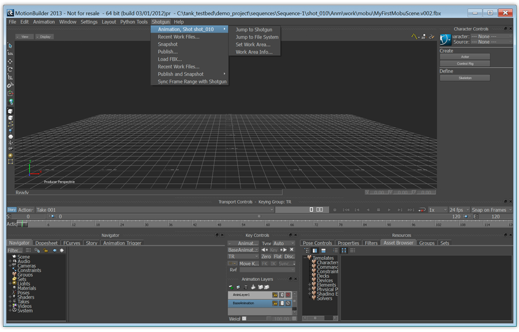

# Motion Builder



Motion Builder용  엔진에는  툴킷 앱을 Motion Builder에 통합하기 위한 표준 플랫폼이 포함되어 있습니다. 간단하고 직접적인 이 플랫폼은 기본 메뉴에  메뉴를 추가합니다.



## 설치 및 업데이트

###  Pipeline Toolkit에 이 엔진 추가

asset 환경의 XYZ 프로젝트에 이 엔진을 추가하려면 다음 명령을 실행합니다.

```
> tank Project XYZ install_engine asset tk-motionbuilder
```

### 최신 버전으로 업데이트

프로젝트에 이 항목이 이미 설치되어 있는 경우 최신 버전을 얻으려면 `update` 명령을 실행할 수 있습니다. 특정 프로젝트와 함께 제공되는 tank 명령을 탐색하여 다음과 같이 실행할 수 있습니다.

```
> cd /my_tank_configs/project_xyz
> ./tank updates
```

또는 스튜디오 tank 명령을 실행하고 업데이트 확인을 실행할 프로젝트 이름을 지정할 수 있습니다.

```
> tank Project XYZ updates
```

## 협업 및 개선

 Pipeline Toolkit에 액세스할 수 있다면 모든 앱, 엔진 및 프레임워크가 저장 및 관리되는 Github에서 그 소스 코드에도 액세스할 수 있습니다. 이러한 항목을 자유롭게 개선하여 향후 독립적인 개발을 위한 기반으로 사용하고 변경 후 다시 사용자 요청을 제출하거나, 아니면 그냥 조금만 손을 보고 어떻게 빌드되었는지, 툴킷이 어떻게 작동하는지 확인해 보십시오. https://github.com/shotgunsoftware/tk-motionbuilder에서 이 코드 리포지토리에 액세스할 수 있습니다.


