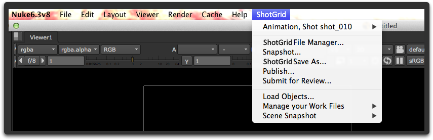

# Nuke

Nuke용  엔진에는  앱을 Nuke, Nuke Studio 및 Hiero에 통합하기 위한 표준 플랫폼이 포함되어 있습니다. 간단하고 직접적인 이 플랫폼은 Nuke에 여러 새 항목을 추가합니다.

Nuke에 다양한 항목이 표시되는 ** 메뉴**를 생성합니다.



Nuke에 다양한 항목이 표시되는 ** 노드 메뉴**를 만듭니다.


 단축키를 파일 대화상자에 추가하여 다양한 파일 시스템 위치로 쉽게 이동할 수 있습니다.


`favourite_directories` 설정을 사용하여 현재 환경에 템플릿 경로를 기반으로 하는 고유의 단축키를 추가할 수 있습니다. 이 설정에는 목록의 각 항목이 새로운 즐겨찾기 디렉토리를 나타내는 사전 목록이 필요합니다. 다음은 사용할 형식의 예입니다(아이콘 값으로 ""를 입력하여 지정하지 않을 수도 있음).

```yaml
  favourite_directories:
  - display_name: "Shot Publish Path"
    template_directory: "shot_publish_area_nuke"
    icon: "icons/custom_publish_icon.png"
  - display_name: "Shot Work Path"
    template_directory: "shot_work_area_nuke"
    icon: "icons/custom_work_icon.png"
```

" 현재 프로젝트(Current Project)" 즐겨찾기가 정의된 각 루트에 자동으로 추가됩니다. `project_favourite_name` 설정을 사용하여 이름을 커스터마이즈하거나 값을 빈 문자열 `''`로 설정하여 이러한 즐겨찾기를 비활성화할 수 있습니다.


***

_참고: 현재 CentOS 6.5에서 실행되는 Nuke 8.0의 버그로 인해 툴킷을 실행할 때 Nuke가 중단됩니다. CentOS의 다른 버전은 영향을 받지 않습니다. 당사는 이 문제를 인식하고 있습니다(버그 43766). 이 버전을 실행 중인 경우 Nuke의 향후 업데이트에서 이 문제가 해결될 때까지 조치를 취할 수 있도록 당사에 문의해 주십시오._


## 앱 개발자를 위한 정보

### 컨텍스트 트래킹

Nuke용  엔진은 파일 로드 시 컨텍스트를 자동으로 전환합니다. 파일이 로드될 때마다 엔진에서 파일을 확인하고 컨텍스트를 분석합니다.

### 커스텀 기즈모를 사용하는 앱

Nuke용  엔진을 사용하면 커스텀 기즈모를 쉽게 처리할 수 있습니다. 커스텀 기즈모를 사용하는 앱을 작성하는 경우 **gizmos**라는 폴더에 기즈모를 배치하기만 하면 엔진이 자동으로 해당 위치를 nuke 경로에 추가합니다.


그러면 노드 생성 기능을 통해 기즈모에 쉽게 액세스할 수 있습니다.

* `nuke.createNode("WriteTank")`



### 노드 생성 앱

커스텀 nuke 노드를 만드는 앱은 신중하게 제작해야 합니다. 이러한 앱에는 씬과 기즈모 코드 간의 종속성이 필요하므로 기즈모를 사용하지 않는 것이 좋습니다. 대신, 커스텀 노드를 nuke 파일로 저장하여 씬으로 가져옵니다.

```python
    group_node_script = os.path.join(self.disk_location, "resources", "my_group_node.nk")
    group_node = nuke.nodePaste(group_node_script)
```

앱 내에서 노드를 호출하는 모든 코드는 반환된 인스턴스를 사용할 수 있습니다.

그룹 내에서 앱을 호출해야 하는 모든 코드는 코드가 이전 버전과 호환되도록 신중하게 작성해야 합니다. 다음과 같은 접근 방식을 권장합니다.

앱을 시작할 때 nuke 네임스페이스의 일부로 앱 핸들을 등록합니다.

```python
    def init_app(self):

        nuke.tk_nuke_nameofmyapp = self
```

예를 들어 그룹 노드에 버튼이 있고 일부  앱 코드를 호출하려는 경우  툴킷을 찾을 수 없으면 정상적으로 종료합니다. 아래 코드는 앱이 만들 수 있는 그룹 노드에 속한 python 버튼 노브와 연결된 코드입니다.

```python
# have to gracefully support the case when
# sgtk is not in the system at all!
import nuke
try:
  app = nuke.tk_nuke_nameofmyapp
  app.do_something_v1(nuke.thisNode())
except:
  nuke.warning("Could not do XYZ! Most likely Sgtk is not currently active.")
```

앱 동작을 변경하는 경우 앱 콜백의 버전 번호를 증가시켜 계속해서 관리하면 앱 코드가 새로운 동작과 이전 동작을 모두 지원할 수 있습니다.

## Hiero 내에서 Nuke용  엔진 사용

Nuke용  엔진은 Hiero 내에서 실행되는  인식 통합에도 사용됩니다.

 앱 액션을 응용프로그램의 여러 위치, 기본 메뉴 막대의 특정  메뉴 및 다른 Hiero 패널에서 마우스 오른쪽 버튼을 클릭하면 표시되는 다양한 상황별 메뉴에 배치할 수 있습니다.


### Hiero 메뉴 구성 방법

Hiero에는 여러 메뉴가 있기 때문에 Maya나 Nuke 등보다 메뉴 항목의 위치를 구성하는 옵션이 더 많습니다. Nuke용  엔진의 Hiero 워크플로우 구성은 다음과 같은 모양입니다.

```yaml

  tk-hiero:
    location: {name: tk-nuke, type: app_store, version: v0.6.9}
    debug_logging: false

    timeline_context_menu:
    - {app_instance: tk-hiero-openinshotgun, keep_in_menu: false, name: Open in Shotgun, requires_selection: true}

    spreadsheet_context_menu:
    - {app_instance: tk-hiero-openinshotgun, keep_in_menu: false, name: Open in Shotgun, requires_selection: true}

    bin_context_menu:
    - {app_instance: tk-multi-workfiles, keep_in_menu: false, name: " Save As...", requires_selection: true}
    - {app_instance: tk-multi-workfiles, keep_in_menu: false, name: "Version up Current Scene...", requires_selection: true}
    - {app_instance: tk-multi-snapshot, keep_in_menu: false, name: "Snapshot...", requires_selection: true}
    - {app_instance: tk-multi-snapshot, keep_in_menu: false, name: "Snapshot History...", requires_selection: true}
    - {app_instance: tk-multi-publish, keep_in_menu: false, name: "Publish Project...", requires_selection: true}

    menu_favourites:
    - {app_instance: tk-multi-workfiles, name: Shotgun File Manager...}
```

대부분의 엔진에는 기본  메뉴에 배치되는 "단축키"를 지정할 수 있는 목록인 `menu_favourites` 옵션이 있습니다. 이 외에도 Hiero 전용 구성에는 세 개의 특수 섹션이 있습니다.

- `timeline_context_menu`는 타임라인 편집기에서 클립을 마우스 오른쪽 버튼으로 클릭할 때 표시되는 메뉴를 나타냅니다.
- `spreadsheet_context_menu`는 스프레드시트 편집기에서 항목을 선택하여 마우스 오른쪽 버튼으로 클릭할 때 표시되는 메뉴를 나타냅니다.
- `bin_context_menu`는 모든 프로젝트와 미디어를 볼 수 있는 bin 편집기에서 항목을 선택하여 마우스 오른쪽 버튼으로 클릭할 때 표시되는 메뉴를 나타냅니다.

이러한 메뉴에 항목을 추가하려면 구성에 정의된 `name` 필드가 앱 메뉴에 표시되는 항목과 일치해야 합니다.

#### 현재 씬의 개념이 필요한 앱

일부 툴킷 앱에는 기본 씬이나 기본 프로젝트의 개념이 필요합니다. 예를 들어 스냅샷 앱은 현재 씬을 스냅샷으로 찍는 방법을 압니다. 그러나 Maya나 Nuke와는 달리 Hiero에는 현재 씬의 개념이 없습니다. 동시에 여러 프로젝트를 Hiero에서 열 수 있습니다. 따라서 앱(예: 스냅샷 앱)이 어떤 프로젝트를 클릭했는지 확인할 수 있도록 후크에 특수 로직을 추가해야 하는 경우가 종종 있습니다. 다음 문서 섹션에서 이 작동 방식을 보여 줍니다.

### 앱 개발자를 위한 정보

Hiero에는 현재 프로젝트의 개념이 없으므로 앱이 Hiero 내부에서 클릭되는 내용을 쉽게 찾을 수 있도록 보다 강력한 도구를 추가했습니다. 이에 따라 Hiero용  엔진에 두 가지 방식이 추가되었습니다.


#### get_menu_selection()

가장 최근의 메뉴 클릭에서 선택된 Hiero 객체 목록을 반환합니다.
이 목록에는 다양한 유형의 항목이 포함될 수 있습니다. 어떤 방식으로 무엇이 반환되는지 정확하게 보기 위해 디버그 로깅을 켭니다. 그러면 진행 중인 작업의 상세 정보가 표시됩니다.

다음은 반환되는 객체의 예입니다.

- bin 뷰에서 프로젝트 선택: [hiero.core.Bin](https://learn.foundry.com/hiero/developers/2.0/hieropythondevguide/api/api_core.html#hiero.core.Bin)
- bin 뷰에서 항목 선택: [hiero.core.BinItem](https://learn.foundry.com/hiero/developers/2.0/hieropythondevguide/api/api_core.html#hiero.core.BinItem)
- 트랙 선택: [hiero.core.TrackItem](https://learn.foundry.com/hiero/developers/2.0/hieropythondevguide/api/api_core.html#hiero.core.TrackItem)

`list` engine_object.get_menu_selection()

**매개변수 및 반환값**

* **반환값:** Hiero 객체 목록

**예**

가장 최근 클릭에서 선택된 객체를 가져와서 단일 객체가 선택되고 이 객체가 유효한 Hiero 프로젝트인지 확인합니다. 예를 들어 Hiero에서 프로젝트의 저장, 로드 또는 게시 작업을 트리거하려는 경우에 이 방식이 유용할 수 있습니다.

```python
# get the menu selection from the engine
selection = engine_obj.get_menu_selection()

if len(selection) != 1:
    raise TankError("Please select a single Project!")

if not isinstance(selection[0] , hiero.core.Bin):
    raise TankError("Please select a Hiero Project!")

project = selection[0].project()
if project is None:
    # apparently bins can be without projects (child bins I think)
    raise TankError("Please select a Hiero Project!")
```

#### HieroEngine.get_menu_category()

마지막 메뉴 클릭이 발생한 UI 영역을 반환합니다. 이 명령은 거의 사용되지 않으며 호출된 메뉴에 따라 다르게 동작하려는 앱 명령이 있는 경우에 필요할 수 있습니다.

`area_enum` engine_object.get_menu_category()

**매개변수 및 반환값**

다음 상수 중 하나를 반환합니다.

- `HieroEngine.HIERO_BIN_AREA`
- `HieroEngine.HIERO_SPREADSHEET_AREA`
- `HieroEngine.HIERO_TIMELINE_AREA`
- 알 수 없는 경우 또는 정의되지 않은 경우 `None`

#### Hiero 작동을 위한 후크 구성 방법

Hiero용으로 구성된 다중 앱은 일반적으로 어떤 프로젝트가 클릭되었는지 찾아야 합니다. 예를 들어 `tk-multi-workfiles` 앱은 프로젝트에 대해 " 다른 이름으로 저장(Save As)"을 수행해야 합니다. 따라서 Hiero의 bin 메뉴에 탱크 다른 이름으로 저장(Tank Save As) 명령을 추가하여 사용자가 bin 뷰에서 프로젝트를 마우스 오른쪽 버튼으로 클릭하고 *다른 이름으로 저장(Save As)* 옵션을 선택합니다.


엔진 구성은 다음과 같습니다.

```yaml
bin_context_menu:
- {app_instance: tk-multi-workfiles, keep_in_menu: false, name: " Save As...", requires_selection: true}
```

이제 앱 자체에서 각 엔진은 저장 및 로드와 같은 씬 이벤트를 처리하는 후크를 구성해야 합니다. Maya나 Nuke와 같은 응용프로그램의 경우 이는 일반적으로 저장, 로드 등을 수행합니다.
그러나 Hiero의 경우 실제로 클릭된 프로젝트를 찾는 것으로 시작해야 합니다. 위의 예에서 후크 코드는 다음과 같습니다.

```python
class SceneOperation(Hook):
    """
    Hook called to perform an operation with the
    current scene
    """

    def execute(self, operation, file_path, context, **kwargs):
        """
        Main hook entry point

        :operation: String
                    Scene operation to perform

        :file_path: String
                    File path to use if the operation
                    requires it (e.g. open)

        :context:   Context
                    The context the file operation is being
                    performed in.

        :returns:   Depends on operation:
                    'current_path' - Return the current scene
                                     file path as a String
                    'reset'        - True if scene was reset to an empty
                                     state, otherwise False
                    all others     - None
        """

        if operation == "current_path":
            # return the current script path
            project = self._get_current_project()
            curr_path = project.path().replace("/", os.path.sep)
            return curr_path

        elif operation == "open":
            # open the specified script
            hiero.core.openProject(file_path.replace(os.path.sep, "/"))

        elif operation == "save":
            # save the current script:
            project = self._get_current_project()
            project.save()

        elif operation == "save_as":
            project = self._get_current_project()
            project.saveAs(file_path.replace(os.path.sep, "/"))

        elif operation == "reset":
            # do nothing and indicate scene was reset to empty
            return True

        elif operation == "prepare_new":
            # add a new project to hiero
            hiero.core.newProject()


    def _get_current_project(self):
        """
        Returns the current project based on where in the UI the user clicked
        """

        # get the menu selection from the engine
        selection = self.parent.engine.get_menu_selection()

        if len(selection) != 1:
            raise TankError("Please select a single Project!")

        if not isinstance(selection[0] , hiero.core.Bin):
            raise TankError("Please select a Hiero Project!")

        project = selection[0].project()
        if project is None:
            # apparently bins can be without projects (child bins I think)
            raise TankError("Please select a Hiero Project!")

        return project
```

#### 디버그 로깅을 사용하여 메뉴 이벤트 보기

특정 선택 항목을 클릭했을 때 Hiero가 반환하는 객체를 보려면 엔진 디버그 모드를 켜면 됩니다. 스크립트 편집기에서 각 클릭으로 선택한 객체의 요약을 볼 수 있습니다.


