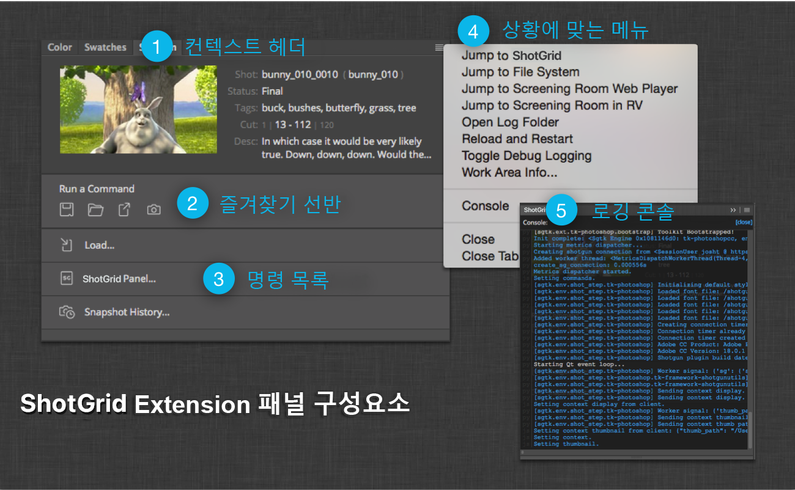
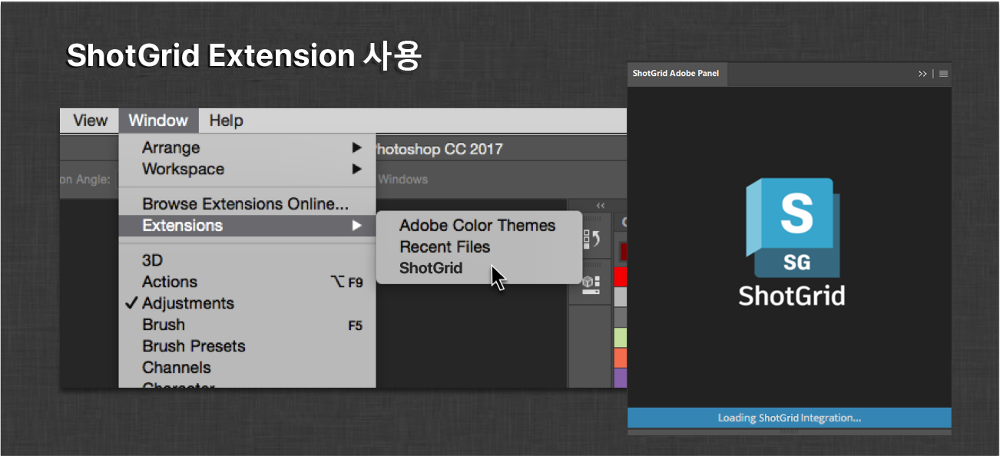
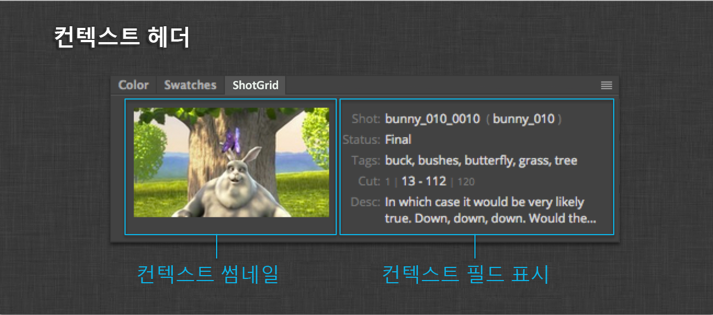
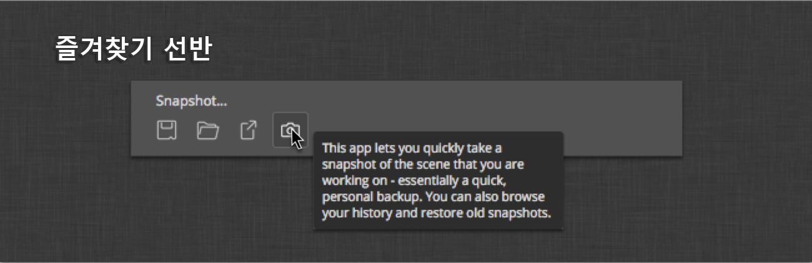
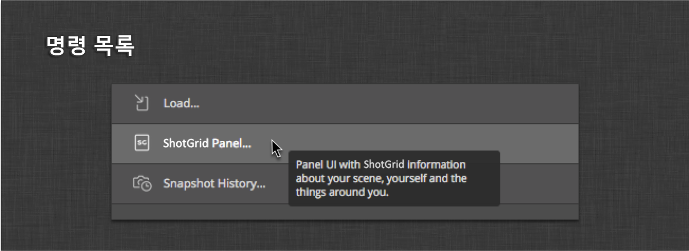
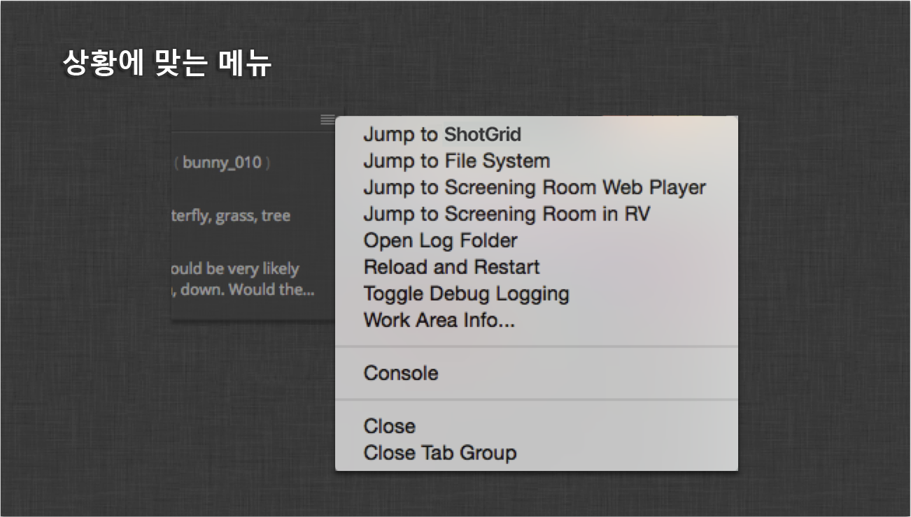
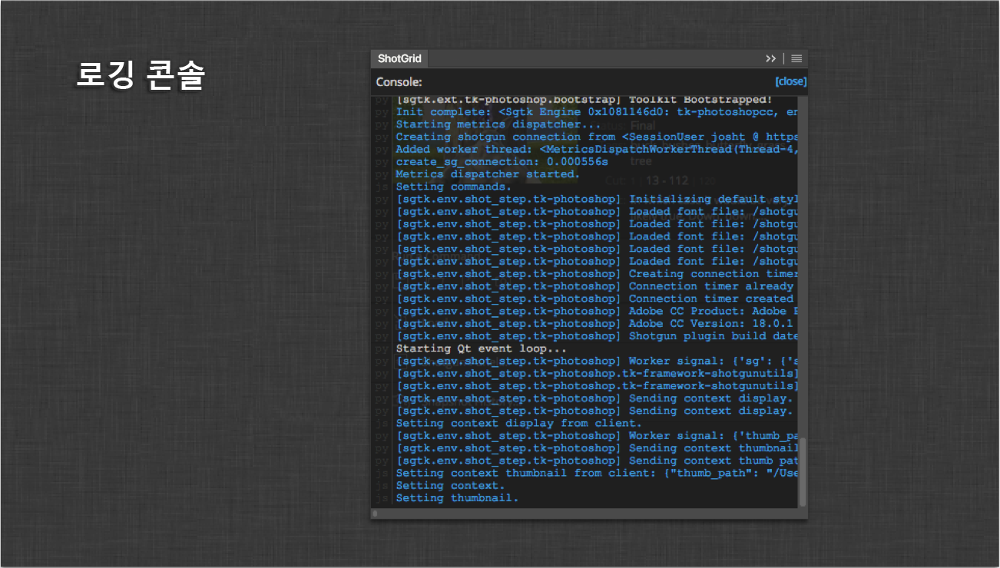

# Photoshop

Photoshop CC용  엔진은 Photoshop CC 워크플로우에 를 통합하기 위한 플랫폼을 제공합니다. 표준  Pipeline Toolkit 엔진으로 구성되며, [tk-framework-adobe](https://github.com/shotgunsoftware/tk-framework-adobe)(CEP)를 사용합니다.

활성화되면 Photoshop CC에서 **** 패널을 사용할 수 있게 됩니다.  컨텍스트에 대한 정보와 현재 해당 컨텍스트에 설치된 앱에 등록된 명령을 표시합니다.


## 지원되는 응용프로그램 버전

이 항목은 테스트를 거쳐 다음 응용프로그램 버전에서 작동하는 것으로 알려져 있습니다. 



최신 릴리즈에서는 더 완벽하게 작동할 수 있지만 이러한 버전에서 아직 공식적으로 테스트되지는 않았습니다.

## 인터페이스 개요

 익스텐션 패널은 기본 Photoshop CC 패널과 동일한 색상 팔레트 및 기본 레이아웃을 사용합니다. 익스텐션 패널은 다음 다섯 가지 구성요소로 이루어져 있습니다.



1. **컨텍스트 헤더** \- 현재 컨텍스트에 대한 썸네일 및 필드입니다.
2. **즐겨찾기 쉘프** \- 현재 컨텍스트에서 가장 많이 사용되는 앱을 표시하도록 디자인되었습니다.
3. **명령 목록** \- 현재 컨텍스트에서 자주 사용되지 않는 모든 명령입니다.
4. **상황에 맞는 메뉴** \- 추가 컨텍스트 관련 명령 및 디버깅 도구입니다.
5. **로깅 콘솔** \- 디버깅용 로깅 출력을 표시하는 콘솔 오버레이입니다.

## 설치

Photoshop CC용  엔진의 설치는 다른  통합과 동일한 프로토콜을 수행합니다. 엔진 및 앱 설치에 대한 자세한 내용은 [툴킷 관리](https://developer.shotgridsoftware.com/ko/425b1da4/) 문서를 참조하십시오. 또한 통합을 구성하는 방법의 예로 [기본 툴킷 구성](https://github.com/shotgunsoftware/tk-config-default2)을 참조할 수 있습니다.

## 익스텐션 활성화

익스텐션이 설치되면 Photoshop CC의 익스텐션 메뉴를 통해 익스텐션을 실행해야 합니다.



이 작업은 한 번만 수행하면 되고  익스텐션 패널은 이후 시작 시 활성화할 필요 없이 Photoshop CC 레이아웃에 유지될 수 있습니다.

활성화하고 이후에 시작하면  통합이 부트스트랩(Bootstrapping)되는 동안 익스텐션 패널에 로딩 화면이 표시됩니다.

이 화면은 일반적으로 현재 컨텍스트가 결정되고 명령이 표시되기까지 몇 초 동안 표시됩니다.

## 인터페이스 구성요소

다음 섹션에서는  Photoshop CC 통합의 구성요소를 간략하게 설명합니다.

### 컨텍스트 헤더

컨텍스트 헤더는 현재  컨텍스트에 대한 정보를 표시할 수 있는 커스터마이즈 가능 영역입니다.



컨텍스트는 현재 활성 문서에 의해 결정됩니다. 엔진에서 컨텍스트가 결정되면 헤더가 업데이트되어 컨텍스트의 썸네일 필드 상세 정보가 표시됩니다. 필드 정보는 후크로 제어됩니다. 필드 표시를 커스터마이즈하는 방법에 대한 자세한 정보는 아래의 **컨텍스트 필드 표시 후크** 섹션을 참조하십시오.

또한 Photoshop CC는 다중 문서 인터페이스이므로 활성 문서를 변경하면 컨텍스트가 업데이트되고 따라서  익스텐션도 업데이트됩니다. 특히 여러  컨텍스트에서 동시에 작업할 때 아티스트가 이 동작을 이해하는 것이 중요합니다.

### 즐겨찾기 쉘프

즐겨찾기 쉘프는 Maya 및 Houdini와 같은 다른  DCC 통합에서 사용할 수 있는 메뉴 즐겨찾기와 유사합니다. 이 인터페이스 섹션에서는 가장 일반적으로 사용되는 툴킷 앱을 컨텍스트 헤더 바로 아래에서 쉽게 사용할 수 있고 쉽게 찾습니다.



쉘프는 즐겨찾는 명령을 버튼으로 표시하며, 버튼 위에 마우스 커서를 놓으면 회색 음영에서 색상으로 전환되고 상단의 레이블에 이름이 표시됩니다. 버튼 위에 마우스 커서를 놓으면 버튼에 대한 툴팁이 표시됩니다.

버튼 중 하나를 클릭하면 실행하도록 등록된 명령에 대한 콜백이 트리거됩니다.

명령 즐겨찾기를 지정하는 방법에 대한 자세한 정보는 아래의 **쉘프 즐겨찾기** 섹션을 참조하십시오.

### 명령 목록

명령 목록에는 현재 컨텍스트에 대해 등록된 다른 "일반" 명령이 표시됩니다.



일반적으로 파이프라인 구성 내에 설치된 앱은 여기에 표시되는 하나 이상의 명령을 등록합니다. 명령이 즐겨찾기로 식별되지 않고 상황에 맞는 메뉴 명령으로도 식별되지 않는 경우 여기에 표시됩니다.

명령 목록 버튼은 즐겨찾기 쉘프의 버튼과 비슷한 방식으로 동작합니다. 유일한 차이점은 아이콘의 오른쪽에 전체 이름이 있는 목록으로 표시된다는 점입니다.

### 상황에 맞는 메뉴

상황에 맞는 메뉴 명령으로 등록된 모든 명령은  익스텐션 패널의 상황에 맞는 메뉴에 표시됩니다.



다른 명령 영역과 마찬가지로 이러한 명령은 컨텍스트와 함께 변경됩니다. **(으)로 이동(Jump to )** 및 **파일 시스템으로 이동(Jump to Filesystem)**과 같은 명령은 항상 여기에서 사용할 수 있습니다.

### 로깅 콘솔

로깅 콘솔에는 CEP Javascript 인터프리터 및 툴킷의 Python 프로세스의 모든 로깅 출력이 표시됩니다.



익스텐션에 문제가 있어 지원이 필요한 경우 로깅 콘솔 출력은  지원 팀이 문제를 디버깅하는 데 매우 유용합니다.

## 구성 및 기술 상세 정보

다음 섹션에서는 스튜디오 파이프라인의 특정 요구 사항으로 통합을 구성할 수 있는 통합의 보다 기술적인 측면에 대해 설명합니다.

### PySide

Photoshop CC용  엔진은 PySide를 사용합니다. [Pyside 설치](http://pyside.readthedocs.io/en/latest/installing/index.html)에 대한 공식 지침을 참조하십시오.

### CEP 익스텐션

익스텐션 자체는 엔진과 함께 번들로 제공되며 엔진은 Photoshop CC를 처음 시작할 때 자동으로 설치를 처리합니다. 익스텐션은 아티스트의 로컬 컴퓨터에 OS별 CEP 익스텐션 표준 디렉토리에 설치됩니다.

```shell
# Windows
> C:\Users\[user name]\AppData\Roaming\Adobe\CEP\extensions\

# OS X
> ~/Library/Application Support/Adobe/CEP/extensions/
```

Photoshop CC를 시작할 때마다 엔진 부트스트랩(Bootstrapping) 코드는 엔진과 함께 번들로 제공되는 익스텐션 버전을 컴퓨터에 설치된 버전과 비교하여 검사합니다. 즉, 엔진 업데이트 후 새 익스텐션 버전이 함께 제공된 경우 설치된 익스텐션이 번들로 제공되는 새 버전으로 자동 업데이트됩니다.

### 즐겨찾기 구성

**즐겨찾기 쉘프**는 설치된 앱에 등록된 모든 명령을 표시하도록 구성할 수 있습니다. 이렇게 하려면 환경 설정의 `tk-photoshopcc` 섹션에 `shelf_favorites` 구성을 추가하면 됩니다. 다음은 예입니다.

```yaml
shelf_favorites:
    - {app_instance: tk-multi-workfiles2, name: File Save...}
    - {app_instance: tk-multi-workfiles2, name: File Open...}
    - {app_instance: tk-multi-publish, name: Publish...}
    - {app_instance: tk-multi-snapshot, name: Snapshot...}
```

설정의 값은 구성에 설치된 앱 중 하나에서 제공하는 등록된 명령을 식별하는 사전 목록입니다. `app_instance` 키는 설치된 특정 앱을 식별하고 `name` 키는 해당 앱에서 등록된 명령의 표시 이름과 일치합니다. 위의 예에서 즐겨찾는 네 가지 명령, `tk-multi-workfiles2` 앱의 파일 열기 및 저장 대화상자와 표준 툴킷 게시 및 스냅샷 대화상자를 볼 수 있습니다. 이제 이 네 가지 명령이 즐겨찾기 쉘프에 표시됩니다.

### 컨텍스트 필드 표시 후크

엔진에는 패널의 **컨텍스트 헤더** 섹션에 표시되는 필드를 제어하는 후크가 제공됩니다. 후크에서 표시되는 항목을 커스터마이즈하기 위해 재지정할 수 있는 두 가지 방식이 있습니다.

첫 번째는 `get_entity_fields()` 방식입니다. 이 방식은 현재  컨텍스트를 나타내는 엔티티 유형을 적용합니다. 예상되는 반환값은 표시를 위해 쿼리해야 하는 해당 엔티티의 필드 목록입니다. 엔진 자체는 비동기적으로 데이터 쿼리를 처리합니다.

에서 데이터를 쿼리하면 후크의 두 번째 방식이 호출됩니다. 이 `get_context_html()` 방식은 `get_entity_fields()` 방식에서 지정된 쿼리된 필드로 채워진 컨텍스트 엔티티 사전을 수신합니다. 예상되는 반환값은 쿼리된 엔티티 필드를 표시하도록 형식이 지정된 HTML을 포함하는 문자열입니다.

[기본 후크 구현](https://github.com/shotgunsoftware/tk-photoshopcc/blob/master/hooks/context_fields_display.py)은 이러한 방식에 필요한 사항에 대한 좋은 참조입니다.

엔진은 엔티티 썸네일을 사용할 수 있는 경우 항상 이를 표시합니다.

### Photoshop API

이 엔진은 Photoshop CC용 Javascript API를 Python에 노출합니다.

Photoshop API 객체는 `engine.adobe`로 노출됩니다. 아래 예는 툴킷 앱과 후크 내에서 Photoshop DOM을 직접 조작하는 방법을 보여 줍니다. 표준 툴킷 앱에는 Photoshop 문서와 상호 작용하는 방법에 대한 작업 예가 포함되어 있습니다.

#### 예
파일 로드:

```python
f = adobe.File('/Path/To/File.jpeg')
adobe.app.load(f)
```

눈금자 단위를 픽셀로 설정:

```python
pixels = adobe.Units.PIXELS
adobe.app.preferences.rulerUnits = pixels
```

기본 옵션을 사용하여 현재 웹 문서 내보내기:

```python
temp_thumb_file = adobe.File(out_path)
save_for_web = adobe.ExportType.SAVEFORWEB
export_options = adobe.ExportOptionsSaveForWeb()
adobe.app.activeDocument.exportDocument(temp_thumb_file, save_for_web, export_options)
```

각 레이어를 별도의 파일로 내보내기:

```python
doc = adobe.app.activeDocument
layers = doc.artLayers
layers = [layers[i] for i in xrange(layers.length)]
original_visibility = [layer.visible for layer in layers]

save_for_web = adobe.ExportType.SAVEFORWEB
export_options = adobe.ExportOptionsSaveForWeb()

for layer in layers:
    layer.visible = False

for layer in layers:
    layer.visible = True
    out_file = adobe.File("c:/layer.%s.jpg" % str(layer.name))
    doc.exportDocument(
        out_file,
        save_for_web,
        export_options,
    )
    layer.visible = False

for (i, layer) in enumerate(layers):
    layer.visible = original_visibility[i]
```

### 환경 변수

디버깅을 돕기 위해 엔진의 일부 기본값을 변경하는 일련의 환경 변수가 있습니다.

`SHOTGUN_ADOBE_HEARTBEAT_INTERVAL` - Python heartbeat 간격(초)입니다(기본값: 1초). 레거시 환경 변수 `SGTK_PHOTOSHOP_HEARTBEAT_INTERVAL` 역시 설정된 경우 적용됩니다.

`SHOTGUN_ADOBE_HEARTBEAT_TOLERANCE` - 종료하기 전 heartbeat 오류 수입니다(기본값: 2). 레거시 환경 변수 `SGTK_PHOTOSHOP_HEARTBEAT_TOLERANCE` 역시 설정된 경우 적용됩니다.

`SHOTGUN_ADOBE_NETWORK_DEBUG` - 출력 로깅 시 추가 네트워킹 디버그 메시지를 포함합니다. 레거시 환경 변수 `SGTK_PHOTOSHOP_NETWORK_DEBUG` 역시 설정된 경우 적용됩니다.

`SHOTGUN_ADOBE_PYTHON` - 엔진을 시작할 때 사용할 Python 실행 파일의 경로입니다. 설정되지 않은 경우 시스템 Python이 사용됩니다. Photoshop이  데스크톱과 같은 Python 프로세스에서 또는 tk-shell 엔진을 통해 시작되면 해당 프로세스에서 사용되는 Python이 Photoshop 통합에서 사용됩니다.

참고: Adobe 프레임워크에 추가 환경 변수가 존재합니다. 자세한 내용은 [개발자 문서](https://developer.shotgridsoftware.com/tk-framework-adobe/)를 참조하십시오.

### 앱 개발자 노트

* Python 프로세스는 Photoshop CC 프로세스와 별개이므로 가능한 깔끔한 방식으로 Photoshop 창 위에 표시되는 앱 창을 만들기 위해 엔진 내에서 일부 작업이 수행됩니다. 이 설정의 한 가지 문제는 `QFileDialog`의 경우 기본 OS 창을 사용하도록 하는 기본 옵션입니다. 이 엔진과 함께 사용할 앱을 개발하는 경우 기본 대화상자를 사용하지 않도록 옵션을 설정해야 합니다. [tk-multi-pythonconsole 앱에서 이에 대한 예를 참조하십시오](https://github.com/shotgunsoftware/tk-multi-pythonconsole/blob/master/python/app/console.py#L218).
