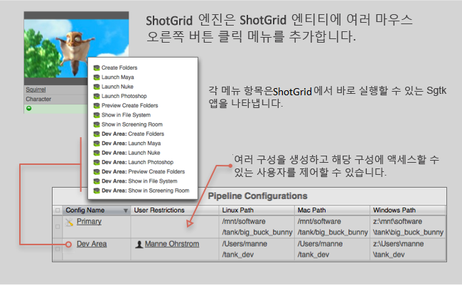

# 



 엔진은  내에서 시작할 수 있는 앱을 관리합니다. 이러한 툴킷 앱을 *액션*으로 간주하는 경우가 있습니다. 일반적으로 이러한 앱은  내부의 메뉴에 항목으로 표시됩니다.

##  Pipeline Toolkit 액션 사용

액션은  홈페이지에 표시됩니다.


객체 또는 선택 항목을 마우스 오른쪽 버튼으로 클릭하면 표시되는 표준  상황에 맞는 메뉴에서도 찾을 수 있습니다.


액션을 클릭하면 즉시 처리가 시작됩니다. 앱이 완료되면 일반적으로 일부 상태 정보가 포함된 메시지가 표시되고 정상적으로 작동하지 않을 경우 오류 메시지가 표시됩니다.

## 용 앱 개발

 내부에서 실행되는 앱을 개발하는 것은 쉽습니다. 일반적인 앱 개발 작업 방식을 잘 모르는 경우 플랫폼 문서로 이동하여 소개 자료를 확인하십시오. 이 섹션에서는 앱 개발 프로세스의  측면에 대해 설명합니다.

Core v0.13부터는  엔진에서 모든 다중 앱을 사용할 수 있습니다. 기술적으로  엔진과 다른 엔진 사이에는 차이가 거의 없습니다. 그러나 다음과 같이 약간의 미묘한 차이가 있습니다.

*  엔진에서 QT 기반 앱을 실행하려면 PySide 또는 PyQt를 표준 Python 환경에 수동으로 설치해야 합니다.
*  엔진에서는 사용자가 속한 권한 그룹에 따라 사용자에게 액션을 표시할 수 있습니다.  액션(Action) 메뉴에 명령을 추가하고 관리자(Admin)만 볼 수 있게 하려는 경우에 유용합니다.

관리자(Admin)에게만 표시되는 hello-world 스타일의  앱은 다음과 같습니다.

```python
from tank.platform import Application

class LaunchPublish(Application):

    def init_app(self):
        """
        Register menu items with 
        """        
        params = {
            "title": "Hello, World!",
            "deny_permissions": ["Artist"],
        }

        self.engine.register_command("hello_world_cmd", self.do_stuff, params)


    def do_stuff(self, entity_type, entity_ids):
        # this message will be displayed to the user
        self.engine.log_info("Hello, World!")    
```

## 설치 및 업데이트

###  Pipeline Toolkit에 이 엔진 추가

asset 환경의 XYZ 프로젝트에 이 엔진을 추가하려면 다음 명령을 실행합니다.

```
> tank Project XYZ install_engine asset tk-shotgun
```

### 최신 버전으로 업데이트

프로젝트에 이 항목이 이미 설치되어 있는 경우 최신 버전을 얻으려면 `update` 명령을 실행할 수 있습니다. 특정 프로젝트와 함께 제공되는 tank 명령을 탐색하여 다음과 같이 실행할 수 있습니다.

```
> cd /my_tank_configs/project_xyz
> ./tank updates
```

또는 스튜디오 tank 명령을 실행하고 업데이트 확인을 실행할 프로젝트 이름을 지정할 수 있습니다.

```
> tank Project XYZ updates
```

## 협업 및 개선

 Pipeline Toolkit에 액세스할 수 있다면 모든 앱, 엔진 및 프레임워크가 저장 및 관리되는 Github에서 그 소스 코드에도 액세스할 수 있습니다. 이러한 항목을 자유롭게 개선하여 향후 독립적인 개발을 위한 기반으로 사용하고 변경 후 다시 사용자 요청을 제출하거나, 아니면 그냥 조금만 손을 보고 어떻게 빌드되었는지, 툴킷이 어떻게 작동하는지 확인해 보십시오. https://github.com/shotgunsoftware/tk-shotgun에서 이 코드 리포지토리에 액세스할 수 있습니다.

## 특별 요구 사항

이 기능을 이용하려면  Pipeline Toolkit Core API 버전 v0.19.5 이상이 필요합니다.