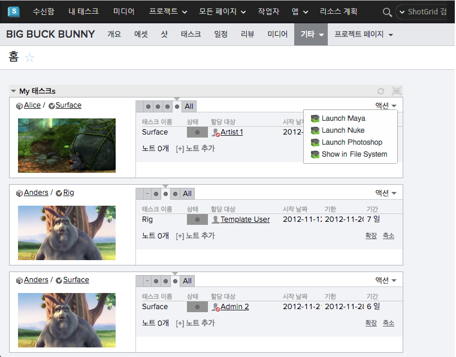
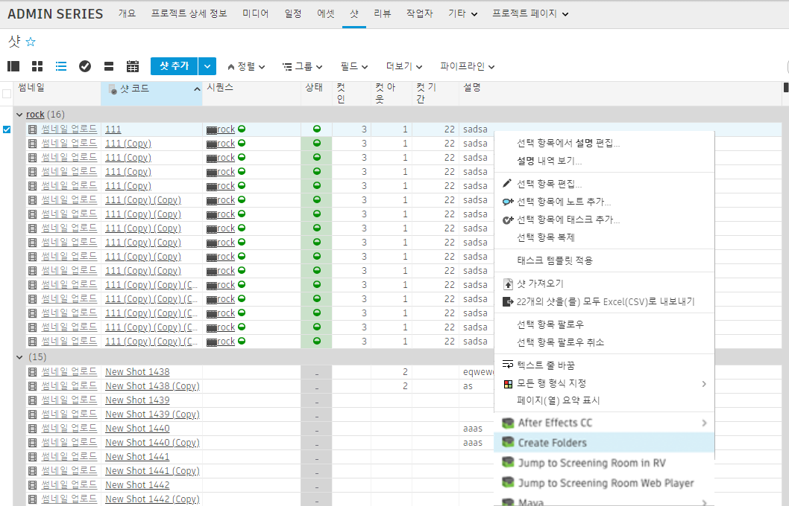

# 

 엔진은  내에서 시작할 수 있는 앱을 관리합니다. 이러한 툴킷 앱을 *액션*으로 간주하는 경우가 있습니다. 일반적으로 이러한 앱은  내부의 메뉴에 항목으로 표시됩니다.

##  Pipeline Toolkit 액션 사용

액션은  홈페이지에 표시됩니다.



객체 또는 선택 항목을 마우스 오른쪽 버튼으로 클릭하면 표시되는 표준  상황에 맞는 메뉴에서도 찾을 수 있습니다.



액션을 클릭하면 즉시 처리가 시작됩니다. 앱이 완료되면 일반적으로 일부 상태 정보가 포함된 메시지가 표시되고 정상적으로 작동하지 않을 경우 오류 메시지가 표시됩니다.

## 용 앱 개발

 내부에서 실행되는 앱을 개발하는 것은 쉽습니다. 일반적인 앱 개발 작업 방식을 잘 모르는 경우 플랫폼 문서로 이동하여 소개 자료를 확인하십시오. 이 섹션에서는 앱 개발 프로세스의  측면에 대해 설명합니다.

Core v0.13부터는  엔진에서 모든 다중 앱을 사용할 수 있습니다. 기술적으로  엔진과 다른 엔진 사이에는 차이가 거의 없습니다. 그러나 다음과 같이 약간의 미묘한 차이가 있습니다.

*  엔진에서 QT 기반 앱을 실행하려면 PySide 또는 PyQt를 표준 Python 환경에 수동으로 설치해야 합니다.
*  엔진에서는 사용자가 속한 권한 그룹에 따라 사용자에게 액션을 표시할 수 있습니다.  액션(Action) 메뉴에 명령을 추가하고 관리자(Admin)만 볼 수 있게 하려는 경우에 유용합니다.

관리자(Admin)에게만 표시되는 hello-world 스타일의  앱은 다음과 같습니다.

```python
from tank.platform import Application

class LaunchPublish(Application):

    def init_app(self):
        """
        Register menu items with 
        """        
        params = {
            "title": "Hello, World!",
            "deny_permissions": ["Artist"],
        }

        self.engine.register_command("hello_world_cmd", self.do_stuff, params)


    def do_stuff(self, entity_type, entity_ids):
        # this message will be displayed to the user
        self.engine.log_info("Hello, World!")    
```

