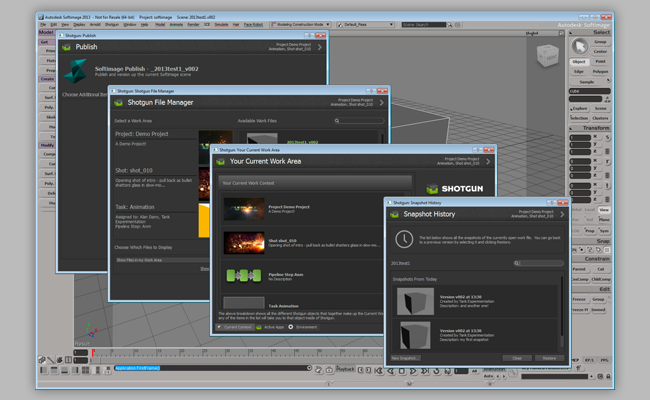

# Softimage

> **경고:** Softimage 엔진은 2021년 2월 13일부로 사용 기간이 종료되었습니다. [자세한 내용은 여기를 참조](https://community.shotgridsoftware.com/t/end-of-life-for-softimage-support-on-february-13th-2021/10694)하십시오.



Softimage용  엔진은  Pipeline Toolkit 앱과 Softimage를 연결합니다. 여기에는 PySide/Qt 배포판이 포함되어 있어 엔진 내부에서 바로 실행되는 Python 및 PySide를 사용하여 앱을 작성할 수 있습니다. 이 문서에서는 고급 구성 설정에 대해 자세히 설명합니다.

Softimage용  엔진에는  앱을 Softimage에 통합하기 위한 표준 플랫폼이 포함되어 있습니다. 이 엔진은 자동 파일 관리, 잘 정의된 작업 영역/게시 워크플로우, 스냅샷 등을 제공하는 일반적인 앱 제품군을 지원합니다.

엔진이 로드되면 Softimage 기본 메뉴 모음에  메뉴가 제공됩니다.


## 지원되는 응용프로그램 버전

이 항목은 테스트를 거쳐 2012, 2013 응용프로그램 버전에서 작동하는 것으로 알려져 있습니다. 최신 릴리즈에서는 더 완벽하게 작동할 수 있지만 이러한 버전에서 아직 공식적으로 테스트되지는 않았습니다.

사용 가능한 툴킷 명령이 여기에 표시됩니다.

Softimage용  엔진은 베타 버전이며 몇 가지 알려진 문제가 있습니다. 아래에서 전체 목록을 확인하십시오.

## 앱 개발자를 위한 정보

### 지원되는 플랫폼

Softimage용  엔진은 현재 Windows에서는 Softimage 2012 및 2013을 지원하고 Linux에서는 2013을 지원합니다.

Softimage 2014는 현재 Linux에서 지원되지 않으며 Windows에서 실행될 수는 있지만 일부 불안정한 문제가 있으므로 사용하지 않는 것이 좋습니다.

### PySide

#### Windows

Windows에서 Softimage는 기본 제공 Python 배포판 또는 외부 배포판을 사용하도록 구성할 수 있습니다. 자세한 정보는 http://download.autodesk.com/global/docs/softimage2013/en_us/userguide/index.html?url=files/userprefs528.htm,topicNumber=d30e797817을 참조하십시오.

이 엔진은 설치된 Python for Softimage 버전, 버전 2012(Python 2.6 x64), 2013(Python 2.6 x64), 2014(Python 2.7 x64)의 경우 PySide 및 Qt 버전과 함께 번들로 제공됩니다. 그러나 Python의 외부 배포판을 사용하는 경우 PySide와 Qt의 이진 호환 버전도 제공해야 합니다.

Windows PySide 배포판에 대한 리소스는 http://www.lfd.uci.edu/~gohlke/pythonlibs/에서 찾을 수 있습니다.

#### Linux

Linux에서 Softimage는 기본 제공 Python 버전을 사용해야 합니다. Softimage 2013의 경우 사전 빌드된 PySide 및 Qt 배포판이 필요하며 [tk-framework-softimageqt](https://github.com/shotgunsoftware/tk-framework-softimageqt)에서 제공됩니다. 이 배포판은 Softimage 2013에서 사용하는 것과 동일한 버전인 Python 2.5.2용 GCC 4.1.2를 사용하여 빌드되었습니다.

다양한 Linux 배포판으로 인해 모든 경우에 잘 작동한다는 보장이 없기 때문에 제대로 작동하도록 하려면 다시 빌드해야 할 수 있습니다. 버전 빌드 방법에 대한 자세한 정보는 프레임워크에 포함된 README에서 확인할 수 있습니다. 다음을 참조하십시오.

https://github.com/shotgunsoftware/tk-framework-softimageqt/tree/master/resources/pyside121_py25_qt485_linux

### 알려진 문제(Windows)

#### Softimage 2014 불안정성

엔진이 Windows의 Softimage 2014에서 실행되기는 하지만 알려진 문제가 있으며 완전히 테스트되지 않았습니다. 게시 대화상자를 열면 Softimage가 중단됩니다.

#### Softimage 2014의 SSL 버그

Softimage 2014와 함께 배포된 `_ssl.pyd` 파일에는 시작 시 속도 저하를 유발할 수 있는 알려진 버그가 포함되어 있습니다. 이 문제를 해결하려면 이 파일을 백업한 다음 Maya 2014에서 찾을 수 있는 `_ssl.pyd` 파일로 덮어쓰는 것이 좋습니다. 도움이 필요한 경우 언제든지 툴킷 지원 팀에 문의하십시오.

#### 창 상위 지정

엔진의 `show_modal` 또는 `show_dialog` 방식을 사용하지 않고 상위가 없이 생성된 Qt 창은 기본 Softimage 응용프로그램의 상위로 제대로 지정되지 않습니다.

### 알려진 문제(Linux)

#### ssl 및 sqlite3 라이브러리 누락

Softimage는 매우 구체적인 PySide 버전(위에서 자세히 설명)을 요구하는 것 외에도  Python API 및 툴킷에 필요한 ssl 및 sqlite3 라이브러리가 누락되었습니다.

이 라이브러리를 `tk-multi-launchapp` 앱의 일부로 포함하여 Softimage를 시작하기 전에 LD_LIBRARY_PATH & PYTHONPATH에도 추가합니다. 다시 말하지만 이러한 문제가 있는 경우 시스템 구성 빌드에 대한 자세한 지침은 앱에 포함된 README에서 확인할 수 있습니다. 다음을 참조하십시오.

https://github.com/shotgunsoftware/tk-multi-launchapp/blob/master/app_specific/softimage/linux/lib/README

#### libX11의 세그먼트화 오류

Linux의 Softimage에는 특정 Linux 배포판에서 속도 문제를 해결할 수 있는 해크 옵션이 포함되어 있습니다. 자세한 정보는 다음을 참조하십시오.

http://xsisupport.com/2011/01/19/the-case-of-the-slow-2011-startup-on-fedora-14/

이에 따라 Softimage는 다음 위치에 있는 libX11 라이브러리의 다른 버전을 사용하게 됩니다.

/usr/Softimage/Softimage_2013/Application/mainwin/mw/lib-amd64_linux_optimized/X11

이 해크를 사용할 경우 Qt가 libX11 라이브러리(호출 스택의 SIGSEGV)를 호출하는 동안 세그먼트화 오류가 발생하여 잦은 충돌이 발생할 수 있습니다. 왜냐하면 libX11 라이브러리의 해크 버전이 꽤 오래되었고 Qt가 빌드된 버전과 호환되지 않기 때문입니다.

이 문제를 해결하려면 Softimage 해크 버전과 호환되는 libX11 버전에 대한 새 Qt 버전을 빌드해야 합니다.

#### libssl의 세그먼트화 오류

GCC의 올바른 버전(4.1.2)을 사용하여 빌드하지 않은 최신 버전의 openssl을 사용하는 경우  API를 사용할 때 세그먼트화 오류(SIGSEGV)가 표시될 수 있습니다.

이러한 오류는 Qt/PySide에만 국한되는 것이 아니라 두 번째로 흔한 문제이기 때문에 여기서 설명할 필요가 있습니다.

다음을 참조하십시오.

https://github.com/shotgunsoftware/tk-multi-launchapp/blob/master/app_specific/softimage/linux/lib/README

Softimage 2013에 대한 openssl의 호환 버전을 빌드하는 방법에 대한 지침이 나와 있습니다.

#### 창 상위 지정

현재 툴킷 창은 Linux의 기본 Softimage 응용프로그램 창에 상위로 지정되지 않습니다. 해결 방법으로 툴킷 창은 최상위 레벨로 만들어지지만 때때로 다른 창(특히 확인 대화상자)이 툴킷 창 뒤에 숨겨져 있음을 의미할 수 있습니다.

Softimage가 멈춘 것 같으면 열려 있는 툴킷 창을 이동하여 뒤에 대화상자가 숨어 있는지 확인합니다.

#### Softimage/툴킷이 창 이동 후 고정

모달리스 대화상자(예:  File Manager)를 이동하면 Softimage와 대화상자의 컨텐츠가 모두 고정되거나 중단되는 것으로 나타납니다. 이는 Qt 메시지 대기열이 현재 구현되는 방식과 관련된 문제이지만 유감스럽게도 아직 대체 솔루션을 찾지 못했습니다.

간단한 해결 방법으로, 이 문제가 발생할 때 기본 Softimage 뷰포트를 클릭하면 다시 제대로 작동하기 시작합니다.

## 설치 및 업데이트

###  Pipeline Toolkit에 이 엔진 추가

asset 환경의 XYZ 프로젝트에 이 엔진을 추가하려면 다음 명령을 실행합니다.

```
> tank Project XYZ install_engine asset tk-softimage
```

### 최신 버전으로 업데이트

프로젝트에 이 항목이 이미 설치되어 있는 경우 최신 버전을 얻으려면 `update` 명령을 실행할 수 있습니다. 특정 프로젝트와 함께 제공되는 tank 명령을 탐색하여 다음과 같이 실행할 수 있습니다.

```
> cd /my_tank_configs/project_xyz
> ./tank updates
```

또는 스튜디오 `tank` 명령을 실행하고 업데이트 확인을 실행할 프로젝트 이름을 지정할 수 있습니다.

```
> tank Project XYZ updates
```

## 협업 및 개선

 Pipeline Toolkit에 액세스할 수 있다면 모든 앱, 엔진 및 프레임워크가 저장 및 관리되는 Github에서 그 소스 코드에도 액세스할 수 있습니다. 이러한 항목을 자유롭게 개선하여 향후 독립적인 개발을 위한 기반으로 사용하고 변경 후 다시 사용자 요청을 제출하거나, 아니면 그냥 조금만 손을 보고 어떻게 빌드되었는지, 툴킷이 어떻게 작동하는지 확인해 보십시오. https://github.com/shotgunsoftware/tk-softimage에서 이 코드 리포지토리에 액세스할 수 있습니다.

## 특별 요구 사항

이 기능을 이용하려면  Pipeline Toolkit Core API 버전 v0.14.56 이상이 필요합니다.