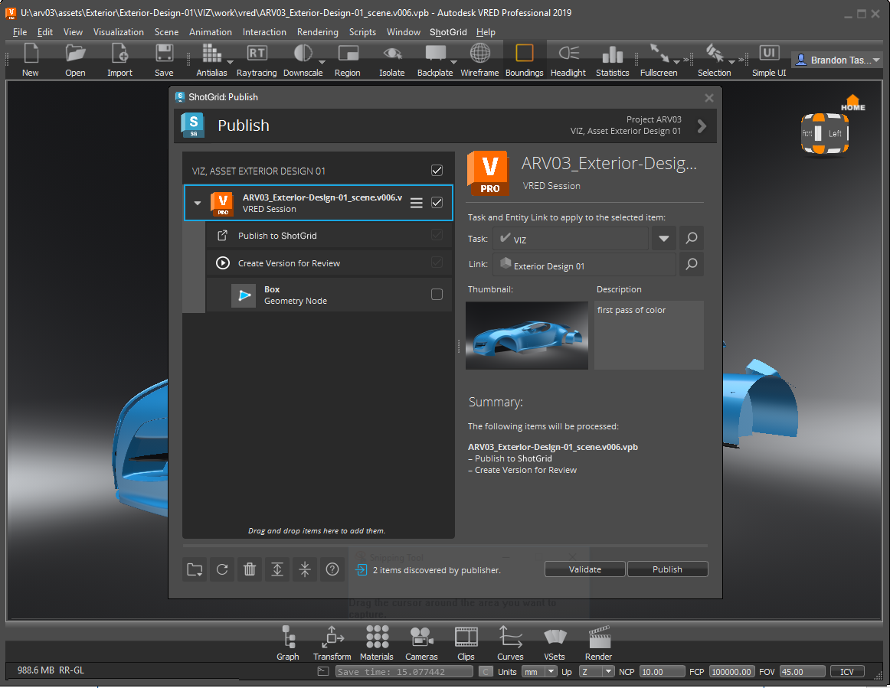

# VRED

VRED용  엔진에는  앱을 VRED에 통합하기 위한 표준 플랫폼이 포함되어 있습니다. 직접적으로 실행되는 경량의 플랫폼으로, VRED 메뉴에  메뉴를 추가합니다.

## 지원되는 응용프로그램 버전

이 항목은 테스트를 거쳐 다음 응용프로그램 버전에서 작동하는 것으로 알려져 있습니다. 



최신 릴리즈에서는 더 완벽하게 작동할 수 있지만 이러한 버전에서 아직 공식적으로 테스트되지는 않았습니다.

## 앱 개발자를 위한 정보

### VRED 프로젝트 관리

VRED용  엔진이 시작되면 VRED 프로젝트가 이 엔진 설정에서 정의된 위치를 가리키도록 설정됩니다. 즉, 새 파일을 열면 프로젝트가 변경될 수도 있습니다. 파일을 기반으로 VRED 프로젝트가 설정되는 방법과 관련된 상세 정보는 템플릿 시스템을 사용하여 구성 파일에서 구성할 수 있습니다.

## tk-vred 작업

이  통합은 VRED 제품군(Pro 및 Design)을 지원합니다.

VRED가 열리면  메뉴(VRED 엔진)가 메뉴 막대에 추가됩니다. 

### 파일 열기 및 저장

내 태스크(My Tasks) 및 에셋(Assets) 탭을 사용하여 할당된 모든 태스크를 보고 에셋을 찾을 수 있습니다. 오른쪽에서 이 탭을 사용하여 왼쪽에 선택된 항목과 연관된 모든 파일, 작업 파일 또는 게시된 파일을 볼 수 있습니다. 

### 게시 
게시: 파일을 에 게시하기 위한 게시(Publish) 대화상자를 엽니다. 게시하면 아티스트 다운스트림에서 사용할 수 있습니다. VRED 게시에 대한 자세한 내용은 [여기를 참조](https://github.com/shotgunsoftware/tk-vred/wiki/Publishing)하십시오. 

### Loader 
Loader: 앱 작동 방법을 설명하는 지침 슬라이드와 함께 컨텐츠 Loader 앱을 엽니다. VRED 로드에 대한 자세한 내용은 [여기를 참조](https://github.com/shotgunsoftware/tk-vred/wiki/Loading)하십시오. 

### 씬 분할 
씬 분할: 기한이 만료된 씬의 항목과 함께 또는 PublishedFile의 대체 버전을 사용하여 "참조된" 파일(및 해당 링크) 목록을 표시하는 분할(Breakdown) 대화상자를 엽니다. 
