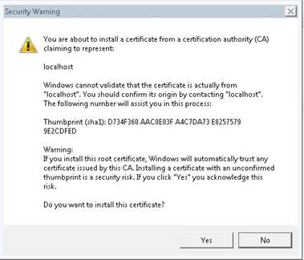

# 툴킷 데스크톱 서버 프레임워크

desktopserver 프레임워크는 의 로컬 파일 링크 및 툴킷 통합 기능을 제공합니다.  이를 통해 데스크톱 액세스가 필요한 동작에 대한  웹 사이트의 요청을 안전하게 수신하는 로컬 웹 소켓 서버를 사용할 수 있습니다.

로컬 파일 링크의 경우, 이러한 요청을 통해 웹 인터페이스에서 로컬 파일 경로에 대한  액세스를 허용하며 요청 시  페이지에서 해당 파일을 직접 열 수 있습니다.
툴킷의 경우 를 통해 지정된 엔티티에 대해 등록된 파이프라인 액션을 확인하고 이를 실행할 수 있습니다.

## 데스크톱 통합을 실행하는 방법

이러한  기능이 작동하려면 일부 지원되는 데스크톱 통합이 실행 중이어야 합니다.
[이 페이지](https://support.shotgunsoftware.com/entries/95402178)에서는 데스크톱과 를 통합하는 방법에 대한 다양한 옵션을 설명합니다.  Websocket 서버 섹션에서는 이 프레임워크가 제공하는 기능에 대해 설명합니다.

###  데스크톱

이 프레임워크는  데스크톱과 함께 번들로 제공되며, 이는 [여기](https://support.shotgunsoftware.com/entries/95442748#Downloading%20Shotgun%20Desktop)에서 다운로드할 수 있습니다.  데스크톱을 실행하면 자동으로 Websocket 서버를 시작합니다.   데스크톱을 이미 실행 중인 경우 설정 프로세스가 완료된 것입니다.

### 서버 구성

브라우저 통합 설정은 구성 파일에 저장할 수 있습니다. 이 구성 파일은 `SGTK_BROWSER_INTEGRATION_CONFIG_LOCATION` 환경 변수를 설정하여 지정할 수 있습니다. 로컬 서버를 구성할 수 있는 방법에 대한 자세한 내용은 [샘플 파일](https://github.com/shotgunsoftware/tk-framework-desktopserver/blob/master/app/config.ini.example)에서 확인할 수 있습니다.

### 인증서 제거

생성한 인증서를 제거하려는 경우 `python certificates.py --remove` 명령을 실행할 수 있습니다.

## 래퍼를 통해 시작

기본적으로 서버에서는 운영 체제 기본값을 사용하여 명령을 실행합니다(Linux에서는 "xdg-open"과 동등한 값, OS X에서는 "열기", Windows에서 "실행"). 파일 실행을 위해 자체 래퍼를 제공하려는 경우 커스텀 래퍼를 가리키도록 **SHOTGUN_PLUGIN_LAUNCHER** 환경 변수를 설정할 수 있습니다. 이를 설정하면 래퍼는 유일한 인수로서 경로를 통해 호출됩니다.

## 인증서

서버를 처음 실행하면 보안 연결 설정에 필요한 인증서가 생성됩니다. 이러한 인증서는 컴퓨터에 로컬로 저장되며 공개적으로 공유되지 않습니다.
이를 이용하면 웹 소켓에 필요한 암호화된 연결이 가능하며 이는 로컬에 남아 있는 모든 트래픽(브라우저에서 서버로)에도 불구하고 필요합니다. 의 웹 소켓 트래픽은 인터넷을 통해 제공되지 않습니다.

인증서가 시스템에 등록된 경우 다음과 같이 대화상자가 표시됩니다.
"확인(OK)"을 클릭하여 등록을 계속 진행합니다.




 데스크톱을 사용하면 생성된 인증서가 다음 위치에 저장됩니다.

**OS X**: ~/Library/Caches/Shotgun/desktop/config/certificates<br/>**Windows**: %AppData%\Shotgun\desktop\config\certificates<br/>**Linux**: ~/.shotgun/desktop/config/certificates<br/>

## 보안 설정 - 로컬  설치

기본적으로 websocket 서버는 포트 9000에서 호스트되는  사이트를 수신하도록 설정되어 있습니다.
로컬  서버를 실행하는 경우 websocket 서버에서의 연결을 허용하도록  서버에 대한 구성을 업데이트해야 합니다.

 데스크톱을 실행할 때  바이너리와 함께 존재하는 ```config.ini``` 파일을 설정해야 합니다.  이 파일이 존재해야 하는 위치에 대한 자세한 지침은 [여기](https://support.shotgunsoftware.com/entries/95442748#Advanced%20Installation%20Topics)에서 참조하십시오.

해당 파일에는 Websocket 서버의 기능을 제어하는 섹션이 있습니다.
일반적인 구성은 다음과 같습니다.

```ini
[BrowserIntegration]
low_level_debug=0
port=9000
enabled=1
whitelist=*.shotgunstudio.com
```

## 문제 해결

Linux에서 서버는 libffi에 대한 종속성을 도입합니다.  시작 시 데스크톱에서 충돌이 발생하고 로그에서 libffi를 찾을 수 없다는 메시지가 표시되는 경우 이 패키지를 설치해야 합니다.

설치 중에 문제 또는 질문이 있는 경우 [지원 사이트](https://knowledge.autodesk.com/ko/contact-support)를 방문하십시오.  서버 실행에 문제가 있는 경우 **config.ini** 파일에서 **debug**를 **1**로 설정하고 데스크톱의 로그 파일을 포함시키십시오.

로그 파일은 다음 위치에 있습니다.

**OS X**: ~/Library/Logs/Shotgun/tk-desktop.log<br/>**Windows**: ~\%APPDATA%\Shotgun\tk-desktop.log<br/>**Linux**: ~/.shotgun/tk-desktop.log<br/>
