<!-- omit in toc -->
# 통합 사용자 안내서

이 안내서의 내용:
- [소개](#Introduction)
- [데스크톱 시작하기](#getting-started-with-desktop)
   - [데스크톱 설치](#installation-of-desktop)
   - [자체 호스팅되거나 프록시 서버 뒤에 있는 경우 로그인](#logging-in-when-self-hosted-or-behind-a-proxy-server)
      - [인증 및 브라우저 통합](#authentication-and-browser-integration)
   - [시스템 트레이](#the-system-tray)
   - [프로젝트 브라우저](#the-project-browser)
   - [명령 실행기](#the-command-launcher)
   - [콘솔](#the-console)
- [응용프로그램 실행](#launching-applications)
- [패널](#the-panel)
   - [개요](#overview)
   - [UI 상세 정보](#ui-details)
      - [액티비티 스트림](#the-activity-stream)
      - [노트 생성 및 노트에 회신](#creating-and-replying-to-notes)
      - [노트, 버전, 게시 및 태스크](#notes-versions-publishes-and-tasks)
      - [정보 탭](#the-info-tab)
      - [검색](#searching)
      - [액션](#actions)
      - [현재 작업 영역 및 내 영역](#the-current-work-area-and-the-me-area)
      - [현재 작업 영역](#current-work-area)
- [Publisher](#the-publisher)
   - [개요](#overview-1)
   - [인터페이스 구성요소 및 개념](#interface-components-and-concepts)
   - [기본 워크플로우 ](#basic-workflow)
      - [컨텐츠 생성 소프트웨어 내에서 게시](#publishing-within-content-creation-software)
      - [항목 및 태스크 게시](#publish-items-and-tasks)
         - [컨텍스트](#context)
         - [유효성 검사](#validation)
         - [다중 문서 워크플로우](#multi-document-workflows)
      - [독립 실행형 게시](#stand-alone-publishing)
      - [게시 유형](#publish-types)
         - [독립 실행형](#standalone)
         - [3ds Max](#3ds-max)
         - [Houdini](#houdini)
         - [Maya](#maya)
         - [Nuke](#nuke)
         - [Nuke Studio](#nuke-studio)
         - [Photoshop CC](#photoshop-cc)
- [로더](#the-loader)
   - [개요](#overview-2)
   - [트리 뷰](#the-tree-view)
   - [탐색](#navigation)
   - [게시 살펴보기](#looking-at-publishes)
   - [하나 이상의 게시를 씬으로 가져오기](#bringing-one-or-multiple-publishes-into-your-scene)
   - [이전 게시를 사용하는 작업](#working-with-older-publishes)
   - [연관 리뷰](#associated-review)
- [고급 기능](#advanced-functionality)
- [감사의 인사](#acknowledgments)

## 소개

 통합은 를 컨텐츠 생성 도구로 이용할 수 있도록 해 줍니다.  통합을 이용하면 간편하게 소프트웨어를 실행하고, 패널을 사용하여 의 태스크 관련 노트 및 데이터를 트래킹하고, Publisher 및 Loader를 통해 파일을 트래킹하고 이를 씬으로 가져올 수 있습니다. 아티스트는 앱 내에서 바로 태스크에 관한 모든  데이터와 프로젝트의 모든 태스크에 액세스할 수 있습니다. 또한 노트에 회신하고, 버전을 재생하고, 파일을 게시하고, 동료가 게시한 파일에서 이를 로드할 수 있습니다.

최신  통합 업데이트를 받으려면 [릴리즈 정보](https://community.shotgridsoftware.com/tags/c/pipeline/6/release-notes)를 구독하십시오.

## 데스크톱 시작하기

** 데스크톱** 앱은 이 통합의 심장에 해당합니다.  경험을 로컬 컴퓨터로 확장시켜 주는 소프트웨어 응용프로그램이며, 컴퓨터에서 바로 쉽게  데이터에 액세스하고, 응용프로그램을 실행하고, 파이프라인 통합 도구를 실행할 수 있도록 해 줍니다.

**툴킷 클래식 또는 커스텀 설정 실행?**

  통합은 자동으로 설치됩니다. **클래식** 툴킷 구성을 설치하려는 앞선 고객이거나 **데스크톱 설정 마법사**를 통해 설치하려는 **커스텀** 툴킷 설정이 있는 경우에는 [관리자 안내서](https://developer.shotgridsoftware.com/ko/8085533c/)에서 그 방법을 알아보십시오.

### 데스크톱 설치

앱 메뉴에서  데스크톱을 다운로드할 수 있습니다.

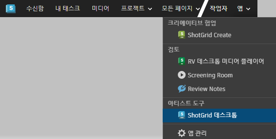

메시지에 따라 진행하면서 Mac용, Windows용, Linux용 데스크톱 중에서 어느 것을 다운로드할지 선택합니다.

### 자체 호스팅되거나 프록시 서버 뒤에 있는 경우 로그인

*참고: 로그인에 관한 다음 내용은 자체 호스팅되거나 프록시 서버를 사용하는 경우에 필요합니다. 이는 기본 동작이 아닙니다.*

자체 호스팅되거나 프록시 서버를 사용하는 경우 처음 데스크톱을 열면 인증서에 관해 묻는 메시지가 브라우저에 표시됩니다. 이는 를 데스크톱 앱과 연결하기 위한 것입니다. 인증서 설정에 문제가 있다면 [Firefox](https://developer.shotgunsoftware.com/ko/d4936105/)와 [Chrome 및 기타 브라우저](https://developer.shotgunsoftware.com/ko/95518180/)에 관한 문제 해결 설명서를 참조하십시오.

보안 인증서 목록은 한 번만 업데이트하면 됩니다. Mac과 Windows에서만 인증서에 관한 메시지가 표시되고, Linux에서는 표시되지 않습니다.

설정을 마치면  사이트에 로그인해야 합니다.

프록시를 이용하는 경우 추가 구성도 필요합니다. 추가 구성 방법은 [관리자 안내서](https://developer.shotgridsoftware.com/ko/8085533c/#toolkit-configuration-file)를 참조하십시오.

#### 인증 및 브라우저 통합

데스크톱은  웹 응용프로그램이 컴퓨터와 상호 작용할 수 있도록 해 주는 서비스를 제공합니다. 이를 통해 [로컬 파일 링크](https://help.autodesk.com/view/SGSUB/KOR/?guid=SG_Administrator_ar_data_management_ar_linking_local_files_html) 및 소프트웨어 실행 같은 기능을 이용할 수 있습니다. 보안을 위해 브라우저에서와 같은  사이트에서 동일한 사용자로 데스크톱에 로그인해야 합니다. 다른 사용자로 또는 다른 사이트에서 데스크톱에 로그인하면 계정을 전환하라는 메시지가 표시되고, 계정을 전환하면 데스크톱이 다시 시작되고 해당 자격 증명을 묻는 메시지가 표시됩니다.

### 시스템 트레이

응용프로그램을 시작하면 시스템 트레이에 아이콘이 나타납니다. 응용프로그램 창을 열려면 아이콘을 클릭하십시오. 기본적으로 창은 시스템 트레이에 고정되기 때문에 사용하지 않으면 자동으로 숨겨집니다.

사용자 메뉴에서 "메뉴에서 고정 해제(Undock from Menu)"를 선택하거나 헤더를 드래그해서 창의 고정을 해제할 수 있습니다. 고정 해제된 창은 일반 창과 비슷하게 보이고, 사용하지 않더라도 더 이상 숨겨지지 않습니다.

창이 고정 해제되면 닫기 버튼을 클릭해 숨길 수 있습니다. 다시 나타나게 하려면 시스템 트레이 아이콘을 클릭하면 됩니다.

### 프로젝트 브라우저

앱의 첫 번째 메인 뷰는 프로젝트 브라우저입니다. 여기에서  인스턴스의 모든 프로젝트를 볼 수 있습니다. 가장 최근에 액세스한 프로젝트가 첫 번째로 나열됩니다.

창 오른쪽 아래 근처에는  계정의 썸네일이 있습니다. 이는 사용자 메뉴로, 여기에서 창을 고정 및 고정 해제하고, 창을 다른 창 위에 고정하고, 로깅 콘솔을 표시하는 등의 작업이 가능합니다.

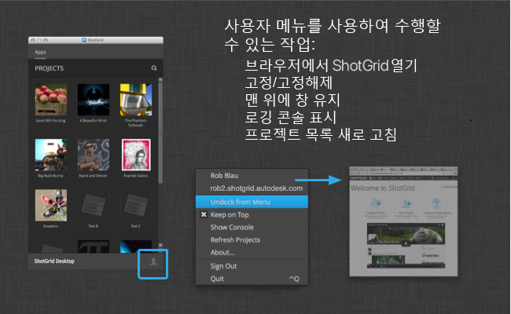

창 위쪽에 있는 돋보기 아이콘을 클릭하면 검색란이 나타납니다. 이 검색란에 검색어를 입력하면 프로젝트 목록이 필터링되면서 입력한 검색어가 포함된 프로젝트만 표시됩니다.

프로젝트를 클릭하면 해당 프로젝트의 명령 실행기 뷰로 이동하여, 해당 프로젝트에 사용할 수 있는 도구를 실행할 수 있습니다.

### 명령 실행기

프로젝트를 선택하면 해당 프로젝트의 명령 실행기로 이동합니다. 이 창에는 해당 프로젝트에 사용할 수 있는 모든 도구 및 응용프로그램이 격자 모양으로 배치된 버튼으로 표시됩니다. 응용프로그램을 실행하려면 버튼을 클릭하기만 하면 됩니다. 그러면 프로젝트 전용 환경에서 응용프로그램이 실행되고, 에 통합이 설정되어 있는 경우에는 사용 가능한 모든 도구가 나와 있는  메뉴가 표시됩니다.

### 콘솔

이 콘솔은 사용자 메뉴에서 실행할 수 있습니다. 프로젝트 실행과 관련한 로그가 여기에 표시됩니다. 오류가 발생하는 경우 오류 상세 정보가 여기에 표시되어야 합니다.

콘솔을 마우스 오른쪽 버튼으로 클릭하면 표준 편집 메뉴가 표시되어 콘솔에서 모든 텍스트를 선택하고, 선택 사항을 복사하거나 텍스트를 지울 수 있습니다.

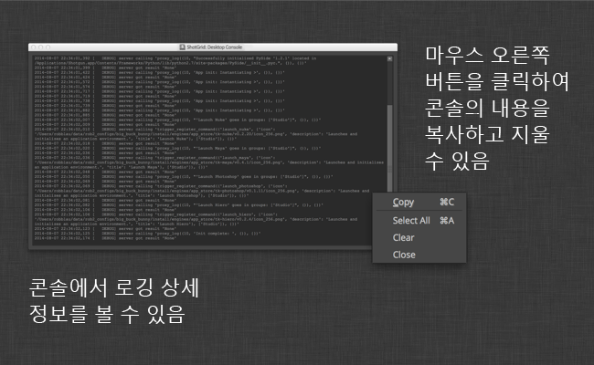

## 응용프로그램 실행

 데스크톱을 실행하고 프로젝트를 선택하면 데스크톱이 사용 중인 운영 체제에 대한 표준 응용프로그램 디렉토리를 스캔합니다. 그리고 [해당하는 통합이 설정되어 있는 응용프로그램](https://www.shotgridsoftware.com/integrations/)의 시작 관리자를 표시합니다. 같은 소프트웨어의 버전이 여러 개인 경우 시작 관리자는 사용 가능한 모든 버전이 포함된 드롭다운 목록을 보여 줍니다. 시작 관리자 아이콘 자체를 클릭하면 최신 버전이 실행됩니다.

Maya 및 Nuke 같은 응용프로그램은  데스크톱에서 직접 실행해도 되고, 에서 바로 실행해도 됩니다. 어떻게 실행하든 응용프로그램 내에서  통합을 사용할 수 있습니다.

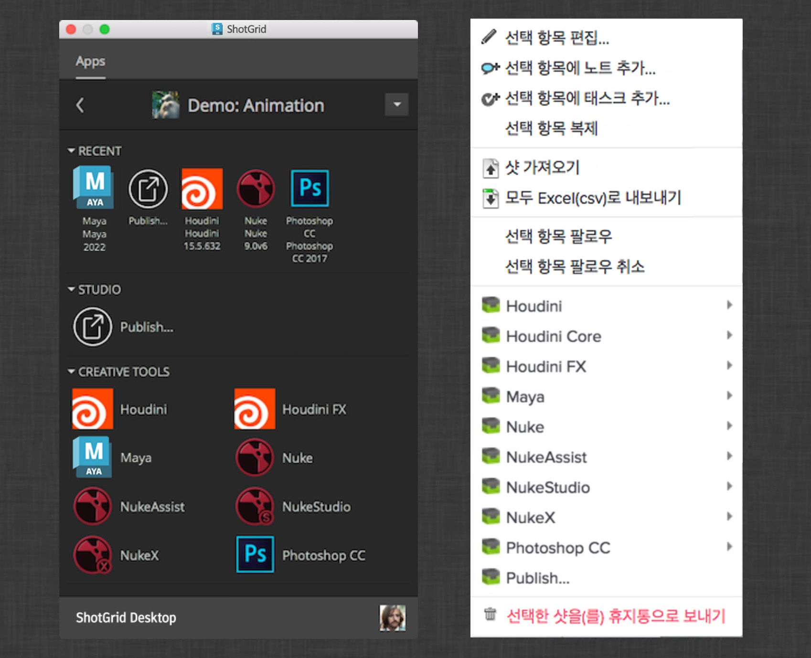

스튜디오에는 보통 기본 제공되는 것 외에 추가 구성이 필요하기 마련입니다. 스튜디오의 소프트웨어가 표준이 아닌 위치에 있거나 스튜디오가 기본적으로 지원되지 않는 내부 엔진을 사용 중인 경우가 있을 수 있습니다. 이 경우에도  웹 앱 내에서 바로 구성하기는 쉽습니다. 자세한 내용은 [관리자 안내서](https://developer.shotgridsoftware.com/ko/8085533c/)를 참조하십시오.

원하는 앱이 보이지 않으면 [관리자(Admin)의  데스크톱에서 소프트웨어 구성 섹션](https://developer.shotgridsoftware.com/ko/8085533c/)을 참조하십시오.

## 패널

### 개요

데스크톱 또는 에서 응용프로그램을 실행하면  패널이 나타납니다.  패널은 작고 가벼운 버전의 로서 Maya 및 Nuke 같은 아티스트 응용프로그램 내에서 바로 실행됩니다. 이 패널을 이용하면 작업 중인 응용프로그램에서 나오지 않고도  정보에 빠르게 액세스할 수 있습니다. 또한 현재 태스크에 관한 정보에 쉽게 액세스하고, 에서 액티비티 스트림, 노트, 태스크, 버전 및 Publisher에 즉시 액세스할 수 있습니다. 다른 팀원이 리뷰를 위해 전송한 버전을 재생해 보고, 노트에 회신하고, 새 태스크를 생성하고,  사이트를 검색할 수도 있습니다.

### UI 상세 정보

 패널은 다양한 기본 UI 요소들로 이루어져 있습니다. 맨 위에는 탐색 및 검색을 위한 버튼으로 이루어진 _도구막대_ 가 있습니다. 도구막대 오른쪽 아래에는 현재 보고 있는 항목에 관한 정보가 나와 있는 _상세 정보 영역_ 이 있습니다. 이 상세 정보 영역은 구성이 가능하기 때문에 커스텀 필드를 표시하고 싶다거나 파이프라인에서 특히 중요한 데이터가 있는 경우 이곳에 표시되도록 쉽게 구성할 수 있습니다. 끝으로 많은 _컨텐츠 탭_ 이 있습니다. 이 탭에는 모두  데이터가 표시되며, 이를 통해  패널을 쉽게 탐색하면서 게시 등의 항목을 빠르게 찾고, 버전을 리뷰하거나, 현재 선택한 항목에 링크되어 있는 태스크에 누가 할당되어 있는지 확인할 수 있습니다.

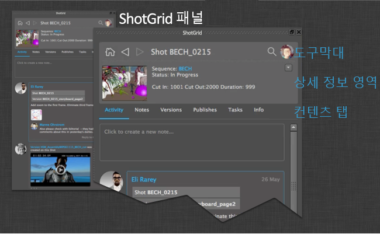

통합이 고정 기능을 지원하는 응용프로그램에서는  패널이 UI 내에 깔끔하게 고정된 상태로 나타납니다. 그 외의 응용프로그램에서는 보통의 창으로 표시됩니다.

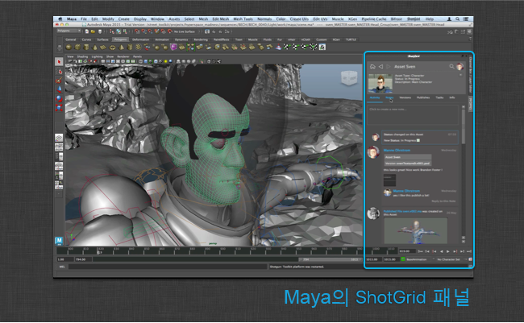

아래는  패널에서 사용할 수 있는 다양한 탭과 기능을 간략히 요약한 내용입니다.

#### 액티비티 스트림

액티비티 스트림은 의 액티비티 스트림과 유사하게 작동합니다. 다음과 같이 현재 표시된 객체와 관련하여 일어나는 일들을 모두 보여 줍니다.

* 노트를 작성하는 사용자
* 리뷰를 위해 제출되는 버전
* 파이프라인에 의해 생성되는 게시

액티비티 스트림에서 바로 새 노트를 추가하거나 기존 노트에 회신할 수 있습니다. 첨부 파일은 자동으로 표시되고, 이 파일을 클릭하면 큰 미리보기로 표시됩니다.

이 파일을 업로드한 후 자리 표시자 아이콘을 볼 수 있습니다. 패널을 수동으로 새로 고치면 최종 썸네일을 표시하여 사용할 수 있습니다.

#### 노트 생성 및 노트에 회신

 패널에서 노트를 생성하거나 노트에 회신하는 일은 간단합니다. 액티비티 스트림 또는 노트 상세 정보 페이지로 이동한 다음 _노트 생성(create note)_ 또는 _노트에 회신(reply to note)_ 을 클릭하면 됩니다. 그러면 노트 텍스트를 입력할 수 있는 대화상자가 나타납니다. 노트를 특정인에게 전송하고 싶다면 `@name` 표기법을 사용하면 됩니다. 그러면 그 사람이 노트의 받는 사람 필드에 자동으로 추가됩니다.

#### 노트, 버전, 게시 및 태스크

노트(Notes), 버전(Versions), 게시(Publishes) 및 태스크(Tasks) 탭은 모두 같은 방식으로 작동하여, 현재 사용자가 보고 있는 항목과 연관된 데이터를 표시합니다. 원하는 항목을 두 번 클릭하면 해당 항목을 집중해서 보여 줍니다. _Publish_ 로 이동했다면 해당 게시에 대한 종속성을 볼 수 있는데, 이는 파이프라인이 종속성 정보를 트래킹하는 경우 유용한 기능으로 에셋이 상호 연결되어 있는 방식을 즉시 파악할 수 있도록 해 줍니다.

#### 정보 탭

다른 탭에서 원하는 정보를 찾지 못한 경우 정보(Info) 탭으로 이동해 보십시오. 이 탭에는 해당 엔티티에 대한 대부분의  필드가 나와 있으며, 파란색 하이퍼링크를 클릭하여 다른  위치로 이동할 수도 있습니다.

#### 검색

에서 다른 위치 또는 다른 객체로 빠르게 이동하고 싶다면 기본 제공되는 검색 기능을 이용하면 됩니다. 이는  웹 응용프로그램의 전역 검색 기능과 유사합니다. 찾고 싶은 항목의 이름이나 설명을 입력하기 시작하여 세 자 이상 입력하면 결과가 표시됩니다.

#### 액션

 패널을 통해  데이터를 이용하여 씬에서 작업을 실행할 수도 있습니다. 로더와 마찬가지로 패널에도 메뉴에 의해 트리거되는 코드 조각을 브라우저의 항목에 쉽게 등록할 수 있도록 해 주는 액션 시스템이 있습니다. 상세 정보 영역과 목록에서 액션에 액세스할 수 있습니다. 상세 정보 영역의 액션 버튼에는 로 빠르게 이동하거나 현재 뷰를 새로 고침하는 등 몇 가지 편리한 기본 제공 기능도 포함되어 있습니다.

#### 현재 작업 영역 및 내 영역

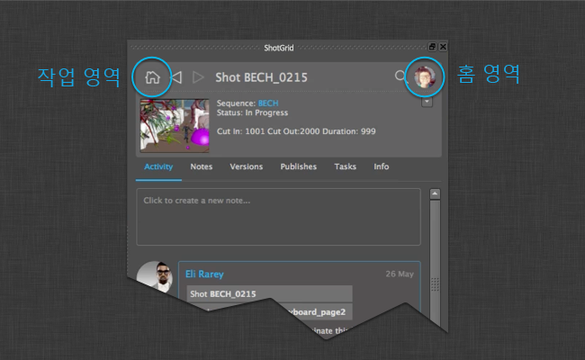

왼쪽 위에 있는 아이콘을 클릭하면 현재 작업 영역으로 이동합니다. 이 영역은 주로 현재 작업 중인 태스크이며, 여기에서 빠르게 노트에 액세스하고, 버전을 리뷰하고, 현재 작업 중인 항목과 관련한 기타 정보를 확인할 수 있습니다. 이곳은  패널이 항상 처음으로 포커스를 두는 위치이기도 합니다.

오른쪽 위에는 현재 사용자의 썸네일이 표시되는 버튼이 있습니다. 이 버튼을 클릭하면 현재 사용자와 관련된 정보를 보여 주는 페이지로 이동합니다. 여기에는 다음 정보가 포함됩니다.

* 사용자가 제출한 모든 게시 및 버전
* 사용자에게 할당된 태스크
* 사용자가 참여하고 있거나 노트가 사용자와 연관되어 있는 모든 노트 대화(예: 사용자에게 할당된 태스크와 연관된 노트)

#### 현재 작업 영역

태스크에 대한 작업을 시작할 때 패널을 사용하여 현재 작업 영역을 설정할 수 있습니다. 그러면 작업을 게시할 때 이 영역이 의 현재 태스크와 연결됩니다.

## Publisher

### 개요

아티스트는 Publish 앱을 통해 아티스트 다운스트림에서 사용할 수 있도록 작업물을 게시할 수 있습니다. 아티스트의 컨텐츠 생성 소프트웨어 내에서 기존 게시 워크플로우를 지원하고 디스크상의 파일을 독립 실행형으로 게시할 수 있습니다. 컨텐츠 생성 소프트웨어에서 작업하거나 기본  통합을 사용하여 작업할 때 이 앱은 아티스트가 게시할 수 있는 항목을 자동으로 검색해 표시해 줍니다. 보다 정교한 프로덕션이 필요한 경우 스튜디오는 커스텀 게시 플러그인을 작성하여 아티스트 워크플로우를 진행할 수 있습니다.

다음 섹션에서는 Publisher UI 및 기본 통합 워크플로우를 다룹니다. 스튜디오의 특정 요구 사항에 맞게 Publisher를 커스터마이즈하는 방법은 [Publisher Dev 안내서](http://developer.shotgridsoftware.com/tk-multi-publish2/)를 참조하십시오.

### 인터페이스 구성요소 및 개념

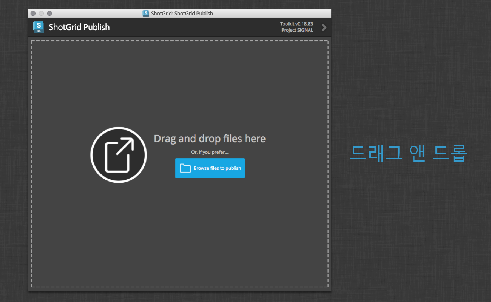

로컬 파일 시스템 어디에서든 파일을 드래그 앤 드롭합니다. 찾아보기(Browse) 버튼을 사용하여 파일 브라우저를 열고 게시할 파일을 하나 이상 선택합니다.

왼쪽의 항목 트리가 게시되는 항목을 보여 줍니다. 최고 레벨 항목들에는 작업 파일 내에서 생성된 렌더나 캐시 등 관련된 하위 항목이 포함될 수 있습니다. 각 항목 아래에는 게시할 때 수행되는 액션을 나타내는 하나 이상의 게시 태스크가 있습니다.

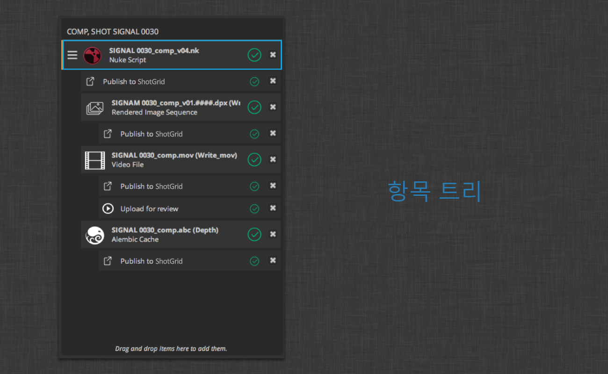

항목 자체는 게시된 파일이 연결되는  컨텍스트를 나타내는 컨텍스트 헤더 아래에 그룹화됩니다.

최고 레벨 항목이 둘 이상인 경우에는 게시하는 항목과 실행할 액션을 전체적으로 보여 주는 요약 항목이 존재합니다.

항목을 선택하면 인터페이스 오른쪽에 항목의 상세 정보가 표시됩니다. 상세 정보에는 대상 컨텍스트뿐 아니라 게시의 썸네일과 설명도 포함됩니다. 해당 항목과 하위 항목에 대한 요약도 포함될 수 있습니다.

인터페이스 아래쪽을 보면 왼쪽에 일련의 도구 버튼이 있습니다. 다음과 같은 버튼이 있습니다.

* **찾아보기(Browse)**: 게시할 파일을 찾습니다
* **새로 고침(Refresh)**: 게시 항목 목록을 새로 고칩니다
* **삭제(Delete)**: 선택한 항목을 목록에서 제거합니다
* **확장(Expand)**: 목록의 모든 항목을 확장합니다
* **축소(Collapse)**: 목록의 모든 항목을 축소합니다
* **설명서(Documentation)**: 워크플로우 설명서를 엽니다

가운데는 상태 레이블입니다. 이 레이블은 게시자가 유효성 확인을 수행하고 게시 태스크를 실행하면 업데이트됩니다. 클릭하면 진행 상세 정보가 오버레이로 표시됩니다.

맨 오른쪽에는 **확인(Validate)** 및 **게시(Publish)** 버튼이 있습니다. 확인(Validate) 버튼을 클릭하면 모든 항목과 태스크에 대한 초기 유효성 확인을 실행하여 모두 게시 가능한 상태인지 확인합니다. 게시(Publish) 버튼을 클릭하면 목록에 있는 항목의 게시가 시작됩니다.

진행 상세 정보 오버레이에는 목록 내 항목의 수집, 유효성 확인 및 게시 결과가 표시됩니다.

클립보드에 복사(Copy to Clipboard) 버튼을 이용하면 게시 로그를 쉽게 공유할 수 있습니다. 유효성 확인 또는 게시 오류가 발생하면 로그 메시지에 액션 버튼이 포함될 수 있으며, 이 버튼을 클릭하면 추가 정보, 그리고 때로는 즉시 해결 방법까지 확인할 수 있습니다.

### 기본 워크플로우

아티스트가 자신의 작업물을 다른 아티스트들도 사용할 수 있도록 만드는 것, 그것을 가능하게 해 주는 것이 Publish 앱의 목적입니다. 에서 파일을 게시한다는 것은 곧 게시되는 파일에 관한 정보(경로, 버전 번호, 아티스트 정보, 관련  컨텍스트 등)가 담긴 레코드를 에 생성하는 것을 의미합니다. 파일이 에서 트래킹되고 나면 다른 사용자들도 [Loader](#the-loader) 앱을 통해 이 파일을 사용할 수 있습니다.

기본  통합은 파이프라인에서 Publish 앱을 사용할 수 있는 두 가지 방법, 독립적으로 게시하는 방법과 컨텐츠 생성 소프트웨어 내에서 게시하는 방법을 제공합니다. 다음 섹션은 각 시나리오의 워크플로우를 설명한 것입니다.

#### 컨텐츠 생성 소프트웨어 내에서 게시

기본  통합은 3dsMax, Houdini, Maya, Nuke, Nuke Studio, Photoshop 같은 컨텐츠 생성 소프트웨어를 위한 게시 워크플로우를 지원합니다. 컨텐츠 생성 소프트웨어를 통해 실행되는 게시자는 자동으로 게시할 항목을 찾습니다. 게시할 수 있는 항목은 소프트웨어, 그리고 아티스트의 작업 파일 컨텐츠에 따라 조금씩 다르지만 게시에 대한 기본적인 컨셉은 동일합니다. 다음은 Nuke에서 게시하는 경우를 예로 든 것입니다.

#### 항목 및 태스크 게시

왼쪽에 수집된 게시 항목들이 있습니다. 게시 항목은 세 가지로, 선택한 항목은 그 아래 하위 항목이 두 가지 있는 작업 파일 자체입니다. 또한, 이미지 파일 시퀀스와 Alembic 캐시도 있습니다. 이 항목들은 각각 **에 게시(Publish to Shotgun)** 게시 태스크가 첨부되어 있어, 이를 실행하면 개별 파일 또는 이미지 시퀀스를 트래킹할 수 있도록 에 게시 항목을 생성하는 작업이 진행됩니다.

Nuke 스크립트를 나타내는 상위 항목에는 **파일 버전 지정 시작(Begin file versioning)** 플러그인이 부착되어 있습니다. 이 플러그인은 작업 파일의 경로에 버전 번호가 없는 경우 나타납니다. 이 체크박스를 선택하면 이 태스크를 통해 게시 전 파일 이름에 버전 번호가 삽입됩니다. 이 경우에는 파일 이름이 `bunny_010_0010.nk`에서 `bunny_010_0010.v001.nk`로 바뀝니다. 이렇게 하면 아티스트 작업 파일의 내역을 기록할 수 있습니다. 기본적으로 이 태스크는 선택되어 있지 않고, 반드시 실행할 필요도 없습니다. 이 태스크를 활성화한 상태로 항목을 게시하고 나면 다음에 해당 작업 파일을 게시할 때에는 파일 이름에 버전 번호가 이미 있기 때문에 이 태스크가 표시되지 않습니다.

게시 태스크는 원하는 대로 켜거나 끌 수 있습니다. 항목의 체크박스는 하위 태스크의 선택 상태를 반영하고 제어합니다. 예를 들어, 항목을 선택 취소하면 그 태스크도 모두 선택 취소됩니다. 여러 태스크 중 하나를 선택 취소하면 항목이 반만 선택한 상태가 됩니다. 특정 유형의 태스크 모두(예: **에 게시(Publish to Shotgun)** 태스크 모두)의 선택 상태를 토글하려면 체크박스를 선택할 때 `Shift` 키를 누른 채로 선택하면 됩니다.

게시 태스크를 선택하면 해당 태스크에 관한 정보가 표시됩니다.

##### 컨텍스트

위의 Nuke 스크립트 항목의 경우, 게시된 항목이 에서 연결되는 컨텍스트의 이름을 볼 수 있습니다. 이 이름은 인터페이스 오른쪽의 태스크(Task) 및/또는 링크(Link) 필드를 변경하여 수정할 수 있습니다. 여러 항목을 게시하는 경우에는 서로 다른 컨텍스트에 표시될 수도 있습니다. 게시 항목 왼쪽에 가로줄이 세 개 있는 아이콘은 한 컨텍스트에서 다른 컨텍스트로 항목을 옮기기 위한 드래그 핸들입니다.

태스크(Task) 항목 필드 옆에는 메뉴 드롭다운 버튼도 있습니다. 이 메뉴를 클릭하면 사용자와 관련이 있을 수 있는 여러 태스크 그룹이 나타날 수 있습니다. 여기에는 현재 사용자에게 할당된 태스크, 현재 컨텍스트에 관련된 태스크(같은 샷에 할당된 다른 태스크 등), 최근에 찾아본 태스크가 표시됩니다.

태스크 또는 엔티티 링크를 검색하려면 필드 중 하나를 클릭하거나 검색 아이콘을 클릭하고 원하는 컨텍스트 이름을 입력하면 됩니다. 이 필드에 일치하는 태스크 또는 엔티티 링크가 표시되면 이를 클릭하거나 원하는 컨텍스트로 이동할 수 있습니다.

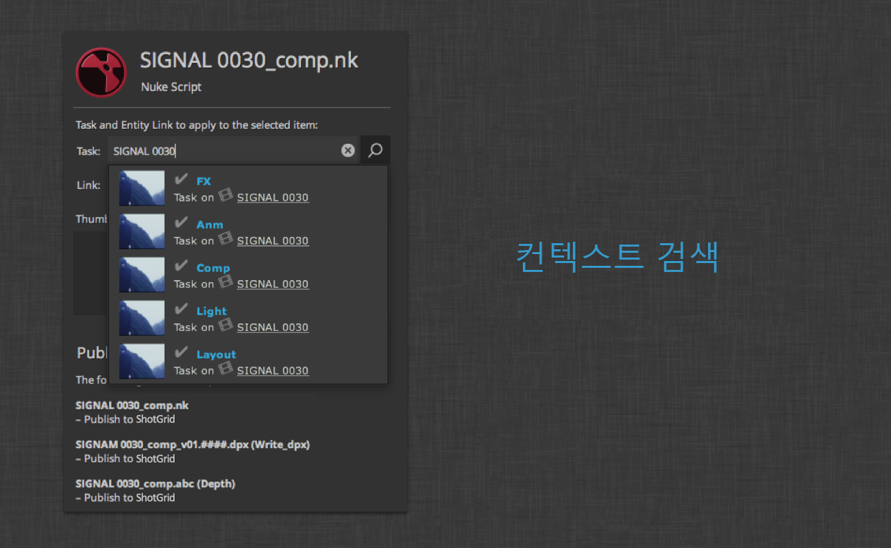

각 게시 항목마다 카메라 아이콘을 클릭하면 화면 일부를 선택해 에서 해당 게시의 썸네일로 사용할 수 있습니다. 하위 항목이 있는 경우에는 기본적으로 상위 항목의 썸네일을 상속합니다. 하위 항목의 썸네일은 하위 항목을 선택하고 썸네일을 클릭해서 재정의할 수 있습니다.

입력한 설명은 의 게시 데이터에 포함됩니다. 썸네일과 마찬가지로 설명도 상위 항목에게서 상속되지만 하위 항목의 상세 정보 항목에 새로운 설명을 입력해 재정의할 수 있습니다.

##### 유효성 확인

항목을 게시할 준비가 되면 확인(Validate) 버튼을 클릭해 파일 및 게시 항목의 상태가 게시가 원하는 대로 완료될 수 있는 상태인지 확인할 수 있습니다.

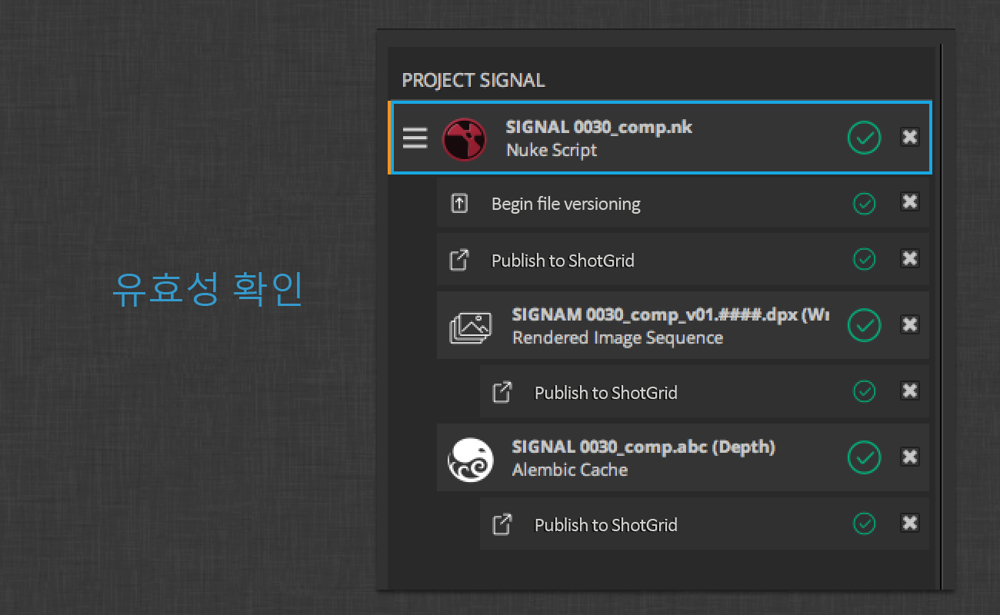

모든 항목이 이상 없는 것으로 확인되면 오른쪽에 초록색 체크 표시가 나타납니다. 확인을 통과하지 못한 항목에는 경고 아이콘이 나타납니다.

이 상태는 Publisher 아래쪽에 있는 상태 레이블 영역에도 표시됩니다.

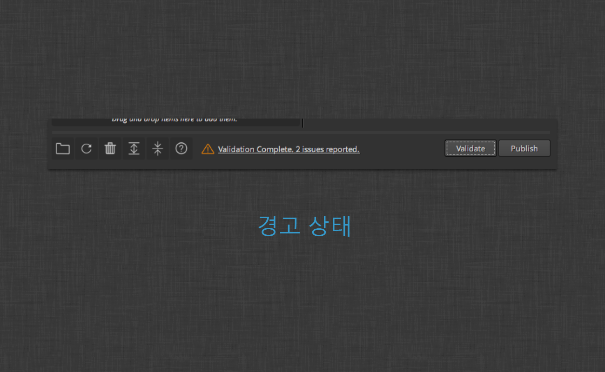

항목의 아이콘 또는 상태 레이블을 클릭하면 진행 상황 상세 정보 오버레이가 열리고, 유효성 확인 문제가 강조 표시됩니다.

위 예에서는 Nuke 스크립트가 저장되지 않았습니다. 간혹 문제 해결 방법을 빠르게 알려주거나 문제에 관한 자세한 정보를 제공하는 액션 버튼이 제공됩니다. 여기에서는 Nuke 저장 대화상자가 열리는 **다른 이름으로 저장...(Save As...)** 액션 버튼이 보입니다.

유효성 확인 문제가 모두 해결되면 진행 상황 상세 정보 오버레이를 닫고 게시 항목 뷰로 돌아갈 수 있습니다. 유효성 확인은 게시 태스크 경고 또는 오류를 해결하는 동안 필요한 만큼 얼마든지 실행할 수 있습니다.

**게시(Publish)** 버튼을 누르면 앱이 목록의 항목과 태스크를 살펴보면서 다시 하나씩 유효성 확인을 실행한 다음, 게시 로직을 실행하여 에 항목을 생성하고, 썸네일을 업로드하고, 작업 파일 버전을 수정하는 등의 작업을 처리합니다. 각 항목에 대한 게시를 요약하고 필요한 정리 작업을 수행하기 위한 최종 확인도 실행됩니다.

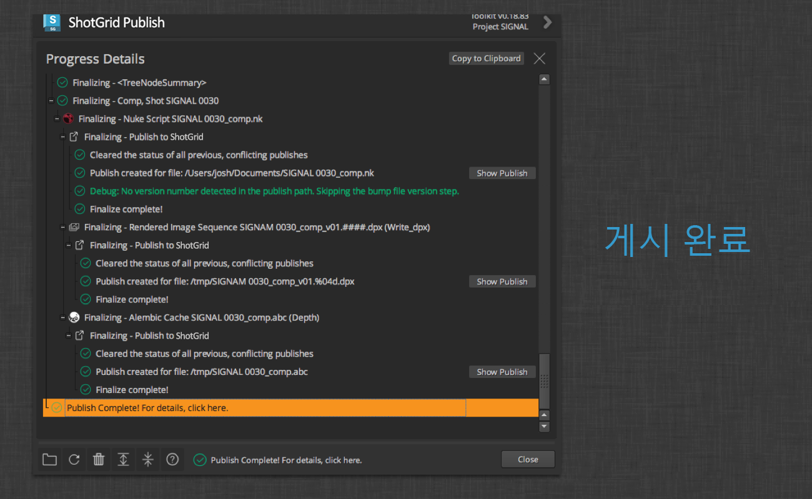

전체 프로세스의 결과는 나중에 Publisher 아래쪽에 있는 상태 레이블을 클릭해 진행 상황 상세 정보 오버레이를 열어 검토할 수 있습니다. 게시하는 동안 진행 상황 상세 정보 뷰를 열어둔 채로 게시 결과를 살펴볼 수도 있습니다. 여기에서는 에 새로 생성된 게시 항목으로 빠르게 이동하기 위한 추가 액션 버튼도 볼 수 있습니다.

##### 다중 문서 워크플로우

Photoshop 또는 Nuke Studio 같은 컨텐츠 생성 소프트웨어에서 이루어지는 다중 문서 워크플로우의 경우 게시 항목 목록에 최고 레벨 항목이 여러 개 표시됩니다.

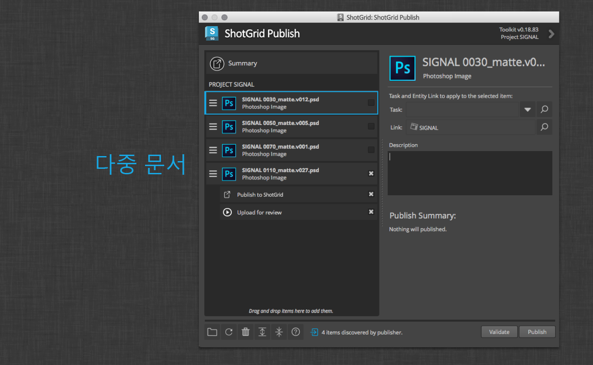

그 중에서 현재/활성 문서만 확장 및 선택된 상태로 표시됩니다. 게시할 모든 문서를 선택하려면 `Shift` 키를 누른 채로 선택 취소된 항목의 체크박스 하나를 클릭하십시오. 축소된 항목을 확장하려면 아래쪽 도구막대에 있는 확장 버튼을 사용합니다.

최고 레벨 항목이 여러 개인 경우에는 목록 맨 위에 요약 항목도 포함됩니다.

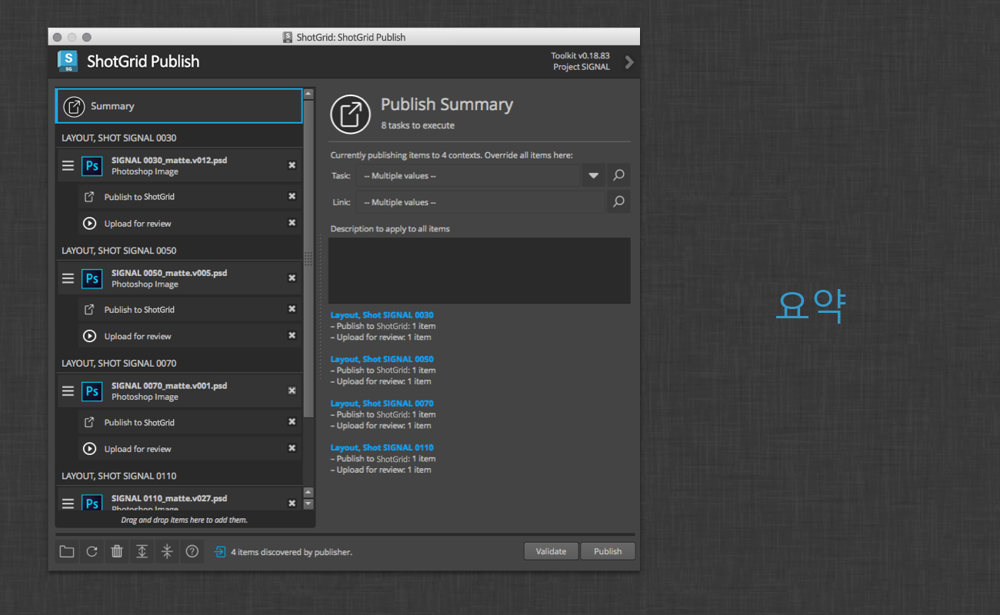

이 항목을 선택하면 게시를 위해 선택한 모든 항목의 전체 요약이 표시됩니다. 위에서는 서로 다른 네 가지 컨텍스트에서 총 여덟 개 태스크가 실행될 네 개 항목을 볼 수 있습니다. 원한다면 이 뷰에서 모든 항목의 컨텍스트와 설명을 재정의할 수 있습니다.

위 이미지에서는 **리뷰용 업로드(Upload for review)** 태스크도 볼 수 있습니다. 이 태스크는 Photoshop 워크플로우로 한정되지 않습니다. 리뷰 가능한 미디어로 트랜스코딩하여 에 업로드할 수 있는 모든 파일 유형에 대해 가능한 태스크입니다.

#### 독립 실행형 게시

Publish 앱을 꼭 컨텐츠 생성 소프트웨어 내에서 실행할 필요는 없습니다.

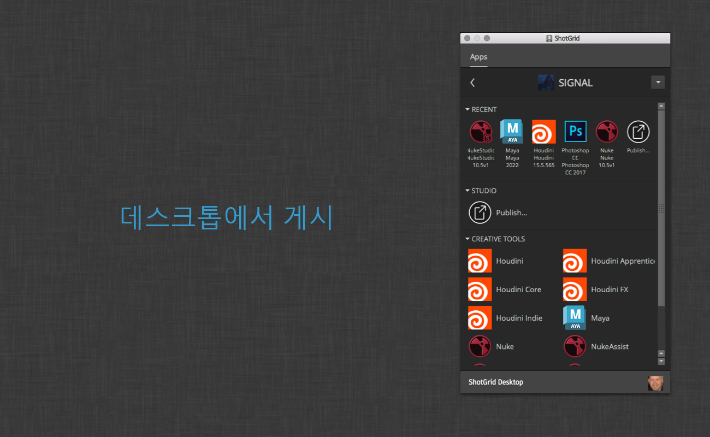

여기에서는 Publisher를  데스크톱에서 직접 실행할 수 있음을 알 수 있습니다. 독립 실행형 모드에서 앱을 실행하면 파일을 찾아보거나 드래그 앤 드롭할 수 있는 영역이 나타납니다.

찾아보기(Browse) 버튼을 클릭하면 게시할 파일을 선택할 수 있는 표준 파일 브라우저가 열립니다.

브라우저에서 파일을 선택하거나 파일 시스템에서 드래그 앤 드롭하고 나면 앱이 해당 파일을 게시할 최고 레벨 항목으로 보여 줍니다.

이전 예에서와 마찬가지로 각 항목의 컨텍스트를 선택하고, 설명을 설정하고, 게시 시 실행되어야 하는 태스크를 식별할 수 있습니다.

#### 게시 유형

다음 섹션에서는 각각의 기본  통합에 대해 자동으로 수집되는 게시 유형을 설명합니다.

##### 독립 실행형

독립 실행형 워크플로우는 게시를 위한 파일을 자동으로 수집하지 않습니다. 대신 사용자가 인터페이스로 파일 경로를 드래그하거나 게시할 파일을 찾아야 합니다. 게시자는 **게시(Publish)** 버튼을 클릭하기 전까지는 사용자가 찾거나 드롭한 파일을 언제든 수용합니다. 기본 통합에서는  게시 유형과 연결되는 것으로 알려진 파일 유형을 사용하는 모든 파일 확장자를 사용할 수 있습니다. 파일 확장자가 인식되지 않으면 파일의 MIME 유형이 사용됩니다. 인식된 이미지 및 동영상 MIME 유형은 게시 가능하며, 리뷰용 업로드에 부착된 태스크가 있습니다.

기본 통합은 드롭된 폴더에 이미지 시퀀스가 포함되어 있다고 가정합니다. 폴더에서 발견되는 인식된 모든 이미지 시퀀스는 게시 항목으로 표시됩니다. 발견된 시퀀스가 없다면 게시를 위한 항목이 생성되지 않습니다.

##### 3ds Max

현재 Max 세션은 로더를 통해 다른 Max 세션으로 병합 또는 참조될 수 있는 **3dsmax 씬**의 게시 유형으로 게시를 위해 수집됩니다.

현재 세션에 대한 프로젝트 폴더를 지정할 수 있다면 그 프로젝트의 **export** 폴더에 있는 모든 파일이 게시 항목으로 표시되고, 마찬가지로 프로젝트의 **preview** 폴더에 있는 모든 영상 파일도 게시할 수 있게 됩니다.

##### Houdini

현재 Houdini 세션은 로더를 통해 다른 Houdini 세션으로 병합될 수 있는 **Houdini 씬**의 게시 유형으로 게시를 위해 수집됩니다.

다음 유형의 노드에서 디스크로 작성된 모든 파일 역시 게시 항목으로 자동 수집 및 표시됩니다.

* **alembic**
* **comp**
* **ifd**
* **opengl**
* **wren**

##### Maya

현재 Maya 세션은 로더를 통해 다른 Maya 세션으로 가져오거나 참조될 수 있는 **Maya 씬**의 게시 유형으로 게시를 위해 수집됩니다.

현재 세션에 대한 프로젝트 루트를 지정할 수 있다면 그 프로젝트의 **cache/Alembic** 폴더에 있는 모든 Alembic 파일이 게시 항목으로 표시되고, 마찬가지로 프로젝트의 **movies** 폴더에 있는 모든 영상 파일도 게시할 수 있게 됩니다.

##### Nuke

현재 Nuke 세션은 로더를 통해 다른 Nuke 세션으로 가져오거나 새 세션으로 열 수 있는 **Nuke 스크립트** 게시 유형으로 게시를 위해 수집됩니다.

다음 유형의 노드에서 디스크로 작성된 모든 파일 역시 게시 항목으로 자동 수집 및 표시됩니다.

* **Write**
* **WriteGeo**

##### Nuke Studio

열려 있는 Nuke Studio 프로젝트는 다른 Nuke Studio 세션에서 로더를 통해 새 프로젝트로 열 수 있는 **NukeStudio 프로젝트** 게시 유형으로 게시를 위해 수집됩니다.

##### Photoshop CC

열려 있는 Photoshop 문서는 다른 Photoshop 세션에서 로더를 통해 새 레이어로 로드하거나 새 문서로 열 수 있는 **Photoshop 이미지** 게시 유형으로 게시를 위해 수집됩니다.

## 로더

 Loader를 사용하면 에 게시한 파일을 신속하게 확인하고 탐색할 수 있습니다. 검색 가능한 트리 뷰 네비게이션 시스템 덕분에 원하는 태스크, 샷 또는 에셋을 빠르고 쉽게 찾을 수 있고, 찾고 나면 로더가 해당 항목의 모든 게시에 대한 개요를 기반으로 썸네일을 보여 줍니다. 그러면 구성 가능한 후크를 통해 쉽게 게시를 참조하거나 현재 씬으로 가져올 수 있습니다.

게시는 의 레코드로, 각각 디스크의 파일 또는 파일의 시퀀스(예: 이미지 시퀀스)를 나타냅니다. 게시는 모든 응용프로그램을 통해 생성할 수 있지만 보통 게시자를 통해 생성합니다.

게시를 생성하고 나면 파이프라인의 다른 사람이 로드할 수 있는데 바로 여기에서 로더가 등장합니다. Loader를 사용하면 파일 시스템 브라우저와 비슷한 방식으로  내에 저장되어 있는 게시를 찾을 수 있습니다.

### 개요

Loader 앱을 사용하면 에 게시된 파일을 빠르게 찾을 수 있습니다. 이 앱은 검색 가능한 트리 뷰 네비게이션 시스템을 갖추고 있어 태스크, 샷 또는 에셋의 썸네일을 쉽게 확인할 수 있습니다.

### 트리 뷰

왼쪽의 트리 뷰를 사용하여 원하는 샷, 에셋 또는 태스크를 빠르게 찾을 수 있습니다. 찾고 있는 항목의 이름을 알고 있는 경우 검색란에 입력하면 검색어와 일치하는 항목만 트리에 표시됩니다.

검색어를 입력하기 시작하면 더 이상 전체 트리를 보는 것이 아님을 나타내는 파란색 막대가 트리 주변에 나타나고, 검색어를 기반으로 트리에 해당 항목의 하위 세트만 표시됩니다. 검색을 시작하면 트리의 모든 노드가 자동으로 확장됩니다. 트리를 마우스 오른쪽 버튼으로 클릭하면 트리의 모든 노드를 간편하게 확장 또는 축소할 수 있는 옵션이 나타납니다.

### 탐색

트리 뷰 맨 위에는 세 가지 탐색 버튼이 있습니다.

홈 버튼을 클릭하면 로더가 현재 작업 영역을 나타내는 샷 또는 에셋으로 자동으로 이동합니다. 현재 진행 중인 작업과 관련된 무언가를 빠르게 로드하고 싶을 때 유용한 기능입니다. 이 화면은 시작 시 로더가 기본적으로 표시하는 위치이기도 합니다. 트리 뷰에서 다른 항목을 선택하면 점점 내역이 생성됩니다. 내역은 브라우저처럼 뒤로 및 앞으로 버튼을 사용하여 탐색할 수 있습니다.

### 게시 살펴보기

트리에서 항목을 선택하면 UI 가운데의 게시 영역에 사용 가능한 게시가 표시됩니다. 이 뷰의 각 항목은 게시 스트림 내 최신 항목을 나타냅니다. 예를 들어, 텍스처 버전 15를 보게 된다면 이는 해당 항목의 버전 내역에 이전 버전이 14개 있다는 의미입니다.

게시뿐 아니라 샷, 시퀀스, 에셋 또는 기타  엔티티 유형을 나타내는 폴더 아이콘도 표시됩니다. 객체의 썸네일이 있는 경우 이 썸네일은 빠른 시각적 탐색을 위해 폴더 위에 겹쳐서 표시됩니다. 계층에서 폴더를 두 번 클릭하면 해당 폴더를 자세히 탐색합니다.

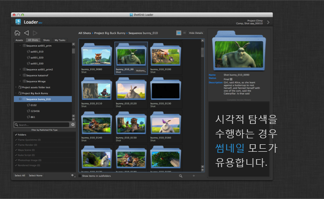

뷰 모드는 두 가지입니다. 썸네일 모드는 시각적으로 찾아볼 때(예: 텍스처를 찾아볼 때) 아주 유용합니다. 목록을 빠르게 훑어보고, 줌 핸들을 사용해 빠르게 확대 및 축소할 수 있습니다.

Nuke 스크립트나 Maya 파일처럼 텍스처보다 덜 시각적인 항목을 찾아보는 경우에는 썸네일 뷰 대신 목록 뷰를 사용하면 됩니다. 이 모드는 보다 많은 정보를 제공하고, 보다 콤팩트한 형태이기 때문에 많은 항목을 스크롤하면서 빠르게 살펴보기에 좋습니다.

특정 유형의 항목만 보고 싶다면 왼쪽 아래에 있는 _필터 패널_ 을 사용해 게시를 빠르게 숨기거나 표시하면 됩니다. 목록의 각 유형 옆에는 요약 정보도 나와 있는데, 현재 선택한 트리 항목에 대해 각 유형별로 몇 개의 게시를 찾았는지 알려줍니다.

### 하나 이상의 게시를 씬으로 가져오기

한 항목을 씬으로 가져오려는 경우 해당 항목을 두 번 클릭하면 로더가 게시를 위한 _기본 액션_ 을 실행합니다. 항목을 씬으로 추가(예: Maya에서 다른 Maya 파일을 참조하거나 씬으로 가져오려는 경우)하는 방법이 둘 이상일 수도 있는데, 이 경우에는 _액션(Actions)_ 드롭다운 메뉴를 클릭하거나 게시에서 아무 곳이나 마우스 오른쪽 버튼으로 클릭하면 사용 가능한 모든 옵션이 나타납니다.

여러 항목을 씬으로 가져오려는 경우에는 여러 항목을 선택하고 선택 모음에서 아무 항목이나 마우스 오른쪽 버튼으로 클릭하면 _액션(Actions)_ 팝업 메뉴가 나타납니다. 선택 모음의 모든 항목에 적용할 수 있는 액션만 표시됩니다.

게시 대신 샷 또는 에셋 폴더 객체를 선택하는 경우에는 해당 항목을  또는 파일 시스템에 표시하기 위한 옵션이 표시됩니다.

### 이전 게시를 사용하는 작업

오른쪽의 상세 정보 창을 열면 선택한 게시의 모든 버전 내역을 볼 수 있습니다. 여기에서 이전 버전을 로드할 수 있습니다. 이전 버전을 로드하려면 메인 뷰의 게시와 마찬가지로 버전 내역에서 해당 버전을 선택하고 액션 메뉴를 사용하여 로드하면 됩니다.

### 연관 리뷰

게시에 연관 리뷰 버전이 있는 경우 상세 정보 창에 재생 버튼이 표시됩니다. 이 버튼을 클릭하면 웹 페이지에서 Screening Room을 실행되어 빠르게 노트를 확인하거나 버전에 노트를 추가할 수 있고, 연관 리뷰 Quicktime을 재생할 수도 있습니다.

## 고급 기능

의 모든 통합은 툴킷이라는 파이프라인 생성을 위한 커스터마이즈 범위가 넓고 확장성이 뛰어난 플랫폼에서 생성됩니다.  이 기능에 액세스하고 구성하는 자세한 방법은 [관리자 안내서](https://developer.shotgridsoftware.com/ko/8085533c/)를 참조하십시오.

## 감사의 인사

* PySide의 버그 픽스 버전은  데스크톱을 통해 배포되며, [여기](http://www.autodesk.com/content/dam/autodesk/www/Company/files/PySide-1.2.2.sgtk.zip)에서 얻을 수 있습니다.
* Big Buck Bunny - footage 제공: (CC) Blender Foundation, www.blender.org

이 특별 마크업(TANK_NO_HEADER)을 추가해 헤더가 없어도 된다고 문서 생성 시스템에 알리십시오
