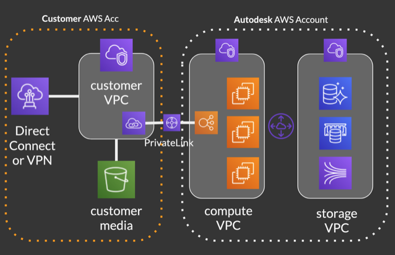

# Planning Your Setup

## Pick your options

Pick which features you want to activate
  * Media Isolation
  * Media Traffic Isolation
  * Media Replication

## AWS Account Creation

Before going further, you will require an AWS Account. If you don't already have an AWS Account, [create your AWS Account](https://aws.amazon.com/premiumsupport/knowledge-center/create-and-activate-aws-account/).

## Choose an AWS Region

Choose an AWS Region for your AWS S3 bucket and VPC. Which region to use? You should chose the a region that is the closest possible to your studio.

If your company is located in different locations, consider enabling the media replication feature to reduce latency and improve performance

## Plan the VPC IP ranges

Plan your AWS VPC and subnets IP ranges if you plan to use Media Traffic Isolation.

### IP Range Example

| Region | VPC | Subnet 1 | Subnet 2 | Subnet 3 | 
|--------|-----|----------|----------|----------|
| ap-southeast-2 | 10.1.0.0/16 | 10.1.0.0/24 | 10.1.1.0/24 | 10.1.2.0/24 |

### Plan how you will privately access your AWS VPC

If you plan to activate any of the Traffic Isolation feature, you will need a way to connect your AWS VPC and your network infrastructure. The main options are:

  * AWS Direct Connect
  * Other VPN solution

We highly recommand you to leverage Direct Connect. Direct Connect guarantees the lowest latency possible to the  services, a consistent network experience, and allow you to leverage the optimization AWS is relying on to guarantee an optimal performance across the globe.

## Next Step

With your plan layed down, you are ready to start implementing the AWS building blocks that will allow you to activate the isolation features.

See [Media Isolation](./s3_bucket.md) for activating the Media Isolation feature.

Go to [Setup](./setup.md) for an overview of the possible next steps.
