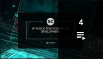

  
#  툴킷 웨비나

*업데이트 날짜: 2020/5/8*

##  툴킷 웨비나 재생 목록

##  툴킷 웨비나 동영상

1:  툴킷 웨비나: 기본 제공 통합*(60분)*

새 시리즈 중 첫 번째 툴킷 웨비나에서는 Rob Blau와 Manne Öhrström이 기본 제공 통합에 관련된 질문에 답변합니다.

2:  툴킷 웨비나: 새 기본 구성 상세 설명*(60분)*

이 웨비나에서는 Josh Tomlinson과 Rob Blau가 툴킷 프로젝트의 새 기본 구성에 대한 변경 사항과 변경한 이유에 대해 설명합니다.

3:  툴킷 웨비나: 게시 워크플로우 커스터마이즈 - 라이브 데모*(60분)*

이 웨비나에서는 Josh Tomlinson이 Maya에서 커스텀 게시 워크플로우를 직접 만들어 볼 수 있도록 단계별 연습 과정을 안내합니다. 게시 앱을 구성하는 방법과 데이터 수집 및 게시를 위한 커스텀 후크를 작성하는 방법을 학습합니다.

*보충 자료*

[파이프라인 튜토리얼](https://developer.shotgridsoftware.com/ko/cb8926fc/)

4:  툴킷 웨비나: 클라우드 구성 및 다중 위치 워크플로우*(60분)*

이 웨비나에서는 Manne Ohrstrom이 아티스트가 여러 위치에 분산된 스튜디오의 워크플로우를 탐색합니다.

*보충 자료*

[툴킷 초기화 및 구성 관리에 대한 개발자 문서](https://developer.shotgridsoftware.com/tk-core/initializing.html)

[동영상에서 Manne이 참조하는 디스크립터 유형 목록](https://developer.shotgridsoftware.com/tk-core/descriptor.html#descriptor-types)

5:  에코시스템 웨비나: REST API*(60분)*

이 웨비나에서는 Brandon Ashworth가 여러 가지 유용한 데모, 예제 및 방법을 소개하면서 REST API의 정의, 중요성 및 사용 방법을 설명합니다.

*보충 자료*

[REST API 참조 문서](https://developer.shotgridsoftware.com/rest-api/)

6:  툴킷 웨비나: 새 Publisher API*(35분)*

최신 통합 릴리즈에 포함된 향상된 게시 API를 사용하면 GUI 앱에서 게시 로직을 분리하고 고유의 도구 또는 렌더 팜에서 게시를 실행할 수 있습니다. 이 웨비나에서는 Jean-Francois Boismenu가 API를 사용하여 게시자 UI에서 렌더 팜 작업으로 게시 항목 트리를 전달하는 방법에 대해 설명합니다.

*보충 자료*

[구성이 포함된 Github 리포지토리](https://github.com/shotgunsoftware/tk-config-publish_api_webinar)

[31시에 참조된 풀 요청](https://github.com/shotgunsoftware/tk-config-publish_api_webinar/pull/1)

[API 문서 게시](https://developer.shotgridsoftware.com/tk-multi-publish2/)

7:  툴킷 웨비나: After Effects 통합*(38분)*

Adobe After Effects는 최신  통합 기능입니다. 이 웨비나에서는 Rob Blau가 기능에 대한 라이브 데모를 사용하여 After Effects 통합에 대해 자세히 설명하고 Photoshop 통합에서 히빙 리프팅을 리팩터링하여 Adobe 통합에 재사용 가능한 프레임워크를 개발하는 방법에 대해 논의합니다.  
  
또한 Tannaz Sassooni가 새로운 개발자 설명서 사이트를 둘러보고 어떻게 하면 사용자가  소프트웨어를 사용하여 보다 쉽게 통합할 수 있는지 설명합니다.

*보충 자료*

[After Effects 통합 문서](https://developer.shotgridsoftware.com/ko/1eca509c/)

[개발자 설명서 포털](https://developer.shotgridsoftware.com/ko/)

##  Developer Day 재생 목록

##  Developer Day 동영상

SIGGRAPH 2018 및 2019에서  팀은 개발자들이 태스크 자동화, 커스텀 앱 작성 등에 사용할 수 있는 다양한 리소스를 익힐 수 있도록 교육 과정 시리즈  Developer Day를 발표했습니다. SIGGRAPH가 끝난 후에는 Developer Day의 컨텐츠를 소개하는 일련의 웨비나를 진행했습니다. 이 재생 목록에는 웨비나의 녹화본이 포함되어 있습니다.

전체 슬라이드 데크, 코드 예제 및 이 컨텐츠와 관련된 기타 리소스는 [2019의 경우 여기](https://github.com/shotgunsoftware/sg-siggraph-2019), [2018의 경우 여기](https://github.com/shotgunsoftware/sg-devday-2018/)에서 확인할 수 있습니다.

1: SIGGRAPH Developer Day 2019:  개발 소개*(83분)*

이 웨비나에서는 Tannaz Sassooni와 Patrick Boucher가 의 자동화를 위한 진입점, 의 Python 및 REST API, 의 API로 스튜디오의 태스크 및 데이터 트래킹을 자동화하는 방법에 대한 논의 등  개발과 관련된 내용을 소개합니다.

[0:56 ](https://www.youtube.com/watch?v=i0aVJepZw8Y&list=PLEOzU2tEw33r4yfX7_WD7anyKrsDpQY2d&index=1&t=56s) 환영 인사 및 오리엔테이션

[3:00](https://www.youtube.com/watch?v=i0aVJepZw8Y&list=PLEOzU2tEw33r4yfX7_WD7anyKrsDpQY2d&index=1&t=180s)  개발 소개: 공통 파이프라인의 요구 사항을 소개하고,  API 및 개발 프레임워크를 사용하여 이러한 요구 사항을 충족하는 방법을 간략하게 설명합니다. [Tannaz Sassooni]

[25:59 ](https://www.youtube.com/watch?v=i0aVJepZw8Y&list=PLEOzU2tEw33r4yfX7_WD7anyKrsDpQY2d&index=1&t=1559s)  API를 사용한 데이터 관리 소개: 액션 메뉴 항목을 생성하는 프레임워크 및 간단한 Python 및 REST 스크립팅을 사용하여  API에 대해 자세히 설명합니다. [Patrick Boucher]

2: SIGGRAPH Developer Day 2019: 고급  개발*(78분)*

이 웨비나에서는 Brandon Ashworth와 Manne Öhrström이 의 데이터 변경에 반응하는 이벤트 데몬과 새로운 웹후크를 사용하는 에 대해 자세히 설명하고  툴킷을 사용하여 간단한 파이프라인 도구를 작성하는 방법을 보여 줍니다.

[0:39 ](https://www.youtube.com/watch?v=xUeY1pECHdI&list=PLEOzU2tEw33r4yfX7_WD7anyKrsDpQY2d&index=2&t=39s) 환영 인사 및 오리엔테이션

[2:33](https://www.youtube.com/watch?v=xUeY1pECHdI&list=PLEOzU2tEw33r4yfX7_WD7anyKrsDpQY2d&index=2&t=153s)  이벤트 작업 [Brandon Ashworth]

[41:25](https://www.youtube.com/watch?v=xUeY1pECHdI&list=PLEOzU2tEw33r4yfX7_WD7anyKrsDpQY2d&index=2&t=2485s) 여러 아티스트 앱에서 실행되는  도구 개발 [Manne Öhrström]

3: SIGGRAPH Developer Day: 툴킷 관리*(1시간 15분)*

이 웨비나에서는 Josh Tomlinson, Tannaz Sassooni와 Phil Scadding이 통합을 인계받고 커스텀 디렉토리 구조 및 후크를 생성하여 스튜디오에서 더 많은 데이터 흐름을 자동화하는 방법에 대해 설명합니다.

[0:00](https://www.youtube.com/watch?v=7qZfy7KXXX0&list=PLEOzU2tEw33r4yfX7_WD7anyKrsDpQY2d&index=2&t=0s) 환영 인사 및 오리엔테이션

[1:04](https://www.youtube.com/watch?v=7qZfy7KXXX0&list=PLEOzU2tEw33r4yfX7_WD7anyKrsDpQY2d&index=2&t=64s)  툴킷 관리:  데스크톱 앱을 통해 일반 컨텐츠 생성 소프트웨어를 시작하는 방법을 배우고 아티스트가 작업 세션을 종료하지 않고도 기본 파이프라인 통합을 사용하여  소프트웨어와 상호 작용할 수 있는 방법을 알아봅니다. [Phil Scadding]

[32:41](https://www.youtube.com/watch?v=7qZfy7KXXX0&list=PLEOzU2tEw33r4yfX7_WD7anyKrsDpQY2d&index=2&t=1961s) 툴킷 구성 소개: 툴킷 파이프라인 구성을 통한 탐색 및 이를 사용하여 파이프라인 워크플로우를 커스터마이즈하는 방법을 익힙니다. [Tannaz Sassooni]

[56:20](https://www.youtube.com/watch?v=7qZfy7KXXX0&list=PLEOzU2tEw33r4yfX7_WD7anyKrsDpQY2d&index=2&t=3380s) 후크 관리:  툴킷의 광범위한 후크 집합을 사용하여 커스텀 로직을 구성에 추가하고 툴킷 파이프라인을 스튜디오의 요구 사항에 맞게 조정하는 방법을 배웁니다. [Josh Tomlinson]

4: SIGGRAPH Developer Day: 고급  개발*(1시간 15분)*

Manne Ohrstrom, Jeff Beeland, Rob Blau가 소스 제어 및 클라우드 기반 파이프라인 배포에 대한 모범 사례를 시연하고 빠르게 UI를 디자인하고 데이터를 처리할 수 있는 툴킷 표준 프레임워크 사용 및 앱 구축 방법에 대해 자세히 설명합니다.

[0:00](https://www.youtube.com/watch?v=bT2WlQaJVmY&list=PLEOzU2tEw33r4yfX7_WD7anyKrsDpQY2d&index=3&t=0s) 환영 인사 및 오리엔테이션

[2:31](https://www.youtube.com/watch?v=bT2WlQaJVmY&list=PLEOzU2tEw33r4yfX7_WD7anyKrsDpQY2d&index=3&t=151s) 툴킷 플랫폼: 개발 및 배포 패턴: 개발용 워크플로우, 버전 제어 모범 사례 및 파이프라인 구성을  사이트에 업로드하여 원격 사용자에게 배포하는 것을 비롯해 툴킷 파이프라인 구성을 설정하고 배포하는 다양한 방법에 대해 배웁니다. [Manne Ohrstrom]

[30:23](https://www.youtube.com/watch?v=bT2WlQaJVmY&list=PLEOzU2tEw33r4yfX7_WD7anyKrsDpQY2d&index=3&t=1823s) 툴킷 플랫폼: 자체 앱 작성: 간단한 툴킷 앱을 작성하고 제공된 API 및 프레임워크를 활용하여 강력한 UI를 빠르게 만들 수 있는 방법을 살펴봅니다. [Jeff Beeland]

[1:02:22 ](https://www.youtube.com/watch?v=bT2WlQaJVmY&list=PLEOzU2tEw33r4yfX7_WD7anyKrsDpQY2d&index=3&t=3742s) Autodesk Forge 소개: Autodesk의 API 기반 클라우드 서비스 시리즈인 Forge를 소개하고 이를 사용하여  환경을 확장하는 방법을 알아봅니다. [Rob Blau]
  
