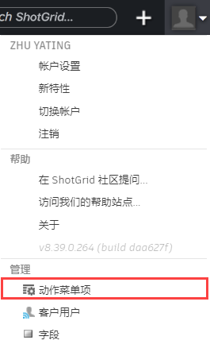

# 自定义动作菜单项

API 开发人员可以通过动作菜单项 (AMI) 按实体自定义上下文菜单项。例如，在“版本”(Versions)页面中，可以选择多个版本，单击鼠标右键，然后选择“Build a PDF Report”。

## 动作菜单项字段

**1. 标题(Title)(title)：**菜单项的显示名称。

**2. 实体类型(Entity Type)(entity_type)：**将菜单项限制为只在某个类型的实体页面上显示，例如版本。如果忽略此键（nil 值），则会允许在所有启用的实体上显示菜单项。

**3. URL (url)：**将用于创建 PDF 报告的脚本的 URL。

**4. 顺序(Order)(list_order)：**菜单项的顺序位置（相对于其他自定义菜单项）。

**5. 轻量有效负载(Light Payload)(light_payload)：**使用[自定义协议](https://developer.shotgridsoftware.com/zh_CN/af0c94ce/)时，您的脚本将收到用于保存有效负载信息的事件日志条目记录的 ID，而不是完整的有效负载本身。

**6. 配置菜单选项：**有几个选项可供选择：

- **包含在实体记录的右键单击菜单中：**这是默认值，通过在记录上单击鼠标右键将包含 AMI。

- **包含在实体页面的“添加实体”(Add Entity)下拉菜单中：**在“添加实体”(Add Entity)下拉菜单中包含此 AMI 的选项（例如：“添加资产”(Add Asset)、“添加镜头”(Add Shot)等）。

- **覆盖实体页面上的“添加实体”(Add Entity")按钮：**此选项允许您使用 AMI 覆盖“添加实体”(Add Entity)按钮。

- **包含在用户菜单的“内部资源”(Internal Resources)部分中：**这使您可以选择使用内部资源自定义用户菜单。在[此处](https://help.autodesk.com/view/SGSUB/CHS/?guid=SG_Administrator_ar_display_options_ar_user_menu_customization_html)了解有关使用内部资源自定义用户菜单的详细信息。

**7. 文件夹(Folder)(folder)：**允许您在上下文菜单中将 AMI 组织到文件夹中（当前仅支持单个级别的文件夹）。

**8. 以模态叠加方式打开(Open in Modal Overlay)：**允许 AMI 在 iframe 窗口中打开，而不是在新选项卡中打开。请注意，如果 ShotGrid 运行的是 HTTPS，那么所有 iframe 也需要是 HTTPS。

**9. 轮询数据更新(Poll for Data Updates)(poll_for_data_updates)：**启动轮询循环以查询事件日志条目。此项适用于以下情况：动作菜单项另一端的代码通过 API 将触发动作菜单项的页面上可见的实体的更改改回到 ShotGrid。

**10. 限制到权限组(Restrict to Permission Groups)(permissions_groups)：**允许您将 AMI 访问权限限制为仅指定的权限组。如果保留为空，则 AMI 可供所有用户使用。

**11. 限制到项目(Restrict to Projects)(projects)：**将使 AMI 仅显示在指定的项目中。如果保留为空，则 AMI 可在所有项目中使用。

**12. 秘密代币(Secret Token)：**通过设置[秘密代币](https://help.autodesk.com/view/SGSUB/CHS/?guid=SG_Administrator_ar_general_security_ar_securing_amis_html)来保护您的 AMI。

**13. 需要选择(Selection Required)(selection_required)：**确定当前未选择任何行时菜单项是否处于活动状态。

## 动作菜单项类型

可以创建两种类型的菜单项：

## HTTP URL 示例

例如，您可以创建名为“Build PDF Report”的自定义菜单项。 这将允许用户转到任何“版本”(Versions)页面，选择一个或多个版本，单击鼠标右键，然后从  菜单中选择“Build PDF Report”。执行此操作将启动一个您必须创建的脚本，以便将格式完善的报告发送回其浏览器。工作方式如下：

### 通过 UI 创建菜单项

在设置菜单中，选择“动作菜单项”(Action Menu Items)以打开 AMI 管理页面。 

要创建新 AMI，请单击 。 

填写“标题”(Title)和任何其他必填字段，然后单击“创建动作菜单项”(Create Action Menu Item)。

### 用户单击 AMI 会发生什么情况？

 将在新窗口或模态对话框（如果选择了该选项）中分派 POST 请求，然后将相关数据从当前页面（作为 POST 请求的一部分）发送到接收 URL。下面是一个工作流示例。

*   用户导航到“版本”(Versions)页面
*   用户选择一个或多个版本
*   用户打开上下文菜单（右键单击或单击工具栏中的配置菜单）
*   用户单击“Build PDF Report”
*    在新窗口中将 POST 请求分派到 AMI 的 URL（如果  服务器使用的是 HTTPS，URL 使用的是 HTTP，将会显示浏览器警告）
*   您的脚本（位于指定的 URL）处理 POST 数据，并生成一个 PDF 文档
*   向用户发送回一个格式完善的 PDF 报告以进行查看或下载

## 自定义协议处理程序示例

更高级的自定义 AMI 执行涉及设置自定义协议处理程序（例如 ://process_version）。这样，您可以通过本地计算机上的脚本将  与应用程序（如 Maya、RV 或 Cinesync）桥接起来。如果您指定非 HTTP(S) 协议，则将通过 GET 而不是 POST 将数据发送到您的 URL。您可能希望使用此项来启动内部工具以分派不同的请求。

有关自定义协议的详细信息，请参见[使用自定义浏览器协议启动应用程序](https://developer.shotgridsoftware.com/zh_CN/67695b40/)。

> **注意：**我们还通过 [ 集成](https://developer.shotgridsoftware.com/zh_CN/d587be80/)内置了与 Maya 和其他软件包的集成。
### 轻量有效负载

使用自定义协议时，查询信息作为 GET 请求发送。某些操作系统和浏览器组合对允许的 GET 请求的大小限制有所不同。我们建议在自定义协议 AMI 上选中轻量有效负载复选框。在选中轻量有效负载复选框的情况下，您的脚本将收到一个事件日志条目 ID，它可以提取该 ID 以通过读取记录的 `meta` 字段的 `ami_payload` 键来从其获取完整的有效负载。

## 示例

下面是一些相关的示例脚本，可帮助您快速入门：

*   [处理动作菜单项调用](http://developer.shotgridsoftware.com/python-api/cookbook/examples/ami_handler.html)
*   [版本打包程序](http://developer.shotgridsoftware.com/python-api/cookbook/examples/ami_version_packager.html)

## 有效负载内容

### 用户数据

*   **user_id：**当前登录用户的用户 ID（例如 34）
*   **user_login：**当前登录用户的登录名（例如 joe）

### 实体数据

*   **entity_type：**当前页面或视图的实体类型（例如版本）
*   **selected_ids：**选定实体 ID 的逗号分隔列表（例如 931, 900）
*   **ids：**当前页面查询所返回实体的所有 ID 的逗号分隔列表。这会返回所有 ID，包括那些由于分页而不可见的 ID（例如 931, 900, 904, 907）。如果在 AMI 上选中了“需要选择”(Selection required)，则此值将与 **selected_ids** 相同。

### 页面数据

*   **title：**页面标题（例如“所有版本”(All Versions)）
*   **page_id：**单击其中的动作菜单项的页面的 ID（例如 1353）
*   **server_hostname：**在其中触发 AMI 的系统的主机名。如果您有多个调用相同 AMI 的服务器（例如开发服务器和生产服务器），这可能很有用。
*   **referrer_path：**在其中调用 AMI 的 URL 的规范路径。
*   **session_uuid：**在其中调用此 AMI 的窗口的唯一标识符。这可以与“轮询数据更新”(Poll for Data Updates)复选框和 Python API 的 [`set_session_uuid`](http://developer.shotgridsoftware.com/python-api/reference.html?highlight=session_uuid#shotgun_api3.shotgun.Shotgun.set_session_uuid) 方法一起使用，以将信息传回调用 AMI 的页面。**注意：**此功能的更新轮询成指数级衰减并最终停止，因此如果您的 AMI 在轮询停止之前未更新，您可能无法在源页面中看到任何更新。
*   **cols：**页面上所有可见列的系统字段名称的逗号分隔列表（例如 code, sg_status_list, description）
*   **column_display_names：**页面上所有可见列的显示名称的逗号分隔列表（例如：版本(Version), 状态(Status), 说明(Description)）
*   **view：**调用 AMI 时选择的视图。可以通过设计页面模式为任何给定页面创建多个视图
*   **sort_column：**作为排序依据的列的系统名称（例如 code）。如果有多个排序键，仅发送第一个，请参见 **sort_columns**
*   **sort_direction：**（例如 asc 或 desc）如果有多个排序方向，仅发送第一个，请参见 **sort_directions**
*   **sort_columns：**作为页面或视图排序依据的列的系统名称的逗号分隔列表（例如 code, created_at）。仅当有多个排序键时才发送
*   **sort_directions：**作为页面或视图排序依据的列的系统名称的逗号分隔列表（例如 code, created_at）。仅当有多个排序键时才发送
*   **grouping_column：**作为分组依据的列的系统名称（例如 code）。如果有多个分组列，仅发送第一个，请参见 **grouping_columns**
*   **grouping_method：**分组依据的方法（例如，对实体字段按 `entitytype` 分组，对日期字段按 `month` 分组）。如果有多个分组方法，仅发送第一个，请参见 **grouping_columns**
*   **grouping_direction：**分组方向（例如 asc 或 desc）如果有多个分组方向，仅发送第一个，请参见 **grouping_directions**
*   **grouping_columns：**作为数据分组依据的列的系统名称的逗号分隔列表（例如 code, created_at）。仅当有多个分组列时才发送
*   **grouping_methods：**分组方法的逗号分隔列表（例如 entity_type, month）。仅当有多个分组列时才发送
*   **grouping_directions：**分组方向的逗号分隔列表（例如 asc,desc）。仅当有多个分组列时才发送

### 项目数据（仅当当前页面上的所有实体共享同一项目时才发送）

*   **project_name：**项目的名称（例如 Gunslinger）
*   **project_id:**项目的 ID（例如 81）

# “内部资源”(Internal Resources)菜单

要了解有关将“动作菜单项”(Action Menu Items)用于“用户”(User)菜单中的“内部资源”(Internal Resources)的详细信息，请[访问此处的管理员手册](https://help.autodesk.com/view/SGSUB/CHS/?guid=SG_Administrator_ar_display_options_ar_user_menu_customization_html)。