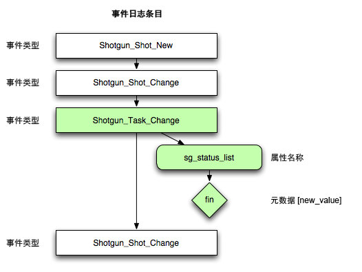

#  事件框架
该软件最初由 [Patrick Boucher](http://www.patrickboucher.com) 开发，[Rodeo Fx](http://rodeofx.com) 和 Oblique 提供支持。该软件现已加入 [ Software](http://www.shotgridsoftware.com) 的[开源计划](https://github.com/shotgunsoftware)。

该软件根据 MIT 许可提供；如需获取该许可，请访问 LICENSE 文件或[开源计划](http://www.opensource.org/licenses/mit-license.php)网站。

**目录：**

- [概述](#overview)
- [框架的优点](#advantages-of-the-framework)
- [编写事件驱动的触发器](#writing-event-driven-triggers)
   - [示例用例](#example-use-cases)
   - [事件驱动的触发器的工作方式](#how-event-driven-triggers-work)
   - [轮询事件日志与触发器](#polling-the-eventlog-versus-triggers)
   - [事件类型](#event-types)
   - [事务和可能丢失的事件](#transactions-and-potentially-missing-events)

## 概述

如果要访问  事件流，首选方法是监视事件表、获取任何新事件并对其进行处理，然后重复上述动作。

需要执行许多工作才可顺利完成此流程，这些工作可能与需要应用的业务规则并无任何直接关系。

框架的作用是使业务逻辑实施者摆脱任何繁琐的监视任务。

该框架是一个守护进程，可在服务器上运行并监视  事件流。找到事件时，守护进程会将事件分发给一系列注册的插件。每个插件可以根据情况处理事件。

进程负责以下工作：

- 从一个或多个指定路径注册插件。
- 取消激活任何崩溃的插件。
- 当磁盘上的插件出现变化时重新加载插件。
- 监视  事件流。
- 记住最后一次处理的事件 ID 和所有积压工作。
- 当进程启动后，从最后一次处理的事件 ID 开始作业。
- 捕捉所有连接错误。
- 根据需要将信息记录到标准输出、文件或电子邮件。
- 创建与  的连接，以供回调使用。
- 将事件传递到已注册的回调。

插件负责以下工作：

- 将任意数量的回调注册到框架。
- 每当框架提供一个事件时，便处理该事件。

## 框架的优点

- 为所有脚本使用一个监视机制，而不是为每个脚本使用一个。
- 可最大限度地减轻网络和数据库负载（仅使用一个监视器向多个事件处理插件提供事件）。

# 编写事件驱动的触发器

**注意：**有关事件驱动的触发器的详细信息，请参见我们的文档，网址为 [https://github.com/shotgunsoftware/shotgunEvents](https://github.com/shotgunsoftware/shotgunEvents)。

 会为在  中发生的每个动作创建一个[事件日志条目](https://help.autodesk.com/view/SGSUB/CHS/?guid=SG_Administrator_ar_data_management_ar_event_logs_html)。您可以在您的  站点中以及通过  API 查看这些事件。

除了在  中查看事件的详细历史记录外，您还可以编写自己的事件侦听器脚本来轮询事件日志并对您关注的某些事件执行操作。您的脚本可以执行您的工作流中的其他内部脚本，也可以使用  API 并更新  中的其他信息，或同时实现两者。

## 示例用例

下面是一些使用事件驱动的触发器的示例：

* 每当镜头的“布局”(Layout)任务状态标记为“最终”(final)时，自动将“动画”(Animation)任务状态设置为“准备开始”(ready to start)，以便动画设计师知道可以开始处理该镜头。
* 每当在  中创建了新镜头时，都会在文件系统上创建合适的镜头目录。
* 当某个镜头进入“暂停”(on hold)状态时通知分配给该镜头的美工人员。
* 最终确定了某个资产时将目录设为只读。
* 在  中将版本添加到审核时，将相关版本（或镜头）信息复制到样片系统。
* 场景增加到 25 个镜头时，通过 Twitter 发布一个以与场景的“说明”(Description)字段中第三个词语相同的字母开头的随机引文。

## 事件驱动的触发器的工作方式

下面是  生成的事件日志条目简单图表。您的脚本将使用 API 获取自上次查询以来发生的事件列表。然后，它将查看每个事件类型（例如 _Task_Change），看看其中是否有您关注的事件类型。

一旦找到关注的事件，它将更进一步检查事件的详细信息（例如，更改了哪些字段，值更改为什么等。此时，如果需要，您甚至可以使用 API 请求实体的详细信息）。

如果事件符合要求，脚本将对该事件执行操作，并执行用于确定是使用  API、您的工作流中的内容还是两者时需要执行的任何代码。没有其他事件要查看时，重复该过程，然后使用 API 获取自上次查询以来发生的事件列表。

## 轮询事件日志与触发器

 提供持续的事件信息流，您可以侦听所有事件，并只对您关注的事件执行操作。相比于让  自己控制触发器，这具有以下优势：

* **灵活**：您的触发器脚本可以独立于  运行。这样，您的脚本可以按照您所需的任何方式与  和您的工作流交互。您可以根据需要定义规则和动作，不受任何约束。 不需要了解您的事件触发器的任何信息。它只需持续生成事件日志条目。您可以控制后面发生的情况的所有其他方面。
* **远程**：您的脚本可以从能通过网络访问  服务器的任何位置运行。您的脚本只需要 API 访问权限即可运行。
* **多重性**：您可以同时运行多个脚本。 不同部门可能有不同的需求，因此侦听不同的事件。可以从同一脚本运行所有触发器，没有任何限制。您可能希望将触发器分解为单独的逻辑脚本。轮询查询占用资源非常少，对性能不会有任何显著影响。
* **责任明确**：如果您的脚本对  进行更改，它们也会创建自己的事件，从而允许您准确查看哪些脚本进行了更改。

## 事件类型

所有内部事件类型都采用 **`Shotgun_[entity_type]_[New|Change|Retirement]`** 格式。一些示例包括 `Shotgun_Shot_New` 和 `Shotgun_Asset_Change`。有关详细信息，请参见[事件类型文档](https://github.com/shotgunsoftware/shotgunEvents/wiki/Technical_Overview#event-types)。

## 事务和可能丢失的事件

 在事务中执行破坏性数据库查询，且仅当事务完成时向事件日志写入。因此，您在此处使用“最高 ID”方法时可能会丢失事件。但[我们 GitHub 站点上的事件触发器框架](https://github.com/shotgunsoftware/shotgunEvents)中有应该能处理这些情况的代码。