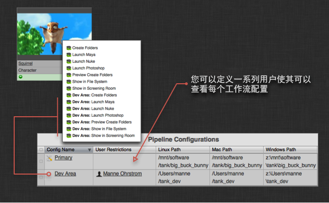

# 高级 Toolkit 管理

本文介绍了如何管理和配置 Toolkit 以实现高级配置。

在本主题中，请执行以下操作：
- [简介](#introduction)
- [使用 tank 命令](#using-the-tank-command)
   - [在调试模式下运行](#running-in-debug-mode)
   - [通过 Tookit API 运行 tank 命令](#running-tank-commands-via-the-tookit-api)
   - [实用的 tank 命令](#useful-tank-commands)
      - [setup_project](#setup_project)
      - [core](#core)
      - [configurations](#configurations)
      - [updates](#updates)
      - [install_app、install_engine](#install_app-install_engine)
      - [app_info](#app_info)
      - [folders、preview_folders](#folders-preview_folders)
      - [shell](#shell)
      - [dump_config](#dump_config)
         [高级 tank 命令](#advanced-tank-commands)
- [Toolkit Python API](#the-toolkit-python-api)
- [工作流配置和沙盒](#pipeline-configurations-and-sandboxes)
   - [为沙盒运行 tank 命令](#running-the-tank-command-for-a-sandbox)
   - [在沙盒中使用核心 API](#using-the-core-api-from-a-sandbox)
   - [访问沙盒](#accessing-a-sandbox)
   - [本地化工作流配置](#localizing-a-pipeline-configuration)
   - [删除克隆配置](#deleting-a-cloned-configuration)
- [检查更新](#checking-for-updates)
   - [创建临时沙盒](#creating-a-staging-sandbox)
- [配置应用的启动方式](#configuring-how-apps-are-launched)
- [在磁盘上创建文件夹](#creating-folders-on-disk)
   - [文件系统位置](#filesystem-locations)
   - [重命名 Toolkit 文件夹](#renaming-toolkit-folders)
   - [延迟创建和用户沙盒](#deferred-creation-and-user-sandboxes)
- [配置模板](#configuring-templates)
   - [模板文件中的 @include 语法](#include-syntax-in-the-template-file)
   - [在模板文件中包含外部文件](#including-external-files-in-your-template-file)
   - [文件夹创建和模板](#folder-creation-and-templates)
- [挂钩](#hooks)
   - [应用级挂钩](#app-level-hooks)
   - [核心级挂钩](#core-level-hooks)
   - [工作室级挂钩](#studio-level-hooks)
   - [项目名称挂钩](#project-name-hook)
   - [连接挂钩](#connection-hook)
- [配置应用和插件](#configuring-apps-and-engines)
   - [每个应用各有一个 location 设置](#each-app-has-a-location-setting)
   - [包含文件](#including-files)
   - [配置模板设置 - 文件路径](#configuring-template-settings---file-paths)
   - [使用挂钩自定义应用的行为](#using-hooks-to-customize-app-behaviour)


# 介绍

欢迎您阅读《 Toolkit 管理员手册》！本文档从管理的角度介绍如何使用  Pipeline Toolkit - 安装和更新应用、设置新项目以及管理工作室配置。Toolkit 仍然相对偏技术性，因此我们假设负责配置和管理的人员是系统管理员、工作流/工具开发者或技术主管。在开始了解细节之前，如果您还未阅读以下文档，我们建议您先阅读它！此文档讲解了一些基本概念，并简要介绍了配置管理和更新方面的知识：

[ Pipeline Toolkit 基本概念简介。](https://developer.shotgridsoftware.com/zh_CN/e95205a8/)

如果您尚未设置  Toolkit，则可能需要阅读[集成用户手册](https://developer.shotgridsoftware.com/zh_CN/d587be80/)。

# 使用 tank 命令

管理  Toolkit 以及常规使用 Toolkit 时，`tank` 命令是您的好帮手！使用 `tank` 命令，您可以快速轻松地从命令行同时运行管理命令和实际的应用。

默认情况下，您创建的每个新项目都有自己独立的核心 API 和自己的 `tank` 命令。只需导航到项目配置位置并执行 `tank` 命令，即可查看所有适用于该项目的命令：

```
cd /mnt/software//big_buck_bunny
./tank
```
tank 命令有很多不同的用法。基本的思路是首先告诉 tank 命令要在何处执行操作，然后再告诉它要执行什么操作。 如果不告诉 tank 命令要执行什么操作，它将显示一个包含所有可用命令的列表。 如果不告诉 tank 命令在何处执行操作，它会尝试使用您当前所在的目录。 您还可以使用 tank 命令列出  中的内容。

有关如何使用 tank 命令的基本概述：

```python
# Show all tank commands for an asset named 'piano'
> tank Asset piano

# We can also list all assets containing the phrase 'pi'
> tank Asset pi

# We can execute the built-in folder creation command for
# the piano
> tank Asset piano folders

# If the application launcher app is installed, we can launch maya
# and set the work area to the piano
> tank Asset piano launch_maya

# Alternatively, we can specify a path on disk instead of a  entity
> tank /mnt/projects/hero/assets/piano launch_maya

# Or we can change our work directory and run tank like this
> cd /mnt/projects/hero/assets/piano launch_maya
> tank launch_maya
```
## 运行调试模式

有时，了解底层运行情况可能会给您带来帮助。您可以向 `tank` 命令传递一个 `--debug` 标志，它会启用详细输出和计时功能，这有时能让您更容易跟踪查找问题或了解出现异常情况的原因。

## 通过 Tookit API 运行 tank 命令

大多数 tank 命令也完全支持通过 API 运行。这让您可以轻松在更庞杂的脚本化工作流中执行与 Toolkit 相关的维护操作。有关如何进行此操作的详细信息，请参见[核心 API 参考](https://developer.shotgridsoftware.com/tk-core/)

## 实用的 tank 命令

下面是您在管理  Toolkit 时可以使用的实用 tank 命令的简要列表。

### setup_project

 Desktop 中的设置项目向导的命令行版本。使用  Toolkit 设置新项目。当您在  中有一个项目，并想扩展此项目以使用 Toolkit 时，可以由此命令开始。此命令将引导您完成整个过程，并提示您输入各种信息，比如要使用哪个配置以及要设置哪个项目。

**对同一个项目重新运行 setup_project**

默认情况下，setup_project 只会列出尚未设置的项目。但是，有时（特别是测试时）我们常常需要对同一个项目重新运行 setup_project。我们可以通过传递 --force 标志做到这一点，该标志将列出所有项目，并通过备注标识出之前已设置的项目：

```python
> tank setup_project --force

Welcome to SGTK!
For documentation, see https://developer.shotgridsoftware.com
- Running setup_project...

force mode: Projects already set up with Toolkit can be set up again.

Welcome to SGTK Project Setup!

Connecting to ...
Connecting to the App Store...

------------------------------------------------------------------
Which configuration would you like to associate with this project?

You can use the configuration from an existing project as a template for this
new project. All settings, apps and folder configuration settings will be
copied over to your new project. The following configurations were found:

   big_buck_bunny: '/mnt/software/sgtk/big_buck_bunny'
   ghosts: '/mnt/software/sgtk/ghosts'
   chasing_perfection: '/mnt/software/sgtk/chasing_perfection'

If you want to use any of the configs listed about for your new project, just
type in its path when prompted below.

You can use the Default Configuration for your new project.  The default
configuration is a good sample config, demonstrating a typical basic setup of
the  Pipeline Toolkit using the latest apps and engines. This will be
used by default if you just hit enter below.

If you have a configuration stored somewhere on disk, you can just enter the
path to this config it will be used for the new project.

[tk-config-default]:
Downloading Config tk-config-default v0.4.15 from the App Store...

This is the 'Default Config' config.

Below are all active projects, including ones that have been set up:
--------------------------------------------------------------------

[ 4] Demo Project
     Fubar is an epic story of an on-going political wa...

[ 5] Big Buck Bunny
Note: This project has already been set up.
     A killer bunny movie

[ 6] The Ghosts of Pere Lachaise
Note: This project has already been set up.
     De Films en Aiguille and ChezEddy present this year...

[ 7] Chasing Perfection
Note: This project has already been set up.
     You've seen the car commercials, the car races, and...

[ 8] What Happened to My Headphones?
     The Ryan Mayeda story

Please type in the id of the project to connect to or ENTER to exit:
```

Toolkit 在项目设置过程中会提供项目名称建议。如果您对提供的名称满意，可以直接按 Enter 继续，否则也可以手动键入另外的名称。

如果您的工作室对于项目命名有特殊约定，也可以对设置项目过程中建议的默认值加以控制。这可以通过一个高级的工作室级挂钩实现 - 请阅读下文中有关工作室级挂钩的部分了解更多信息。

### core

此命令检查核心 API 更新。此命令将连接应用商店，查看是否有更新版本的核心 API 可用。如果有，命令会询问您是否要更新。

此命令的输出示例：

```python
> tank core

Welcome to Sgtk!
Starting Sgtk for your current directory '/private/tmp'
- Running core...

WARNING: You are potentially about to update the Core API for multiple
projects.

Welcome to the Sgtk update checker!
This script will check if the Sgtk Core API
installed in /mnt/software/sgtk/studio
is up to date.

You are currently running version v0.13.22 of the Sgtk Platform
No need to update the Sgtk Core API at this time!
```

### configurations

此命令可概览项目的所有配置。当您想知道某个项目当前活动的明细时，此命令非常方便。

此命令的输出示例：

```python
> tank Project Bunny configurations

Welcome to Sgtk!
Will search across all  Projects.
- Found Project Big Buck Bunny
- Starting Sgtk v0.13.22 using configuration
/mnt/software/sgtk/big_buck_bunny.
- Setting the Context to Big Buck Bunny.
- Running configurations...

Fetching data from ...

======================================================================
Available Configurations for Project 'Big Buck Bunny'
======================================================================

Configuration 'Primary' (Public)
-------------------------------------------------------

This is the Project Master Configuration. It will be used whenever this
project is accessed from a studio level sgtk command or API constructor.

Linux Location:  /mnt/software/sgtk/big_buck_bunny
Winows Location: z:\mnt\software\sgtk\big_buck_bunny
Mac Location:    /mnt/software/sgtk/big_buck_bunny

This configuration is using a shared version of the Core API.If you want it to
run its own independent version of the Toolkit Core API, you can run:
> /mnt/software/sgtk/big_buck_bunny/tank localize

If you want to check for app or engine updates, you can run:
> /mnt/software/sgtk/big_buck_bunny/tank updates

If you want to change the location of this configuration, you can run:
> /mnt/software/sgtk/big_buck_bunny/tank move_configuration

This is a public configuration. In , the actions defined in this
configuration will be on all users' menus.

Configuration 'Dev Area' (Private)
-------------------------------------------------------

Linux Location:  /Users/manne/sgtk_dev
Winows Location: z:\Users\manne\sgtk_dev
Mac Location:    /Users/manne/sgtk_dev

This configuration is using a shared version of the Core API.If you want it to
run its own independent version of the Toolkit Core API, you can run:
> /Users/manne/sgtk_dev/tank localize

If you want to check for app or engine updates, you can run:
> /Users/manne/sgtk_dev/tank updates

If you want to change the location of this configuration, you can run:
> /Users/manne/sgtk_dev/tank move_configuration

This is a private configuration. In , only Admin 3 will see the actions
defined in this config. If you want to add additional members to this
configuration, navigate to the SG Pipeline Configuration Page and add
them to the Users field.
```

### updates

此命令将查看与项目关联的所有环境，检查是否有更新版本的应用或插件可用。此更新程序可能会对照本地 Git 库、GitHub 或  Toolkit 应用商店检查更新，具体取决于应用和插件的安装方式。如果检测到更新的版本，命令会询问您是否要更新设置。如果应用的新版本中引入了任何新的配置参数，会提示您输入参数的值。

一般语法：

```
> tank updates [environment_name] [engine_name] [app_name]
```

可以使用特殊关键词 ALL 表示一个类别中的所有项。示例：

- 检查所有内容：`tank updates`
- 检查镜头环境：`tank updates Shot`
- 检查所有环境中的所有 Maya 应用：`tank updates ALL tk-maya`
- 检查镜头环境中的所有 Maya 应用：`tank updates Shot tk-maya`
- 确保所有地方的加载器应用保持更新：`tank updates ALL ALL tk-multi-loader`
- 确保 Maya 中的加载器应用保持更新：`tank updates ALL tk-maya tk-multi-loader`

### install_app、install_engine

此命令在其中一个与项目关联的环境中安装新插件或应用。您可以使用此命令从 Toolkit 应用商店或 Git 安装应用或插件。

### app_info

此命令可查看所有应用及其主要配置设置的明细。

### folders、preview_folders

此命令在磁盘上为内容项创建文件夹。

此命令的输出示例

```python
Welcome to Sgtk!
Will search across all  Projects.
- Found Asset Squirrel (Project 'Big Buck Bunny')
- Starting Sgtk v0.13.22 using configuration
/mnt/software/sgtk/big_buck_bunny.
- Setting the Context to Asset Squirrel.
- Running folders...

Creating folders, stand by...

The following items were processed:
 - /mnt/projects/big_buck_bunny
 - /mnt/projects/big_buck_bunny/reference
 - /mnt/projects/big_buck_bunny/reference/artwork
 - /mnt/projects/big_buck_bunny/reference/footage
 - /mnt/projects/big_buck_bunny/sequences
 - /mnt/projects/big_buck_bunny/assets
 - /mnt/projects/big_buck_bunny/assets/Character
 - /mnt/projects/big_buck_bunny/assets/Character/Squirrel
 - /mnt/projects/big_buck_bunny/assets/Character/Squirrel/sgtk_overrides.yml
 - /mnt/projects/big_buck_bunny/assets/Character/Squirrel/Art
 - /mnt/projects/big_buck_bunny/assets/Character/Squirrel/Model
 - /mnt/projects/big_buck_bunny/assets/Character/Squirrel/Rig
 - /mnt/projects/big_buck_bunny/assets/Character/Squirrel/Surface
 - /mnt/projects/big_buck_bunny/assets/Character/Squirrel/Art/publish
 - /mnt/projects/big_buck_bunny/assets/Character/Squirrel/Art/publish/elements
 - /mnt/projects/big_buck_bunny/assets/Character/Squirrel/Art/publish/maya
 - /mnt/projects/big_buck_bunny/assets/Character/Squirrel/Art/publish/nuke
 - /mnt/projects/big_buck_bunny/assets/Character/Squirrel/Art/publish/photoshop
 - /mnt/projects/big_buck_bunny/assets/Character/Squirrel/Art/publish/photoshop/jpg
 - /mnt/projects/big_buck_bunny/assets/Character/Squirrel/Art/publish/photoshop/psd
 - /mnt/projects/big_buck_bunny/assets/Character/Squirrel/Art/reference
 - /mnt/projects/big_buck_bunny/assets/Character/Squirrel/Art/reference/artwork
 - /mnt/projects/big_buck_bunny/assets/Character/Squirrel/Art/reference/footage
 - /mnt/projects/big_buck_bunny/assets/Character/Squirrel/Art/review
 - /mnt/projects/big_buck_bunny/assets/Character/Squirrel/Art/work
 - /mnt/projects/big_buck_bunny/assets/Character/Squirrel/Art/work/images
 - /mnt/projects/big_buck_bunny/assets/Character/Squirrel/Art/work/maya
 - /mnt/projects/big_buck_bunny/assets/Character/Squirrel/Art/work/maya/workspace.mel
 - /mnt/projects/big_buck_bunny/assets/Character/Squirrel/Art/work/maya/snapshots
 - /mnt/projects/big_buck_bunny/assets/Character/Squirrel/Art/work/nuke
 - /mnt/projects/big_buck_bunny/assets/Character/Squirrel/Art/work/nuke/snapshots
 - /mnt/projects/big_buck_bunny/assets/Character/Squirrel/Art/work/photoshop
 - /mnt/projects/big_buck_bunny/assets/Character/Squirrel/Art/work/photoshop/snapshots
 - /mnt/projects/big_buck_bunny/assets/Character/Squirrel/Model/publish
 - /mnt/projects/big_buck_bunny/assets/Character/Squirrel/Model/publish/elements
 - /mnt/projects/big_buck_bunny/assets/Character/Squirrel/Model/publish/maya
 - /mnt/projects/big_buck_bunny/assets/Character/Squirrel/Model/publish/nuke
 - /mnt/projects/big_buck_bunny/assets/Character/Squirrel/Model/publish/photoshop
 - /mnt/projects/big_buck_bunny/assets/Character/Squirrel/Model/publish/photoshop/jpg
 - /mnt/projects/big_buck_bunny/assets/Character/Squirrel/Model/publish/photoshop/psd
 - /mnt/projects/big_buck_bunny/assets/Character/Squirrel/Model/reference
 - /mnt/projects/big_buck_bunny/assets/Character/Squirrel/Model/reference/artwork
 - /mnt/projects/big_buck_bunny/assets/Character/Squirrel/Model/reference/footage
 - /mnt/projects/big_buck_bunny/assets/Character/Squirrel/Model/review
 - /mnt/projects/big_buck_bunny/assets/Character/Squirrel/Model/work
 - /mnt/projects/big_buck_bunny/assets/Character/Squirrel/Model/work/images
 - /mnt/projects/big_buck_bunny/assets/Character/Squirrel/Model/work/maya
 - /mnt/projects/big_buck_bunny/assets/Character/Squirrel/Model/work/maya/workspace.mel
 - /mnt/projects/big_buck_bunny/assets/Character/Squirrel/Model/work/maya/snapshots
 - /mnt/projects/big_buck_bunny/assets/Character/Squirrel/Model/work/nuke
 - /mnt/projects/big_buck_bunny/assets/Character/Squirrel/Model/work/nuke/snapshots
 - /mnt/projects/big_buck_bunny/assets/Character/Squirrel/Model/work/photoshop
 - /mnt/projects/big_buck_bunny/assets/Character/Squirrel/Model/work/photoshop/snapshots
 - /mnt/projects/big_buck_bunny/assets/Character/Squirrel/Rig/publish
 - /mnt/projects/big_buck_bunny/assets/Character/Squirrel/Rig/publish/elements
 - /mnt/projects/big_buck_bunny/assets/Character/Squirrel/Rig/publish/maya
 - /mnt/projects/big_buck_bunny/assets/Character/Squirrel/Rig/publish/nuke
 - /mnt/projects/big_buck_bunny/assets/Character/Squirrel/Rig/publish/photoshop
 - /mnt/projects/big_buck_bunny/assets/Character/Squirrel/Rig/publish/photoshop/jpg
 - /mnt/projects/big_buck_bunny/assets/Character/Squirrel/Rig/publish/photoshop/psd
 - /mnt/projects/big_buck_bunny/assets/Character/Squirrel/Rig/reference
 - /mnt/projects/big_buck_bunny/assets/Character/Squirrel/Rig/reference/artwork
 - /mnt/projects/big_buck_bunny/assets/Character/Squirrel/Rig/reference/footage
 - /mnt/projects/big_buck_bunny/assets/Character/Squirrel/Rig/review
 - /mnt/projects/big_buck_bunny/assets/Character/Squirrel/Rig/work
 - /mnt/projects/big_buck_bunny/assets/Character/Squirrel/Rig/work/images
 - /mnt/projects/big_buck_bunny/assets/Character/Squirrel/Rig/work/maya
 - /mnt/projects/big_buck_bunny/assets/Character/Squirrel/Rig/work/maya/workspace.mel
 - /mnt/projects/big_buck_bunny/assets/Character/Squirrel/Rig/work/maya/snapshots
 - /mnt/projects/big_buck_bunny/assets/Character/Squirrel/Rig/work/nuke
 - /mnt/projects/big_buck_bunny/assets/Character/Squirrel/Rig/work/nuke/snapshots
 - /mnt/projects/big_buck_bunny/assets/Character/Squirrel/Rig/work/photoshop
 - /mnt/projects/big_buck_bunny/assets/Character/Squirrel/Rig/work/photoshop/snapshots
 - /mnt/projects/big_buck_bunny/assets/Character/Squirrel/Surface/publish
 - /mnt/projects/big_buck_bunny/assets/Character/Squirrel/Surface/publish/elements
 - /mnt/projects/big_buck_bunny/assets/Character/Squirrel/Surface/publish/maya
 - /mnt/projects/big_buck_bunny/assets/Character/Squirrel/Surface/publish/nuke
 - /mnt/projects/big_buck_bunny/assets/Character/Squirrel/Surface/publish/photoshop
 - /mnt/projects/big_buck_bunny/assets/Character/Squirrel/Surface/publish/photoshop/jpg
 - /mnt/projects/big_buck_bunny/assets/Character/Squirrel/Surface/publish/photoshop/psd
 - /mnt/projects/big_buck_bunny/assets/Character/Squirrel/Surface/reference
 - /mnt/projects/big_buck_bunny/assets/Character/Squirrel/Surface/reference/artwork
 - /mnt/projects/big_buck_bunny/assets/Character/Squirrel/Surface/reference/footage
 - /mnt/projects/big_buck_bunny/assets/Character/Squirrel/Surface/review
 - /mnt/projects/big_buck_bunny/assets/Character/Squirrel/Surface/work
 - /mnt/projects/big_buck_bunny/assets/Character/Squirrel/Surface/work/images
 - /mnt/projects/big_buck_bunny/assets/Character/Squirrel/Surface/work/maya
 - /mnt/projects/big_buck_bunny/assets/Character/Squirrel/Surface/work/maya/workspace.mel
 - /mnt/projects/big_buck_bunny/assets/Character/Squirrel/Surface/work/maya/snapshots
 - /mnt/projects/big_buck_bunny/assets/Character/Squirrel/Surface/work/nuke
 - /mnt/projects/big_buck_bunny/assets/Character/Squirrel/Surface/work/nuke/snapshots
 - /mnt/projects/big_buck_bunny/assets/Character/Squirrel/Surface/work/photoshop
 - /mnt/projects/big_buck_bunny/assets/Character/Squirrel/Surface/work/photoshop/snapshots

In total, 93 folders were processed.
```
### shell

此命令在当前选择的上下文中启动一个互动式 Python Shell。针对预先初始化的 API、上下文和插件对象设置方便的引用。您可以使用 `./tank shell` 尝试 Toolkit 和  API 代码示例。tank 可执行文件位于您本地计算机的 **工作流配置根目录**，看起来如下所示：

```
> cd /my_tank_configs/project_foobar
```

此命令的输出示例：

```python
Welcome to SGTK!
For documentation, see https://developer.shotgridsoftware.com
You are running a tank command associated with  Project 'Chasing the
Light'. Only items associated with this project will be considered.
- Found Shot moo87 (Project 'Chasing the Light')
- Starting the SG pipeline toolkit v0.15.14.
- Setting the Context to Shot moo87.
- Started Shell Engine version v0.3.3
- Environment: /mnt/software/tank/chasing_the_light/config/env/shot.yml.
- Running shell...

Welcome to SG Pipeline Toolkit Python!
2.7.1 (r271:86832, Jul 31 2011, 19:30:53)
[GCC 4.2.1 (Based on Apple Inc. build 5658) (LLVM build 2335.15.00)]
Running on darwin

- A tk API handle is available via the tk variable
- A Shotgun API handle is available via the Shotgun variable
- Your current context is stored in the context variable
- The shell engine can be accessed via the engine variable
>>>
>>> tk
<Sgtk Core vHEAD@0x105f66990 Config /mnt/software/tank/chasing_the_light>
>>>
>>> context
<Sgtk Context:   Project: {'type': 'Project', 'id': 88, 'name': 'Chasing the Light'}
  Entity: {'type': 'Shot', 'id': 1184, 'name': 'moo87'}
  Step: None
  Task: None
  User: {'type': 'HumanUser', 'id': 42, 'name': 'Manne \xc3\x96hrstr\xc3\xb6m'}
  Additional Entities: []>
>>>
>>> Shotgun
<tank_vendor.Shotgun_api3.Shotgun.Shotgun object at 0x105fb2990>
>>>
>>> engine
<Sgtk Engine 0x105feead0: tk-shell, env: shot>
>>>
```

在上面的示例中，`./tank` 为您启动一个 Python Shell，并设置一些您需要的变量。通过在上面的变量中提供以下句柄和上下文，这就省去了一些基础工作，例如设置身份认证和用户会话，以及启动与  站点的连接：

- `tk` 变量有一个句柄，可让您访问 [Toolkit API](https://developer.shotgridsoftware.com/tk-core/core.html?highlight=context#the-toolkit-core-api)。
- `` 变量有一个指向 [ API](https://developer.shotgridsoftware.com/python-api/) 的句柄，它已连接至您的站点，并准备好查询您的 [ 站点]中的数据库和其他内容。
- context 变量读取您当前的上下文（项目、镜头、资产、工作流工序、用户等）。[下面是一个活动上下文的示例](https://developer.shotgridsoftware.com/tk-core/core.html?highlight=context#sgtk.Context)。这个示例中使用了一个上下文实例来收集一组描述当前上下文的主要字段。我们有时称上下文为当前工作区。通常，这将是用户当前正在处理的镜头或资产。在此示例中，可以看到项目为“Chasing the Light”，ID 为 1184，镜头为“moo87”。没有分配工作流工序或任务，但是用户为 Manne。在为 Toolkit API 编写脚本时，您可能需要知道这些信息，而这个方便的上下文变量可提供您所需要的一切：

```python
<Sgtk Context:   Project: {'type': 'Project', 'id': 88, 'name': 'Chasing the Light'}
     Entity: {'type': 'Shot', 'id': 1184, 'name': 'moo87'}
     Step: None
     Task: None
     User: {'type': 'HumanUser', 'id': 42, 'name': 'Manne \xc3\x96hrstr\xc3\xb6m'}
     Additional Entities: []>
```

`engine` 变量指向当前运行的 [Shell 插件](https://developer.shotgridsoftware.com/zh_CN/2ad59ee8/) 实例。

### dump_config

核心 `v0.18` 中提供此命令。

此命令将现有环境配置转存到 `STDOUT` 或另一个文件。它能够转存配置的完整表达法或稀疏表达法。完整表达法包括所有设置的默认值，稀疏表达法只包括与设置的默认值不同的值。默认情况下，该命令的输出包括每项设置的注释，这些注释指示清单文件可以在哪里找到默认值，如果默认值与配置中的值不同，还会指示默认值是什么。该命令不允许作为一项安全预防措施将环境配置转存到现有文件。

用法：

```
./tank dump_config env_name [--sparse | --full] [--no_debug-comments] [--file=/path/to/output/file.yml]
```

此命令的输出示例：

```python
> ./tank dump_config shot_step --sparse --file=/tmp/shot_step.yml

Welcome to SGTK!
For documentation, see https://developer.shotgridsoftware.com
Starting toolkit for path '/Shotgun/configs/sparse34913'
- The path is not associated with any SG object.
- Falling back on default project settings.
- Running as user 'Toolkit'
- Using configuration 'Primary' and Core HEAD
- Setting the Context to sparse34913.
- Running command dump_config...

----------------------------------------------------------------------
Command: Dump config
----------------------------------------------------------------------

Dumping config...
```

运行上面的命令会将当前项目的 `shot_step` 环境文件的一个稀疏副本写入 `/tmp/shot_step.yml`。

要想不包括附加的调试注释，请使用 `--no_debug_comments` 标志。

### 高级 tank 命令

下面是您在管理  Toolkit 时可以使用的高级 tank 命令的简要列表。

- `tank share_core` - 新项目创建后，它们的状态常常是每个项目都自己保留一份核心 API 的独立副本。此命令让您可选取这类项目的核心，并将核心移出到磁盘上的一个单独位置。这样就可以创建一个共享核心，几个项目共享核心 API 的一个副本。

- `tank attach_to_core` - 新项目创建后，它们的状态常常是每个项目都自己保留一份核心 API 的独立副本。使用此命令，您可以将配置附加至现有的核心 API 安装，而不是让它保留属于自己的嵌入式版本的核心 API。

- `tank localize` - 此命令会将核心 API 下载到特定的工作流配置位置。当您想在 Toolkit 暂存区内测试新版本的核心 API 时，此命令非常有用。本文档的下文详细介绍此过程。

- `tank clear_cache` - 清除 Toolkit 的部分缓存。如果菜单项由于某种原因没有显示在  中，此命令可能很有用。

- `tank validate` - 验证项目配置。

- `tank cache_apps` - 确保所有必需的应用、插件和框架版本在磁盘上存在。

- `tank switch_app` - 此命令对开发非常有用。它可在应用商店模式与本地或 Git 模式之间来回切换应用。

- `tank push_configuration` - 将当前工作流配置中包含的配置推送至另一个工作流配置。

# Toolkit Python API

如果您使用  Desktop、`tank` 命令或  启动应用程序，则 Toolkit 会自动添加到 `PYTHONPATH` 并进行初始化。有时，手动添加 Toolkit API 的源并运行它是很有用的。我们可以通过将 Toolkit 核心 API 添加到 pythonpath 并导入它来做到这一点。

在每个项目配置中，`project_config_root/install/core/python` 内都有一个 `python` 文件夹。只要将该位置添加到您的 Python 路径，便可导入 `sgtk` API：

```python
import sgtk

# create a Sgtk API object for a  entity
tk = sgtk.sgtk_from_entity("Shot", 123)

# Create a Sgtk API object based on a file system location
tk = sgtk.sgtk_from_path("/mnt/projects/hero/assets/chair")
```

# 工作流配置和沙盒

工作流配置具有与工作室安装相同的基本结构。最重要的是，它在 `install/core/python` 内同时包含一个 `tank` 命令和一个 Toolkit API。每个配置之所以具有相同的 API 和 tank 命令，是因为这样易于开发，并且便于在生产配置之外工作。

当您在  Toolkit 中设置一个新项目后，项目设置会为该项目创建一个***主工作流配置***。此配置始终称为“主”(Primary)，代表项目的主配置。您可以看到该配置以项目的工作流配置实体形式显示在  内。当您进行开发或更改配置时，通常不要在主配置中工作 - 如果不小心弄错了什么，所有参加项目的人都会受到影响。相反，您可以克隆  内的配置。这样，不仅有属于自己的相同配置，而且可以在更改配置时不影响其他任何人。

## 为沙盒运行 tank 命令

如果您使用工作室级的 `tank` 命令运行应用，它将始终为项目使用主配置。因此，如果您只是键入 `tank Shot ABC123 launch_maya`， Toolkit 将查找镜头 ABC123 所属的项目，找到它的主工作流配置，并在启动 Maya 时使用这些配置设置。如果您想在开发沙盒中改用试验配置，则需要在开发沙盒内使用特定的 tank 命令启动 Maya：`~/sgtk_dev_sandbox/tank Shot ABC123 launch_maya`。这时 Toolkit 将使用开发沙盒中的配置，而不使用项目的主配置。

## 在沙盒中使用核心 API

同样，如果您想从工作流配置内（而不是工作室安装位置）运行 Toolkit API，可以将开发沙盒添加到 `PYTHONPATH`，而不是工作室的 Python API。

## 访问沙盒

在  内，事情要简单得多。项目的每个工作流配置各有一组可以查看该配置的用户。如果将字段留空，每个人都将能够查看配置。



当您克隆一个配置时（在  中的配置上单击鼠标右键即可进行克隆），将会自动与该配置关联，这实际上授予了您对配置的独占查看权。如果您是在 Maya 中开发新工具，想让一位美工人员测试这些工具，只需将该美工人员添加到您的工作流配置开发沙盒中，他们便可从您的沙盒中启动 Maya，然后将可以访问正在开发中的工具。

## 本地化工作流配置

默认情况下，工作流配置将从  Toolkit 的工作室安装中提取其代码。Toolkit 的工作室安装会包含  Toolkit 使用的所有应用和插件代码的缓存，以及 Toolkit 核心 API 安装。每个工作流配置将共享位于工作室位置的核心 API 和应用缓存。这种做法通常比较有用，因为您可以将核心 API 更新同时部署到所有项目。只要更新工作室位置，所有项目都会随之更新。

但是，有时我们需要能够隔离某个工作流配置，让它变得独立。例如，在下列情况有必要这样做：

- 您有一个即将封装的项目，您想冻结更新并确保所有内容都不再变化。
- 您有一个工作流配置，想在其中测试 Toolkit 核心 API 的某个新版本。
- 您要打包一个最精简的 Toolkit 数据包，供在家工作时使用。

我们将这个使工作流配置完全独立于工作室位置的过程称为对配置进行***本地化***，根本上讲是将核心 API 复制到工作流配置中。您可以运行 `tank localize` 命令来执行此操作。

注意，一旦将某个配置本地化，就无法再运行工作室 tank 命令 - 一般来说，一旦项目本地化，您就需要使用它的本地 tank 命令和 Python API。

## 删除克隆配置

如果您不再需要克隆的配置或开发环境，只要删除记录，然后从磁盘上删除配置即可。

# 检查更新

检查应用或插件是否有更新非常简单！只要为项目运行 `tank updates` 命令即可。 Toolkit 会检查是否有更新，并询问您是否要进行更新。如果有任何新参数没有默认值，更新脚本会提示您输入这些值。每个更新会显示一个指向发行说明页面的 URL 链接，如果您想查看更改内容的详细信息，可访问此链接。您可以随时退出该过程。

更新 Toolkit 核心 API 也同样简单。运行 `tank core` 命令即可！

## 创建临时沙盒

尽管只对主配置运行 `tank updates` 命令通常是万无一失的，但有时最好还是先进行测试，然后再部署到生产环境。在这种情况下，您只需克隆主工作流配置，然后在其中运行更新命令。升级核心 API 时，请确保在运行 `core` 命令前，先对沙盒进行本地化（参见上文了解有关本地化的详细信息）。验证更新可以正常进行后，再对主配置运行更新。有关如何执行此操作的详细信息，请参见[管理您的配置](https://developer.shotgridsoftware.com/zh_CN/60762324/)。

# 配置应用的启动方式

在 Toolkit 配置中，常常需要在安装 Toolkit 之后立即进行的一项配置是应用启动配置。我们已尽量让这项任务变得灵活又可配置，因为我们知道工作室在这方面通常已经做了自定义，有了自己的工具。

当您从  内或使用 tank 命令启动应用程序（例如 Maya 或 Nuke）时，将会调用一个应用来负责启动应用程序并初始化 Toolkit。此应用称为 `tk-multi-launchapp`。

当您使用其中一个 Toolkit 入门配置设置新项目时，它会显示如何更改启动器应用所用的应用程序路径。如果您有可以达到相同效果的替代系统，则无需使用此应用。启动器应用程序通常会执行以下操作步骤：

1. 确定要使用的上下文。上下文表示当前的工作区。如果您在  内的某个任务、资产或镜头上单击鼠标右键，将基于该对象创建上下文。如果您使用 tank 命令，上下文将是您在命令行中指定的内容，或者选取自您的当前目录。

2. 然后，根据应用配置中的设置启动应用程序。您可以对启动器应用进行几种配置 - 应用程序的路径、要传递的命令行参数、实际执行应用程序的代码和启动应用程序前需要设置的环境变量。

3. 设置 Pythonpath 以确保稍后可以初始化 Toolkit API。

4. 一旦应用程序启动，将导入并初始化 Toolkit API。

5. 最后，启动插件。

**示例：一个说明  Toolkit 如何启动的更具实操性的示例。**

典型的 Toolkit 引导过程分为几个阶段：

- 启动主宿主应用程序。这是任何具有 Python 解释器的应用程序。它最简单的形式只是一个在标准 Shell 中运行的 CPython 解释器。另外，也可以是 Maya 或 Nuke 或其他任何具有内嵌 Python 解释器的应用程序。

- Toolkit 核心 API 将添加到 `PYTHONPATH` 并导入：`import sgtk`

- 接下来需要确定上下文。该上下文可以是磁盘上的路径，也可以是  对象。我们可以使用工厂方法创建一个 Toolkit API 实例：`tk = sgtk.sgtk_from_path("/mnt/projects/hero/assets/chair01/lighting")`。或者，也可以使用  实体：`tk = sgtk.sgtk_from_entity("Shot", 123)`。当使用实体时，上面的代码将连接到 ，解析该镜头的工作流配置，在磁盘上找到该工作流配置，加载 Sgtk 的基本设置（例如文件系统模板）。此时不会加载应用或插件。当需要查找路径时，它会使用文件系统来定位工作流配置。

- 接下来我们创建一个上下文对象来表示当前工作区。此操作也可通过实体或路径来完成：`ctx = tk.context_from_entity("Shot", 123)` 或 `ctx = tk.context_from_path("/mnt/projects/hero/assets/chair01/lighting")`

- 最后，我们启动插件。假设我们在 Maya 内使用 Maya 的 Python 解释器运行这些命令，我们会这样做：`sgtk.platform.start_engine('tk-maya', tk, ctx)`。这将执行以下操作：

   - 为上下文运行选取环境挂钩。选取环境挂钩将返回要使用的环境。环境包含要加载的所有应用及其配置的列表。

   - 确定环境文件后，将插件加载到内存中。这将动态地加载插件基础对象，并执行其 init 方法。插件加载后，所有应用以相同方式加载。通常，在这个过程中，插件将在应用程序中的某处注册一个“”菜单，每个应用将向插件注册一系列命令。这些命令稍后将成为执行命令的切入点：用户单击  菜单上的某项，从而触发应用执行。

按照这样的思路，一个完整的示例将如下所示：

```python
# starting up sgtk when your context is based on a path
import sgtk
path = "/mnt/projects/hero/assets/chair01/lighting"
# create a sgtk api handle
tk = sgtk.sgtk_from_path(path)
# create a context object
ctx = tk.context_from_path(path)
# start the tank engine
sgtk.platform.start_engine('tk-maya', tk, ctx)

# starting up sgtk when your context is based on a  object
import sgtk
entity_type = "Shot"
entity_id = 123
# create a sgtk api handle
tk = sgtk.sgtk_from_entity(entity_type, entity_id)
# create a context object
ctx = tk.context_from_entity(entity_type, entity_id)
# start the sgtk engine
sgtk.platform.start_engine('tk-maya', tk, ctx)
```

# 在磁盘上创建文件夹

Toolkit 配置的一个关键部分是文件系统配置。 Toolkit 可以帮助您以一致的方式在磁盘上创建文件夹，创建过程由  驱动。下面是一个配置内的 core 文件夹的概览：


设置一个文件夹配置相对简单。配置本质上是您创建的一个模板文件夹结构，其中有一些配置文件，指示文件夹应代表资产还是镜头。在配置文件系统结构时，您随时可以使用***文件夹预览***功能列出将要创建的文件夹。此命令在  和 tank 命令中均可使用。

首先使用普通文件夹概括您的“脚手架”。如果您的“脚手架”中有一级动态文件夹（例如用来代表资产、镜头或工作流工序的文件夹），请先暂时忽略它们。待获得满意的结果后，再逐步为每个动态文件夹添加动态功能。这通过添加与文件夹同名的 yml 文件来实现。

在该 yml 文件内，使用特殊语法定义文件夹的创建方式。 Toolkit 支持多种不同的动态行为，但常见的一种是代表  实体的动态节点。在本例中，配置文件可以如下所示：

```python
# the type of dynamic content
type: "Shotgun_entity"

# the Shotgun field to use for the folder name
name: "{code}_{sg_prefix}"

# the Shotgun entity type to connect to
entity_type: "Asset"

# Shotgun filters to apply when getting the list of items
# this should be a list of dicts, each dict containing
# three fields: path, relation and values
# (this is std Shotgun API syntax)
# any values starting with $ are resolved into path objects
filters:
    - { "path": "project", "relation": "is", "values": [ "$project" ] }
    - { "path": "sg_asset_type", "relation": "is", "values": [ "$asset_type"] }

```

这将告诉 Toolkit，动态文件夹应创建使用资产实体上的两个  字段命名的文件夹。使用标准  API 查询语法，我们还可基于父文件夹定义约束条件；只考虑当前项目和资产类型的资产。

有关支持哪些类型的节点的完整参考，请参见[参考文档](https://developer.shotgridsoftware.com/zh_CN/82ff76f7/)。

## 文件系统位置

通过 Toolkit 文件夹创建系统在磁盘上创建文件夹时，这些文件夹也会在  中存储和跟踪。在  中，文件夹以**文件系统位置**实体的形式表示，可以在管理员菜单中找到。通常，Toolkit 会在后台跟踪这些数据，用户什么都不用管。这些文件系统位置实体供 Toolkit 用来同步和跟踪磁盘上的文件夹，另外也可像初次运行文件夹创建系统创建文件夹结构那样，用于在磁盘上重新创建文件夹结构。文件系统位置实体数据进而主要用于尝试找出哪个  实体与磁盘上的特定路径关联。

出于性能原因，Shotgun 管理的文件系统位置表的内容缓存在用户的本地计算机上。这样做是为了加快文件夹/实体查找速度。对于专家级用户，可通过修改 `cache_location` 核心挂钩来自定义此缓存的位置。每当磁盘上创建了文件夹和应用程序启动时，都会同步缓存的本地文件夹表示。

## 重命名 Toolkit 文件夹

当您执行 Toolkit 文件夹创建操作时，会在  中的实体与磁盘上的文件夹之间建立联系。Toolkit 使用其文件夹数据结构配置在磁盘上生成一系列文件夹，而每个文件夹在  中都注册为一个 `Filesystem Location` 实体。我们可以将这看成是  数据（例如镜头和资产名称）和配置被“转化”成磁盘上和  中的实际文件夹。

文件夹一经创建，您便无法再随意更改  中实体的名称。如果您尝试重命名实体并启动 Toolkit，将显示错误消息。
 这是为了避免无法再跟踪与特定实体关联的文件夹。

要重命名 Toolkit 文件夹，请执行以下操作：

- 首先，在  中重命名实体（资产或镜头）。
- 通过运行 `tank unregister_folders` 命令，取消注册任何已注册的文件夹。这将移除  中用来跟踪实体与磁盘位置之间关系的所有文件系统位置实体。请注意，此命令不会影响磁盘上的任何内容，只会影响  中指向磁盘位置的 `Filesystem Location` 实体。例如，如果您想取消注册名为 Plant 的资产的文件夹，请执行 `tank Asset Plant unregister_folders` 命令。此命令会显示将要取消注册的文件夹的概要，并要求您确认操作。
- 取消注册文件夹之后，您实际上相当于“重置”了资产。此时资产不再与任何文件夹关联，通过在  中使用新名称运行文件夹创建过程，将会在磁盘上创建新文件夹。
- 最后，将所有数据从先前的磁盘位置移至新位置。注意确保文件之间的任何链接也得到更新，指向新的位置。

## 延迟创建和用户沙盒

我们可以将 Toolkit 的文件夹创建过程设置为分两个阶段运行：一个阶段是每当有人运行文件夹创建命令时，另一个阶段是在应用程序临启动前。这是 Toolkit 应用程序启动器内置的一种行为（启动器只是调用标准 API 方法来执行文件夹创建操作）。延迟文件夹创建功能可以用来处理以下情况：

- 当您的工作流有多个不同的内容创作应用程序，但您不想在实际需要前就为每个应用程序包含一套完整的支持文件夹时，可以设置文件夹创建过程，让每个内容创作应用在配置中建立属于自己的延迟子树。当制作人员或管理员为镜头创建文件夹时，创建操作将在开始为 Maya、Nuke、Mari 等创建工作区前停止。然后，当用户启动某个应用程序时，会在该应用程序开始运行前创建这些文件夹。
- 当您想在文件系统中创建基于用户的沙盒时，需要等到工作开始前再创建它们。利用延迟文件夹创建功能，您可以添加一个特殊的用户节点来简化这一过程。在模板配置中，您将该用户节点称为 HumanUser，因为这是它在  API 中的表示方式。

有关延迟创建的详细信息，请参见[参考文档](https://developer.shotgridsoftware.com/zh_CN/82ff76f7/)。

# 配置模板

创建文件系统结构后，接下来要基于上面的文件夹结构配置一组文件系统位置。这些位置称为模板，它们是  Toolkit 不可或缺的一部分。模板文件包含三个部分：keys 部分定义每个字段的含义，paths 部分可定义模板路径，strings 部分可定义字符串表达式。 模板文件中可以使用两种语法，一种是简单语法，适用于只有一个存储根目录的配置；另一种是高级语法，适用于多存储配置。

**示例：单根目录模板格式**

```yml
# The keys section contains the definitions for all the different keys that are being
# used in the Toolkit. A key is a magic token that is replaced by a value at runtime, for example
# {Shot}. The section below tells the Toolkit which data types and formats to expect for each key.
keys:
    Sequence:
        type: str
    Shot:
        type: str
    Step:
        type: str
    sg_asset_type:
        type: str
    Asset:
        type: str
    name:
        type: str
        filter_by: alphanumeric
    iteration:
        type: int
    version:
        type: int
        format_spec: '03'
    version_four:
       type: int
       format_spec: '04'
       alias: version
    timestamp:
        type: str
    width:
        type: int
    height:
        type: int
    channel:
        type: str
        filter_by: alphanumeric
    SEQ:
        type: sequence
        format_spec: '04'
    eye:
        type: str

# The paths section contains all the the key locations where files are to be stored
# by the Toolkit Apps. Each path is made up of several keys (like {version} or {shot}) and
# these are defined in the keys section above.
#
# Toolkit apps use these paths as part of their configuration to define where on disk
# different files should go.
paths:

    ##########################################################################################
    # Shot pipeline / maya

    shot_root: 'sequences/{Sequence}/{Shot}/{Step}'

    # define the location of a work area
    shot_work_area_maya: '@shot_root/work/maya'

    # define the location of a publish area
    shot_publish_area_maya: '@shot_root/publish/maya'

    # The location of WIP files
    maya_shot_work: '@shot_root/work/maya/{name}.v{version}.ma'

    # The location of backups of WIP files
    maya_shot_snapshot: '@shot_root/work/maya/snapshots/{name}.v{version}.{timestamp}.ma'

    # The location of published maya files
    maya_shot_publish: '@shot_root/publish/maya/{name}.v{version}.ma'

    ##########################################################################################
    # Asset pipeline / maya

    asset_root: 'assets/{sg_asset_type}/{Asset}/{Step}'

    # define the location of a work area
    asset_work_area_maya: '@asset_root/work/maya'

    # define the location of a publish area
    asset_publish_area_maya: '@asset_root/publish/maya'

    # The location of WIP files
    maya_asset_work: '@asset_root/work/maya/{name}.v{version}.ma'

    # The location of backups of WIP files
    maya_asset_snapshot: '@asset_root/work/maya/snapshots/{name}.v{version}.{timestamp}.ma'

    # The location of published maya files
    maya_asset_publish: '@asset_root/publish/maya/{name}.v{version}.ma'

# The strings section is similar to the paths section - but rather than defining paths
# on disk, it contains a list of strings. Strings are typically used when you want to be
# able to configure the way data is written to  - it may be the name field for a
# review version or the formatting of a publish.
strings:

    nuke_shot_version_name: '{Shot}_{name}_{channel}_v{version}.{iteration}'
    nuke_asset_version_name: '{Asset}_{name}_{channel}_v{version}.{iteration}'
```

**示例：多根目录模板格式**

```yml
#
# The keys section contains the definitions for all the different keys that are being
# used in the Toolkit. A key is a magic token that is replaced by a value at runtime, for example
# {Shot}. The section below tells the Toolkit which data types and formats to expect for each key.
#
keys:
    Sequence:
        type: str
    Shot:
        type: str
    Step:
        type: str
    sg_asset_type:
        type: str
    Asset:
        type: str
    name:
        type: str
        filter_by: alphanumeric
    iteration:
        type: int
    version:
        type: int
        format_spec: '03'
    version_four:
       type: int
       format_spec: '04'
       alias: version
    timestamp:
        type: str
    width:
        type: int
    height:
        type: int
    channel:
        type: str
        filter_by: alphanumeric
    SEQ:
        type: sequence
        format_spec: '04'
    eye:
        type: str

# The paths section contains all the the key locations where files are to be stored
# by the Toolkit Apps. Each path is made up of several keys (like {version} or {shot}) and
# these are defined in the keys section above.
# Toolkit apps use these paths as part of their configuration to define where on disk
# different files should go.
paths:

    ##########################################################################################
    # Shot pipeline / Maya

    shot_root: 'sequences/{Sequence}/{Shot}/{Step}'

    # define the location of a work area
    shot_work_area_maya:
      definition: '@shot_root/work/maya'
      root_name: primary

    # define the location of a publish area
    shot_publish_area_maya:
      definition: '@shot_root/publish/maya'
      root_name: primary

    # The location of WIP files
    maya_shot_work:
      definition: '@shot_root/work/maya/{name}.v{version}.ma'
      root_name: primary

    # The location of backups of WIP files
    maya_shot_snapshot:
      definition: '@shot_root/work/maya/snapshots/{name}.v{version}.{timestamp}.ma'
      root_name: primary

    # The location of published maya files
    maya_shot_publish:
      definition: '@shot_root/publish/maya/{name}.v{version}.ma'
      root_name: primary

    ##########################################################################################
    # Asset pipeline / Maya

    asset_root: 'assets/{sg_asset_type}/{Asset}/{Step}'

    # define the location of a work area
    asset_work_area_maya:
      definition: '@asset_root/work/maya'
      root_name: secondary

    # define the location of a publish area
    asset_publish_area_maya:
      definition: '@asset_root/publish/maya'
      root_name: secondary

    # The location of WIP files
    maya_asset_work:
      definition: '@asset_root/work/maya/{name}.v{version}.ma'
      root_name: secondary

    # The location of backups of WIP files
    maya_asset_snapshot:
      definition: '@asset_root/work/maya/snapshots/{name}.v{version}.{timestamp}.ma'
      root_name: secondary

    # The location of published maya files
    maya_asset_publish:
      definition: '@asset_root/publish/maya/{name}.v{version}.ma'
      root_name: secondary

# The strings section is similar to the paths section - but rather than defining paths
# on disk, it contains a list of strings. Strings are typically used when you want to be
# able to configure the way data is written to  - it may be the name field for a
# review version or the formatting of a publish.

strings:

    # when a review version in  is created inside of nuke, this is the
    # name that is being given to it (the code field)
    nuke_shot_version_name: '{Shot}_{name}_{channel}_v{version}.{iteration}'
    nuke_asset_version_name: '{Asset}_{name}_{channel}_v{version}.{iteration}'
```

模板文件有多个配置选项，您可以[在此处](https://developer.shotgridsoftware.com/zh_CN/82ff76f7/)找到完整的参考。

## 模板文件中的 @include 语法

为了减少模板文件中的重复内容，您可以重复使用字段：

```yml
paths:
    asset_root: 'assets/{sg_asset_type}/{Asset}/{Step}'
    maya_asset_work: '@asset_root/work/maya/@maya_asset_file'

strings:
    maya_asset_file: '{name}.v{version}.ma'
```

您还可以将模板拆分到多个文件，在文件中包含其他文件。有关完整详情，请参见[参考文档](https://developer.shotgridsoftware.com/zh_CN/82ff76f7/)。


## 在模板文件中包含外部文件

在管理环境配置时，您可以将环境配置拆分成多个文件，然后将一些文件包含在另一些文件中。对于模板文件，您也可以采用这种方式。这种做法有时很有用，例如当您要设置一个全局配置供多个项目共享时。

您可以使用以下 include 语法之一，在 `templates.yml` 文件中包含其他文件：

```yml
# single include using a path local to the location of the current file
include: './include_file.yml'
# multiple incudes, processed in order
includes: ['./include_file_1.yml', './include_file_2.yml']
# you can also use absolute paths when including things:
include:
# files that are not recognized are skipped, so you can put paths for
# windows and linux next to each other for multi platform support:
includes: ['/foo/bar/hello.yml', 'z:\foo\bar\hello.yml']
# you can use environment variables inside of full paths too
includes: ['$STUDIO_ROOT/foo/bar/hello.yml', '%STUDIO_ROOT%\foo\bar\hello.yml']
```

包含的文件需要与主 templates.yml 文件结构相同，也就是说它需要包含 `paths`、`keys` 和 `strings` 部分。Toolkit 处理包含的文件时，会按照从上到下、深度优先的顺序以递归方式读取它们，分别向 `paths`、`keys` 和 `paths` 这三个“区块”添加数据。在这个过程中，如果某个值在某个区块中已存在，该值将被覆盖。处理完所有包含的文件后，将对整个配置进行验证。

下面是一个简短的示例。这是主 `templates.yml` 文件：

```yml
include: ./global_defs.yml
keys:
    name:
        type: str
        filter_by: alphanumeric
    version:
        type: int
        format_spec: "03"
paths:
    maya_shot_work: '@shot_root/work/maya/{name}.v{version}.ma'
```
这是包含的文件 `global_defs.yml` 的内容：

```yml
keys:
    Sequence:
        type: str
    Shot:
        type: str
    Step:
        type: str
paths:
    shot_root: sequences/{Sequence}/{Shot}/{Step}
```

建议将 keys 和 paths 部分放在一起（但并不总是适合如此），以便每个文件都包含各自需要的所有内容。这样通常可以让维护工作更简单。

## 文件夹创建和模板

创建模板时，如果模板引用了文件夹创建系统创建的文件夹，您需要使用  API 风格的表示法指定字段！这个细节很容易被忽视。上面的示例很好地说明了这一点。在文件夹创建过程中，我们已设置了一个配置，先后按资产类型和资产名称对项进行分组。例如：

```
/mnt/projects/my_project/assets/character/Hero
```

然后，我们要在 Toolkit 中创建一个与此路径一致的模板。为了让  Toolkit 能够保持模板与路径和上下文一致，字段的命名方式需要与使用  API 时相同 - 资产类型一级的文件夹需要称为 `sg_asset_type`，因为这是此字段在  中的字段名称，资产一级的文件夹需要称为 `Asset`（首字母 A 大写），因为使用  API 时，会这样称呼资产实体类型。

# 挂钩

挂钩是灵活的 Toolkit 配置片段。通常，在配置应用、插件或核心 API 时，您会指定一组参数来定义某些功能的行为。但是，这种做法有时不够强大，这种情况下就要用到挂钩。 挂钩是小段的 Python 代码，可用来自定义应用、插件或核心的某个方面。挂钩的设计已尽量做到轻量化和原子化。在 Toolkit 中，挂钩分为三个不同的级别。请阅读下面的小节了解有关每个级别的详细信息。

## 应用级挂钩

每个 Toolkit 应用（包括插件）都附带一组设置，其中一些可以是挂钩。每个应用都有一组默认挂钩，除非特别进行改写，否则将自动使用这些挂钩。挂钩通常用来进行一些特别针对应用程序的自定义。例如，对于一个向 Maya 加载图像的 Toolkit 应用来说，用户界面代码和所有交互逻辑都位于应用中，实际向 Maya 加载图像的小块业务逻辑则位于一个挂钩中。这让工作室可以自定义应用的行为；默认挂钩可在 Maya 中创建标准纹理节点，而想要使用不同节点类型的工作室则可改写该挂钩，轻松改变整个应用的行为，而且不必重新编写任何代码！

自定义应用挂钩时，通常的做法是将默认挂钩从应用的 hooks 文件夹复制到您项目的 hooks 文件夹中。接下来，需要在环境文件内更新应用设置，让它读取您的新挂钩，而不是默认挂钩。您的自定义挂钩将自动继承应用随附的默认挂钩的设置，这样可轻松进行细微的参数更改和调整，同时仍保留默认挂钩中的大部分业务逻辑。有关挂钩继承性的详细信息，请参见[环境配置参考](https://developer.shotgridsoftware.com/zh_CN/6d10dedf/)。

## 核心级挂钩

使用核心挂钩可更改 Toolkit 中的系统级行为。核心级挂钩全部以项目为单位进行改写，因此每个项目需要单独设置改写 （如果您在设置新项目时总是重用相同的配置，这种方式通常比较直观）。

核心配置区包含一个特殊的 `hooks` 文件夹。您可以将某些核心挂钩的自定义执行放在这里。核心挂钩与应用级挂钩类似，通过它可从 Toolkit 提取代码片段并对其进行自定义。核心 API 允许您改写许多不同的核心行为，包括文件系统 I/O、文件夹创建和文件系统结构的验证。


默认情况下，Toolkit 将直接从 API 文件夹中选取需要的核心挂钩。如果您要自定义此行为，可将挂钩文件复制到您的配置中的 `config/core/hooks` 区域。然后修改代码。

有关可用核心挂钩的列表，请查看核心 API 内的 hooks 文件夹。每个挂钩都包含大量介绍其用途和修改方法的文档。

## 工作室级挂钩

除了上面的挂钩以外，还有几个非常特殊的挂钩，我们称之为“工作室级挂钩”。 这些挂钩是可影响所有内容的全局挂钩。这些挂钩控制 Toolkit 中不属于任何特定项目的方面。

## 项目名称挂钩

项目设置过程将提示您为项目输入一个“磁盘名称”，并会根据  中的项目名称建议一个名称，但空格及其他与文件系统不兼容的字符会被替换为下划线。该磁盘名称将是存储项目数据和配置的文件夹的名称。

指定磁盘名称时，可以使用斜杠。这将生成一个项目根点，该根点在深度上横跨若干个文件夹。当工作室按领域（商业广告、视觉特效等）组织项目时，或者工作室项目量很大，导致在文件系统中使用单层结构难以概览全貌时，根点会很有帮助。请注意，您应该始终使用正斜杠（“/”）。在 Windows 上，Toolkit 会做出必要的调整。

配合使用上面介绍的多级文件夹，还可以自定义 Toolkit 在设置过程中建议的名称。此操作在一个特殊的工作室级挂钩中进行。如果您想自定义此行为，可在工作室 API 所在位置内的 `config/core` 文件夹中创建一个名为 `project_name.py` 的文件。此文件夹应该已包含 `install_location.yml`、`app_store.yml` 和 `shotgun.yml` 等文件。

`project_name.py` 挂钩文件可以如下所示：

```python
from tank import Hook
import os

class ProjectName(Hook):

    def execute(self, sg, project_id, **kwargs):
        """
        Gets executed when the setup_project command needs a disk name preview.
        """

        # example: create a name based on both the sg_type field and the name field

        sg_data = sg.find_one("Project", [["id", "is", project_id]], ["name", "sg_type"])

        # create a name, for example vfx/project_x or commercials/project_y
        name = "%s/%s" % ( sg_data["sg_type"], sg_data["name"] )

        # perform basic replacements
        return name.replace("_", "/").replace(" ", "/")
```

## 连接挂钩

Toolkit 会存储连接设置，以便可以连接到其关联的  实例。有时候，能够动态地控制这些连接设置可能会有所帮助。这种情况下，可在工作室 API 所在位置内的 `config/core` 文件夹中创建一个名为 `sg_connection.py` 的挂钩文件。此文件夹应该已包含 `install_location.yml`、`app_store.yml` 和 `shotgun.yml` 等文件。

从 `shotgun.yml` 和 `app_store.yml` 配置文件读入  连接设置后，会调用此挂钩。使用此挂钩，可以轻松对连接设置进行程序化修改，例如根据某些外部环境变量设置代理服务器。

下面三个参数将传递给该挂钩：

- `config_data` 是一个词典，其中包含已读入的  配置文件中的设置。它通常包含 `host`、`api_script`、`api_key` 和 `http_proxy` 键。

- `user` 是与连接信息关联的用户档案。这是一项高级设置，几乎总是设置为 `defualt`。

- `cfg_path` 是从中加载 `config_data` 的配置文件的路径。

挂钩需要返回一个与 config_data 相同形式的词典。

如果您要自定义代理设置，请注意返回的代理字符串格式应该与  API 构造函数需要的格式相同，例如 123.123.123.123、123.123.123.123:8888 或 username:pass@123.123.123.123:8888。

下面这个示例执行可以作为您的设置基础：

```python
from tank import Hook
import os

class CustomShotunConnection(Hook):
    """
    Allows for post processing of  connection data prior to connection
    """
    def execute(self, config_data, user, cfg_path, **kwargs):

        # explicitly set the proxy server setting
        config_data["http_proxy"] = "123.123.123.123"
        return config_data
```

# 配置应用和插件

现在，我们有了一个设置好的模板文件，其中定义了所有关键的磁盘位置。接下来，可以开始决定要在配置中包括哪些应用和插件。正如介绍性文档的其他部分所述，应用和插件的配置细分为若干个系列***环境***。本质上讲，环境是可供选择的配置 - 您很可能会需要提供不同的应用套件，并且这些应用需要针对不同工作（例如镜头工作和资产工作）进行不同配置，因此环境是一项非常实用的功能。对于更复杂的工作流，您可能需要按部门进一步细分它，让建模工作使用与装配工作不同的设置。这些全部通过环境来实现。

环境文件定义了一些可能用到的插件，并将根据您正在运行的应用程序，使用其中一个部分。例如，如果您运行的是 Maya，将指示 Toolkit 启动“tk-maya”插件。 Toolkit 会首先确定要使用的环境（基于当前工作区），然后在这个环境中查找 `tk-maya` 插件。如果能找到该插件，Toolkit 将加载为此部分定义的所有应用。

每个应用都有一些可以配置的设置。当您安装或升级应用时， Toolkit 会要求您配置所有无默认值的设置。Toolkit 应用通常采取可重用设计，因此根据设置方式的不同，应用可以有很多不同的用法，并且可用在许多不同的工作流中。您甚至可以在同一环境中多次定义同一应用。例如，您可以在 Maya 菜单上显示两个发布器，一个用来发布装配，另一个用来发布模型。两者都使用同一发布应用，只是配置不同。

**示例：环境文件**

```yml
include: ./includes/app_launchers.yml

engines:

  # 3dsmax engine
  tk-3dsmax:
    debug_logging: false
    location: {name: tk-3dsmax, type: app_store, version: v0.2.6}

    # all the registered apps for this engine
    apps:

      tk-multi-about:
        location: {name: tk-multi-about, type: app_store, version: v0.1.8}

      tk-multi-loader-texture:
        dependency_mode: false
        hook_add_file_to_scene: default
        location: {name: tk-multi-loader, type: app_store, version: v0.2.6}
        menu_name: Load Texture...
        publish_filters: []
        sg_entity_types:
          Asset: []
        single_select: true
        tank_types: [Diffuse Texture, Specular Texture]

      tk-multi-publish:
        display_name: Publish
        hook_copy_file: default
        hook_post_publish: default
        hook_primary_pre_publish: default
        hook_primary_publish: default
        hook_scan_scene: default
        hook_secondary_pre_publish: default
        hook_secondary_publish: default
        hook_thumbnail: default
        location: {name: tk-multi-publish, type: app_store, version: v0.2.5}
        primary_description: Publish and version up the current 3ds Max scene
        primary_display_name: 3ds Max Publish
        primary_icon: icons/publish_3dsmax_main.png
        primary_publish_template: max_shot_publish
        primary_scene_item_type: work_file
        primary_tank_type: 3dsmax Scene
        secondary_outputs: []
        template_work: max_shot_work

      tk-multi-screeningroom: '@launch_screeningroom'

      tk-multi-snapshot:
        hook_copy_file: default
        hook_scene_operation: default
        hook_thumbnail: default
        location: {name: tk-multi-snapshot, type: app_store, version: v0.1.15}
        template_snapshot: max_shot_snapshot
        template_work: max_shot_work

      tk-multi-workfiles:
        hook_copy_file: default
        hook_scene_operation: default
        location: {name: tk-multi-workfiles, type: app_store, version: v0.2.5}
        sg_entity_types: [Shot, Asset]
        template_publish: max_shot_publish
        template_publish_area: shot_publish_area_max
        template_work: max_shot_work
        template_work_area: shot_work_area_max

  # the maya engine
  tk-maya:
    debug_logging: false
    location: {name: tk-maya, type: app_store, version: v0.2.7}
    menu_favourites:
    - {app_instance: tk-multi-workfiles, name: File Manager...}
    - {app_instance: tk-multi-snapshot, name: Snapshot...}
    - {app_instance: tk-multi-workfiles, name: Save As...}
    - {app_instance: tk-multi-publish, name: Publish...}
    template_project: shot_work_area_maya

    # all the registered apps for this engine
    apps:

      tk-maya-breakdown:
        hook_multi_update: default
        hook_scan_scene: default
        location: {name: tk-maya-breakdown, type: app_store, version: v0.2.7}

      tk-multi-about:
        location: {name: tk-multi-about, type: app_store, version: v0.1.8}

      tk-multi-loader-1:
        dependency_mode: false
        hook_add_file_to_scene: default
        location: {name: tk-multi-loader, type: app_store, version: v0.2.6}
        menu_name: Load Assets...
        publish_filters: []
        sg_entity_types:
          Asset: []
        single_select: true
        tank_types: [Maya Model, Maya Rig]

      tk-multi-loader-2:
        dependency_mode: false
        hook_add_file_to_scene: default
        location: {name: tk-multi-loader, type: app_store, version: v0.2.6}
        menu_name: Load Shots...
        publish_filters: []
        sg_entity_types:
          Shot: []
        single_select: true
        tank_types: [Maya Anim, Maya Lighting, Maya Scene]

      tk-multi-publish:
        display_name: Publish
        hook_copy_file: default
        hook_post_publish: default
        hook_primary_pre_publish: default
        hook_primary_publish: default
        hook_scan_scene: default
        hook_secondary_pre_publish: default
        hook_secondary_publish: default
        hook_thumbnail: default
        location: {name: tk-multi-publish, type: app_store, version: v0.2.5}
        primary_description: Publish and version up the current Maya scene
        primary_display_name: Maya Publish
        primary_icon: icons/publish_maya_main.png
        primary_publish_template: maya_shot_publish
        primary_scene_item_type: work_file
        primary_tank_type: Maya Scene
        secondary_outputs: []
        template_work: maya_shot_work

      tk-multi-screeningroom: '@launch_screeningroom'

      tk-multi-setframerange:
        location: {name: tk-multi-setframerange, type: app_store, version: v0.1.2}
        sg_in_frame_field: sg_cut_in
        sg_out_frame_field: sg_cut_out

      tk-multi-snapshot:
        hook_copy_file: default
        hook_scene_operation: default
        hook_thumbnail: default
        location: {name: tk-multi-snapshot, type: app_store, version: v0.1.15}
        template_snapshot: maya_shot_snapshot
        template_work: maya_shot_work

      tk-multi-workfiles:
        hook_copy_file: default
        hook_scene_operation: default
        location: {name: tk-multi-workfiles, type: app_store, version: v0.2.5}
        sg_entity_types: [Shot, Asset]
        template_publish: maya_shot_publish
        template_publish_area: shot_publish_area_maya
        template_work: maya_shot_work
        template_work_area: shot_work_area_maya
```

## 每个应用各有一个 location 设置

环境文件中的每一项都有一个特殊的 `location` 令牌。此令牌定义 Toolkit 应从哪里提取应用代码，以及如何检查应用是否有新版本。例如，我们可以像下面这样定义 location 令牌：

```
location: {name: tk-multi-setframerange, type: app_store, version: v0.1.2}
```

type 指示此应用来自应用商店，正在使用某个特定版本。当您运行更新检查时， Toolkit 会连接到应用商店，检查是否有比 `v0.1.2` 更新的版本，如果有的话，将询问您是否要升级。Toolkit 支持几种不同的 location 类型，包括 Git 和 GitHub，因此您可以构建自己的应用，使用 Git 跟踪它们，并且当您在 Git 中创建了新标记时，更新程序会检测到它，并在升级检查中正确处理它。有关详细信息，请参见[参考文档](https://developer.shotgridsoftware.com/zh_CN/6d10dedf/)。

## 包含文件

您可以在环境文件中包含外部文件。这对于集中处理设置或管理改写来说，往往非常有用：

- 您可以对配置进行组织，使得即使从多个环境启动 Maya，也能在一处管理应用程序（Maya、Nuke）的所有文件路径。

- 对于在许多环境中都采用相同设置的应用，可以在一处定义它们。

- 您可以维护一个“中央”工作流配置，让多个项目共享这个配置。每次更新它时，所有项目都将随之更新。如果今后项目需要特殊的行为，每个项目都可以改写或扩展包含的这个中央配置。

- 您可以包含来自您的上下文的文件，将它们作为改写项。也就是说，您可以逐个镜头或逐个资产地重新配置设置参数。如我们的默认配置中所示，您可以在其中逐个镜头或逐个资产地设置改写 Maya、Nuke 等应用程序的路径。

- 如果您在完整路径中使用环境变量，这些路径将会自动展开。请注意，在 Linux 上，它们的形式必须为 `$ENV_VAR` 而不是 `${ENV_VAR}`，因为这会对 include 解析器造成混淆。示例：includes: `['$STUDIO_ROOT/foo/bar/hello.yml'`, `'%STUDIO_ROOT%\foo\bar\hello.yml']`。

**示例：为应用启动进行的特定于镜头的改写**

假设您的 Shell 插件具有以下环境文件：

```yml
include: ./includes/app_launchers.yml

engines:
  tk-shell:
    debug_logging: false
    location: {name: tk-shell, type: app_store, version: v0.3.0}

    apps:
        tk-multi-launch3dsmax: '@launch_3dsmax'
        tk-multi-launchmaya: '@launch_maya'
        tk-multi-launchmotionbuilder: '@launch_motionbuilder'
        tk-multi-launchnuke: '@launch_nuke'
        tk-multi-launchphotoshop: '@launch_photoshop'
```

其中每个应用都是参考，在 `app_launchers` 包含文件中进行定义。此文件包含每个应用的实际应用配置，内容如下所示：

```yml
includes:

    # first include the configuration's global settings for application paths
    - ./paths.yml

    # now include overrides - these will be loaded if they are found
    - sequences/{Sequence}/{Shot}/sgtk_overrides.yml
    - assets/{sg_asset_type}/{Asset}/sgtk_overrides.yml

launch_3dsmax:
  engine: tk-3dsmax
  extra: {}
  hook_app_launch: default
  hook_before_app_launch: default
  linux_args: ''
  linux_path: ''
  location: {name: tk-multi-launchapp, type: app_store, version: v0.2.4}
  mac_args: ''
  mac_path: ''
  menu_name: Launch 3DSMax
  windows_args: ''
  windows_path: '@3dsmax_windows'

launch_maya:
  engine: tk-maya
  extra: {}
  hook_app_launch: default
  hook_before_app_launch: default
  linux_args: ''
  linux_path: '@maya_linux'
  location: {name: tk-multi-launchapp, type: app_store, version: v0.2.4}
  mac_args: ''
  mac_path: '@maya_mac'
  menu_name: Launch Maya
  windows_args: ''
  windows_path: '@maya_windows'
```

上面的文件不包含 Maya、Nuke 等应用程序的任何实际路径。这些路径在单独的 `paths.yml` 文件中定义：

```yml
# maya
maya_windows: 'C:\Program Files\Autodesk\Maya2012\bin\maya.exe'
maya_mac: /Applications/Autodesk/maya2012/Maya.app
maya_linux: maya

# nuke
nuke_mac: /Applications/Nuke6.3v8/Nuke6.3v8.app
nuke_windows: 'C:\Program Files\Nuke6.3v8\Nuke6.3.exe'
nuke_linux: Nuke6.3
```

注意 `app_launchers` 文件是如何先包含上面的文件，然后又包含了 `sequences/{Sequence}/{Shot}/sgtk_overrides.yml`。这是一个特定于上下文的文件路径，就像模板一样，因此它会尝试对照当前上下文解析该路径。如果解析成功，它会查找并载入该路径。这意味着您可以在镜头位置创建一个 `sgtk_overrides.yml`，然后只改写特定镜头的应用程序路径：

```yml
# maya
maya_windows: 'C:\Program Files\Autodesk\Maya2012\bin\special_maya.exe'
```

这里我们使用的是 Windows 上的一个特别的 Maya 版本。其余的路径将是 `paths.yml` 文件中定义的原始路径。

有关 include 如何工作的更多详细信息，请参见[参考文档](https://developer.shotgridsoftware.com/zh_CN/82ff76f7/)。

## 配置模板设置 - 文件路径

很多应用都会用到的一个重要设置类型是 `template` 设置。需要指定文件系统位置的应用将会使用这些设置。应用的开发要具有通用性或灵活性，设计上要能够用于任何文件系统结构或命名约定。而模板就是让应用能够独立于底层文件系统的关键所在。有关这方面的详细信息，请参见[概念简介](https://developer.shotgridsoftware.com/zh_CN/e95205a8/)。

在配置应用和遇到模板设置时，您需要指定包含正确字段的模板。字段可分为必需和可选两种类型，必需字段是模板中必须包含的字段，可选字段则是模板中可以包含、但即使模板中未定义也不会影响应用正常运行的字段。


应用运行时，会根据您在配置中指定的模板来创建路径。创建的这些路径将以当前上下文和应用逻辑提供的一组字段为依据。这意味着，如果您的模板中有任何字段既不属于上下文，也不属于应用的可选字段或必需字段，应用将不知道如何为该字段设置值，因此将无法正常工作。Toolkit 会通过在启动时验证配置来避免发生这种情况。

验证模板设置时，Toolkit 会首先检查上下文，将上下文给定的字段与模板中的字段进行比较。如果比较上下文后发现字段列表与应用的必需/可选参数定义不一致，将弹出验证错误。

**实际示例：快照应用**

下面这个实际示例说明了此验证是如何进行的。我们来看一下 Toolkit 众多应用中的 **快照应用**：

此应用使用许多模板设置。下面是应用的设置明细部分定义的一项设置：

- **设置名称**：template_snapshot
- **类型**：template
- **必需模板键**：version
- **可选模板键**：name、timestamp、increment
- **说明**：引用一个模板，该模板将定义快照备份在磁盘上的存储位置。

除了运行时上下文提供的字段以外，此模板设置还需要一个包含 `version` 字段的模板。另外，它还可包含可选的 `name`、`timestamp` 或 `increment` 字段，但不能再包含其他任何字段。例如：

假设您为一个镜头的某个任务启动 Maya。上下文随后会包含以下字段：

- 当前项目已设置。
- 当前实体（例如镜头）已设置。
- 当前步骤已设置。
- 当前任务已设置。

插件启动时，会验证配置。下面这些例子说明了为上面的 `template_snapshot` 字段使用不同设置将会怎样：

- 模板 `sequences/{Sequence}/{Shot}/{Step}/work/maya/{name}.v{version}.ma` 将是快照应用的 `template_snapshot` 设置可以使用的有效模板：

   - `Sequence`、`Shot` 和 `Step` 由上下文填充。注意，因为上下文知道当前镜头是什么，所以它可以自动得知当前镜头序列是什么（因为这是文件系统中的一个父文件夹）。
   - 模板中有一个应用设置所需要的 `version` 字段。
   - 模板中有一个可选的 `name` 字段。
   - 除此以外没有其他字段。

- 模板 `assets/{Asset}/work/maya/{name}.v{version}.ma` 将是无效模板，因为（镜头）上下文不知道如何解析 `Asset` 字段。

- 模板 `sequences/{Sequence}/{Shot}/{Step}/work/maya/{name}.ma` 将是无效模板，因为它缺少必需的 `version` 字段。

- 模板 `sequences/{Sequence}/{Shot}/{Step}/work/maya/{name}.v{version}.{extension}` 将是无效模板，因为字段 `extension` 是未知字段，应用不知道如何填充它。

## 使用挂钩自定义应用的行为

应用经常使用的另一个设置类型是 `hook` 设置类型。挂钩是一段代码，应用将在正常执行过程中执行它。使用挂钩可以对应用进行非常灵活的自定义，并且意味着可将应用的某些业务逻辑与实际的应用代码相分离。

例如，假设我们有一个明细应用，它需要扫描场景中的各种参考和文件输入。对于 Maya，我们可以提供一个默认行为来处理 Maya 提供的标准参考节点，但如果工作室使用的是自定义类型的参考节点，该怎么办？当然，工作室总是可以选择在 GitHub 中 Fork 这个应用，但是鉴于他们其实只是想将自定义的节点类型添加到用来在场景中扫描参考节点的代码中，这样做就显得有些小题大作。

其实，细分应用可以将场景扫描代码片段执行成一个挂钩。这样，该挂钩实际上就是一个设置，是应用配置的一部分。它将附带一个默认值，用来处理一般的 Maya 情况，因此这个挂钩是开箱即用的。但是，如果用户需要，也可以轻松配置  Toolkit 来完全更改此行为。

应用安装后，配置中的挂钩设置将全部显示为默认值 (default)。 这表示应用将使用应用随附的内置挂钩执行。我们以下面的启动器应用配置为例：

```yml
launch_maya:
  engine: tk-maya
  extra: {}
  hook_app_launch: default
  hook_before_app_launch: default
  linux_args: ''
  linux_path: '@maya_linux'
  location: {name: tk-multi-launchapp, type: app_store, version: v0.2.4}
  mac_args: ''
  mac_path: '@maya_mac'
  menu_name: Launch Maya
  windows_args: ''
  windows_path: '@maya_windows'
```

可以看到，这里有两个挂钩，分别是 `hook_app_launch` 和 `hook_before_app_launch`，二者都使用默认的应用执行。这两个挂钩的作用是让工作室可以自定义启动过程、设置环境变量等。


要自定义这些挂钩，首先需要找到它们的原始执行。每个应用都有一个 hooks 文件夹，所有挂钩都注册在此文件夹中。接下来，选择想要自定义的挂钩，然后***将该挂钩复制到您的配置中的 hooks 文件夹***。进行必要的代码更改。

此时，环境配置的挂钩设置仍然是 `default`，只要是这样，配置就会选取应用随附的默认挂钩，而不是其他挂钩。要让配置选取您的新设置，请将 default 更改为配置 hooks 文件夹中 Python 挂钩文件的名称。

**示例：如何自定义挂钩**

下面我们来简单介绍一下如何自定义应用启动器的 `hook_before_app_launch` 挂钩。

1. 复制默认的挂钩执行。参见上图可找到应用随附的默认挂钩的位置。将此文件复制到您的配置区的 hooks 文件夹中。例如，如果您的工作流配置位于 `/mnt/software/sgtk/big_buck_bunny`，将该文件复制到 `/mnt/software/sgtk/big_buck_bunny/config/hooks/before_app_launch.py`。

2. 对 Python 代码进行必要的更改。

3. 最后，更新环境配置以使用您的新代码：

```yml
yaml launch_maya: engine: tk-maya extra: {} hook_app_launch: default hook_before_app_launch: before_app_launch # <-- uses custom hook! linux_args: '' linux_path: '@maya_linux' location: {name: tk-multi-launchapp, type: app_store, version: v0.2.4} mac_args: '' mac_path: '@maya_mac' menu_name: Launch Maya windows_args: '' windows_path: '@maya_windows'
```

下次运行启动器应用时，将执行您的代码，而不是默认的挂钩代码。