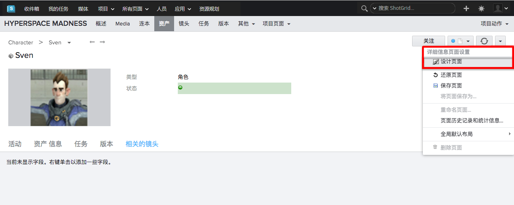

# 在您的第一个项目基础上更进一步

在本文中，我们将介绍使用  Desktop 创建并开始正常运行第一个项目之后该做些什么。其中包含相关的常见问题和主题，并列出了很多有用的文档资源。

# 欢迎使用 Toolkit

欢迎您使用 Toolkit！如果您正在阅读本文，说明您或许已经成功使用  Desktop 安装了第一个  Pipeline Toolkit 项目。

在这个阶段，我们希望您已经可以正常工作，并且像上面的屏幕截图一样，有一个项目页面和一些应用程序启动器。可以尝试着打开 Maya、Nuke 或其他任何应用程序。您应该会看到一个  菜单，其中包含更多用于管理文件和资产的功能。

那么，接下来该做些什么？Toolkit 在配置和工作方式上具有很大的灵活性。本文档将介绍一些我们建议您在使用  Desktop 创建并开始正常运行第一个项目之后执行的后续步骤。

# 基本配置

本节包含一系列参数调整和有用的配置内容。如果您刚刚设置好第一个 Toolkit 项目，很可能需要进行一些细微的调整才能让一切正常运行。本节将介绍这些不同的步骤。请注意，某些步骤需要编辑配置文件和执行一些“底层”操作。如果您对任何方面有任何疑问，请访问我们的[支持站点](https://knowledge.autodesk.com/zh-hans/contact-support)以获取帮助。

## 设置应用程序路径

当您设置好第一个项目并单击启动按钮启动 Maya、MotionBuilder 或 Nuke 时，可能会看到类似如下的错误消息：

在 Toolkit 项目配置中，我们会存储您可以启动的各种可执行文件的路径。如果出现上面的错误消息，很可能意味着这些路径与您的工作室设置不一致。您可能还会发现启动了错误的应用程序版本；例如，我们的默认配置使用的可能是 Maya 2015 的路径，但您的工作室运行的是 Maya 2014。这种情况下，您还需要更改这些路径。

在我们的默认配置中，这些路径全部存储在一个名为 `paths.yml` 的文件中。 要更改某个路径，需要在磁盘上找到您的项目配置，然后导航进入 config 文件夹，直至找到 `paths.yml` 文件：

打开此文件并对路径进行必要的更改。保存文件后，需要在  Desktop 内退出该项目，然后单击重新进入项目（但是不需要重新启动整个应用程序）。

**延伸阅读**

有关应用程序的详细信息，请查看以下主题：

- [Toolkit 应用程序启动器](https://support.shotgunsoftware.com/hc/zh-cn/articles/219032968)
- [传递命令行参数](https://support.shotgunsoftware.com/hc/zh-cn/articles/219032968#Use%20Command%20Line%20Arguments%20at%20Launch)

##  集成

Toolkit 与  集成，并通过向用户界面不同部分添加特殊的 Toolkit 动作菜单项来扩展传统界面：

这提供了一种方法来启动 Toolkit 应用程序或直接从  处理数据的自定义工具。有关与  站点集成的更多信息，请参见[“管理员手册”的“浏览器集成”部分](https://support.shotgunsoftware.com/hc/zh-cn/articles/115000067493#Browser%20Integration)。

## 向  用户界面添加发布

安装 Toolkit 后，通常有必要对  用户界面布局做一些细微的调整。在您发布文件时， Pipeline Toolkit 可创建_发布实体_，以便向关键资产（例如镜头和资产）添加_“发布”(Publishes)选项卡_。要执行此操作，请确保您以管理员用户身份登录。首先，导航到一个资产或镜头，然后进入_设计模式_：

现在单击其中一个选项卡上的小三角形菜单，然后选择 _“添加新选项卡”(Add New Tab)_ 动作。 这将打开一个对话框 UI。将选项卡命名为 _“发布”(Publishes)_，并确保它与已_发布文件_实体关联：

现在单击 _“保存”(Save)_ 保存更改。 这样就全部搞定了！

注意： 会选择几个默认字段，供您在创建新选项卡时添加。您可能想要针对发布添加一些额外的字段。为此，可以单击新的“发布”(Publishes)选项卡下电子表格右上角的小加号按钮。我们建议您添加下列字段：

- **说明(Description)** - 保存本发布中的变更说明
- **创建者(Created By)** - 创建发布的用户
- **创建日期(Date Created)** - 创建发布的日期

如果更改布局，之后请不要忘记保存页面！

## 多个操作系统

在某些情况下，您可能会看到一条弹出消息，提示您**找不到 Python**，并带有一个指向文档本节的链接。

Toolkit 使用一种名为 [Python](https://www.python.org/) 的语言来执行其脚本和功能。 Desktop 附带了一个完整的内置 Python 安装，因此您通常不需要考虑这一点。当您使用  Desktop 设置新的 Toolkit 项目时，项目默认会被设置为使用  Desktop 捆绑的 Python。但是，有时您可能需要明确指示 Toolkit 您想使用哪个 Python。例如，在下列情况下您需要这样做：

- 使用的是早期版本的  Desktop，不能自动设置所有 Python 默认设置。
- 您将  Desktop 安装在了磁盘上的非标准位置。
- 您运行的是手动的或更复杂的 Toolkit 项目设置。

Python 的路径存储在配置文件中，您可以手动编辑这些文件：

要找到正确的文件，首先导航到您的项目配置。在树视图中，查找以 `interpreter_` 开头的文件。 这些文件包含 Linux、Windows 和 Mac（“Darwin”）平台的 Python 解释器的路径。这些文件包含这三种操作系统各自的 Python 位置。您需要进入文件并手动添加要使用的任何操作系统的 Python 位置。

如果文件是空白的，表示您使用的是早期版本的  Desktop。如果是这样，只需尝试使用默认的 Python 路径更新这些空白文件即可。这些路径如下所示：

- Macosx (Darwin)： `/Applications/Shotgun.app/Contents/Frameworks/Python/bin/python`
- Windows： `C:\Program Files\Shotgun\Python\python.exe`
- Linux： `/opt/Shotgun/Python/bin/python`

如果您已将  Desktop 安装在非标准位置，或者打算使用自定义的 Python 位置，请确保文件中的路径指向有效的 Python 安装。此安装需要为 v2.6 或更高版本（但不能是 Python 3！）。如果您想执行基于用户界面的应用程序和工具，请确保您指定的 Python 已安装了 PyQt 或 PySide，并且已链接至 QT v4.6 或更高版本。

另外还要注意，为了能在多个操作系统上运行 Toolkit，在运行项目设置向导时，您需要指定所有需要的平台的路径。如果您尚未执行此操作，并且想要将其他操作系统添加到存储路径或配置位置，请访问我们的[支持站点](https://knowledge.autodesk.com/zh-hans/contact-support)以获取帮助。

# 后续步骤

至此，默认的  设置应该可以正常用于一个  项目（或测试项目）了。应用程序开始启动， 中开始显示上下文菜单动作和发布，您需要的所有操作系统平台一切运行正常。

下面这个小节主要介绍接下来要做些什么 -- 从默认配置开始，对它进行调整，使它更接近于您工作室工作流的其余环节。Toolkit 的灵活性和可配置程度很高，而且我们还有丰富的文档资源。但是在开始前，为了让您对实际操作一目了然，我们建议您花几分钟时间观看我们的各种介绍视频。这些视频演示了  Pipeline Toolkit 的实际运行，以及它在 Maya 和 Nuke 这类应用程序内部是如何工作的。视频还简要介绍了发布、版本控制、加载等基本概念。

[ Toolkit 视频合集](https://support.shotgunsoftware.com/hc/zh-cn/articles/219040678)

## Toolkit 项目剖析

创建新的 Toolkit 项目时，您最终将得到几个关键位置。

-  Desktop 及其配置已安装在您的本地计算机上（如果需要，可将应用程序和配置同时移至共享存储）。
- 数据区域是 Toolkit 项目存储纹理、文件、渲染等内容的地方。这通常是一个共享存储，因为您需要与其他用户共享这些数据，但是此规则也有例外；用户工作区可存储在本地（仅限用户）存储中，集成（例如 Perforce 集成）则使用外部系统帮助分发内容。
- Toolkit 配置是一个完全自包含的数据包，包括代码、应用、核心 API 等。这些数据通常存储在共享存储上，方便所有用户轻松访问配置。

您在磁盘上的项目配置包含几个不同的项。

在下面这些小节中，我们将带您了解项目配置文件夹的不同部分。

### 命令行访问

除了使用  Desktop，您还可以通过终端或 Shell 访问 Toolkit。您在磁盘上创建的每个项目都附带一个特殊的 `tank` 命令，它让您可基于命令行访问许多功能，包括发起 API 会话和启动应用程序。

如果您导航到自己的项目配置，可以在配置的根目录看到 `tank` 和 `tank.bat` 命令。 运行这些命令时，如果不带任何选项，将生成当前配置支持的所有命令的列表，包括以下实用命令：

- `tank shell` - 启动一个提供 TK API 访问功能的交互式 Python Shell
- `tank core` - 检查此项目是否有任何可用的核心 API 更新
- `tank updates` - 检查此配置中是否有任何应用或插件有任何更新可用

有关 `tank` 命令用途的更多详细信息，请参见以下深入的技术文档：

[如何管理 Toolkit](https://support.shotgunsoftware.com/hc/zh-cn/articles/219033178)

### 主要配置文件

`config` 文件夹包含一些主要配置文件。

Toolkit 附带一个文件夹创建系统，它会尝试自动在磁盘上创建文件夹，确保当您启动应用程序时，所有必要的结构在磁盘上都存在，并且已事先准备就绪！这方面的配置可在上面所示的 `schema` 文件夹中找到。

另外要与此相提并论的是 Toolkit 的_模板系统_，它让您可轻松定义各种可配置的文件、发布内容、工作文件、渲染等的路径。 模板存储在上面的 `templates.yml` 文件中。

结合运用项目配置的这两个部分，可以调整 Toolkit 使用的各种应用，让它们将数据写出到您的现有工作流可以识别的磁盘位置。

请参阅我们的高级文档了解这方面的更多信息：

- [文件夹配置](https://support.shotgunsoftware.com/hc/zh-cn/articles/219033178#Creating%20folders%20on%20disk%20with%20Sgtk)
- [文件系统模板](https://support.shotgunsoftware.com/hc/zh-cn/articles/219033178#Configuring%20Templates)

Toolkit 配置本质上由一系列已配置的**应用和插件**组成。 此配置位于 `env` 文件夹中。 如果说上面讨论的文件系统配置文件定义了资源在磁盘上应该“位于_何处_”，那么环境配置及其应用和插件则定义了工作流应该执行“_什么_操作”。

### 核心 API 平台

每个项目配置都使用一系列应用和插件。这些应用和插件的配置存储在配置内的 `env` 文件夹中。 Toolkit 随后会自动下载和管理运行这些应用和插件所需的各种版本的代码。这些代码放在 `install` 文件夹内。

配置、应用和插件都在 Toolkit 核心平台之上运行。对于新项目，这些数据也存储在 `install` 文件夹内。 本质上讲，项目配置是完全自包含的 - 运行 Toolkit 必需的所有必要组件都位于一处。这也意味着每个项目都是独立的，更新一个项目不会打断另一个项目。

技术说明：使用共享的 Toolkit 核心（单击此处展开）

### 延伸阅读

我们还有一份技术性更强的文档，从头到尾介绍了  Pipeline Toolkit 中的高级概念，并讲解了一些更宏观的东西。当您能够很好掌握 Toolkit 的常规用法后，我们建议您继续阅读此文档，更深入地了解可以怎样调整 Toolkit 来满足您工作室的特殊需求。

[ Toolkit 高级概念简介](https://support.shotgunsoftware.com/hc/zh-cn/articles/219040648)

## Toolkit 社区

Toolkit 有一个不可或缺的部分，那就是汇集了众多工作流工程师和技术主管的社区！我们的使命是打造一个充满活力、代码共享的社区。在这里，大家可以群策群力，共同帮助 Toolkit 不断发展成为一个强大并且灵活的工作流环境。

如果您有任何疑问，或者想阅读现有的帖子和话题，请访问我们的[公共论坛版块](https://support.shotgunsoftware.com/hc/zh-cn/community/topics/200682428)。

