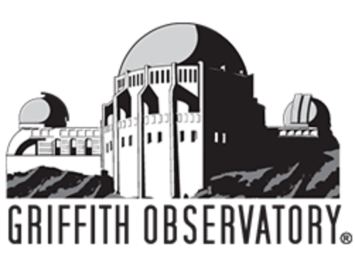

# 社区共享集成

下面是 Toolkit 社区人员热心分享的项目。它们不是由  内部人员编写的，因此我们无法做出保证，但我们一定会回答我们可以回答的任何问题。如果您有要添加到列表的项目，请访问我们的[支持站点](https://www.autodesk.com.cn/support/contact-support)以获取帮助。

### 插件

----------

| 集成 | 插件 | 信息 |
|:-----------:|:------:| ----------- |
| |  **tk-katana**  | 项目 URL：[https://github.com/robblau/tk-katana](https://github.com/robblau/tk-katana)  项目贡献者：[Lightchaser Animation](https://github.com/LightChaserAnimationStudio)  项目维护者：   项目说明：适用于 Foundry Katana 的  插件   |
| | **tk-unreal** | 项目 URL：[https://docs.unrealengine.com/4.26/zh-CN/ProductionPipelines/UsingUnrealEnginewithAutodeskShotgun/](https://docs.unrealengine.com/4.26/zh-CN/ProductionPipelines/UsingUnrealEnginewithAutodeskShotgun/)  项目贡献者：[Epic Games](https://epicgames.com/)  项目维护者：  项目说明：适用于 [Unreal Engine](https://www.unrealengine.com/zh-CN/) 的  插件 |
| |  **tk-substancepainter** | 项目 URL：[https://github.com/diegogarciahuerta/tk-substancepainter](https://github.com/diegogarciahuerta/tk-substancepainter)  项目贡献者：[Factor64](https://www.factor64.com/)  项目维护者：[Diego Garcia Huerta](https://www.linkedin.com/in/diegogh/)  项目说明：适用于 Adobe Substance Painter 的  插件 |
| |  **tk-substancedesigner**  | 项目 URL：[https://github.com/diegogarciahuerta/tk-substancedesigner](https://github.com/diegogarciahuerta/tk-substancedesigner)    项目贡献者：[Factor64](https://www.factor64.com/)    项目维护者：[Diego Garcia Huerta](https://www.linkedin.com/in/diegogh/)    项目说明：适用于 Adobe Substance Designer 的  插件     详细信息：[ 社区论坛](https://community.shotgridsoftware.com/t/substance-designer-shotgun-toolkit-engine-released/9944)|
| |  **tk-modo**  | 项目 URL：[https://github.com/tremolo/tk-modo](https://github.com/tremolo/tk-modo)    项目贡献者：Lutz Pälike 和 [Walking The Dog](https://www.walkingthedog.be/)    项目维护者：    项目说明：适用于 Foundry Modo 的  插件 |
| |  **tk-clarisse** | 项目 URL：[https://github.com/diegogarciahuerta/tk-clarisse](https://github.com/diegogarciahuerta/tk-clarisse)  项目贡献者：[Factor64](https://www.factor64.com/)  项目维护者：[Diego Garcia Huerta](https://www.linkedin.com/in/diegogh/)  项目说明：适用于 [Clarisse iFX](https://www.isotropix.com/products) 的  插件。Clarisse iFX 是一款完全交互式 CG 工具组合，用于布景、外观开发、照明和渲染。 |
| |  **tk-natron** | 项目 URL：[https://github.com/diegogarciahuerta/tk-natron](https://github.com/diegogarciahuerta/tk-natron)  项目贡献者：[Factor64](https://www.factor64.com/)  项目维护者：[Diego Garcia Huerta](https://www.linkedin.com/in/diegogh/)  项目说明：适用于 [Natron](https://natrongithub.github.io/) 的  插件。Natron 是一款基于节点的免费开源软件应用程序。 |
| |  **tk-harmony** | 项目 URL：[https://github.com/diegogarciahuerta/tk-harmony](https://github.com/diegogarciahuerta/tk-harmony)  项目贡献者：[Factor64](https://www.factor64.com/)  项目维护者：[Diego Garcia Huerta](https://www.linkedin.com/in/diegogh/)  项目说明：适用于 [Toon Boom Harmony](https://www.toonboom.com/products/harmony) 的  插件。Toon Boom Harmony 是行业领先的动画制作软件。|
| |  **tk-cinema** | 项目 URL：[https://github.com/mikedatsik/tk-cinema](https://github.com/mikedatsik/tk-cinema)  项目贡献者：Mykhailo Datsyk   项目维护者：Mykhailo Datsyk   项目说明：适用于 [Maxon Cinema 4D](https://www.maxon.net/en-us/products/cinema-4d/overview/) 的  插件。Maxon Cinema 4D 是一款适合设计师使用的建模、动画和渲染工具组合。  详细信息：[ 社区论坛](https://community.shotgridsoftware.com/t/shotgun-toolkit-engine-for-maxon-cinema-4d/6437)| 
| |  **tk-krita** | 项目 URL：[https://github.com/diegogarciahuerta/tk-krita](https://github.com/diegogarciahuerta/tk-krita)  项目贡献者：[Factor64](https://www.factor64.com/)  项目维护者：[Diego Garcia Huerta](https://www.linkedin.com/in/diegogh/)  项目说明：适用于 [Krita](https://krita.org/en/) 的  插件。Krita 是一款免费的开源光栅图形编辑器，主要用于数字绘画和二维动画制作。  详细信息：[ 社区论坛](https://community.shotgridsoftware.com/t/krita-shotgun-toolkit-engine-released/8724) |
| |  **tk-blender** | 项目 URL：[https://github.com/diegogarciahuerta/tk-blender](https://github.com/diegogarciahuerta/tk-blender)  项目贡献者：[Factor64](https://www.factor64.com/)  项目维护者：[Diego Garcia Huerta](https://www.linkedin.com/in/diegogh/)  项目说明：适用于 [Blender](https://www.blender.org/) 的  插件。Blender 是一款免费的开源三维计算机图形软件工具组合，用于创建动画电影、视觉特效、艺术作品、3D 打印模型、运动图形、交互式三维应用程序、虚拟现实和计算机游戏。  详细信息：[ 社区论坛](https://community.shotgridsoftware.com/t/blender-shotgun-toolkit-engine-released/10773)|

### 应用

----------

| 集成 | 插件 | 信息 |
|:-----------:|:------:| ----------- |
| | **tk-maya-playblast** | 项目 URL：[https://github.com/basestudio/tk-maya-playblast](https://github.com/basestudio/tk-maya-playblast)    项目贡献者：[BASE Studio](https://github.com/basestudio)    项目维护者：    项目说明：用于从 Maya 发布播放预览的应用。请参见 [https://goo.gl/5oJTv0](https://goo.gl/5oJTv0)|
| | **tk-multi-renderfarm**  | 项目 URL：[https://github.com/baitstudio/tk-multi-renderfarm](https://github.com/baitstudio/tk-multi-renderfarm)    项目贡献者：[Bait Studio](https://www.baitstudio.com/)    项目维护者：    项目说明：用于向场提交作品的应用。请参见 [https://goo.gl/ew6mkD](https://goo.gl/ew6mkD) |
| | **tk-shotgun-publishrenders**  | 项目 URL：[https://github.com/janimation/tk-shotgun-publishrenders](https://github.com/janimation/tk-shotgun-publishrenders)    项目贡献者：    项目维护者：[Dave Sisk](mailto:dave@janimation.com)    项目说明：此应用用于搜索项目的目录结构，以查找现有的已发布文件或文件序列，然后在  中将其注册为已发布的文件（如果已发布的文件对象尚不存在）。 |
| | **nuke-getShotgunData**  | 项目 URL：[https://github.com/RicardoMusch/nuke-getShotgunData](https://github.com/RicardoMusch/nuke-getShotgunData)    项目贡献者：[Ricardo Musch](https://www.ricardo-musch.com/)    项目维护者：Ricardo Musch     项目说明：将  数据导入 NUKE 文本节点可能会有点困难。此节点可用于将此信息通过管道传递到场记板、场景信息覆层或其他任何地方。  |
| | **sb-shotgun-schema-introspection**  | 项目 URL：[https://github.com/scottb08/sb-shotgun-schema-introspection](https://github.com/scottb08/sb-shotgun-schema-introspection)    项目贡献者：[Scott Ballard](https://www.linkedin.com/in/scottballard/)    项目维护者：Scott Ballard     项目说明：这是一个简单的 Toolkit 应用，支持  和 Toolkit 开发人员快速导航和检查  实体、字段和基础模式。 |
| | **foto-multi-namingconvention**  | 项目 URL：[https://github.com/scottb08/foto-multi-namingconvention](https://github.com/scottb08/foto-multi-namingconvention)    项目贡献者：[Griffith Observatory](https://www.griffithobservatory.org/)    项目维护者：[Scott Ballard](https://www.linkedin.com/in/scottballard/)    项目说明：这是一个简单的 Toolkit 应用，支持  和 Toolkit 开发人员快速导航和检查  实体、字段和基础模式。 |
| | **tk-cpenv**  | 项目 URL：[https://github.com/cpenv/tk-cpenv](https://github.com/cpenv/tk-cpenv)    项目贡献者：[Dan Bradham](https://github.com/danbradham)    项目维护者：[Dan Bradham](https://github.com/danbradham)    项目说明：此应用添加了对 [cpenv](https://github.com/cpenv/cpenv) 的支持，cpenv 工具使用模块来管理软件插件、项目依存关系和环境变量。    详细信息：[ 社区论坛](https://community.shotgridsoftware.com/t/rez-support/7350/7) |
| | **rtm-tk-hiero-shotgunDropper**  | 项目 URL：[https://github.com/RicardoMusch/rtm-tk-hiero-shotgunDropper](https://github.com/RicardoMusch/rtm-tk-hiero-shotgunDropper)  项目贡献者：[Ricardo Musch](https://www.ricardo-musch.com/)  项目维护者：Ricardo Musch   项目说明：此应用允许您将版本和播放列表从  拖放到 Hiero 中。  详细信息：[ 社区论坛](https://community.shotgridsoftware.com/t/release-shotgundropper-for-hiero/4183) |
