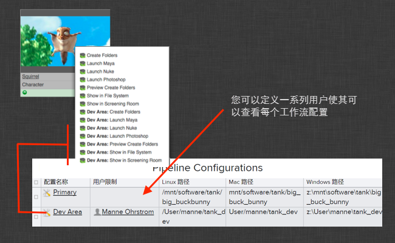

# 配置临时沙盒和推行应用

本文档介绍了有关如何安全地将更改应用于您的生产工作流的最佳实践。说明了如何创建临时沙盒（这是您的生产配置的副本）、更新此沙盒及进行测试，最后将更改推送至生产配置。

_请注意，本文档介绍仅当控制 Toolkit 配置时可用的功能。有关默认设置，请参见 [ 集成管理员手册](https://support.shotgunsoftware.com/hc/zh-cn/articles/115000067493)。_

# 简介

本文档概括介绍了如何管理您的 Toolkit 配置。Toolkit 包含几个实用程序和工具，让您可安全地管理配置，并在安全的沙盒环境中测试升级和更改，然后再将它们部署到整个生产环境。

在本文档中，我们将介绍如何：

- 安全地升级 Toolkit 核心 API。
- 升级应用和插件。
- 使用各种方法管理多个项目的配置。
- 使用 Toolkit 的“克隆”和“推送”功能____，在不中断生产的情况下安全地测试升级和更改。
- 使用 `git` 源代码管理系统和 Toolkit。

# 配置管理的基础知识

每个 Toolkit 项目都关联了一个或多个配置。配置包含项目所需的所有设置，包括文件系统位置（模板）、插件、应用等。在 Toolkit 中，每个项目都可以单独进行配置。也就是说，不同的项目可以和平共处：升级一个项目不会影响另一个项目。

如果您有大量项目要处理，这样可能会比较麻烦，因此我们提供了几种方法，让配置过程变得轻松、安全、简单。

在  中，每个项目都有多个**工作流配置**。首次使用 Toolkit 设置项目时，会创建一个名为 `primary` 的工作流配置。  中的工作流配置实体将指向一个磁盘位置，Toolkit 的配置将位于此处。

在项目期间，经常需要更改配置。您可能会调整配置，也可能需要添加另外的应用或插件。我们也会经常发布新的应用版本，并建议您尽可能使用最新版本。

尽管可以直接升级项目的_主_配置，但这样做可能会有风险：因为参与项目的每个人都使用此配置，一旦出现问题，就会影响所有人。更好的做法是创建一个孤立的配置版本，让指定的一组人员可以访问它。在这个安全的环境中，无论进行升级、配置更改还是开发，都不会影响其余的生产环境。更改通过测试后，便可以安全放心地将它们推送到主配置。

我们将这个过程称为“克隆”__，它相当于为主配置创建一个只有您自己（以及您邀请的其他人）才能访问的个人副本。 在这个副本中，您可以安全地进行更改，直到满意为止，然后可以将这些更改推送回主配置。

## 克隆您的配置

设置好 Toolkit 并配置项目后，整个设置看起来将如下所示：


设置中有一个工作室安装 (_studio_)，其中容纳着所有项目的核心 API。 此 _studio_ 位置中还包含一个 `tank` 命令和一个 Toolkit Python API，您可以使用该 API 访问任何启用了 Toolkit 的  项目。

除此以外，每个项目还有一个配置文件夹。此文件夹包含该项目的所有设置。此外，它还包含一个专门用来操作此配置的 `tank` 命令（和一个 Python API）。使用此 `tank` 命令或 API 代码时，只能操作此配置。

设置新项目后，会创建一个主配置。__ 这是 Toolkit 默认将为项目使用的配置。除了主配置以外，您还可以为项目创建另外的配置。这些配置可以并存，并且当您想单独测试某些修改、升级某些应用或在不影响整个团队的情况下进行开发时，这些配置会很有用。除主配置以外的其他配置由一个称为“克隆”的过程创建，__这个过程会将配置复制到一个新位置。

克隆完配置后，您的设置看起来可能如下所示：


此时，除了工作室级的 `tank` 命令和项目主配置的 `tank` 命令以外，您还有了一个新的工作流配置，它也有自己的 `tank` 命令。 如果您运行此 `tank` 命令，将对临时沙盒中的配置进行独占操作。 因此，如果您想在 Maya 中测试某些新功能，只要导航到克隆的沙盒，运行 `./tank Shot xyz launch_maya`，Maya 中显示的  菜单便会反映临时沙盒内的配置，而不是主配置。

注意，工作室级的 `tank` 命令始终使用主配置。因此，访问克隆配置的唯一方法是导航到克隆配置所在的位置，然后使用该文件夹中的 `tank` 命令。 在  中，您可以向一个工作流配置项分配一组特定的用户，任何与某个配置关联的用户不仅能看到主配置中的菜单项，还能看到该配置的菜单项：



### 创建克隆配置

要创建可以安全测试升级的临时沙盒，请在  中导航到您项目的工作流配置，然后在主配置上单击鼠标右键。此时将显示一个克隆配置的选项：


单击此选项后，将显示一个对话框，让您指定新配置在磁盘上的路径。如果您的设置运行多个操作系统，请确保输入所有相关平台的路径。


按“确定”(OK)后，Toolkit 将复制配置并设置克隆。它还会将您的  用户与此配置关联，因此创建克隆后，您立刻就会在  内看到新的菜单项。

### 将更改从临时沙盒推送到主配置

应用相关更新并运行了任何必要的测试之后，您可以执行 `tank push_configuration` 命令，将更改推送回生产配置。 此操作会将您在临时沙盒中所做的更改全部传输到主配置。

请注意，当您运行 `push_configuration` 命令时，当前配置将被移至一个备份位置。如果您意外地进行了推送或推送出现问题，只需将 backup 文件夹中的内容复制到 config 文件夹，即可轻松回退。

默认情况下，此命令会将一系列文件复制到目标工作流配置中的 `config` 文件夹。 如果您使用的是 Unix 系统，想进行更加原子式的更新，可以向 `push_configuration` 命令添加一个 `--symlink` 标志。 这会将目标工作流配置中的 `config` 文件夹变成一个符号链接，让升级变得更容易，并且不会出现当前运行的会话中配置不匹配的风险。

### 刷新旧的克隆配置

如果您有一个旧的开发沙盒或过时的临时沙盒设置，现在需要将它的内容与最新的生产配置同步，可以为主配置运行 `push_configuration` 命令来进行同步。
```shell
tank push_configuration

Welcome to the  Pipeline Toolkit!
For documentation, see https://support.shotgunsoftware.com
Starting Toolkit for your current directory '/tmp'
- Using configuration 'Primary' and Core v0.14.52
- Setting the Context to Empty Context.
- Running command push_configuration...

----------------------------------------------------------------------
Command: Push configuration
----------------------------------------------------------------------

This command will push the configuration in the current pipeline configuration
('Primary') to another pipeline configuration in the project.

Your existing configuration will be backed up.

The following pipeline configurations are available to push to:
 - [324] Staging Sandbox (/my/staging/sandbox)

Please type in the id of the configuration to push to (ENTER to exit): 324
Hold on, pushing config...
Checking if there are any apps that need downloading...
Push Complete!

Your old configuration has been backed up into the following folder:
/my/staging/sandbox/config.bak.20140108_093218
```
请注意我们如何从项目主配置向临时沙盒推送内容。我们的做法是运行__主配置的 `tank` 命令。 如果您有多个沙盒设置，也可以在这些沙盒之间推送数据。

### 删除克隆配置

如果想删除克隆配置，只需在  中删除条目，然后从磁盘上移除对应的文件夹即可。

## 获取最新的应用和插件

在临时沙盒内（或其他任何配置中），您可以运行 `tank updates` 命令来检查是否有任何可用的应用更新。 此命令提供基本的过滤器，如果您只想检查配置的某些区域，可以使用这些过滤器：

```shell
----------------------------------------------------------------------
Command: Updates
----------------------------------------------------------------------

This command will go through your current configuration and check if there are
any updates available. If there are updates, you will be asked if you want to
perform an upgrade. If settings has been added to the new version that you are
installing, you may be prompted to specified values for these.

Running this command with no parameters will check all environments, engines
and app. This may take a long time. You can also run the updater on a subset
of your installed apps and engines.

General syntax:
> tank updates [environment_name] [engine_name] [app_name]

The special keyword ALL can be used to denote all items in a category.

Examples:

Check everything:
> tank updates

Check the Shot environment:
> tank updates Shot

Check all maya apps in all environments:
> tank updates ALL tk-maya

Check all maya apps in the Shot environment:
> tank updates Shot tk-maya

Make sure the loader app is up to date everywhere:
> tank updates ALL ALL tk-multi-loader

Make sure the loader app is up to date in maya:
> tank updates ALL tk-maya tk-multi-loader
```
## 升级 Toolkit 核心 API

本节介绍可以怎样使用克隆临时沙盒配置来安全地升级 Toolkit 核心 API。如果您还没有准备好临时沙盒，只要按照上节的说明操作即可！

如果您的临时沙盒克隆自某个使用[共享工作室核心 API](https://support.shotgunsoftware.com/hc/zh-cn/articles/219040448) 的工作流配置，您需要升级沙盒，让它使用自己独有的核心 API 代码。我们将这个过程称为对核心进行“本地化”，您可以导航到您的临时沙盒并运行 `tank localize` 来执行此操作。 此命令会将工作室安装中的核心 API 复制到您的沙盒，以便稍后可以运行和测试不同版本的核心 API。

_Toolkit 的默认行为是默认对核心进行本地化。如果您之前未显式创建过共享的工作室核心，可以有把握地认为您的核心已经本地化。_
```shell
cd /my/staging/sandbox
./tank localize

Welcome to the  Pipeline Toolkit!
For documentation, see https://support.shotgunsoftware.com
Starting Toolkit for your current directory '/my/staging/sandbox'
- Using configuration 'Staging Sandbox' and Core v0.14.52
- Setting the Context to Empty Context.
- Running command localize...

----------------------------------------------------------------------
Command: Localize
----------------------------------------------------------------------

This will copy the Core API in /mnt/software/shotgun/studio into the Pipeline
configuration /my/staging/sandbox.

Do you want to proceed [yn]y

Localizing Core: /mnt/software/shotgun/studio/install/core -> /my/staging/sandbox/install/core
Copying Core Configuration Files...
Localizing Apps: /mnt/software/shotgun/studio/install/apps -> /my/staging/sandbox/install/apps
Localizing Engines: /mnt/software/shotgun/studio/install/engines -> /my/staging/sandbox/install/engines
Localizing Frameworks: /mnt/software/shotgun/studio/install/frameworks -> /my/staging/sandbox/install/frameworks
The Core API was successfully localized.

Localize complete! This pipeline configuration now has an independent API.
If you upgrade the API for this configuration (using the 'tank core' command),
no other configurations or projects will be affected.
```
此时，我们已不再共享工作室位置的核心 API，而是运行我们自己的独立版本。接下来，我们可以继续再次使用本地 tank 命令执行标准的核心 API 升级：
```shell
cd /my/staging/sandbox
./tank core
```
Toolkit 将检查是否有新版本可用，并让您下载并安装它。

更新核心 API 之后，请务必对安装进行测试。使用沙盒中的 `tank` 命令或使用  中专门的菜单项启动一些应用。从头至尾对您的工作流进行基本调试，并执行您认为必要的测试。

最后，待测试结果满意后，便可继续更新核心 API 的工作室版本。请注意，在典型的 Toolkit 设置中，所有项目共享核心 API，因此从工作室位置的 `tank` 命令运行 `tank core` 命令，即可为所有项目更新核心 API。

# 管理项目生命周期

每个 Toolkit 项目都包含一个独立的配置，用来容纳该项目的所有设置。如果您管理着大量项目，意味着您需要管理大量配置。为此，Toolkit 包含多种不同的配置处理工具和方法，它们同时适用于单个项目和工作室的生命周期及配置发展。本节概括介绍其中一些最佳实践，并说明有关设置配置的实际步骤。

取决于工作室的需要，复杂程度可能会有所不同。Toolkit 提供三种不同的方法，下面我们将逐一详细介绍它们：

- 最直接的方法是在设置新项目时复制之前项目的配置。这种方法非常适合项目量不大的小型工作室。
- 如果您的项目处理量更大，并且会同时运行多个项目，我们推荐的更深一层集成是使用 `git` 版本控制系统。Toolkit 原生支持 Git。当您设置完毕并开始运行基于 Git 的工作流后，工作室只有一个配置，您可以跟踪一段时间内对该配置所做的所有更改。每个项目都可以根据需要导入配置更改。
- 如果您运营的设施规模较大，或许可以考虑将一个配置直接连接到工作室中当前处于活动状态的所有项目。对这个配置进行的任何更改，都将立即应用于所有项目。

在下面的小节中，我们将详细介绍这几种不同的方法。

## 继承之前项目的配置

这是最简单的配置管理方法。首次使用 Toolkit 设置项目时，您会下载我们的默认配置。然后，根据自己的工作流设置、文件系统位置等建立第一个项目。项目开始运行后，您会运行诸如 `tank updates` 等命令，更新正在运行的应用版本。

等到建立第二个项目时，您不用再从默认配置重新开始，可以在项目设置阶段选取第一个项目的配置作为新项目的初始配置。也就是说，您对第一个项目所做的所有更改、调整和改进，也将为第二个项目所用。同样，第三个项目可以使用第二个项目的配置等。


这是让配置随时间逐步发展的一个非常简单的方法。所做的更改和改进将即时在项目之间传播。第一次运行 `setup_project` 命令时，只需在设置过程提示您选择要使用的配置时按 Enter 即可。这将下载并安装默认配置。

设置第二个项目时，您将看到之前项目的配置路径列表。选择其中一个路径，当设置过程提示输入配置时，输入此路径。这会将相应的配置复制到新项目：
```
Welcome to the  Pipeline Toolkit!
For documentation, see https://support.shotgunsoftware.com
- Running command setup_project...

----------------------------------------------------------------------
Command: Setup project
----------------------------------------------------------------------

Welcome to the  Pipeline Toolkit Project Setup!

Connecting to ...
Connecting to the App Store...

------------------------------------------------------------------
Which configuration would you like to associate with this project?

You can use the configuration from an existing project as a template for this
new project. All settings, apps and folder configuration settings will be
copied over to your new project. The following configurations were found:

   My very first project: '/mnt/software/shotgun/first_project/config'

If you want to use any of the configs listed about for your new project, just
type in its path when prompted below.

You can use the Default Configuration for your new project.  The default
configuration is a good sample config, demonstrating a typical basic setup of
the  Pipeline Toolkit using the latest apps and engines. This will be
used by default if you just hit enter below.

If you have a configuration stored somewhere on disk, you can enter the path
to this config and it will be used for the new project.

You can also enter an url pointing to a git repository. Toolkit will then
clone this repository and base the config on its content.

[tk-config-default]: /mnt/software/shotgun/first_project/config
```
## 在 Git 源代码管理系统中创建工作室配置

第一种方法有一定的局限性，其中一点是项目实际上不是彼此相连。假设您有 10 个项目，当发布了某个重大错误修复时，您需要更新所有项目，这时必须手动操作每个项目并运行 `tank updates` 命令。

解决此问题的一个办法是创建一个主配置，并将它存储在 Git 源代码管理系统中。每当您创建新项目时，只需在设置项目对话框中键入此 Git 库的路径，Toolkit 便会克隆相应内容。这样，所有项目便会连接至同一个工作室主配置。如果您对某个项目配置做了一些不错的更改，可以提交这些更改，并将它们推送至工作室主配置。其他项目随后便可轻松 Pull 这些更改。另外，您还会得到通过 Git 进行的所有更改的历史记录。

    Git 是什么？


基本思路是建立一个用来容纳 Git 配置的 Git 库。每次运行 `tank setup_project` 时，您指定此库的 Git URL（例如 `username@someserver.com:/studio_config.git`），设置过程便会克隆该库，这样新项目就成为一个与主工作室库相连的库。它们相连后，您可以使用 Push 和 Pull 命令推送和调取更改，并可使用分支进行更精细的控制。

### 设置工作室配置库

在执行其他操作前，您需要先创建一个工作室配置库。本节介绍如何利用现有的 Toolkit 配置创建一个 Git 库。

首先，您需要转至您的 Git 服务器并创建一个库。此过程可能会因您的设置而异。如果您使用的是类似 GitHub 的站点，需要启动 Web 浏览器并导航至 github.com。如果您有权访问服务器，可以执行类似 `git init --bare` 这样的操作。 在我们的示例中，假设您创建的 Git 库称为 `username@someserver.com:/studio_config.git`。

接下来，将用来为库提供种子的项目的 `config` 文件夹复制到一个 `config.bak` 位置：
```shell
cd /project_configs/studio_config
mv config config.bak
```
将经过初始化的 Git 库克隆到工作室配置要基于的项目的 `config` 位置。 运行克隆命令后，将得到一个同样是 Git 库的空白 `config folder`：
```shell
cd /project_configs/studio_config
git clone username@someserver.com:/studio_config.git config
```
将 `config.bak` 位置的所有文件复制到 `config` 文件夹。复制完毕后，可以删除空的 `config.bak` 文件夹。这时，您的配置文件已位于 Git 库内，我们需要添加、提交并将它们推送至服务器。但是在执行这些操作前，我们还要做些扫尾工作，正确处理一些 Toolkit 系统文件。在 `config` 文件夹中，创建一个 `.gitignore` 文件，并向其中添加以下几行内容：
```shell
install_location.yml
pipeline_configuration.yml
```

这样，Git 将忽略这两个系统文件。我们可以继续在配置中添加其余文件，提交它们，然后将它们推送到工作室库。

```shell
git add --all
git commit -am "initial commit of our studio config!"
git push
```
### 从 Git 创建新项目

当您创建新项目时，只需在设置过程提示您输入要使用的配置的路径时，指定一个有效的 Git URL 即可。按照上面的示例，我们将输入 `username@someserver.com:/studio_config.git`。作为项目设置过程的一部分，Toolkit 会将此库克隆到您的新项目配置的 `config` 文件夹。这意味着，稍后您可以转到此 config 文件夹运行 Git 命令。请注意，任何克隆的工作流配置也会克隆该 Git 库，并将无缝工作。

### 对项目进行更改

每次更改主配置后，您可以直接转到 `config` 文件夹，然后运行 `git diff`、`git commit` 和 `git push`。这会将您的更改推送到克隆您的项目配置所依据的工作室配置。

### 更新项目以获取最新版本

另外，如果您使用一些更改更新过您的工作室级配置，现在想将这些更改下载到项目中，只需转到 `config` 文件夹并运行 `git pull` 即可。  **重要提示**：请注意，完成此操作后务必运行 `tank cache_apps`，以确保系统中存在您更改的配置所需的所有应用版本！

### Git 高级用法：分支

创建新项目时，Toolkit 的默认行为是完成一次简单的克隆操作。项目将使用 Git 的 `master` 分支。要进行更高级的设置，例如当您想将项目的某些配置更改保密、不想与其他项目共享这些更改时，可以在创建项目后建立一个 Git 分支。然后，将更改提交到此分支。您要推送到工作室配置的更改可以与项目的本地 master 分支合并，然后再进行推送。

### Git 高级用法：批量部署

Toolkit 通过工作流配置实体保留了  站点所有不同配置的列表，因此我们可以迭代处理此列表，为每个列表项执行 `git pull` 命令，这实际上相当于对所有项目运行批量更新。此功能目前并未纳入到 Toolkit 中，但可以使用 Python 和  Python API 编写相应的脚本。

## 使用包含文件的全局配置

上面基于 Git 的方法处理的是通过 Git 相连的独立项目配置：更新不会自动体现在所有项目中，用户必须执行 Pull 和 Push 操作来提取和推送更新。

而对于完全集中式的配置，配置真正位于一处，一个更改会立即反映到一组项目。这种情况下，您需要使用 Toolkit 配置中的 `@include` 功能。 此功能让您可以创建引用，将每个项目配置指向一个存储实际配置的中央位置。


使用 `@include` 语法可将多个文件串联在一起。 例如，如果您有一个 `/tmp/stuff.yml` 文件，其中包含以下内容：
```
# paths to maya
maya_windows: 'C:\Program  Files\Autodesk\Maya2012\bin\maya.exe'
maya_mac: '/Applications/Autodesk/maya2012/Maya.app'
maya_linux: 'maya'

# a configured toolkit app
file_manager:
  allow_task_creation: true
  file_extensions: []
  hook_copy_file: default
  hook_filter_publishes: default
  hook_filter_work_files: default
  hook_scene_operation: default
  launch_at_startup: false
  launch_change_work_area_at_startup: false
  location: {name: tk-multi-workfiles, type: app_store, version: v0.4.8}
  saveas_default_name: scene
  saveas_prefer_version_up: false
  sg_entity_type_filters: {}
  sg_entity_types: [Shot, Asset]
  task_extra_display_fields: []
  template_publish: null
  template_publish_area: null
  template_work: null
  template_work_area: null
```
如上所述，您可以在几个不同级别创建包含定义 - 在上面的例子中，我们有一个应用定义和三个字符串值。接下来，我们可以从一个环境文件引用这些对象：
```
includes: ['/tmp/stuff.yml']

engines:

  tk-maya:

    # First all our app definitions
    apps:
        # normally, we would have the entire set of configuration parameters at this point.
        # because we are using an include, we can reference an entire sub-section of configuration
        # using the @ keyword:
        tk-multi-workfiles: '@file_manager'

        # alternatively, for simple values, we can use them as parameter values for apps:
        tk-maya-launcher:
          mac_path: '@maya_mac'
          linux_path: '@maya_linux'
          windows_path: '@maya_windows'
          location: {name: tk-multi-launchapp, type: app_store, version: v0.2.19}

    # and after the apps section follows specific configuration options for the engine
    location: {name: tk-maya, type: app_store, version: v0.4.1}
    menu_favourites:
    - {app_instance: tk-multi-workfiles, name:  File Manager...}
    template_project: null
    use_sgtk_as_menu_name: false
```
此外，您可以逐个读入几个包含文件。如果两个不同的文件中存在相同的包含定义，将优先使用最新读取的文件。我们可以扩展上面的示例环境：
```
includes:

    # first include a global config file which contains all the studio level app definitions
    - '/studio/configurations/studio_apps.yml'

    # now we can include an include containing overrides, for example based on project type.
    # if the global config contains an entry named file_manager and the vfx_apps.yml contains
    # the same, the vfx_apps definition will be used.
    - '/studio/configurations/vfx_apps.yml'

engines:

  tk-maya:    
    apps:
        tk-multi-workfiles: '@file_manager'

    location: {name: tk-maya, type: app_store, version: v0.4.1}
    use_sgtk_as_menu_name: false
```
使用刚刚介绍的方法，可以得到一组工作室默认值，这些默认值可被项目类型默认值改写，而后者又可以被特定的项目设置改写。您既可以如上面示例中所示，在应用一级使用此功能，也可以如下节中所示，在插件一级使用此功能。

### 设置全局配置的最佳实践

设置全局配置的方法有多种。我们建议的最佳做法是按插件对配置进行细分。每个环境文件完全空白，并引用在单独的文件中定义的插件（和应用）。这样便于逐个插件地调整和重新配置设置。

每个包含文件均采用标准形式，以插件的名称命名。例如，如果您有一个 Maya 插件，包含文件将只包含该插件和它的应用。其顶层项直接命名为 `maya`：
```yaml
maya:
    apps:
      tk-maya-breakdown:
        hook_multi_update: default
        hook_scan_scene: default
        location: {name: tk-maya-breakdown, type: app_store, version: v0.2.13}
      tk-multi-loader2:
        action_mappings:
          Maya Scene: [reference, import]
          Photoshop Image: [texture_node]
          Rendered Image: [texture_node]
        actions_hook: '{self}/tk-maya_actions.py'
        entities:
        - caption: Assets
          entity_type: Asset
          filters:
          - [project, is, '{context.project}']
          hierarchy: [sg_asset_type, code]
        filter_publishes_hook: '{self}/filter_publishes.py'
        location: {name: tk-multi-loader2, type: app_store, version: v1.0.6}
        menu_name: Load
        publish_filters: []
        title_name: Loader
      [... additional app entries here ...]

    debug_logging: true
    location: {name: tk-maya, type: app_store, version: v0.3.10}
    menu_favourites:
    - {app_instance: tk-multi-workfiles, name:  File Manager...}
    - {app_instance: tk-multi-snapshot, name: Snapshot...}
    - {app_instance: tk-multi-workfiles, name:  Save As...}
    - {app_instance: tk-multi-publish, name: Publish...}
    template_project: shot_work_area_maya
    use_sgtk_as_menu_name: false

# each include file has a framworks section containing all the frameworks needed for
# all apps in the file
frameworks:
  tk-framework-shotgunutils_v1.x.x:
    location: {name: tk-framework-shotgunutils, type: app_store, version: v1.0.8}
```
在您的工作室中，您很可能并不只有一套 Maya 设置，而是会为不同部门和不同类型的工作准备多套不同的设置。我们建议您为每套设置分别建立一个 maya 包含文件，并按文件层次结构进行组织。这其中的每个文件都像上面的文件一样，在顶层具有一个 `maya` 项。


现在，每个项目都将包含一些环境。每个环境文件都将是一个插件包含文件的列表，将这个特定环境链接到一组插件和应用设置。您可以为自己的工作室设置一个（或几个）默认的项目配置，都包含这样的包含文件，以确保实际的应用和插件负载完全包含在包含文件内，从而实现全局性。如果您更改全局包含文件，所有项目都将受到影响。使用这种设置，您的环境文件看起来将如下所示：
```yaml
includes:     
    - '/studio/configurations/maya/asset.yml'
    - '/studio/configurations/nuke/asset.yml'
    - '/studio/configurations/houdini/generic.yml'

engines:
  tk-maya: '@maya'
  tk-nuke: '@nuke'
  tk-houdini: '@houdini'

# we don't need any frameworks here because there are no apps or engines defined
frameworks: null
```
如果您想打破上面的设置，定义一些特定于项目的条目，可以在环境文件本身中直接将 `@maya` 替换为一系列应用和插件定义。

### 管理全局配置

管理全局配置比管理普通配置更加复杂。因为您实际上已将多个项目合并为一个文件结构，无论是从任意项目运行 `tank updates` 命令还是选择更新某个应用版本，都将影响其他所有项目，因此操作时要谨慎行事。

另外要注意的是，标准的克隆工作流不能直接使用，因为您克隆的是项目配置，而它现在只含有一些包含文件。

出于安全测试和维护的考虑，我们建议将全局配置存储在源代码管理系统中（例如 `git`），然后在单独的测试区对专门的测试项目进行更新。 待通过质量控制检查后，再提交更改并将它们导入实际的全局配置中。
