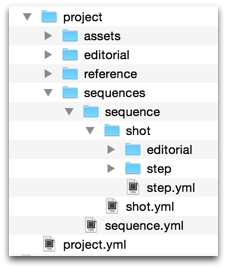
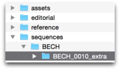
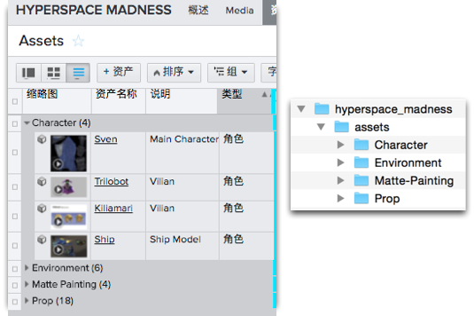
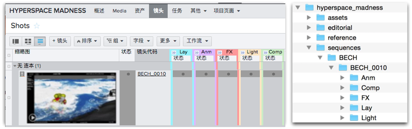
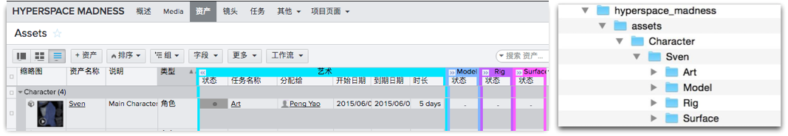
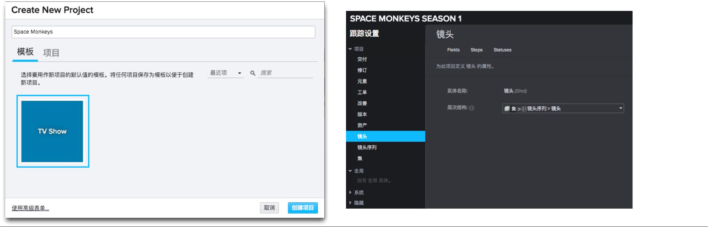
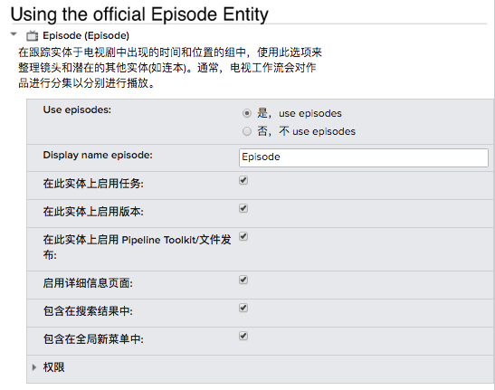
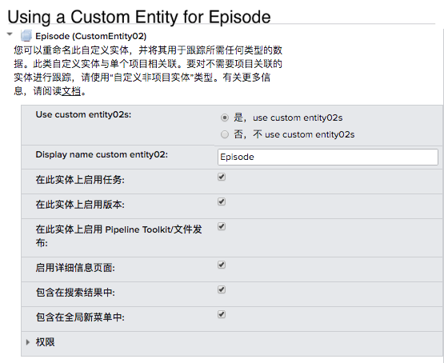
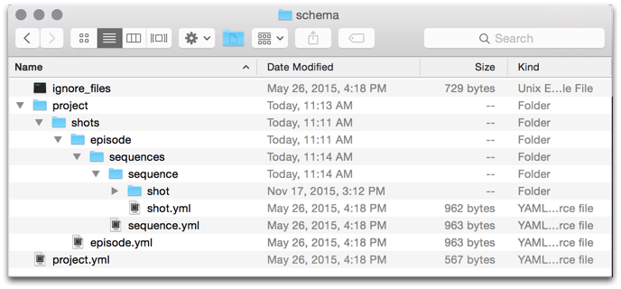

# 文件系统配置参考

本文档全面地介绍了  Pipeline Toolkit 中以文件系统为中心的配置。概述了模板系统的工作方式和可用的选项。还列出了在文件夹创建配置中可以包含的所有不同参数。  
_请注意，本文档介绍仅当控制 Toolkit 配置时可用的功能。有关详细信息，请参见 [ 集成管理员手册](https://support.shotgunsoftware.com/hc/zh-cn/articles/115000067493)。_

# 简介

本文档介绍如何配置 Toolkit 配置中与您的文件系统相关的部分，包括相关的示例。Toolkit 需要处理大量文件和目录，您可以利用 Toolkit 的配置来表现路径的组合方式和它们代表的意义。我们通常会以两种截然不同且互不相关的方式访问文件系统：

1. **创建文件夹：**在  中创建对象后，我们需要先在磁盘上创建文件夹，然后才能开始工作。这个过程可以很简单，比如在磁盘上创建一个文件夹来代表镜头；也可以更复杂，比如设置一个特定于用户的工作沙盒，让每个处理镜头的用户在单独的磁盘区域工作。

   - Toolkit 会在您启动应用程序（例如为镜头 BECH_0010 启动 Maya）时自动创建文件夹，并确保在启动 Maya 前文件夹已存在。如果文件夹不存在，则会即时创建这些文件夹。除此以外，也可以使用 API 方法、[Shell 中的 tank 命令](https://support.shotgunsoftware.com/hc/zh-cn/articles/219033178#Useful%20tank%20commands)以及通过 [ShotGrid 中的“创建文件夹”(Create Folders)菜单](https://support.shotgunsoftware.com/hc/zh-cn/articles/219040688#Shotgun%20Integration)来创建文件夹。此文件夹创建过程由一组特殊的配置文件来控制，下面我们在文档的[第 1 部分](https://support.shotgunsoftware.com/hc/zh-cn/articles/219039868#Part%201%20-%20Folder%20Creation%20Syntax)中对此进行介绍。
2. **打开和保存工作：**在工作时，我们需要在磁盘的标准位置打开和保存文件。 这些文件位置通常位于我们在开始工作前创建的文件夹结构之中。

   - 文件夹结构建立后，我们可以使用该结构来确定关键的磁盘位置。这些位置称为[模板](https://support.shotgunsoftware.com/hc/zh-cn/articles/219039868#Part%202%20-%20Configuring%20File%20System%20Templates)。例如，您可以定义一个 `maya_shot_publish` 模板来表示为镜头发布的 Maya 文件。[Toolkit 应用](https://support.shotgunsoftware.com/hc/zh-cn/articles/219039798)随后会使用此模板 - 发布应用可使用它控制应将文件写入何处，而 [Workfiles 应用](https://support.shotgunsoftware.com/hc/zh-cn/articles/219033088)可使用此模板了解从何处打开文件。在 Toolkit 的环境配置内，您可以控制每个应用使用哪些模板。因此，Toolkit 使用的所有关键文件位置都定义在一个模板文件中，并且易于查看。

# 第 1 部分 - 文件夹创建语法

文件夹配置将  中的实体映射到磁盘上的位置。配置不是只使用一个配置文件，而是采取“迷你文件系统”的形式，每个个体都以这个系统为模板 - 我们将这称之为**数据结构配置**。 当 Toolkit 执行文件夹创建操作时，文件夹和文件将从这个“迷你文件系统”复制到它们的目标位置。这样可以实现动态的行为。例如，一个文件夹可以表示  中的一个镜头，而您可以控制该文件夹的命名。更具体地说，您可以使用几个  字段来构成该文件夹的名称，然后在创建文件夹前执行字符转换。

上图显示了一个数据结构配置。当您执行 Toolkit 文件夹创建操作时，会在  中的实体与磁盘上的文件夹之间建立联系。Toolkit 使用此文件夹数据结构配置在磁盘上生成一系列文件夹，每个文件夹在  中注册为一个 [`Filesystem Location`](https://developer.shotgridsoftware.com/zh_CN/cbbf99a4/) 实体。我们可以将这看成是  数据（例如镜头和资产名称）和配置被“转化”成磁盘上和  中的实际文件夹。配置总是以一个名为“project”的文件夹开头。此文件夹始终表示  中连接的项目，并将被替换为项目的 Toolkit 名称。这层下面是静态文件夹。例如，文件夹创建器将自动创建 **sequences** 文件夹。

进一步深入 sequences 文件夹，有一个 **sequence** 文件夹和一个 **sequence.yml** 文件。 每当 Toolkit 检测到与文件夹同名的 YAML 文件时，便会读取该 YAML 文件的内容，并添加需要的动态行为。在本例中，**sequence.yml** 文件包含 project 文件夹下的结构，由三种内容组成：

1. **普通文件夹和文件：**这些内容将直接被复制到目标位置。
2. **含有 YAML 文件的文件夹**（文件与文件夹同名）：这代表动态内容。 例如，假设有一个 **shot** 文件夹和一个 **shot.yml**，当创建文件夹时，这个 **shot** 文件夹就是生成一系列文件夹所采用的模板 - 每个镜头一个文件夹。
3. **名为 name.symlink.yml 的文件：**此文件将在处理文件夹时生成符号链接。  [本文档稍后将对符号链接](https://support.shotgunsoftware.com/hc/zh-cn/articles/219039868#Symbolic%20Links)进行介绍。

目前，以 YAML 文件形式表示的动态配置设置支持以下模式：

- **[ 查询文件夹：](#shotgun-query-folders)**基于  数据库查询的动态文件夹名称。例如，此模式可用于为项目中的每个镜头创建一个文件夹。

- **[ 列表字段文件夹：](#shotgun-list-field-folders)**基于  列表字段的动态文件夹名称。例如，此模式可用于为  的“资产”(Asset)实体上的  列表字段“资产类型”(Asset Type)中的每个值创建一个文件夹。

- **[延迟文件夹：](#workspaces-and-deferred-folder-creation)**仅当通过 Toolkit API 的创建文件夹方法请求第二次文件夹创建操作时（通常是启动应用程序（如 Maya）时），才会执行此操作。通常，Toolkit 的各种应用程序启动器会在启动应用程序前执行此方法。

- **[当前用户文件夹：](#current-user-folder)**一个特殊文件夹，表示当前用户。

下面我们来更深入地了解这些模式。

##  查询文件夹

要创建一个与  查询对应的动态文件夹，请在 YAML 文件中使用以下语法：

    
    # the type of dynamic content
    type: shotgun_entity

    
    # the  entity type to connect to
    entity_type: Asset

    
    # the  field to use for the folder name
    name: code

    
    #  filters to apply when getting the list of items
    
    # this should be a list of dicts, each dict containing
    
    # three fields: path, relation and values
    
    # (this is std  API syntax)
    
    # any values starting with $ are resolved into path objects
    filters: [ { "path": "project", "relation": "is", "values": [ "$project" ] } ]

- 将动态内容 **type** 字段的值设置为 **shotgun_entity**。
- **entity_type** 字段应设置为要从中提取数据的  实体（“资产”(Asset)、“镜头”(Shot)、“场”(Sequence)、“自定义实体 02”(CustomEntity02)等）。
- **name** 字段是根据  中的数据应指定给每个文件夹的名称。

   - 您可以像上面的示例中那样，只使用一个字段（例如 `name: code`）。
   - 也可以在大括号内使用多个字段（例如 `name:` `"{asset_type}_{code}"`）。
   - 如果想包含来自其他链接实体的字段，可使用标准  语法（例如 `name: "{sg_sequence.Sequence.code}_{code}"`）。
- **filters** 字段是一个  查询。该字段相对严格遵循 [ API 语法](http://developer.shotgridsoftware.com/python-api/reference.html)。它是一个词典列表，并且每个词典需要有 _path_、_relation_ 和 _values_ 键。 $ 语法的有效值是任何包含对应  实体的根文件夹（例如，对于项目来说是 `"$project"`，而如果上层目录层次结构存在 sequence.yml，也可以是 `"$sequence"`）。对于  实体链接，您可以使用 $ 语法（例如 `{ "path": "project", "relation": "is", "values": [ "$project" ] }`）指代配置中的父文件夹 - [下面的示例](https://support.shotgunsoftware.com/hc/zh-cn/articles/219039868#Examples)对此做出了更深入的解释。

## 多个文件夹

在名称定义中包含斜杠是为了创建可一次性创建多个文件夹的表达式：

    
    # the type of dynamic content
    type: shotgun_entity

    
    # the  entity type to connect to
    entity_type: Asset

    
    # the  field to use for the folder name
    name: "{sg_asset_type}/{code}"

    
    #  filters to apply when getting the list of items
    
    # this should be a list of dicts, each dict containing
    
    # three fields: path, relation and values
    
    # (this is std  API syntax)
    
    # any values starting with $ are resolved into path objects
    filters: [ { "path": "project", "relation": "is", "values": [ "$project" ] } ]

创建适用于这种路径的文件系统模板（有关详细信息，请参见此文档的第 2 部分）时，最后一个文件夹将表示  实体。例如，可以使用以下模板表示上面的示例

    asset_step_folder: assets/{asset_type}/{Asset}/{Step}

`{asset_type}`  和 `{Asset}` 都定义为字符串模板键，`{Asset}` 令牌将在确定给定路径的上下文时在上下文计算中使用。

## 随父文件夹一起创建的文件夹

在  中， 的数据结构中存在嵌套。这种嵌套可以称为父子关系。例如，在文件系统中，sequence 通常是 shot 的父文件夹；同样，shot 通常是 sequence 的子文件夹。



shotgun_entity 类型的文件夹支持一个可选标志，该标志可控制文件夹创建过程在创建父文件夹后是否尝试向下递归到该文件夹中，如果是的话，还将创建子文件夹。标志作为一种设置，只能有某些固定值，在本例中为“true”或“false”。要添加此标志，请参考下面这个示例：

    
    # recurse down from parent folder
    create_with_parent: true

如前所述，这个设置是可选的，默认值为 False。如果将它设置为 True，Toolkit 将为找到的所有子实体创建文件夹。继续来看我们的示例，如果您想每次创建镜头序列父文件夹时都创建镜头子文件夹，可将镜头文件夹的 `create_with_parent` 设置为 `true`。



## 可选字段

通常，当您定义文件夹名称（例如 `{code}_{sg_extra_field}`）时，Toolkit 会要求所有字段在  中都具有值。例如，如果 `sg_extra_field` 为空，将生成一条错误消息。 如果某个字段并不总是填充有值，可将它标记为可选字段。可选字段的意思是，Toolkit 会在该字段有值时包含它，在该字段为空时不包含它，而不会生成错误。

您可以使用方括号定义可选字段，比如：`{code}[_{sg_extra_field}]`。 这会生成以下文件夹名称：

- 如果 `code` 为 BECH_0010，`sg_extra_field` 为 extra，文件夹名称将为 `BECH_0010_extra`。

- 如果 `code` 为 BECH_0010，`sg_extra_field` 为空，文件夹名称将为 `BECH_0010`。



## 正则表达式令牌匹配

Toolkit 支持使用正则表达式提取  字段名称的部分内容。这样，可以创建简单的表达式，从而可使用  中的值来驱动文件夹的创建。例如，如果  中的所有资产都以三个字母为前缀，后跟一个下划线命名（例如 `AAT_Boulder7`），这样就可以拆分为两个文件系统文件夹级别（例如 `AAT/Boulder7`）：

    
    # the type of dynamic content
    type: shotgun_entity

    
    # the  entity type to connect to
    entity_type: Asset

    
    # Extract parts of the name using regular expressions
    name: "{code:^([^_]+)}/{code^[^_]+_(.*)}"

    
    #  filters to apply when getting the list of items
    
    # this should be a list of dicts, each dict containing
    
    # three fields: path, relation and values
    
    # (this is std  API syntax)
    
    # any values starting with $ are resolved into path objects
    filters: [ { "path": "project", "relation": "is", "values": [ "$project" ] } ]

该语法类似于模板系统中的 `subset` 令牌；只需在  字段名称后面添加一个冒号，后跟一个正则表达式。正则表达式中定义的任何组（例如，`()` 括起来的部分）将用于提取值。 如果正则表达式中有多个组，它们将会连接在一起。例如，以下表达式将提取创建对象的用户的首字母：  `{created_by.HumanUser.code:^([A-Z])[a-z]* ([A-Z])[a-z]*}`

## 示例

下面一组示例说明了如何使用 filters 语法。

要**查找所有属于当前项目且正在进行的镜头**，可使用下面的语法。 请注意， 镜头实体有一个称为“项目”(project)的链接字段，用于将镜头连接到项目。我们要确保只为与当前项目关联的镜头创建文件夹。由于配置文件系统中存在上层项目目录，我们可以通过 $ 语法引用它，Toolkit 会自动根据此  实体链接引用来创建文件夹。请记住，$ 语法的有效值是任何包含对应  实体的根文件夹（例如，对于项目来说是 `"$project"`，如果上层目录层次结构存在 sequence.yml，也可以是 `"$sequence"`）。

    entity_type: Shot
    filters:
        - { "path": "project", "relation": "is", "values": [ "$project" ] }
        - { "path": "status", "relation": "is", "values": [ "ip" ] }

如果您的树结构上层有镜头序列文件夹，并想**为属于该镜头序列的所有镜头创建文件夹**，可以创建以下过滤器：

    entity_type: Shot
    filters:
        - { "path": "project", "relation": "is", "values": [ "$project" ] }
        - { "path": "sg_sequence", "relation": "is", "values": [ "$sequence" ] }

要**查找所有资产**，可使用以下语法：

    entity_type: Asset
    filters: [ { "path": "project", "relation": "is", "values": [ "$project" ] } ]

##  列表字段文件夹

如果您想为  中的每种资产类型都创建一个文件夹，[ 列表字段](https://support.shotgunsoftware.com/hc/zh-cn/articles/219031008)文件夹将会非常有用。在  中，资产类型属于列表字段。使用此文件夹配置类型，可以在文件系统中定义一个层来反映这些资产类型列表。



如果需要一个动态文件夹来对应  列表字段中的所有项，可在 YAML 文件中使用以下语法：

    
    # the type of dynamic content
    type: "shotgun_list_field"

    
    # the  entity type to connect to
    entity_type: "Asset"

    
    # only create for values which are used in this project.
    
    # this is optional and will be set to false if not specified.
    skip_unused: false

    
    # by default, list fields are only created if they are needed by a child entity node
    
    # by setting the create_with_parent parameter to true you ensure that list field
    
    # nodes are always created
    create_with_parent: false

    
    # the  field to use for the folder name
    field_name: "{sg_asset_type}_type"

- 将动态内容 **type** 字段的值设置为 `shotgun_list_field`。
- `entity_type` 字段应设置为想要从中提取数据的  实体（例如“资产”(Asset)、“场”(Sequence)、“镜头”(Shot)等）。
- `field_name` 字段应设置为从中提取数据的  字段，并且必须是[列表类型字段](https://support.shotgunsoftware.com/hc/zh-cn/articles/219031008)。如果想随动态内容一起添加静态文本，可以使用表达式。`field_name: "{sg_asset_type}_type"`  此示例表达式包含文本和一个模板键。

- 可选参数 `skip_unused` 可防止为未使用的列表类型字段值创建目录（如上面的[可选字段](https://support.shotgunsoftware.com/hc/zh-cn/articles/219039868#Optional%20fields)部分所述）。

- 可选参数 `create_with_parent` 可强制创建 list_field 节点，即使当前没有正在接受处理的子实体级节点（请参见上面的[随父文件夹一起创建的文件夹](https://support.shotgunsoftware.com/hc/zh-cn/articles/219039868#Create%20With%20Parent%20Folder)部分）。

## 工作流工序文件夹

工作流工序文件夹表示  中的[工作流工序](https://support.shotgunsoftware.com/hc/zh-cn/articles/219031288)。工作流工序也称为“工序”。

    
    # the type of dynamic content
    type: "shotgun_step"

    
    # the  field to use for the folder name. This field needs to come from a step entity.
    name: "short_name"

您可以在此使用名称表达式，就像[上面介绍的  实体](https://support.shotgunsoftware.com/hc/zh-cn/articles/219039868#Shotgun%20List%20Field%20Folders)一样。节点会查找其父节点、祖父节点等，直至找到  实体文件夹配置。此实体文件夹将与工序关联，并且实体的类型将用来确定要创建哪些工序文件夹。



默认情况下，会尝试自动为特定实体的所有相关工序创建工序文件夹。例如，如果一个包含 5 个工序（布局、动画、特效、照明、合成）的镜头触发了文件夹创建操作，将自动为这 5 个工序（布局、动画、特效、照明、合成）创建工序文件夹。

但是，您可以使用以下语法关闭此功能：

    
    # recurse down from parent folder
    create_with_parent: false

将此设置添加到配置，意味着创建镜头文件夹时不会创建任何工序文件夹。只有在任务中运行文件夹创建操作时，才会创建工序文件夹。如果您想配置用户沙盒和其他需要在工作开始前才创建的结构，可以使用此功能。

### 为不同工作流工序设置不同的文件系统布局

假设您想让照明和合成工序使用一个文件夹结构，其余工序则使用另一个文件夹结构。如果您想为不同的工作流工序使用不同的文件系统布局，可以向配置中添加 `filter` 子句来实现这一点。 使用此过滤器可限定特定工序的配置将会涵盖哪些工作流工序。在我们的示例中，您可以创建两个配置文件：`step_lightcomp.yml` 和 `step.yml`。 在第一个配置文件中，添加以下过滤器：

    filters: [ { "path": "short_name", "relation": "in", "values": [ "Light", "Comp"  ] } ]

上面的语法只有在创建 `Light` 或 `Comp` 类型的工序文件夹时才会使用。 在第二个配置文件中，为其他工序创建一条规则：

    filters: [ { "path": "short_name", "relation": "not_in", "values": [ "Light", "Comp"  ] } ]

现在，您可以在每个文件夹中单独定义子结构。

## 高级技巧：指定父文件夹

在创建文件夹的过程中，Toolkit 需要将工作流工序与实体（例如“镜头”(Shot)、“资产”(Asset)等）相关联。为实现这一目标，默认情况下，Toolkit 会查找文件夹树，并选取找到的第一个  实体文件夹。例如，如果您的层次结构为 `Sequence > Shot > Step`，工序文件夹会自动与镜头关联，这通常正是您想要的。

但是，如果您的层次结构在主实体下还有实体，例如 `Sequence > Shot > Department > Step`，Toolkit 默认会将工序文件夹与部门一级关联，但这并不是您想要的。 在这种情况下，我们需要明确指示 Toolkit 要查找哪个位置。通过向工序配置中添加以下内容，可以实现这一点：

    associated_entity_type: Shot

##  任务文件夹

任务文件夹表示  中的[任务](https://support.shotgunsoftware.com/hc/zh-cn/articles/219031248)。默认情况下，任务文件夹不会随其父文件夹一起创建。例如，如果某个关联了任务节点的镜头触发了文件夹创建操作，将不会自动创建任务文件夹。只有在为任务执行文件夹创建操作时（例如从  启动某项任务时），才会创建任务文件夹。

    
    # the type of dynamic content
    type: "shotgun_task"

    
    # the  field to use for the folder name. This field needs to come from a task entity.
    name: "content"

但是，您可以使用以下语法开启创建功能，让任务文件夹随其父文件夹一起创建：

    
    # recurse down from parent folder
    create_with_parent: true

与工序文件夹类似，您也可以选择性地提供 `filter` 参数，过滤出文件夹配置应操作哪些任务。

同样，与[前面介绍的  实体](https://support.shotgunsoftware.com/hc/zh-cn/articles/219039868#Shotgun%20List%20Field%20Folders)一样，您也可以在这里使用名称表达式。在名称表达式中，可以随动态内容一起使用静态文本，生成兼具动态和静态上下文的名称。

`name: "task_{content}"`

节点会查找其父节点、祖父节点等，直至找到  实体文件夹配置。此实体文件夹将与任务关联，并用来确定要创建哪些任务文件夹。

### 高级技巧：指定父文件夹

在创建文件夹的过程中，Toolkit 需要将任务与实体（例如“镜头”(Shot)、“资产”(Asset)等）相关联。为实现这一目标，默认情况下，Toolkit 会查找文件夹树，并选取找到的第一个  实体文件夹。例如，如果您的层次结构为 `Sequence > Shot > Task`，任务文件夹会自动与镜头关联，这通常正是您想要的。

但是，如果您的层次结构在主实体（例如镜头）下还有实体，例如 `Sequence > Shot > Department > Task,`，Toolkit 默认会将任务文件夹与部门一级关联，但这并不是您想要的。 在这种情况下，我们需要明确指示 Toolkit 要查找哪个位置，就像在[上一部分](https://support.shotgunsoftware.com/hc/zh-cn/articles/219039868#Create%20With%20Parent%20Folder)中为工序文件夹所做的更新一样。通过向任务配置中添加以下内容，可以实现这一点：

`associated_entity_type: Shot`

## 工作空间和延迟文件夹创建

延迟文件夹创建是指，仅当 Toolkit API 的创建文件夹方法通过可选的 `engine` 参数请求第二次文件夹创建操作时，才执行创建操作。 通常，Toolkit 的各种应用程序启动器会在启动应用程序前执行此方法。大多数文件夹类型都支持延迟标志，其默认值为 `false`。 要将延迟文件夹创建功能设置为 `true`，可以添加此标志：

    
    # only create this folder when tk.create_filesystem_structure is
    
    # called with tk-maya, tk-nuke or any-custom-string.
    defer_creation: ["tk-maya", "tk-nuke", "any-custom-string]

    
    # create this folder when any application launches, but not when normal folder
    
    # creation runs
    defer_creation: true

使用此标志可将文件夹创建过程一分为二：一次在第一个“全局”阶段进行，另一次在稍后的时间点进行。通常，第二次创建与插件的启动相关（但是因为默认值为 `false`，所以不会自动进行），并允许用户在插件启动前才创建文件夹。 这可以实现两种主要的工作流：

1. **工作空间：**这是特定于应用程序的文件夹设置。 文件夹可以等到应用程序启动前才创建。
2. 这种工作流的一个常见例子是：某个工作流工序可能会根据镜头的需要和艺术家选择的工作方式，决定需要使用 Houdini、Maya 还是其他插件。艺术家可以一开始就为工作流工序创建 maya/、houdini/ 和其他目录，但如果负责给定镜头的艺术家只在 Maya 中工作，那么就没必要为 Houdini 和其他任何插件创建空文件夹。因此，如果您将文件夹创建任务延迟到各个插件启动时再进行，那么如果艺术家从不使用 Houdini，将不会为镜头创建 houdini/ 文件夹。
3. **用户文件夹：**用户文件夹在应用程序启动前才创建。 默认情况下，用户文件夹配置的结构（如上所述）将延迟创建。
4. 发生这种情况时，您可以不基于  中指定的用户来创建用户文件夹，而是在用户启动插件时才为当前用户创建文件夹。例如，当您开始处理镜头并启动 Maya 时，会为您创建一个用户名文件夹（基于您在  中的用户名），让您与其他人的工作不会互相干扰。

_提示：如果您更喜欢应用程序（例如 Maya）启动时创建普通的静态文件夹，只需创建一个与文件夹同名的 YAML 配置文件，并添加以下内容即可：_

    
    # type of content
    type: "static"

    
    # only create this folder for maya
    defer_creation: "tk-maya"

    :::yaml
    
    # type of content
    type: "static"

    
    # only create this folder when tk.create_filesystem_structure is
    
    # called with any-custom-string.
    defer_creation: "any-custom-string"

## 当前用户文件夹

当前用户文件夹是一种特殊构造，通过它可为不同用户设置工作区。例如，我们经常会遇到一个部门的多位艺术家共同处理同一个镜头的情况。此时使用用户文件夹，可以让艺术家将其工作文件存储在自己的目录中，并且能够在 [Workfiles 应用](https://support.shotgunsoftware.com/hc/zh-cn/articles/219033088)中准确过滤出属于自己的文件。这种情况下，配置文件需要包含以下选项：

    
    # the type of dynamic content
    type: "user_workspace"

    name: "login"

- 将 **type** 字段的值设置为 `user_workspace`。
- **name** 字段是应指定给用户文件夹的名称。 此名称必须包含从  人员（ 中的 `HumanUser`）那里提取的字段组合。
- 您可以像上面的示例中那样，只使用一个字段（例如 `name: login`）。
- 您可以在花括号中使用多个字段（例如 `name: "{firstname}_{lastname}"`）。
- 如果想包含来自其他链接实体的字段，可使用标准  语法（例如 `name: "{sg_group.Group.code}_{login}"`）。

默认情况下，当前用户文件夹是延迟文件夹，也就是说，只有在 Toolkit API 的创建文件夹方法中通过可选的 `engine` 参数请求第二次文件夹创建操作时，才会创建它。

## 静态文件夹

静态文件夹（和文件）是最简单的类型。您可以将它们放入配置结构，当执行文件夹创建过程时，会自动复制它们。  [这里有一些默认配置的静态文件夹示例](https://github.com/shotgunsoftware/tk-config-default/tree/master/core/schema/project) (https://github.com/shotgunsoftware/tk-config-default/tree/master/core/schema/project)（请注意，静态文件夹没有对应的 YAML 文件）。

通常，静态文件夹的使用不会超出这些示例介绍的范围；但是，Toolkit 确实支持一些更高级的静态文件夹功能。我们可以定义动态条件来决定是否应创建某个静态文件夹。例如，您可能会需要只有剪辑类型的工作流工序才会创建的特殊静态文件夹。在这种情况下，需要在静态文件夹的同一层添加一个 YAML 配置文件，并为它指定相同的名称，文件扩展名为“yml”。然后，使用以下语法：

    
    # the type of dynamic content
    type: "static"

    
    # pick one of the  folders that are above this folder
    
    # in the folder hierarchy. In this case it is a parent folder
    
    # named step that we want to look at when deciding if this
    
    # static folder should be created or not.
    constrain_by_entity: "$step"

    
    # we can now define constraints for this step. Constraints are simple
    
    #  queries, following the same syntax as the other  filters
    
    # shown in previous sections.
    #
    
    # In our example, if the parent step matches the constraints given
    
    # in the filter below, the static folder will be created. If not,
    
    # it (and its children) will be ignored by the folder creation process.
    constraints:
        - { "path": "short_name", "relation": "is", "values": [ "edit" ] }

默认情况下，静态文件夹会自动随其父文件夹一起创建。但有些时候，我们并不希望如此。这种情况下，可以添加一个特殊标志，指示静态文件夹不要随其父文件夹一起创建。

    
    # do not recurse down automatically
    create_with_parent: false

## 符号链接

您可以在创建动态文件夹的过程中创建符号链接。如果要创建名为 `artwork` 的符号链接，请在数据结构配置中创建一个名为 `artwork.symlink.yml` 的文件。 此文件将被系统识别为符号链接请求，系统将不会复制它，而是会处理它。

`artwork.symlink.yml` 文件必须至少包含一个 `target` 键：

    
    # Example of a .symlink.yml file

    
    # A target parameter is required.
    target: "../Stuff/$Project/$Shot"

    
    # Additional parameters will be passed to the hook as metadata
    
    # so you can for example include permission hints or other stuff
    
    # that you may need for advanced customization
    additional_param1: abc
    additional_param2: def

如果 target 参数包含 `$EntityType` 标记，如 `$Asset`、`$Shot` 或 `$Project`，系统将尝试以代表该实体（资产、镜头、项目等）的文件夹的名称来解析这些标记。 Toolkit 将在 Shotgun 管理的文件系统树中查找这些值，如果树的上层未定义这些值，将报告错误。

列表字段（如资产的资产类型）采用包含实体类型的某种语法进行表示，例如 `$Asset.sg_asset_type`。 例如：

    
    # Example of a .symlink.yml file

    
    # A target parameter is required.
    target: "../renders/$Project/$Asset.sg_asset_type/$Asset"

符号链接的创建操作（与所有输入/输出或 I/O 一样）在文件夹处理挂钩内进行。系统会向挂钩传递一个特殊的 `symlink` 动作，您将随这个请求一起获得符号链接的名称、完全解析的目标，以及定义文件内包含的所有 YAML 元数据。 对于上面的 `artwork` 示例，我们在镜头文件夹 (Shot) 下创建文件夹，如下所示：

     {'action': 'symlink',
      'path': '/mnt/projects/chasing_the_light/Sequences/AA/AA001/artwork'
      'target': '../Stuff/chasing_the_light/AA001',
      'metadata': {'target': '../Stuff/$Project/$Shot', 'additional_param1': 'abc', 'additional_param2': 'def'}
      }

## 忽略文件和文件夹

在创建文件夹的过程中，会将位于数据结构脚手架内的文件复制到目标区域。这个复制过程由一个核心挂钩来执行，因此，项目或工作室的权限处理可以自定义。

{% include info title="注意" content="有关这种处理的更多详细信息，请参见“简单自定义”下的[“自定义 I/O 和权限”部分](https://support.shotgunsoftware.com/hc/zh-cn/articles/219039868#Simple%20customization%20of%20how%20folders%20are%20created)。我们使用一个 [process_folder_creation 核心挂钩](https://github.com/shotgunsoftware/tk-core/blob/master/hooks/process_folder_creation.py#L62-L71) (https://github.com/shotgunsoftware/tk-core/blob/master/hooks/process_folder_creation.py#L62-L71) 来处理许多文件夹设置工作。您可以向此挂钩中添加 chmod 调用（并且/或者在执行 mkdir 时设置权限），通过这种方法为创建的文件夹设置权限。" %}

在文件夹创建过程中，有时将某些文件和文件夹排除在复制内容之外可能会有所帮助。例如，如果您使用 Git 或 SVN 来存储文件夹创建配置，您会不想将 `.git` 和 `.svn` 文件夹复制到每个镜头文件夹或资产文件夹。 如果有些文件是您不想复制的，您可以在项目配置内的 `config/core/schema` 文件夹中放置一个名为 `ignore_files` 的文件。 这个文件应包含 glob 样式的模式，用以定义不复制的文件。每个模式应单独一行：

    
    # This is a good example of a standard ignore_files file

    .svn                # no svn temp files to be copied across at folder creation time
    .git                # no git temp files to be copied across at folder creation time
    .DS_Store           # no mac temp files to be copied across at folder creation time

您也可以使用通配符。例如，如果需要排除所有带 TMP 扩展名的文件，只需向文件中添加一行 *.tmp 即可。

    
    # This is a good example of a standard ignore_files file

    .svn                # no svn temp files to be copied across at folder creation time
    .git                # no git temp files to be copied across at folder creation time
    *.tmp           # no files with tmp extension to be copied across at folder creation time

## 自定义 I/O 和权限

镜头文件夹和资产文件夹在创建时通常需要带有特殊的权限和参数。简单的时候，只需在创建文件夹过程中设置权限位即可；复杂的时候，则需要向专门的文件夹创建服务器发送远程请求，由服务器创建具有适当凭据、组和权限的文件夹。

另外，文件系统中不同层级的文件夹常常也需要不同的权限；工作区文件夹通常对所有人都是可写的，而镜头文件夹的权限则可能严格得多。

在 Toolkit 中，我们只通过一个挂钩，便可对文件夹的创建进行自定义。这个挂钩叫做 `process_folder_creation.py`，是一个核心挂钩。 在创建文件夹的 API 调用遍历文件夹配置并决定应创建哪些文件夹的过程中，它会建立一个可创建项的列表。这些列表项既可以是文件，也可以是文件夹。到了创建文件夹的最后一步，这个列表将被传递给负责实际文件夹处理的挂钩。您可以在此处查看默认的 [process_folder_creation 核心挂钩](https://github.com/shotgunsoftware/tk-core/blob/master/hooks/process_folder_creation.py#L62-L71) (https://github.com/shotgunsoftware/tk-core/blob/master/hooks/process_folder_creation.py#L62-L71)。

### 传递给挂钩的数据

文件夹创建挂钩仅为每个文件夹创建请求执行一次。所有文件夹创建数据将放在列表中传递给挂钩，挂钩通常会轮询这个列表，并根据核心 API 传递的参数创建文件夹。

列表中的数据始终是深度优先的递归，从顶层文件夹和文件开始，然后遍历更深的层。下面这个示例显示了传递给挂钩的数据的形式：

    [

     {'action': 'entity_folder',
      'entity': {'id': 88, 'name': 'Chasing the Light', 'type': 'Project'},
      'metadata': {'root_name': 'primary', 'type': 'project'},
      'path': '/mnt/projects/chasing_the_light'},

     {'action': 'folder',
      'metadata': {'type': 'static'},
      'path': '/mnt/projects/chasing_the_light/sequences'},

     {'action': 'entity_folder',
      'entity': {'id': 32, 'name': 'aa2', 'type': 'Sequence'},
      'metadata': {'entity_type': 'Sequence',
                   'filters': [{'path': 'project',
                                'relation': 'is',
                                'values': [<tank.folder.folder_types.FilterExpressionToken object at 0x10ca04c90>]}],
                   'name': 'code',
                   'type': 'shotgun_entity'},
      'path': '/mnt/projects/chasing_the_light/sequences/aa2'},

     {'action': 'entity_folder',
      'entity': {'id': 1184, 'name': 'moo87', 'type': 'Shot'},
      'metadata': {'entity_type': 'Shot',
                   'filters': [{'path': 'sg_sequence',
                                'relation': 'is',
                                'values': [<tank.folder.folder_types.FilterExpressionToken object at 0x10ca04b10>]}],
                   'name': 'code',
                   'type': 'shotgun_entity'},
      'path': '/mnt/projects/chasing_the_light/sequences/aa2/moo87'},

     {'action': 'copy',
      'metadata': {'entity_type': 'Shot',
                   'filters': [{'path': 'sg_sequence',
                                'relation': 'is',
                                'values': [<tank.folder.folder_types.FilterExpressionToken object at 0x10ca04b10>]}],
                   'name': 'code',
                   'type': 'shotgun_entity'},
      'source_path': '/mnt/software/tank/chasing_the_light/config/core/schema/project/sequences/sequence/shot/sgtk_overrides.yml',
      'target_path': '/mnt/projects/chasing_the_light/sequences/aa2/moo87/sgtk_overrides.yml'},

     {'action': 'create_file',
      'metadata': {'entity_type': 'Shot',
                   'filters': [{'path': 'sg_sequence',
                                'relation': 'is',
                                'values': [<tank.folder.folder_types.FilterExpressionToken object at 0x10ca04b10>]}],
                   'name': 'code',
                   'type': 'shotgun_entity'},
      'content': 'foo bar',
      'target_path': '/mnt/projects/chasing_the_light/sequences/aa2/moo87/automatic_content.txt'},

     {'action': 'symlink',
      'path': '/mnt/projects/chasing_the_light/Sequences/AA/AA001/artwork'
      'target': '../Stuff/chasing_the_light/AA001',
      'metadata': {'target': '../Stuff/$Project/$Shot', 'additional_param1': 'abc', 'additional_param2': 'def'}
      },

    ]

这些数据是一个词典列表。每个词典有一个称为 `action` 的键。 这个键表示请求的 I/O 项的类型。如果您要执行文件夹创建挂钩，需要添加对以下不同动作的支持：

- `entity_folder`：磁盘上与  实体关联的文件夹。
- `folder`：磁盘上的文件夹。
- `copy`：需要从源位置复制到目标位置的文件。
- `create_file`：需要在磁盘上创建的文件。
- `symlink`：应创建的符号链接。

每个动作各有一套不同的词典键。例如，`entity_folder` 动作有一个 `entity key`，其中包含它所连接的实体的详细信息。 `create_file` 有一个 `source_path` 和一个 `target_path` 键，用来指示挂钩要复制哪个文件，以及要复制到何处。

所有的 `actions` 还有一个名为 `metadata` 的键。 此键表示数据结构设置中关联的配置文件的 YAML 配置数据。在上面的示例中，可以看到  文件夹的 `metadata` 键怎样包含数据结构配置内设置的所有过滤器和命名信息。例如，下面是上面示例中镜头文件夹的元数据：

    {'action': 'entity_folder',
      'entity': {'id': 1184, 'name': 'moo87', 'type': 'Shot'},
      'metadata': {'entity_type': 'Shot',
                   'filters': [{'path': 'sg_sequence',
                                'relation': 'is',
                                'values': [<tank.folder.folder_types.FilterExpressionToken object at 0x10ca04b10>]}],
                   'name': 'code',
                   'type': 'shotgun_entity'},
      'path': '/mnt/projects/chasing_the_light/sequences/aa2/moo87'}

...它对应于 `shot.yml` 数据结构配置文件：

    
    # Copyright (c) 2013  Software Inc.
    #
    
    # CONFIDENTIAL AND PROPRIETARY
    #
    
    # This work is provided "AS IS" and subject to the  Pipeline Toolkit
    
    # Source Code License included in this distribution package. See LICENSE.
    
    # By accessing, using, copying or modifying this work you indicate your
    
    # agreement to the  Pipeline Toolkit Source Code License. All rights
    
    # not expressly granted therein are reserved by  Software Inc.

    
    # the type of dynamic content
    type: "shotgun_entity"

    
    # the  field to use for the folder name
    name: "code"

    
    # the  entity type to connect to
    entity_type: "Shot"

    
    #  filters to apply when getting the list of items
    
    # this should be a list of dicts, each dict containing
    
    # three fields: path, relation and values
    
    # (this is std  API syntax)
    
    # any values starting with $ are resolved into path objects
    filters: [ { "path": "sg_sequence", "relation": "is", "values": [ "$sequence" ] } ]

_请注意，动态令牌 `$sequence` 在运行时已被解析为实际对象。_

### 向挂钩传递您自己的文件夹创建指令

除了 Toolkit 要求的各种配置指令，您还可以在数据结构配置中定义自己的配置项。它们将通过上面介绍的 `metadata` 键传递给挂钩，并可以用来驱动文件夹创建过程。

例如，如果您的数据结构设置中有以下结构：

    
    # the type of dynamic content
    type: "shotgun_entity"

    
    # the  field to use for the folder name
    name: "code"

    
    # the  entity type to connect to
    entity_type: "Shot"

    
    #  filters to apply when getting the list of items
    filters: [ { "path": "sg_sequence", "relation": "is", "values": [ "$sequence" ] } ]

    
    # user settings
    studio_permissions_level: "admin"

...通过文件夹创建挂钩传递的数据将为：

    {'action': 'entity_folder',
      'entity': {'id': 1184, 'name': 'moo87', 'type': 'Shot'},
      'metadata': {'entity_type': 'Shot',
                   'filters': [{'path': 'sg_sequence',
                                'relation': 'is',
                                'values': [<tank.folder.folder_types.FilterExpressionToken object at 0x10ca04b10>]}],
                   'name': 'code',
                   'type': 'shotgun_entity',
                   'studio_permissions_level': 'admin'},
      'path': '/mnt/projects/chasing_the_light/sequences/aa2/moo87'}

这时，特殊参数 `studio_permissions_level` 将传递给挂钩，您可以使用它来控制文件权限。 您还可以使用这种方法传递任意复杂度的数据结构。此方法的一个典型用途是对权限进行非常精细的控制。

### 向静态文件夹添加自定义配置

通常，当您在文件夹数据结构配置内创建文件夹时，如果该文件夹没有对应的 YAML 文件，Toolkit 会认为它是静态文件夹，并直接创建它。

如果您想为静态文件夹关联自定义的配置元数据，需要创建一个 `static` 类型的 YAML 配置文件。 例如，假设您在项目根目录下有一个 `assets` 静态文件夹，现在想将各种资产合为成组，并添加自定义配置元数据。 要实现这一点，需要创建以下 `assets.yml` 文件：

    type: static
    studio_permissions_level: "admin"

传递给挂钩的配置数据随后将包含以下内容：

    {'action': 'folder',
     'metadata': {'studio_permissions_level': 'admin', 'type': 'static'},
     'path': '/mnt/projects/chasing_the_light/assets'},

同样，可以用这种方式将任意复杂度的数据从 YAML 配置文件传递给挂钩。

## 文件夹创建方式的简单自定义

下面是一个简单的文件夹创建挂钩：

    class ProcessFolderCreation(Hook):

        def execute(self, items, preview_mode, **kwargs):
            """
     The default implementation creates folders recursively using open permissions.

     This hook should return a list of created items.

     Items is a list of dictionaries. Each dictionary can be of the following type:

     Standard Folder
     ---------------
     This represents a standard folder in the file system which is not associated
     with anything in . It contains the following keys:

     * "action": "folder"
     * "metadata": The configuration yaml data for this item
     * "path": path on disk to the item

     Entity Folder
     -------------
     This represents a folder in the file system which is associated with a
      entity. It contains the following keys:

     * "action": "entity_folder"
     * "metadata": The configuration yaml data for this item
     * "path": path on disk to the item
     * "entity":  entity link dict with keys type, id and name.

     File Copy
     ---------
     This represents a file copy operation which should be carried out.
     It contains the following keys:

     * "action": "copy"
     * "metadata": The configuration yaml data associated with the directory level
     on which this object exists.
     * "source_path": location of the file that should be copied
     * "target_path": target location to where the file should be copied.

     File Creation
     -------------
     This is similar to the file copy, but instead of a source path, a chunk
     of data is specified. It contains the following keys:

     * "action": "create_file"
     * "metadata": The configuration yaml data associated with the directory level
     on which this object exists.
     * "content": file content
     * "target_path": target location to where the file should be copied.

     """

            # set the umask so that we get true permissions
            old_umask = os.umask(0)
            folders = []
            try:

                # loop through our list of items
                for i in items:

                    action = i.get("action")

                    if action == "entity_folder" or action == "folder":
                        # folder creation
                        path = i.get("path")
                        if not os.path.exists(path):
                            if not preview_mode:
                                # create the folder using open permissions
                                os.makedirs(path, 0777)
                            folders.append(path)

                    elif action == "copy":
                        # a file copy
                        source_path = i.get("source_path")
                        target_path = i.get("target_path")
                        if not os.path.exists(target_path):
                            if not preview_mode:
                                # do a standard file copy
                                shutil.copy(source_path, target_path)
                                # set permissions to open
                                os.chmod(target_path, 0666)
                            folders.append(target_path)

                    elif action == "create_file":
                        # create a new file based on content
                        path = i.get("path")
                        parent_folder = os.path.dirname(path)
                        content = i.get("content")
                        if not os.path.exists(parent_folder) and not preview_mode:
                            os.makedirs(parent_folder, 0777)
                        if not os.path.exists(path):
                            if not preview_mode:
                                # create the file
                                fp = open(path, "wb")
                                fp.write(content)
                                fp.close()
                                # and set permissions to open
                                os.chmod(path, 0666)
                            folders.append(path)

                    else:
                        raise Exception("Unknown folder hook action '%s'" % action)

            finally:
                # reset umask
                os.umask(old_umask)

            return folders

# 第 2 部分 - 配置文件系统模板

Toolkit 的模板文件是 Toolkit 配置的一个中枢。每个项目都会有一个这样的文件，它位于您的工作流配置的 **config/core** 文件夹内。

此文件包含_模板_及其_键_的定义。

**键**是我们定义的动态字段。 它可以是名称、版本号、屏幕分辨率、镜头名称等。我们会为键配置类型，这样便可定义一个键应该是字符串还是整数。键还具有格式，这样便可定义一个字符串应仅包含字母数字字符，还是所有整数都填充八个零。

**模板**是一个动态路径。 例如，`shots/{shot}/publish/{name}.{version}.ma` 就是一个模板。 这个模板可表示镜头的 Maya 发布内容 - 括号内的字段就是键。

模板文件分为三个部分：键、路径和字符串。

## 键部分

键定义了字段可以接受什么值。在模板配置文件中，键定义的格式为：

    key_name:
       type: key_type
       option: option_value
       option: option_value

键的类型可以是 `str`、`int` 或 `sequence`。 Str 键是值为字符串的键，int 键是值为整数的键，sequence 键是值为整数序列的键。

除了指定类型以外，您还可以指定其他选项。存在以下选项：

- `default: default_value`  - 在未提供值的情况下使用的值。 例如，当您使用 Toolkit API 尝试将一组字段值解析为一个路径时，可能会发生这种情况。

- `choices: [choice1, choice2, etc]`  - 对此键的各个可能值的枚举。

- `exclusions: [bad1, bad2, etc]`  - 对此键的各个禁止值的枚举。 如果键的类型为 sequence，使用此设置时，将无法让帧规格值无效。

- `length: 12`  - 此键需要有具体长度。

- `alias: new_name`  - 提供一个供使用此键而非 key_name 键的模板使用的名称。 例如，如果您有两种关于版本号的设想，一种是按照客户的希望填充四个零，另一种是根据内部处理方式填充三个零 - 在这种情况下，您其实想将两个键都命名为“version”，但实际上这是不可能的，因为键名称需要具有唯一性。这时，您可以创建一个别名。请参见下面的示例了解详细信息。

- `filter_by: alphanumeric`  - 仅适用于 string 类型的键。 如果指定了此选项，只有包含字母数字值（对于 Ascii 字符串来说通常为 a-z、A-Z 和 0-9，但如果输入数据为 Unicode，也可能包含其他字符）的字符串才会被视为有效值。

- `filter_by: alpha`  - 仅适用于 string 类型的键。 如果指定了此选项，只有包含字母值（对于 Ascii 字符串来说通常为 a-z 和 A-Z，但如果输入数据为 Unicode，也可能包含其他字符）的字符串才会被视为有效值。

- `filter_by: '^[0-9]{4}_[a-z]{3}$'`  - 仅适用于 string 类型的键。 您可以定义正则表达式来作为验证掩码。例如，上面的示例需要键有四位数字，后跟一个下划线，最后是三个小写字母。

- `format_spec: "04"`  - 对于 int 和 sequence 类型的键，此设置意味着 int 或 sequence 的数字将填充零或空格。 像示例中这样指定“04”，将得到一个长度为四位数、填充了零的数字（例如 0003）。指定“03”将得到长度为三位数、填充了零的数字（例如 042），等等。指定“3”将得到长度为三位数、填充了空格的数字（例如“ 3”）。对于 timestamp 类型的键，format_spec 遵循 [strftime 和 strptime 约定](https://docs.python.org/2/library/datetime.html#strftime-strptime-behavior)。

- `strict_matching: true`  - 仅适用于 int 类型的键。 此设置意味着字段只会匹配格式设置正确的数字。例如，给定值为“003”，strict_matching 设置为 True，我们将匹配“002”、“12345”和“042”，但不匹配“00003”或“2”。如果您需要匹配不那么严格，请将 strict_matching 设置为 False。默认行为是严格匹配。

- `shotgun_entity_type` - 与 `shotgun_field_name` 选项一起使用时，上下文将直接向  查询值。这样，将可以在文件名中使用文件夹结构中不可见的字段的值。

- `shotgun_field_name`  - 仅与 `shotgun_entity_type` 一起使用。

- `abstract`  - 表示字段是抽象字段。 当需要以模式来描述路径时（例如图像序列 (%04d) 或立体声 (%V)），会用到抽象字段。抽象字段需要具有默认值。

- `subset`  和 `subset_format` - 提取给定输入字符串的一部分并将它设为键值。这样，便可根据完整的用户名创建用户名首字母缩写键，或创建可容纳每个镜头名称前三个字母的键。

有关模板键的技术细节，请参见 [API 参考](http://developer.shotgridsoftware.com/tk-core/core.html#template-system)。

### 示例 - 字母数字名称

一个默认为“comp”的字母数字名称：

    name:
        type: str
        default: "comp"
        filter_by: alphanumeric

    nuke_shot_work: sequences/{Sequence}/{Shot}/{Step}/work/nuke/{name}.v{version}.nk

### 示例 - 版本号

一个将会匹配 002、102、034、12341 这类数字的版本号

    version:
        type: int
        format_spec: "03"

一个将会匹配 002、102、034、12341，但同时也能匹配 0002、 2 和 0102 这类数字的版本号

    version:
        type: int
        format_spec: "03"
        strict_matching: false

### 示例 - 立体视点

一个典型的立体视点设置。视点字段可以是 L 或 R，但是用在软件中时，通常被泛泛抽象地称为 %V。由于 %V 其实并不是指某个文件名，而是一系列文件，因此我们要设置 _abstract_ 标志。 抽象字段需要有默认值，这个默认值将在用户请求抽象表示时导入。

    eye:
        type: str
        choices: ["L", "R", "%V"]
        default: "%V"
        abstract: true

    nuke_shot_render_stereo: sequences/{Sequence}/{Shot}/{Step}/work/images/{Shot}_{name}_{eye}_v{version}.{SEQ}.exr

### 示例 - 图像序列

图像序列从定义上讲是抽象的，因此除非另有指定，否则它们将有一个设为 %0Xd 的默认值。下面的序列规格将指明帧编号，如 0001、1234 和 12345。

    SEQ:
        type: sequence
        format_spec: "04"

    nuke_shot_render_stereo: sequences/{Sequence}/{Shot}/{Step}/work/images/{Shot}_{name}_{channel}_{eye}_v{version}.{SEQ}.exr

### 示例 - 两个字段通过别名同时命名为 version

两个版本号定义可同时供需要“version”键的代码使用。当您有两个 Toolkit 应用都需要 _version_ 字段、但您希望这两个 version 字段采用不同格式时，这个技巧会很有帮助。

    nuke_version:
        type: int
        format_spec: "03"
        alias: version
    maya_version:
        type: int
        format_spec: "04"
        alias: version

    
    # nuke versions are using numbers on the form 003, 004, 005
    
    # the nuke publish app requires a field called {version}
    
    # however {nuke_version} is a valid replacement for {version}
    
    # because it has an alias defined
    nuke_shot_work: sequences/{Sequence}/{Shot}/{Step}/work/nuke/{name}.v{nuke_version}.nk

    
    # maya versions are using numbers on the form 0004, 0005, 0006
    maya_shot_work: sequences/{Sequence}/{Shot}/{Step}/work/maya/{name}.v{maya_version}.ma

### 示例 - 时间戳

一个默认为当前当地时间、格式为 YYYY-MM-DD-HH-MM-SS 的时间戳。

    now:
        type: timestamp
        format_spec: "%Y-%m-%d-%H-%M-%S"
        default: now

一个默认为当前 UTC 时间、格式为 YYYY.MM.DD 的时间戳。

    year_month_day:
        type: timestamp
        format_spec: "%Y.%m.%d"
        default: utc_now

一个默认为 9:00:00、格式为 HH-MM-SS 的时间戳。

    nine_am_time:
        type: timestamp
        format_spec: "%H-%M-%S"
        default: "09-00-00"

### 示例 -  映射

当您想在文件名中添加  字段时，此技巧非常有用。假设我们想在一个文件名中包含用户名 - 我们要使用以下定义：

    current_user_name:
        type: str
        shotgun_entity_type: HumanUser
        shotgun_field_name: login

    nuke_shot_work: sequences/{Sequence}/{Shot}/{Step}/work/nuke/{current_user_name}_{name}.v{version}.nk

Toolkit 应用在填充所有上下文字段时（通过 `context.as_template_fields()` 方法），会自动填充较高一级的 `Shot`、`Sequence` 和 `Step` 字段。 另外，它还会扫描所有定义了 `shotgun_entity_type` 的字段（比如我们上面的 `current_user_name` 字段）。 如果上下文中定义了  实体，它将能够自动解析该值。当前用户始终记录在上下文中，并且在上面的示例中，我们还可以从“镜头”(Shot)、“镜头序列”(Sequence)和“工序”(Step)字段提取数据，因为它们被定义为较高一级路径的一部分，因此也属于上下文的一部分。但是，在上面的示例中，尝试在字段中引用资产实体将不起作用，因为 Toolkit 没办法知道要从  中的哪个资产中提取数据。

### 示例 - 具有两个有效值的字符串字段

很多时候，工作室会有项目需要向外保存 ASCII 和二进制 Maya 文件。在这种情况下，一个具有两个有效值的字符串值将如下所示：

    maya_file_extension:
        type: str
        choices: ["ma", "mb"]



    maya_shot_work:  '@shot_root/work/maya/{name}.v{version}.ma'
    maya_shot_snapshot:  '@shot_root/work/maya/snapshots/{name}.v{version}.{timestamp}.ma'
    maya_shot_publish:  '@shot_root/publish/maya/{name}.v{version}.ma'

    If  you  instead  end  them  with  .mb,  then  the  apps  will  save  out  as  Maya  binary:

    maya_shot_work:  '@shot_root/work/maya/{name}.v{version}.mb'
    maya_shot_snapshot:  '@shot_root/work/maya/snapshots/{name}.v{version}.{timestamp}.mb'
    maya_shot_publish:  '@shot_root/publish/maya/{name}.v{version}.mb'

请查看下文中的[路径部分](https://support.shotgunsoftware.com/hc/zh-cn/articles/219039868#The%20Paths%20Section)了解更多详细信息。

### 示例 - 禁止使用某个值

一个不允许使用“assets”值的字符串字段。当您有一个包含项目所有镜头序列的文件夹，另外还有一个存储着所有资产的“assets”文件夹时，此技巧会比较有用：

    project
     |--- sequence1
     |--- sequence2
     |--- sequence3
     \--- assets

为了让 Toolkit 正确理解 assets 文件夹不是又一个序列，我们可以定义“assets”不是镜头序列模板的一个有效值。

    sequence:
        type: str
        exclusions: ["assets"]

利用上面的 exclusions 字段，可以定义两个都能够正确解析的模板：

    sequence_work_area: {sequence}/{shot}/work
    asset_work_area: assets/{asset}/work

### 示例 - 字符串子集

下面的示例扩展了前面的一个示例，说明了如何为文件名添加用户名首字母缩写前缀。

    user_initials:
        type: str
        shotgun_entity_type: HumanUser
        shotgun_field_name: login
        subset: '([A-Z])[a-z]*  ([A-Z])[a-z]*'
        subset_format: '\{0\}\{1\}'

    nuke_shot_work: sequences/{Sequence}/{Shot}/{Step}/work/nuke/{user_initials}_{name}.v{version}.nk

## 路径部分

路径部分指定工作的保存位置。所有路径都至少包含一个名称和一个定义，其中的定义是一组位于花括号中的键名称夹杂着代表路径的非键值。例如，镜头工作文件的定义可能会如下所示：

    shot_work: sequences/{Sequence}/{Shot}/{Step}/work/{Shot}.v{version}.ma

其中 Sequence、Shot、Step 和 version 是同一模板文件中定义的键。



如果需要定义任何可选属性，必须使用这种格式。目前，只有 `root_name` 这一个可选属性，在有多个根目录的项目中，可以用它来指定路径的项目根目录。  当您想添加新的存储根目录来存储某些项目文件时，会用到[多个根目录](https://developer.shotgridsoftware.com/zh_CN/9ea9dd4e/)。

`root_name: name_of_project_root`

例如，格式可能会如下所示：

    shot_work:
      definition: sequences/{Sequence}/{Shot}/{Step}/work/{Shot}.v{version}.ma
      root_name: primary

如果您想使用除主根目录以外的其他存储根目录，就需要使用上面的格式。在本示例中，使用这种简单的格式意味着所有条目都使用主根目录。

## 字符串部分

字符串与路径有相似之处，那就是它们也必须包含名称和定义，并且这些内容可以采取简单格式：

    string_name: string_definition

字符串定义是由键名称和其他值构成的模板，这些名称和值一起解析成一个字符串，而不是一个文件系统路径。 中的发布所使用的名称就是一个例子：

    maya_publish_sg_name: "Maya  publish,  {name},  v{version}"

其中 name 和 version 是同一文件中定义的键名称。

## 在模板中使用可选的键

出于一些原因，在模板中使用可选键有时会很有帮助。一个常见的例子是将 `{SEQ}` 设为渲染图像的可选键。 在本示例中，可以有一系列包含帧编号的 exr，比如 `/path/to/render/shot.101.exr`（以及 102、103 等），同时您也能够为 QuickTime 影片使用相同的模板，比如 `/path/to/render/shot.qt`。 另一个更常见的例子是渲染立体图像。如果您所在的工作室这样约定：`left eye: file.LFT.exr, right eye: file.RGT.exr, stereo image: file.exr?`，您可以将 `{eye}` 设为可选键。

我们可以使用方括号来定义可选部分：

    shot_work: sequences/{Shot}/work/{Shot}.[v{version}.]ma

可选部分必须至少包含一个键。如果路径解析时没有某个可选部分所含键的值，路径将直接解析，就好像该部分在定义中不存在一样。我们可以将上面的示例看成是两个模板合成为一个定义：

    shot_work: sequences/{Shot}/work/{Shot}.v{version}.ma
    shot_work: sequences/{Shot}/work/{Shot}.ma

当您传入一个字段词典时，Toolkit 会根据值来选择正确版本的模板：

    >>> template = tk.templates["shot_work"]
    >>> template.apply_fields({"Shot":"ABC_123", "version": 12}
    /project/sequences/ABC_123/work/ABC_123.v12.ma
    >>> template.apply_fields({"Shot":"ABC_123"}
    /project/sequences/ABC_123/work/ABC_123.ma

# 高级问题和疑难解答

## 如何向文件结构中添加新的实体类型？

我们假设您之前一直在  站点上制作专题动画和短片，而现在您接到了剧集工作。下面我们就来一起了解如何向 Toolkit 加入片段工作流。首先，您需要按照[这里](https://support.shotgunsoftware.com/hc/zh-cn/articles/115000019414)的说明，在  中为您的剧集工作设置层次结构。

{% include info title="注意" content="请参见[上文中的“随父文件夹一起创建的文件夹”部分](https://support.shotgunsoftware.com/hc/zh-cn/articles/219039868#Create%20With%20Parent%20Folder)，回顾 Toolkit 中的嵌套关系（这与 ShotGrid 中的项目层次结构完全无关）。" %}

**其他参考：**

- [“剧集”(Episode)实体如何工作？](https://support.shotgunsoftware.com/hc/zh-cn/articles/115000019414)
- [自定义实体层次结构](https://support.shotgunsoftware.com/hc/zh-cn/articles/219030828)

### “剧集 > 场 > 镜头”层次结构需要的  字段

[您可以选择使用任何自定义实体](https://support.shotgunsoftware.com/hc/zh-cn/articles/114094182834)作为 `Episode`（“站点偏好设置 > 实体”(Site Preferences > Entities)），也可以使用  [7.0.7.0](https://support.shotgunsoftware.com/hc/en-us/articles/220062367-7-0-Release-Notes#7_0_7_0) 中提供的官方“剧集”(Episode)实体。如果您注册使用的是  7.0.7.0 之前的版本（在 2017 之前），“TV Show”模板会使用 `CustomEntity02` 作为剧集。如果您决定使用非 `CustomEntity02` 的其他实体或官方“剧集”(Episode)实体，没问题！ 和 Toolkit 具有很高的灵活度。下面我们就来同时介绍这两种情况。

就本练习而言，我们将使用“剧集”(Episode)(`CustomEntity02`) 和官方“剧集”(Episode)实体为例，讲解如何在项目层次结构更新中整合剧集（可以任选其一）。首先，要正确设置项目的**剧集 > 场 > 镜头**层次结构，需要确保  中存在以下字段：

#### 集

a) **使用官方“剧集”(Episode)实体：**“剧集”(Episode)实体可以作为基于项目模板创建电视节目类项目时使用的实体。

**或者**

b) **使用自定义实体：**`CustomEntity02` 可以作为基于项目模板创建电视节目类项目时使用的自定义实体。  _如前所述，您可以再启用一个自定义实体，使用它来代替 `CustomEntity02` - 只要确保将所有的 `CustomEntity02` 都替换成您启用的具体实体即可。_

#### 镜头序列

需要一个称为“剧集”(Episode)的实体链接 (`sg_episode`)，它将链接到“剧集”(Episode)实体。

**使用官方 `Episode` 实体**

<iframe class="wistia_embed" title="Wistia 视频播放器" src="https://fast.wistia.net/embed/iframe/n9q0fx1q9p" name="wistia_embed" width="640" height="400" frameborder="0" scrolling="no" allowfullscreen=""></iframe>

**使用  `CustomEntity02`**

<iframe class="wistia_embed" title="Wistia 视频播放器" src="https://fast.wistia.net/embed/iframe/r3xetbj4ff" name="wistia_embed" width="640" height="400" frameborder="0" scrolling="no" allowfullscreen=""></iframe>

#### 镜头

一个称为“镜头序列”(Sequence)的实体字段 (`sg_sequence`)，它将链接到“镜头序列”(Sequence)实体。 的“TV Show”项目模板中应该已存在这个字段。

**使用官方 `Episode` 实体**

<iframe class="wistia_embed" title="Wistia 视频播放器" src="https://fast.wistia.net/embed/iframe/qcsrn3sy0a" name="wistia_embed" width="640" height="400" frameborder="0" scrolling="no" allowfullscreen=""></iframe>

**使用  `CustomEntity02`**

<iframe class="wistia_embed" title="Wistia 视频播放器" src="https://fast.wistia.net/embed/iframe/juebp6yjn8" name="wistia_embed" width="640" height="400" frameborder="0" scrolling="no" allowfullscreen=""></iframe>

### Toolkit 架构定义

我们假设有一个如下所示的层次结构（`{}` 中的文件夹将根据它们在  中的名称动态地进行命名）：

    - {project_name}
     - shots
     episode.yml
     - {episode_name}
     sequence.yml
     - {sequence_name}
     shot.yml
     - {shot_name}
     ...
     …

#### 剧集

在您的 `config/core/schema/project/shots` 文件夹中，创建一个名为 `episode` 的文件夹，并在同一目录创建一个对应的 `episode.yml` 文件，文件内容如下：

**使用官方 `Episode` 实体**

    
    # the type of dynamic content
    type: "shotgun_entity"

    
    # the  field to use for the folder name
    name: "code"

    
    # the  entity type to connect to
    entity_type: "Episode"

    
    #  filters to apply when getting the list of items
    
    # this should be a list of dicts, each dict containing
    
    # three fields: path, relation and values
    
    # (this is std  API syntax)
    
    # any values starting with $ are resolved into path objects
    filters: [ { "path": "project", "relation": "is", "values": [ "$project" ] } ]

**使用  `CustomEntity02`**

    
    # the type of dynamic content
    type: "shotgun_entity"

    
    # the  field to use for the folder name
    name: "code"

    
    # the  entity type to connect to
    entity_type: "CustomEntity02"

    
    #  filters to apply when getting the list of items
    
    # this should be a list of dicts, each dict containing
    
    # three fields: path, relation and values
    
    # (this is std  API syntax)
    
    # any values starting with $ are resolved into path objects
    filters: [ { "path": "project", "relation": "is", "values": [ "$project" ] } ]

这将指示 Toolkit 为此项目中的每一剧集创建文件夹。

#### 镜头序列

在您的 `config/core/schema/project/shots/episode` 文件夹中，创建一个名为 `sequence` 的文件夹，并在同一目录创建一个对应的 `sequence.yml` 文件，文件内容如下：

    
    # the type of dynamic content
    type: "shotgun_entity"

    
    # the  field to use for the folder name
    name: "code"

    
    # the  entity type to connect to
    entity_type: "Sequence"

    
    #  filters to apply when getting the list of items
    
    # this should be a list of dicts, each dict containing
    
    # three fields: path, relation and values
    
    # (this is std  API syntax)
    
    # any values starting with $ are resolved into path objects
    filters: [ { "path": "sg_episode", "relation": "is", "values": [ "$episode" ] } ]`

这将指示 Toolkit 为链接到目录树中上层剧集的每个镜头序列创建文件夹。

#### 镜头

在您的 `config/core/schema/project/shots/episode/sequence` 文件夹中，创建一个名为 `shot` 的文件夹，并在同一目录创建一个对应的 `shot.yml` 文件，文件内容如下：

    
    # the type of dynamic content
    type: "shotgun_entity"

    
    # the  field to use for the folder name
    name: "code"

    
    # the  entity type to connect to
    entity_type: "Shot"

    
    #  filters to apply when getting the list of items
    
    # this should be a list of dicts, each dict containing
    
    # three fields: path, relation and values
    
    # (this is std  API syntax)
    
    # any values starting with $ are resolved into path objects
    filters: [ { "path": "sg_sequence", "relation": "is", "values": [ "$sequence" ] } ]`

这将指示 Toolkit 为链接到目录树中上层镜头序列的每个镜头创建文件夹。

完成此操作后，您的数据结构应该如下所示：

#### Toolkit 模板定义

为了告诉 Toolkit 您要在数据结构中使用剧集，您需要在顶部的[键部分](https://support.shotgunsoftware.com/hc/zh-cn/articles/219039868#The%20Keys%20Section)创建一个新键来定义它：

**使用官方 `Episode` 实体**

    keys:
        ...
        Episode:
            type: str
        ...

然后，在下面的模板路径部分，通过在正确位置插入 `{Episode}`，在目录结构中指定剧集，更新 `shot_root` 模板以及镜头层次结构中的其他任何模板路径，使它们与您的剧集层次结构一致：

    ...
        paths:
            shot_root: shots/{Episode}/{Sequence}/{Shot}/{Step}
            …

**使用  `CustomEntity02`**

    keys:
        ...
        CustomEntity02:
            type: str
        ...

然后，在下面的模板路径部分，通过在正确位置插入 `{CustomEntity02}`，在目录结构中指定剧集，更新 `shot_root` 模板以及镜头层次结构中的其他任何模板路径，使它们与您的剧集层次结构一致：

    ...
        paths:
            shot_root: shots/{CustomEntity02}/{Sequence}/{Shot}/{Step}
            …

这就是构建基本的**剧集 > 镜头序列 > 镜头**工作流所需的全部！

## 如何在结构中设置分支？

此问题与[为不同工作流工序设置不同的文件系统布局](https://support.shotgunsoftware.com/hc/zh-cn/articles/219039868#Different%20file%20system%20layouts%20for%20different%20pipeline%20steps)有关，更确切地说，当您想向结构中添加分支时，会遇到此问题。例如，您可以为“工作流工序 A”设置一个结构，为其他所有工作流工序设置另一个结构。

我们假设您要向工作流中添加另一种[资产类型](https://support.shotgunsoftware.com/hc/zh-cn/articles/219030738)，这种新的资产类型为“车辆”(Vehicle)。您需要更改 Vehicles 的文件结构，为不同的工作流工序设置不同的文件夹（例如“geoprep”和“lookdev”），而每个工作流工序文件夹内还有其他文件夹。在进行此项更新的同时，创建资产的方式目前应保持不变。下面我们来一起了解如何更新您的工作流以适应此项更新。

**第 1 步：修改数据结构**

首先，修改您的数据结构，以反映您的文件夹结构加入新的资产类型后的样子。

- 先在数据结构中为这个新的资产类型创建一个新的分支：vehicle。
- 在与 `asset/` 和 `asset.yml` 同一级目录中，添加一个 `asset_vehicle/` 文件夹和一个 `asset_vehicle.yml`。
- 这些 YAML 文件中还有一项过滤器设置。修改 `asset.yml` 中的过滤器，让它应用于除车辆以外的所有资产，__然后修改 `asset_vehicle.yml`，使其仅应用于__车辆类型的资产。  [此处举例说明了这种过滤器的具体形式](https://support.shotgunsoftware.com/hc/zh-cn/articles/219039868#Different%20file%20system%20layouts%20for%20different%20pipeline%20steps)。
- 现在，您已有了两个文件夹来表示 `asset` 和 `asset_vehicles`，在 `asset_vehicle` 下添加您希望为这些资产创建的所有文件夹（例如 `geoprep`、`lookdev` 等）。

- 如果您要为这些资产保存和发布文件，需要在 `core/templates.yml` 中创建模板，描述保存的和发布的文件的文件路径。 例如，除了 [`maya_asset_work`](https://github.com/shotgunsoftware/tk-config-default/blob/v0.17.3/core/templates.yml#L480) 之外，您还可以创建一个名为 `maya_asset_work_vehicle` 的模板，然后将该模板定义为一个您用来为车辆资产保存 Maya 工作文件的模板化路径。

**第 2 步：创建新的环境文件**

至此，您已为新的资产类型设置了目录结构，并通过模板描述了要将发布文件保存在新目录结构中的何处。接下来，您需要指示 Toolkit 何时使用这些新模板。为此，需要创建一个新的环境文件。

- 创建一个 `env/asset_step.yml` 文件的副本，并命名为 `env/asset_vehicle_step.yml`。 除了 `env/asset_vehicle_step.yml` 将使用新模板以外，这两个文件完全相同。 将所有 `maya_asset_work` 替换为 `maya_asset_work_vehicle`。 对已创建的所有其他车辆模板执行同样的操作。
- 最后，您需要告诉 Toolkit 何时选用新环境。为此，需要修改 [pick_environment](https://github.com/shotgunsoftware/tk-config-default/blob/master/core/hooks/pick_environment.py) 核心挂钩，以便在上下文资产类型为 `vehicle` 时返回 `asset_vehicle` 或 `asset_vehicle_step`。这时，当您处理这种新类型（“车辆”(vehicle)）的资产时，Toolkit 会知道使用它的环境配置，并因此将文件保存和发布到它备选的文件系统结构。

## 如何使用自定义实体创建自定义工作流工序？

 7.0.6.0 引入了[通过“管理”(Admin)菜单管理工作流工序](https://support.shotgunsoftware.com/hc/zh-cn/articles/222766227#managing_pipeline_steps)的功能。使用此功能，您可以轻松向工作流工序中添加自定义字段。  **高级技巧：大多数情况下，与创建自定义实体来管理工作流工序相比，在工作流工序中使用自定义字段有助于工作流条理更加清楚。**

但是，对于要求更高的情况，创建备选的工作流工序可能会有所帮助。例如，在工作流工序方面，您可能会希望能够灵活地为生产和工作流使用不同的命名约定和结构，以及灵活地独立为它们命名和设置结构。 内置的工作流工序通常用来安排计划，但您可能会想使用其他[自定义实体](https://support.shotgunsoftware.com/hc/zh-cn/articles/114094182834)来构建文件系统结构，并将工作流中的单个任务合并成组。通过创建从任务到自定义实体的自定义链接字段，可以实现这个目的。随后，系统可使用此链接字段，通过工序节点将任务合并成组。

在文件夹配置中，添加两个特殊选项，以指示系统使用您的自定义工序设置，而不是  的内置工作流工序：

    entity_type: "CustomNonProjectEntity05"
    task_link_field: "sg_task_type"