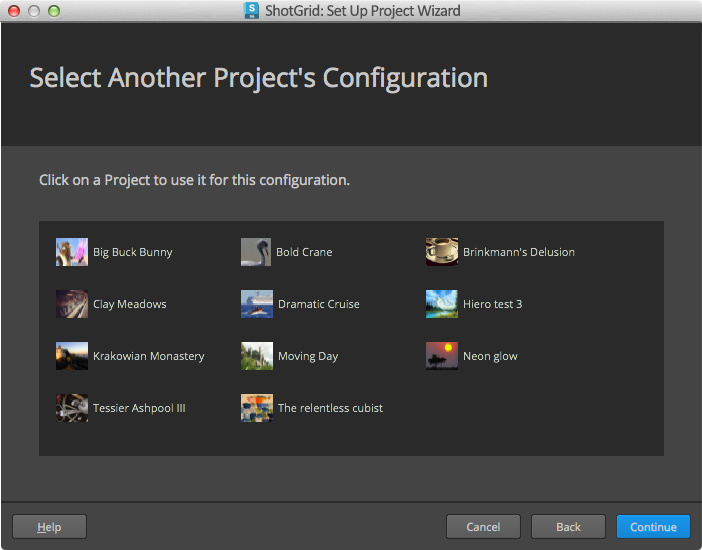
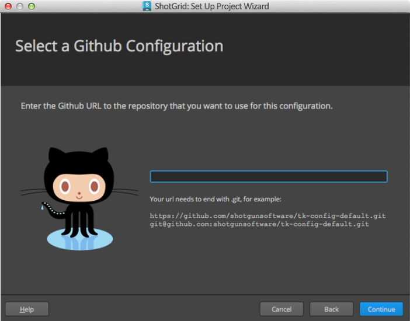

#  集成管理员手册

## 简介

本文档是面向  集成管理员的手册。它适用于三个角色之一：用户、管理员和开发人员。我们的[用户手册](https://support.shotgunsoftware.com/hc/zh-cn/articles/115000068574)面向将在其日常工作流中使用  集成的最终用户（也就是艺术家），我们的[开发人员手册](https://support.shotgunsoftware.com/hc/zh-cn/articles/115000067513)是面向编写 Python 代码以扩展功能的人员的技术文档。本文档介于这两者之间：面向在工作室实施  集成、管理软件版本以及为发布的文件做出存储决策的人员。

## 标准工作流配置

任何 Toolkit 设置的核心都是工作流配置，即一组 YAML 文件，用于管理从安装的应用到软件版本的所有内容，在某些情况下，甚至包含用于设置您的生产目录结构和文件名的模板。标准工作流配置可以高度自定义，但我们提供两种基础配置。

### 基本配置

即时可用的集成设计为在不需要设置或修改任何配置文件的情况下运行。当您使用即时可用的集成时，没有要管理的内容，但 Toolkit 在后台使用隐式工作流配置，我们称此工作流配置为基本配置。基本配置使三个 Toolkit 应用（面板、发布器和加载器）可用于所有受支持的软件包，并根据您在  中的软件实体来确定在  Desktop 中显示哪些软件包。基本配置不包含文件系统位置支持。当您在项目中使用即时可用的集成时，无论何时启动 Desktop，都会自动更新您的基本配置副本，因此，您始终拥有最新版本的集成。您可以[在此处订阅发行说明](https://support.shotgunsoftware.com/hc/zh-cn/sections/115000020494)，以及[在此处查看 GitHub 中的基本配置](https://github.com/shotgunsoftware/tk-config-basic/)。

### 默认配置

这是高级项目设置的默认基础配置。它包括[文件系统位置支持](https://support.shotgunsoftware.com/hc/zh-cn/articles/219039868)以及一组更广泛的 Toolkit 应用和插件。

您可以[在此处查看 GitHub 中的默认配置](https://github.com/shotgunsoftware/tk-config-default2)。有关默认配置结构的详细说明，请参见工作流配置中的 `config/env/README.md` 文件，或[在此处查看 GitHub 中的默认配置结构](https://github.com/shotgunsoftware/tk-config-default2/blob/master/env/README.md)。

如果您熟悉默认配置的旧结构，请查看[默认配置更新常见问题解答](https://support.shotgunsoftware.com/hc/zh-cn/community/posts/115003376154)。



## 发布器

发布器旨在简化即时可用的工作流和完整工作流配置之间的过渡。在即时可用的设置中，文件在原位发布，这就不必定义模板或文件系统数据结构。项目完成高级设置并具有完整工作流配置后，同一发布插件将识别向应用设置引入模板的情况，并开始将文件复制到其指定的发布位置，然后再进行发布。因此，工作室可以根据需要为具有完整配置的项目按每个环境或按每个 DCC 引入基于模板的设置。对于基于模板的工作流，默认配置是完整配置的，要了解如何为发布应用配置模板，它是一个很好的参考。有关详细信息，请参见 GitHub 中的默认配置中的 [tk-multi-publish2.yml 文件](https://github.com/shotgunsoftware/tk-config-default2/blob/master/env/includes/settings/tk-multi-publish2.yml)。

有关编写适用于发布器的插件的详细信息，请参见[开发人员手册的“发布器”部分](https://support.shotgunsoftware.com/hc/zh-cn/articles/115000067513#Publisher)。

## 配置软件启动

可以使用  轻松地自动检测系统上的宿主应用程序：只需启动  Desktop，选择一个项目，Desktop 将显示它在标准应用程序目录中找到的所有受支持软件包的启动程序。但我们还提供了强大的工具，用于对您工作室中的软件进行更细致的管理。您可以限制应用程序对特定项目、组甚至单个用户的可见性。您可以指定版本、在您的整个站点内取消激活某个给定软件包以及将软件包分组在一起。所有这些均通过  中的软件实体进行管理。

当您创建新  站点时，该站点将有一组默认的软件实体 - 每个受支持的宿主应用程序一个实体。您可以修改这些实体以及添加自己的实体，从而以您所需的方式管理 Desktop 中显示的软件。

要在  中查看您的软件实体，请单击屏幕右上角的配置文件图标打开“管理”(Admin)菜单，然后选择 `Software`。

软件实体具有以下字段：

- **软件名称(Software Name)**：软件在 Desktop 中的显示名称。
- **缩略图(Thumbnail)**：上传用作 Desktop 图标的图像文件。
- **状态(Status)**：控制软件是否可用。
- **插件(Engine)**：内容创建工具的集成名称。
- **产品(Products)**：对于包含不同版本（例如，Houdini 与 Houdini FX）的软件包，可以在此处指定以逗号分隔的列表。 仅在自动检测模式下有效，在手动模式下无效。
- **版本(Versions)**：要显示的软件的特定版本。 可以在此处指定以逗号分隔的列表。仅在自动检测模式下有效，在手动模式下无效。
- **组(Group)**：`Group` 字段值相同的实体将分组在 Desktop 中的单个图标和  中的单个菜单下。例如，可以创建包含 Houdini 和 Nuke 的特效组。
- **默认组(Group Default)**：如果某个组的一个成员选中了 `Group Default`，则单击该组的图标或菜单项将启动该软件。
- **项目(Projects)**：将软件限制到特定项目的一种方式。
- **用户限制(User Restrictions)**：将软件限制到特定用户或组的一种方式。
- **Linux 路径(Linux Path)/Mac 路径(Mac Path)/Windows 路径(Windows Path)**：这些字段用于显式指定操作系统特定的软件路径。
- **Linux 参数(Linux Args)/Mac 参数(Mac Args)/Windows 参数(Windows Args)**：启动软件时附加到命令的命令行参数。

我们可以通过演示一些使用这些字段的方法来详细了解它们如何协同工作。

### 示例：对同一应用程序的多个版本分组，自动检测

假设您的文件系统上有三个版本的 Maya：Maya 2016、Maya 2017 和 Maya 2018。您希望它们均可供您的艺术家使用，但想要将它们分组在 Desktop 中单个图标下。

如果这三个版本的 Maya 安装在您的文件系统上的标准位置，则会自动完成上述操作。当您在 Desktop 中选择一个项目时，它将扫描本地计算机上的标准应用程序目录并找到三个版本。由于您在  中已有一个 Maya 软件实体，在没有指定特定版本或路径的情况下，它将在 Desktop 中显示其找到的所有版本。


下面是需要注意的一些事项：

-  自动检测您的软件时，单个软件实体会生成所有版本的菜单项。
- 任何“路径”(Path)字段均未指定值。软件实体处于自动检测模式，因此假定应用位于标准位置。

这些均将显示在 Desktop 中，如此处所示：一个表示 Maya 的图标，包含一个下拉菜单，其中列出了所有可用版本。如果单击图标本身，将启动最新版本的 Maya。

### 示例：对同一应用程序的多个版本分组，手动模式

将 Maya 存储在您工作室中的非标准文件系统位置完全没有问题。您只需要创建自己的软件实体，并指定路径以让  知道在何处找到您的软件。您的设置可能如下所示：


下面是一些注意事项：

- 与在自动检测模式下不同，此处，每个版本的给定软件包对应一个软件实体。
- 为了将它们分组在一起，请使用 `Group` 和 `Group Default` 字段。 `Group` 值相同的软件实体将被分组在 Desktop 中单个图标下的下拉菜单中，该图标使用 `Group` 值作为其名称。
- 单击该图标本身时，将启动 `Group Default` 处于选中状态的组中的软件。
- **在软件实体上为“Linux 路径”(Linux Path)、“Mac 路径”(Mac Path)或“Windows 路径”(Windows Path)中任何一个__指定值时，该实体将转为手动模式。**  与自动检测模式（路径字段为空时，软件会__显示在 Desktop 中）不同，在手动模式下，仅当为软件指定了路径且在指定路径中存在文件时，软件包才会__在给定操作系统上显示。
- 在此示例中，由于未指定 `Windows Path`，因此三个 Maya 版本均不会显示在 Windows 上的 Desktop 中。

### 示例：按用户或组限制

现在，使用上一个示例，假设我们尚未准备好使 Maya 2018 可供所有用户使用。但我们希望 TD、Dev 和 QA 工程师、Tessa Tester 能对其进行访问。我们可以使用 `User Restrictions` 字段实现这一点。 示例如下：


我们基于上一个示例做了一些更改：

- 组默认值现在是 Maya 2017。我们希望这是正式版本，因此在选中对应复选框的情况下，现在单击 Maya 对应的图标将转到此版本。
- 我们在 `User Restrictions` 字段中添加了一些值：该字段可以接受用户和组，我们添加了“Dev”和“TD”组以及用户“Tessa Tester”。 现在，只有这些人员将会在 Desktop 中看到 Maya 2018。

### 示例：按项目限制软件版本

有时，您希望在您的工作室中对多个项目进行更复杂的版本管理。您可能有个项目面临交付困境，您希望使其不再使用新版本软件更新，而同时该项目的后续事情可能刚开始且能够使用更高版本。在这种情况下，您的软件实体可以设置为如下所示：


需要注意的一些重要事项：

- 此处我们删除了 `Group` 和 `Group Default` 值，因为在给定环境中总是只有一个 Maya 版本将显示在 Desktop 中。
- 我们将所有三个版本的 `Software Name` 均设置为“Maya”。 这样，在每个项目中，用户均将看到一个名称相同的图标，但根据此处配置的内容，它将指向不同的版本。
- 我们将 Maya 2016 的 `Status` 字段设置为 `Disabled`。 我们不再在工作室中使用此版本，且此字段切换在所有项目中的全局可见性。
- 我们针对 Maya 2017 和 Maya 2018 指定了 `Projects` 值。 此 `Projects` 字段用作限制。 Maya 2017 将仅__显示在 Chicken Planet 项目中，而 Maya 2018 将仅显示在 Chicken Planet II 中。
- 请注意，一旦指定了某个软件实体的 `Projects` 值，该软件将仅显示在指定的项目中。 因此，如果您的工作室中除了 Chicken Planet 系列外还有其他项目，您需要为它们明确指定软件。

### 示例：添加自己的软件

出于以下一些原因，除了  Desktop 已在您的系统上自动检测到的软件外，您可能还会添加新的软件实体：

- 您要通过 Desktop 使没有插件的应用程序可供您的用户使用。
- 您有我们没有为其提供集成的内部软件或第三方软件，且您已为其编写自己的插件。
- 您的软件不在标准位置，因此您要手动在  中指定该软件的路径。（这是在上面的“对同一应用程序的多个版本分组，手动模式”示例中所述的情况。）

在这些情况下，您可以添加自己的软件实体。将需要为 `Software Name` 字段设置值。 如果您的软件使用的是内部插件，请在 `Engine` 字段中指定插件名称。 某些工作室可能要在 Desktop 中添加没有  集成的应用，以便为艺术家提供方便。您的艺术家可以直接从 Desktop 启动相应的应用。您甚至可以使用上述所有设置来管理版本和使用限制。在这种情况下，请将 `Engine` 字段保留为空，但需要至少为 `Mac Path`、`Linux Path` 和 `Windows Path` 之一指定值。

## 配置发布的文件路径解析

当您发布文件时，发布器在  中创建一个 PublishedFile 实体，其中包括名为 `Path` 的[文件/链接(File/Link)](https://support.shotgunsoftware.com/hc/zh-cn/articles/219031008)字段。随后，其他用户可能会尝试使用加载器将此文件加载到自己的工作会话中。加载器使用复杂的逻辑来解析多个操作系统中已发布的文件的有效本地路径。

加载器尝试将发布数据解析为路径的方式取决于发布是与本地文件链接关联还是与 `file://` URL 关联。

### 解析本地文件链接

如果您发布的路径与  的“站点偏好设置”(Site Preferences)中定义的任何本地存储相匹配，则在发布时会自动生成本地文件链接。如果发布是本地文件链接，则将会使用其本地操作系统表达方式。请在[此处](https://support.shotgunsoftware.com/hc/zh-cn/articles/219030938)了解有关本地文件链接的详细信息。

如果未针对您当前使用的操作系统定义本地存储的路径，您可以使用环境变量指定本地存储根。环境变量的名称应采用 `SHOTGUN_PATH_<WINDOWS|MAC|LINUX>_<STORAGENAME>` 形式。 因此，如果您要为名为“Renders”的存储根定义 Mac 上的路径，可以创建 `SHOTGUN_PATH_MAC_RENDERS` 环境变量。 下面我们使用该示例进行更深入的讨论：

- 假设您的  站点有一个名为“Renders”的存储根，并指定了以下路径：
- Linux 路径：  `/studio/renders/`
- Windows 路径：  `S:\renders\`
- Mac 路径：  `<blank>`

- 您在使用 Mac。

- 您要使用路径 `/studio/renders/sq100/sh001/bg/bg.001.exr` 将发布加载到您的会话中。

加载器可以解析该路径并推断 `/studio/renders/` 是其存储根部分，但没有为 Mac 定义存储根。 因此，它将查找 `SHOTGUN_PATH_MAC_RENDERS` 环境变量，如果找到，则会将路径中的 `/studio/renders` 替换为其值。

**注意：**如果您定义了 `SHOTGUN_PATH_MAC_RENDERS` 环境变量，并且本地存储“Renders”设置了 Mac 路径，则将使用本地存储值并将记录警告。

**注意：**如果无法针对当前操作系统解析存储，则发出 `PublishPathNotDefinedError`。

### 读取文件 URL

加载器还支持对 `file://` URL 进行解析。 在发布时，如果您发布的路径与您站点的任何本地存储均不匹配，则该路径将另存为 `file://` URL。 与本地文件链接相反，这些路径不是以多操作系统表达方式存储，而只是针对其创建时所在的操作系统进行定义。

如果您尝试在创建 `file://` URL 时所在操作系统之外的其他操作系统上解析该 URL，加载器将尝试使用一系列方法将其解析为有效路径：

- 首先，它将查找三个环境变量 `SHOTGUN_PATH_WINDOWS`、`SHOTGUN_PATH_MAC` 和 `SHOTGUN_PATH_LINUX`。 如果这些已定义，则将尝试按此方式转换路径。例如，如果要尝试在 Windows 中解析 `file:///prod/proj_x/assets/bush/file.txt`，您可以设置 `SHOTGUN_PATH_WINDOWS=P:\prod` 和 `SHOTGUN_PATH_LINUX=/prod` 以提示路径的解析方式。
- 如果要使用多组环境变量以表示多个存储，可以使用后缀扩展以上变量名语法来实现：
- 如果您有一个用于渲染的存储，您可以执行一些操作，例如，定义 `SHOTGUN_PATH_LINUX_RENDERS`、`SHOTGUN_PATH_MAC_RENDERS` 和 `SHOTGUN_PATH_WINDOWS_RENDERS`，以便为引用渲染存储中数据的所有已发布 `file://` URL 提供转换机制。
- 然后，如果您还有一个用于剪辑数据的存储，则可以定义 `SHOTGUN_PATH_LINUX_EDITORIAL`、`SHOTGUN_PATH_MAC_EDITORIAL` 和 `SHOTGUN_PATH_WINDOWS_EDITORIAL`，以便为剪辑存储根提供转换机制。

一旦标准化了这些环境变量，可以考虑将其转换为  本地存储。一旦在  的首选项中定义了它们，系统将会自动提取它们且不需要环境变量。

- 除了上述情况外，在  的首选项中定义的所有本地存储均将以相同方式进行处理。
- 如果定义了本地存储，但缺少操作系统，这可以通过环境变量提供。例如，如果 Linux 和 Windows 上定义了一个名为 `Renders` 的本地存储，则可以通过创建名为 `SHOTGUN_PATH_MAC_RENDERS` 的环境变量进行扩展以支持 Mac。 此项的常规语法为 `SHOTGUN_PATH_<WINDOWS|MAC|LINUX>_<STORAGENAME>`。
- 如果没有匹配的根，则将原样返回文件路径。

示例如下：

假设您在 Linux 上发布了文件 `/projects/some/file.txt`，且生成了使用 URL `file:///projects/some/file.txt` 的  发布。在您的工作室中，Linux 路径 `/projects` 相当于 Windows 上的 `Q:\projects`，因此您希望将完整路径转换为 `Q:\projects\some\file.txt`。

以下所有设置将对此进行处理：

- 基于变量的常规替代：
- `SHOTGUN_PATH_LINUX=/projects`
- `SHOTGUN_PATH_WINDOWS=Q:\projects`
- `SHOTGUN_PATH_MAC=/projects`

- 一个名为“Projects”的  本地存储，进行以下设置：

- Linux 路径：  `/projects`
- Windows 路径：  `Q:\projects`
- Mac 路径：  `/projects`

- 一个名为“Projects”的  本地存储，使用一个环境变量予以增强：

- Linux 路径：  `/projects`
- `Windows 路径：``
- `Mac Path:`/projects`
- `SHOTGUN_PATH_WINDOWS_PROJECTS=Q:\projects`

**注意：**如果在  中定义了一个本地存储 `Renders`，且设置了 `Linux path`，另外还定义了 `SHOTGUN_PATH_LINUX_RENDERS` 环境变量，则将优先使用该存储，忽略该环境变量，并记录警告。一般而言，本地存储定义始终优先于环境变量。

### 高级配置

有关执行已发布的文件路径解析的基本方法的信息，请查看[开发人员参考文档](http://developer.shotgridsoftware.com/tk-core/utils.html#sgtk.util.resolve_publish_path)。

如果您要使用“Advanced Project Setup”，可以通过自定义 `resolve_publish` 核心挂钩添加超出本地文件链接和 `file://` URL 的支持。 可以进行以下自定义：

- 具有关联上传文件的发布可以通过核心挂钩自动下载到适当的缓存位置，且会返回路径。
- 自定义 URL 方案（如 `perforce://`）可以解析为本地路径。

## 浏览器集成

 Toolkit 的浏览器集成是指通过  Web 应用程序中的右键单击上下文菜单访问 Toolkit 应用和启动器。这些菜单（如上文所示）包含针对各种实体类型配置的动作。如果某个项目有多个工作流配置，则将按工作流配置组织动作。通过浏览器集成，您可以从浏览器中启动识别  上下文的内容创建软件（如 Maya 或 Nuke）。


### 浏览器集成简单回顾

多年来， Toolkit 的浏览器集成采用了多种形式。随着技术的改进和安全要求的提高，执行浏览器集成的方法也发生了变化。

**Java 小程序（已弃用）**

第一种执行方法是使用 Java 小程序，通过它从  Web 应用程序访问本地桌面。由于 Java 小程序被认为是可利用的安全风险，因此不能再使用它们，必须弃用。

**浏览器插件（已弃用）**

替换已弃用的 Java 小程序的是浏览器插件，它利用 NPAPI 从  Web 应用程序访问本地桌面。由于 NPAPI 也被认为存在安全风险，主要的 Web 浏览器都已开始阻止其使用。因此必须弃用浏览器插件。

**通过  Desktop 的 websocket v1（旧式）**

在  Desktop 应用中托管 websocket 服务器过去是且现在仍然是从  Web 应用程序与本地桌面通信时所采用的方法。此 websocket 服务器的 RPC API 的第一次执行利用了为之前的 Java 小程序和浏览器插件开发的相同底层技术。当服务器收到来自  的请求时，使用关联项目的工作流配置中的 tank 命令来获取要显示在动作菜单中的命令列表。

**通过  Desktop 的 websocket v2**

websocket 服务器的 RPC API 的第二次实施更改了用于获取、缓存和执行 Toolkit 动作的基本机制。此执行解决了与早期浏览器集成执行有关的许多性能问题，改进了动作菜单的外观组织，并添加了对[即时可用的  集成](https://support.shotgunsoftware.com/hc/zh-cn/articles/115000068574#Getting%20started%20with%20Shotgun%20Desktop)的支持，这些集成无需显式配置 Toolkit 即可使用。这是浏览器集成的当前执行方式。

### 配置

要针对每个实体类型控制向用户显示的动作，可在您的项目工作流配置中修改 YAML 环境文件。首次尝试自定义时要了解和考虑一些事情。

**哪个插件配置？**

在  Web 应用中管理 Toolkit 动作的 Toolkit 插件是 `tk-shotgun`，因此，此插件的配置控制动作菜单中的显示内容。


在上面的 [tk-config-basic](https://github.com/shotgunsoftware/tk-config-basic/) 示例中，配置了两个应用，它们会使很多插件命令转换为菜单动作。Toolkit 应用将注册要包含在动作菜单中的命令，包括本地系统上发现的每个软件包的启动器命令，这些命令对应于  站点中的[软件实体](https://support.shotgunsoftware.com/hc/zh-cn/articles/115000067493#Configuring%20software%20launches)列表。结果是此处所示菜单动作列表：


浏览器集成代码找到用户系统上安装的 Houdini、Maya、Nuke 和 Photoshop，从而产生用于启动其中每个集成的菜单动作。请注意，在给定的环境配置文件中，必须存在软件实体的插件，才会针对该环境的实体显示软件的启动器。__ 因此，在此示例中，从中获取此代码片段的文件中必须存在 `tk-houdini`、`tk-maya`、`tk-nuke` 和 `tk-photoshopcc` 所有这些插件。 如果要从此实体的启动器列表中移除某项（例如 Maya），只需从环境配置文件中移除 `tk-maya` 插件块。

除了这些启动器外，发布应用的“发布...”(Publish…)命令也包含在菜单中。

**哪个 YML 文件？**

您可以采用两种途径之一：利用主要环境配置 (`config/env/*.yml`)（由配置的 [pick_environment.py 核心挂钩](https://github.com/shotgunsoftware/tk-core/blob/master/hooks/pick_environment.py)控制），或 [tk-config-default](https://github.com/shotgunsoftware/tk-config-default/) 使用的传统方法（使用 `config/env/shotgun_<entity_type>.yml` 文件）。

如果使用标准环境文件，则浏览器集成使用 `pick_environment` 核心挂钩来确定将哪个环境配置文件用于给定实体的动作菜单。 在最简单的情况下，环境对应于实体类型。例如，如果右键单击镜头，则显示的动作菜单将由 `config/env/shot.yml` 中的 `tk-shotgun` 块配置。 可以自定义 `pick_environment` 挂钩以使用更复杂的逻辑。 如果标准环境文件中没有配置 `tk-shotgun` 插件，则存在 `shotgun_<entity_type>.yml` 文件时发生回退。 这样，浏览器集成可以使用利用实体特定的环境文件的旧配置。

**_提示：使用 tk-config-default2 从浏览器启动器中移除软件_**

更新用于从  浏览器启动软件的配置会有所不同，具体取决于使用的是 tk-config-default 还是 tk-config-default2。

使用 tk-config-default2 时，更新应该应用于 config/env/includes/settings/[`tk-shotgun.yml`](https://github.com/shotgunsoftware/tk-config-default2/blob/v1.1.10/env/includes/settings/tk-shotgun.yml)，而使用 tk-config-default 时，更新应该应用于 config/env/`shotgun_task.yml`。

例如，通过浏览器从资产启动时，从选项列表中移除 Mari。

首先，导航至 [`config/env/asset.yml`](https://github.com/shotgunsoftware/tk-config-default2/blob/v1.1.10/env/asset.yml#L47) 并注意 `tk-shotgun` 插件块如何指向 [`@settings.tk-shotgun.asset`](https://github.com/shotgunsoftware/tk-config-default2/blob/v1.1.10/env/asset.yml#L47)。`@` 符号表示配置值来自包含的文件。 这意味着您需要转到 [env/includes/settings/`tk-shotgun.yml`](https://github.com/shotgunsoftware/tk-config-default2/blob/v1.1.10/env/includes/settings/tk-shotgun.yml) 进行更新。

在 `env/includes/settings/tk-shotgun.yml` 中，注意每个实体的每个块。 例如，资产为：
```
<a name="asset"></a>
# asset
settings.tk-shotgun.asset:
  apps:
    tk-multi-launchapp: "@settings.tk-multi-launchapp"
    tk-multi-launchmari: "@settings.tk-multi-launchapp.mari"
    tk-multi-launchmotionbuilder: "@settings.tk-multi-launchapp.motionbuilder"
    tk-multi-publish2: "@settings.tk-multi-publish2.standalone"
    tk-multi-screeningroom: "@settings.tk-multi-screeningroom.rv"
    tk-shotgun-folders: "@settings.tk-shotgun-folders"
    tk-shotgun-launchfolder: "@settings.tk-shotgun-launchfolder"
  location: "@engines.tk-shotgun.location"
```

要通过浏览器从资产的选项列表中移除 Mari，请移除 Mari 行 ([`tk-multi-launchmari: "@settings.tk-multi-launchapp.mari"`](https://github.com/shotgunsoftware/tk-config-default2/blob/master/env/includes/settings/tk-shotgun.yml#L29))：

```
<a name="asset"></a>
# asset
settings.tk-shotgun.asset:
  apps:
    tk-multi-launchapp: "@settings.tk-multi-launchapp"
    tk-multi-launchmotionbuilder: "@settings.tk-multi-launchapp.motionbuilder"
    tk-multi-publish2: "@settings.tk-multi-publish2.standalone"
    tk-multi-screeningroom: "@settings.tk-multi-screeningroom.rv"
    tk-shotgun-folders: "@settings.tk-shotgun-folders"
    tk-shotgun-launchfolder: "@settings.tk-shotgun-launchfolder"
  location: "@engines.tk-shotgun.location"
```

然后，针对每个实体（例如镜头）按照相同的说明进行操作，从中移除在  浏览器中启动特定软件的功能。请注意，保存文件后，您可能需要等待一分钟并对浏览器进行硬刷新才能使其生效。

### 缓存

浏览器集成具有强大的缓存机制，可以快速向用户显示菜单动作。由于引导 Toolkit 和获取插件命令列表的过程可能很耗时，因此这是很有必要的。

**缓存何时失效？**

websocket 服务器的 RPC API 根据以下两项来确定缓存的数据是否仍有效：YAML 文件修改时间和站点的软件实体的内容。如果自写入缓存数据后对给定配置中的某个环境 YAML 文件进行了修改，则重新缓存必要的数据，并向  Web 应用程序返回最新数据。同样，如果自数据缓存后对  中任何软件实体的任何字段进行了修改，则引导 Toolkit 并缓存新数据。

**缓存文件位于磁盘上的什么位置？**

缓存文件位置取决于操作系统。

```
OS X: ~/Library/Caches/Shotgun/<site_name>/site.basic.desktop/tk-desktop
Windows: %APPDATA%\Shotgun\<site_name>\site.basic.desktop\tk-desktop
Linux: ~/.shotgun\<site_name>\site.basic.desktop\tk-desktop
```

### 挂钩方法

`browser_integration.py` 挂钩包含在 `tk-framework-desktopserver` 中，后者提供以下挂钩方法：

- `get_cache_key`：此方法确定给定配置 URI、项目实体和实体类型的缓存条目键。默认执行组合了配置 URI 和实体类型。
- `get_site_state_data`：此方法可用于将来自  的其他查询数据包含到用于测试缓存数据有效性的哈希中。默认情况下，使用站点中存在的所有软件实体的状态，但如果应在哈希中包含其他数据，可以在此挂钩方法中执行。
- `process_commands`：此方法提供用于自定义或更改要返回到  Web 应用程序的命令的位置。向方法提供的数据结构是词典列表，每个词典代表一个菜单动作。可以根据需要更改、过滤掉数据或将数据添加到列表中，数据将立即反映在请求 Toolkit 动作的菜单中。

### 日志

浏览器集成的日志位于 Toolkit 的[标准日志位置](https://developer.shotgridsoftware.com/zh_CN/38c5c024/)。相关日志文件是 `tk-desktop.log` 和 `tk-shotgun.log`。 此外，如果使用的是 Google Chrome，有时部分相关日志输出会保存在该浏览器的开发人员控制台中。

### 疑难解答

从 Web 应用程序与本地桌面通信的复杂特性意味着中途可能会有故障点。下面介绍了几种此类情况以及在遇到这些情况时首先要采用的一些步骤建议。

动作菜单中显示**“打开或安装  Desktop...”(Open or install ShotGrid Desktop…)**


这可能意味着以下三种情况之一：

1. 本地计算机上当前未运行  Desktop。这似乎很明显，但一定要检查确认。

2. Chrome 或 Python websocket 服务器已拒绝连接，从而导致  Web 应用程序无法与  Desktop 通信。这种情况很可能与用于在请求时允许连接继续的自签名证书有关。从头开始重新生成这些证书通常可以解决该问题，可以从  Desktop 触发此操作，如下所示。


1.  Desktop 的 websocket 服务器无法在启动时启动。可能仅在公开发布的 websocket 服务器版本错误时出现此情况，这应该极少发生。在这种情况下，日志记录将位于 [tk-desktop.log](https://developer.shotgridsoftware.com/zh_CN/38c5c024/) 中，用于说明该错误，可以将其[发送到  的支持团队](https://support.shotgunsoftware.com/hc/zh-cn/requests/new)。

**动作菜单中未显示任何动作**


如果此实体类型应该有动作，这表示出现配置问题。下面是一些可能的问题：

1. 在正确的环境 YAML 文件中配置了 `tk-shotgun` 插件，但该配置中没有应用。 在此情况下，可能是有意设计此实体类型没有动作。

2. 在正确的环境 YML 文件中配置了 `tk-shotgun` 插件，且存在应用，但菜单中仍未显示动作。 这可能是由于应用无法初始化。在此情况下，可以在 [tk-shotgun.log 和 tk-desktop.log](https://developer.shotgridsoftware.com/zh_CN/38c5c024/) 中找到描述相关问题的信息。

3. 对应于此实体类型的环境不包含 `tk-shotgun` 的配置。 此处的最终结果与此列表中的第一种情况相同。在此情况下，您可以查看工作流配置的 `pick_environment` 挂钩来确定正在为此实体类型加载哪个环境，可以在那里验证 `tk-shotgun` 的配置。

4. 有一个缓存在磁盘上的空菜单动作列表。要强制重新生成缓存，可使用以下几种选项：

   - 在项目的配置中更新 YAML 文件的修改时间。这样， 下一次请求菜单动作时，将触发重新缓存这些菜单动作。值得注意的是，这将触发参与项目的所有用户进行重新缓存。__
   - 在  站点中更新任何软件实体中的字段值。该行为与上述涉及 YAML 文件修改时间的选项相同，但将使  站点上_所有_项目中所有用户的缓存数据无效。软件实体是非项目实体，这意味着它们在所有项目之间共享。如果更改了任何软件实体中的数据，则会影响所有项目。
   - 可以在出现问题的主机上删除缓存文件。移除缓存通常没有问题，因为缓存存储在每个主机本地，这仅会导致在相应系统上从头开始重新缓存数据。缓存存储在  缓存位置中的以下 SQLite 文件中：`<site-name>/site.basic.desktop/tk-desktop/shotgun_engine_commands_v1.sqlite`

**“Toolkit: 正在检索动作...”(Toolkit: Retrieving actions…)始终不替换为菜单动作**


出现此情况有几种可能：

1. websocket 服务器尚未完成动作缓存。如果这是对项目的配置进行重大更新后第一次检索动作，该过程可能需要一些时间才能完成。多等待一段时间，然后观察 `tk-desktop.log` 的内容看看是否仍在处理。

2. websocket 服务器无法响应且永远不会响应。这种情况应该很少出现，但如果在请求动作后很明显没有其他处理操作正在进行（如 `tk-desktop.log` 中所示），那应该就是出现了这种情况，此时请[联系 ShotGrid 支持](https://support.shotgunsoftware.com/hc/zh-cn/requests/new)并提供相关日志数据。

3. 用户在多个  站点上工作。在单个站点上对  Desktop 进行身份认证后，从另一个  站点请求菜单动作会导致系统询问用户是否重新启动  Desktop 并登录新站点。如果忽略该请求，则另一个站点将永远不会收到菜单动作列表。


## Toolkit 配置文件

如果您的工作室使用代理服务器，如果您要在初始登录屏幕中预填充某些值，或者如果您要调整基于浏览器的应用程序启动器与  Desktop 的集成方式，有一个名为 `toolkit.ini` 的特殊配置文件。 Desktop 无需此文件即可运行；仅当您需要配置其行为时才需要它。Toolkit 按以下顺序在多个位置查找该文件：

1. 指向文件路径的名为 `SGTK_PREFERENCES_LOCATION` 的环境变量。
2. 在  Toolkit 首选项文件夹中：（请注意，默认情况下这些位置不存在此文件；您必须创建此文件。）
   - Windows： `%APPDATA%\Shotgun\Preferences\toolkit.ini`
   - macOS：  `~/Library/Preferences/Shotgun/toolkit.ini`
   - Linux： `~/.shotgun/preferences/toolkit.ini`

通过 `SGTK_PREFERENCES_LOCATION` 环境变量选项，您可以将您的配置文件存储在计算机或网络上的其他位置。 请注意，`toolkit.ini` 为当前标准文件名。 如果您使用的是 `config.ini`，请参见下面的“旧位置”部分。__

您可以参见[此处](https://raw.githubusercontent.com/shotgunsoftware/tk-framework-desktopstartup/master/config.ini.example)一个记录的配置文件示例。

请注意，此示例文件名为 `config.ini`，但可以重命名为  `toolkit.ini`

另请注意，您可以在此文件中使用环境变量以及硬编码值，以便您可以执行一些操作，例如，通过 Windows 上存在的 USERNAME 变量提取默认的用户名作为建议提供给用户。


**旧位置（已弃用）**

尽管 `toolkit.ini` 为当前标准文件名，我们以前出于相同目的使用了 `config.ini` 文件。 `toolkit.ini` 和 `config.ini` 的内容相同。 搜索 `config.ini` 时将使用以下已弃用的位置：

1. 指向文件的名为 `SGTK_DESKTOP_CONFIG_LOCATION` 的环境变量。
2. 在以下路径中：
   - Windows： `%APPDATA%\Shotgun\desktop\config\config.ini`
   - macOS：  `~/Library/Caches/Shotgun/desktop/config/config.ini`
   - Linux： `~/shotgun/desktop/config/config.ini`

**代理配置**

如果您的工作室通过代理访问 Internet，您将需要告诉 Toolkit 在访问 Internet 时使用此代理。可以将您的代理指定为 `http_proxy` 设置的值来完成此操作：

`http_proxy: <proxy_server_address>`

**使用本地托管站点时运行  Desktop**

如果您的  站点 URL 不是以 `shotgunstudio.com` 或 `shotgrid.autodesk.com` 结尾，表示您正在运行本地  站点。在这种情况下，可能是您的站点尚未完全准备好实施  集成， 团队可能需要参与进来并进行一些小的调整，然后您才能继续！在这种情况下，[请提交工单](https://support.shotgunsoftware.com/hc/zh-cn/requests/new)，我们将帮助您解决问题。

**使用本地托管站点时连接到应用商店**

如果您要在使用本地  站点时通过代理访问 Internet，您可能希望设置一个 HTTP 代理用于访问应用商店，但不用于访问本地  网站。为此，只需将以下行添加到 `toolkit.ini`：

`app_store_http_proxy: <proxy_server_address>`

其中 `<proxy_server_address>` 是一个遵循[开发人员文档](http://developer.shotgridsoftware.com/python-api/reference.html?highlight=reference%20methods#shotgun-methods)

如果您需要按每个项目覆盖此设置，可以在项目工作流配置的 `config/core/shotgun.yml` 中完成此操作。

## 脱机使用情况

在常规使用中， Desktop 会在启动时自动检查 Desktop 应用本身、tk-desktop 插件和基本配置是否有更新。但是，在某些情况下，您可能需要在脱机时或在与 Internet 完全断开连接的计算机上运行集成。以下部分介绍了如何处理其中每种情况。

###  创建

本文档中所述的用于解决脱机使用情况的方法也适用于 [ Create](https://support.shotgunsoftware.com/hc/zh-cn/articles/360012554734) 中提供的集成功能。当以与  Desktop 相同的方式使用  Create 时，用于定制  Toolkit 行为的各种环境变量（例如 `SHOTGUN_BUNDLE_CACHE_FALLBACK_PATHS`）适用。

### 脱机时运行集成

_情况：我要运行  集成，但未连接到 Internet。我们有本地  安装。_

**解决方案**

- 如果您可以临时连接到 Internet，只需下载  Desktop。它预先打包了一组[集成](https://support.shotgunsoftware.com/hc/zh-cn/articles/115000068574#Introduction)，且预先捆绑了适用于所有受支持 DCC 的  集成所需的各种应用和插件。启动后，它将自动尝试查找升级，但如果无法连接到  应用商店，它将仅运行本地的最新版本。

**补充知识**

- 某些 Toolkit 操作（例如注册发布）需要访问  站点。因此，此解决方案仅适用于本地托管的站点。
- 更新下载到本地计算机。
- 如果您在连接和断开连接之间切换，Desktop 以及应用内集成（例如 Maya 和 Nuke 内部的集成）只要处于连接状态，就将在启动时下载升级。

### 通过手动下载管理更新

_情况：我们的美工人员工作站已断开 Internet 连接，因此无法在 Desktop 中使用自动更新。我们仍想获得更新，但必须通过单台联机计算机下载它们，然后手动将它们传输给艺术家或传输到一个集中位置。_

**解决方案**

- 在连接到 Internet 的工作站上运行  Desktop。该工作站启动后，在 Desktop 启动时将自动下载最新升级。
- 选项 1：共享 Desktop 包
- 将[包缓存](https://developer.shotgridsoftware.com/zh_CN/7c9867c0/)复制到所有计算机都可以访问的共享位置。
- 在脱机计算机上设置 `SHOTGUN_BUNDLE_CACHE_FALLBACK_PATHS` 环境变量以指向此位置。
- 在脱机计算机上启动 Desktop 后，它们将选取缓存中可用的最新升级。
- 选项 2：本地部署
- 将更新的缓存分发到每台本地计算机上正确的缓存位置。

**补充知识**

- 采用选项 1 时，将从 `SHOTGUN_BUNDLE_CACHE_FALLBACK_PATHS` 中定义的位置加载 Toolkit 代码。 如果此位置在共享存储上，请确保它的性能足够高，能够加载许多小文件。
- 对于 Windows 设置，通常不会遇到这种情况。此时，我们改为建议采用选项 2。

## 锁定更新

虽然 Desktop 的自动更新可以确保您始终拥有最新版本，但有时您希望冻结某个项目甚至整个站点，从而将其锁定到特定版本并阻止任何更新。

### 针对单个项目冻结更新

_情况：我的项目将要打包，我希望将其冻结，以便不会自动下载  集成更新。_

**解决方案**

- 确定要将项目锁定到的版本。  [可以在此查找集成版本。](https://support.shotgunsoftware.com/hc/zh-cn/sections/115000020494)
- 在  中，为要锁定的项目创建工作流配置实体，并填充以下字段（在此示例中，我们将配置锁定为使用集成 v1.0.36）：
- 配置名称(Config Name)：  `Primary`
- 项目(Project)：要锁定的项目
- 插件 ID(Plugin ids)：  `basic.*`
- 描述符(Descriptor)：  `sgtk:descriptor:app_store?name=tk-config-basic&version=v1.0.36`

- 现在，在该项目上启动  Desktop 的任何人都将始终使用 v1.0.36。开始处理该项目的任何新用户也将获取 v1.0.36。


**补充知识**

- 更新下载到本地计算机。
- 用户下次在连接到 Internet 的情况下启动 Desktop 时，基本配置 `v1.0.36` 及其所有相关代码将下载到他们的计算机。
- `basic.*`  表示基本配置中的所有插件都将选取此覆盖。 例如，如果您想要仅冻结 Nuke 和 Maya 集成，可以指定 `basic.maya, basic.nuke`。
- 要进行测试，您可以创建此工作流配置实体的副本，并将您的用户名添加到 `User Restrictions` 字段中。 这将限制该实体，使其仅可供您使用，而不会影响其他用户。然后，您可以从此配置副本启动 Maya 或某些其他软件，并确认它运行的是预期的集成版本。

**已知问题**

- Flame 集成的命名空间为 `basic.flame`，从表面上看应该包含在 `basic.*` 中。 但实际上 Flame 集成并不包含在基本配置中。因此，如果您在某个项目中使用 Flame，然后执行此覆盖，则 Flame 集成将停止工作。
- 解决方案是专门为 Flame 创建另一个工作流配置覆盖：
- 配置名称(Config Name)：  `Primary`
- 项目(Project)：要锁定的项目（如果要锁定所有项目，则为空）
- 插件 ID(Plugin ids)：  `basic.flame`
- 描述符(Descriptor)：  `sgtk:descriptor:app_store?name=tk-config-flameplugin`

### 针对站点冻结更新

_情况：我不需要任何更新。我想要在我的工作室中完全控制所有项目中的下载内容和使用内容。_

**解决方案**

- 按照上面示例中的步骤操作，但保留 `Project` 字段为空。 在 `Project` 字段中无覆盖的情况下，此工作流配置实体将应用于所有项目，包括“站点”项目，即，Desktop 在任何项目之外使用的站点配置。


**补充知识**

- 这是想要“锁定站点配置”时使用的工作流。这将锁定所有内容，然后您可以通过 Desktop 菜单继续执行高级项目设置。
- 如果将整个站点锁定为使用某个版本（例如 `v1.2.3`），您仍可将单个项目锁定为使用其他配置。

**已知问题**

- Flame 会受此影响。有关解决方案，请参见上述情况的“已知问题”部分。

### 针对除一个项目以外的其他所有项目冻结更新

_情况：我想要锁定站点中除测试项目以外的其他所有项目，而在测试项目中仍允许自动更新。_


**解决方案**

- 按上述部分中所述，针对站点冻结更新。
- 使用以下字段值配置例外项目的工作流配置实体：
- 配置名称(Config Name)：  `Primary`
- 项目(Project)：不希望锁定的项目__
- 插件 ID(Plugin ids)：  `basic.*`
- 描述符(Descriptor)：  `sgtk:descriptor:app_store?name=tk-config-basic`

**补充知识**

- 请注意，项目的“描述符”(Descriptor)字段中忽略了版本号。这将意味着项目追踪最新版本的基本配置。

### 安全升级锁定的站点

- 情况：我们已锁定到 v1.0.0，并希望升级到 v2.0.0，但我想在将新版本部署到工作室之前先对其进行测试。*

**解决方案**

- 通过右键单击并选择“复制选定项”(Duplicate Selected)，在  中复制工作流配置实体。
- 将克隆的配置命名为“update test”，并在“用户限制”(User Restrictions)字段中指定您自己。
- 现在，您将开始使用此工作流配置。
- 将“描述符”(Descriptor)更改为指向要测试的版本。
- 您可以根据需要在“用户限制”(User Restrictions)字段中添加用户以邀请他们参与测试。
- 对测试满意后，只需将主工作流配置更新为使用该版本即可。
- 用户重新启动 Desktop 或 DCC 后，此更新将生效。

## 接管工作流配置

在没有设置任何配置的情况下，您将获得一组即时可用的基本  集成，本文档介绍了使用这些即时可用的集成可以完成的各种管理工作。此基本设置建立在  的 Toolkit 平台上，支持更加丰富的自定义。在 Desktop 中，Toolkit 项目设置向导将引导您完成为项目创建一个完整的可自定义工作流配置的过程。

以下各部分通过示例和合理默认值建议详细介绍了向导的每个步骤，以防您不确定如何设置内容。

#### 从 Desktop 启动设置向导


导航至某个项目后，Desktop 右下方的用户菜单中将会有一个“Advanced Project Setup...”菜单项。单击此菜单项可启动 Toolkit 设置向导。

#### 选择配置类型


开始配置新项目时，首先要确定使用哪个配置模板__。 配置模板基本上是完整的项目配置，包含运行项目所需的所有设置、文件系统模板、应用和逻辑。

- 如果这是您的第一个项目，请使用  默认值以便快速入门。
- 如果您已配置过项目且有以前项目的配置，则可以基于现有项目创建新项目来轻松重用这些配置。
- 对于高级工作流，您可以使用外部配置或 Git 库中存储的配置。

#### 默认配置模板


如果您要从头开始，就从此处开始。默认配置中包含采用默认文件结构和文件命名约定设置的所有最新应用和插件。

安装了默认配置后，您可以手动调整配置文件，并对其进行自定义以满足工作流的特定需求。建立并运行了项目后，您可以基于此配置创建下一个项目。

##### 默认配置

这是默认的 Toolkit VFX 配置，通常是开始设置各项内容的重要开端。该配置包含 3ds Max、Flame、Houdini、Nuke、Mari、Maya、Motionbuilder 和 Photoshop 设置，以及磁盘上简单明了的文件夹设置。

该配置包含多个不同部分：

- 文件系统设置
- 一组用于标识磁盘上关键位置的模板
- 一组预配置的插件和应用，它们一起链接在工作流中。

**文件系统概述**

在  中，标准配置处理资产和镜头。它按工作流工序划分各项内容。一个工作流工序类似于一个部门。每个工作流工序均包含用于各种受支持应用程序的工作和发布区域。镜头结构如下所示：


**应用程序和工作流**

该配置包含以下部分：

- Maya、Mari、Nuke、3ds Max、Flame、Houdini、Photoshop 和 Motionbuilder 支持
-  应用程序启动器
- 发布、创建快照和版本控制
- 一个 Nuke 自定义写入节点
-  集成
- 多个其他工具和实用程序

除了上述应用外，您可以在安装了配置后轻松地安装其他应用和插件。

#### 基于现有项目创建新项目



使用以前项目中的所有默认值和设置来创建并运行新项目，此方法既快捷又方便。Toolkit 仅将整个配置从旧设置复制到新项目中。这是用于改进配置的简单实用方法 - 每个新项目均基于某个旧项目。

有关如何改进和维护工作流配置的详细方法和文档，请参见此处：

[管理项目配置](https://support.shotgunsoftware.com/hc/zh-cn/articles/219033168#Inheriting%20the%20config%20from%20your%20previous%20project)

#### 使用 Git 中的配置模板



如果您要使项目的配置与源控制保持连接，请使用此选项。指定指向远程 Git 库或 Github 库的 URL，设置流程将为您克隆它。请注意，这不仅仅是 Github，而是与任何 Git 库一起使用。请务必确保存储库的路径以 `.git` 结尾，Toolkit 将尝试将其作为 Git 设置进行处理。 由于您的项目配置是 Git 库，您可以提交您所做的任何更改并将其推送至您的主存储库，进而推送至其他项目。通过使用基于 Github 的配置，可以轻松地使多个 Toolkit 项目保持同步。可在此处了解详细信息：

[管理项目配置](https://support.shotgunsoftware.com/hc/zh-cn/articles/219033168#A%20studio%20configuration%20in%20git%20source%20control)

请注意，如果您运行的是 Windows，则需要将 Git 安装在您的计算机上，并可以通过 `PATH` 访问。 在 Linux 和 Mac OS X 上，通常默认安装 Git。

#### 浏览配置模板


如果您的配置在磁盘上（以文件夹形式，或压缩为 zip 文件），请使用此选项。如果有人通过电子邮件向您发送了配置，或如果您在磁盘上保留了一个主配置，您基于它来建立所有项目，这会很有用。这通常是专家选项，我们建议使用另一个项目的配置或我们的应用商店默认配置中的一个。

#### 设置存储

每个 Toolkit 项目均会将其所有文件和数据写入到磁盘上的一个或多个共享存储位置。例如，某个配置可能需要一个存储用来存放纹理，一个用来存放渲染，以及一个用来存储场景文件。通常，在  的“站点偏好设置”(Site Preferences)中的_“文件管理”(File Management)_选项卡下控制这些存储。

Toolkit 设置向导将要求您将配置所需的每个存储根映射到  中的一个本地存储。


所需根在左侧列出并显示其说明（如配置的 `roots.yml` 文件中所定义）。 现有的  本地存储列表在右侧列出。您必须为每个所需根选择一个存储，并输入当前操作系统的路径（如果  中还不存在）。

您还可以添加其他操作系统的路径（如果未定义）。现有路径会被锁定，以确保您不会意外影响可能依赖相应存储路径的其他项目。向导中的映射页面将确保您已映射每个所需根，并且每个映射都有效。

您也可以在向导中选择存储选择列表末尾的 `+New` 项来创建新的本地存储。 系统将提示您提供本地存储名称和当前操作系统的路径。

设置项目时，Toolkit 将在每个存储位置中为每个新项目创建一个文件夹。例如，如果您的主存储位置为 `/mnt/projects`，则称为 _The Edwardian Cry_ 的项目最后将位于 `/mnt/projects/the_edwardian_cry` 中。 如果配置不仅仅使用主存储，则每个存储最后将有一个 `the_edwardian_cry` 文件夹。

主存储位置通常类似于 `/mnt/projects` 或 `\\studio\projects`，且通常是一个您已在存储项目数据的位置，位置按项目分组。 它几乎始终位于共享网络存储上。

#### 选择项目文件夹名称


现在要为项目选择磁盘名称。将在配置所需的所有不同存储中创建此文件夹。您可以在 UI 中查看快速预览 - 对于大多数配置，这将仅预览主存储，但如果使用多根配置，其他存储也会显示。Toolkit 将根据  中的名称建议一个默认项目名称。可以随意调整它以创建适合您的设置的名称。

#### 选择配置位置


最后，请确定磁盘上存放配置文件的位置。Toolkit 将根据以前的项目建议一个位置，以使它们最终全部位于磁盘上的同一位置。

配置通常位于共享存储或磁盘上，以便工作室中需要该配置的所有用户均可以访问它。如果您计划在此项目中使用多个操作系统，请确保输入所有必要的路径。所有路径均应表示磁盘上的同一位置。通常，在 Mac OS X 和 Linux 上路径可以相同，但在 Windows 上不同。

如果这是您的第一个项目，您通常要确定磁盘上一个用于存储您的所有将来工作流配置的共享区域。这通常是存储整个工作室共享的软件或软件设置的位置。该位置可能类似于 `/mnt/software/shotgun`。 根据您的工作室网络和文件命名约定，该位置可能会有所不同。

在设置第一个配置时，请在配置中为您的工作室中使用的所有平台设置路径。从而，将来能够轻松创建可从所有计算机访问的环境。假设您的项目名称为 _Golden Circle_，您可以键入以下三个路径：
```
linux:   /mnt/software/shotgun/golden_circle
macosx:  /servers/production/software/shotgun/golden_circle
windows: \\prod\software\shotgun\golden_circle
```

#### 有了配置后可以做什么？

当您完成并运行第一个配置后，请导航到“后续步骤”文档，详细了解如何配置和调整 Toolkit，以更好地满足您的工作室需要：

[在您的第一个项目基础上更进一步](https://support.shotgunsoftware.com/hc/zh-cn/articles/219040688)

您还可以参见[高级项目设置文档](https://support.shotgunsoftware.com/hc/zh-cn/articles/219039808)了解详细信息。

## 高级功能

### 静默安装

如果在 Windows 网络中，可以使用参数“/S”强制 .exe  Desktop 安装程序执行静默安装。然后，您可以将可执行文件的快捷方式的副本推送至启动文件夹。
