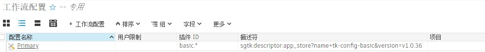
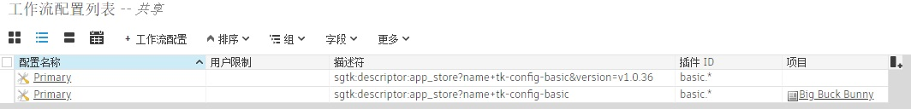

# 脱机使用和禁用自动更新

- [自动更新](#auto-updates)
   - [哪些部分会自动更新？](#what-parts-auto-update)
   - [哪些部分不会自动更新？](#what-doesnt-auto-update)
- [脱机运行集成](#running-the-integrations-offline)
   - [初始设置](#initial-setup)
   - [管理更新](#managing-updates)
- [禁用自动更新](#disabling-auto-updates)
   - [在项目级别或站点级别禁用更新](#disabling-updates-at-a-project-or-site-level)
   - [针对除一个项目以外的其他所有项目禁用更新](#disabling-updates-for-all-but-one-project)
   - [升级](#upgrading)

## 自动更新
### 哪些部分会自动更新？

默认情况下， Desktop 将自动检查更新，并在找到更新时将其安装到本地计算机。

它会检查两个组件的更新：

- `tk-framework-desktopstartup` - 用于帮助启动  Desktop 的框架。
- `tk-config-basic` - 默认站点配置。

该配置用作保存  Desktop 应使用的应用、插件、框架和核心版本的清单文件。
更新该配置也可能会更新其中的任何组件。找到的任何更新都将下载并存储在用户的本地缓存中，而不是修改原始的  Desktop 安装文件。

 Create 作为应用程序，具有与  Desktop 不同的独立更新机制，此处未涵盖此内容。
但是  Create 中提供的集成功能以类似的方式工作，而且还会将 `tk-config-basic` 自动更新到同一用户缓存中。

### 哪些部分不会自动更新？

- 如果您已接管站点配置，则系统不会检查是否有较新的 `tk-config-basic` 更新，相关详细信息[请见下文](#disabling-updates-at-a-project-or-site-level)。

- 未使用默认站点配置的任何项目（即，对其运行了 Toolkit 高级设置向导的项目）的配置不会自动更新。

- 与  Desktop 捆绑在一起的资源（如 Python 和 QT）不会自动更新。
   我们有时会在需要更新这些部分时发布新的  Desktop 安装程序。

## 脱机运行集成

### 初始设置

如果您的工作室 Internet 访问受限或无法访问 Internet，则需要确保在本地缓存所需的所有部分。您仍需要一台可以连接到 Internet 的计算机，以便下载  Create 或  Desktop。

 Desktop 预先打包了运行基本集成所需的所有依存项。
虽然  Create 也捆绑了这些依存项，但您仍需按照[管理更新](#managing-updates)中提及的步骤进行操作。

启动任一项后，它将自动尝试查找更新，但如果无法连接到  应用商店，它将仅运行本地的最新版本。

建议在安装  Desktop 后，按照下面的[管理更新](#managing-updates)步骤操作，因为与安装程序捆绑在一起的组件可能不是最新组件。





### 管理更新

要更新 `tk-framework-desktopstartup` 组件，您需要[下载最新版本](https://github.com/shotgunsoftware/tk-framework-desktopstartup/releases)，并将环境变量 `SGTK_DESKTOP_STARTUP_LOCATION` 设置为指向其在磁盘上的位置（这仅适用于  Desktop）。

对于 `tk-config-basic` 组件，由于它的所有依存项，情况有点棘手。

1. 在连接到 Internet 的工作站上运行  Desktop 或  Create。 当它启动时，将会自动下载最新升级。（确保未在此计算机上设置 `SHOTGUN_DISABLE_APPSTORE_ACCESS`。）
2. 将缓存复制到所有计算机都可以访问的共享位置。
3. 在脱机计算机上设置 `SHOTGUN_BUNDLE_CACHE_FALLBACK_PATHS` 环境变量以指向此位置。
4. 在脱机计算机上启动  Desktop 或  Create 后，它们将选取缓存中可用的最新升级。



## 禁用自动更新

### 在项目级别或站点级别禁用更新



要对集成禁用自动更新，请按照以下步骤操作。

1. 确定要使用的版本。您可以在[此处](https://support.shotgunsoftware.com/hc/en-us/sections/115000020494-Integrations)查找集成版本。
2. 在  中，在项目或全局页面上创建工作流配置实体，并填充以下字段（在此示例中，我们将配置锁定为使用集成 v1.0.36）：

   1. 名称(Name)：`Primary`
   2. 项目(Project)：如果希望对所有项目禁用更新，请保留为空；如果仅希望锁定单个项目，请选取特定项目。
   3. 插件 ID(Plugin ids)：`basic.*`
   4. 描述符(Descriptor)：`sgtk:descriptor:app_store?name=tk-config-basic&version=v1.0.36`

   
3. 启动  Desktop，如果将“项目”(Project)字段留空，则  Desktop 将切换为使用此版本（如果尚未使用此版本）。

   

   如果设置项目，则只有该项目会受到影响，您在  Desktop 的“关于”(About)窗口中看不到变化。
4. [可选] 要锁定 `tk-framework-desktopstartup` 的版本，您需要[下载最新版本](https://github.com/shotgunsoftware/tk-framework-desktopstartup/releases)，并将环境变量 `SGTK_DESKTOP_STARTUP_LOCATION` 设置为指向其在磁盘上的位置（这仅适用于  Desktop）。

大部分功能由配置控制（这可以按上述步骤锁定），但是，如“哪些部分会自动更新？”部分中所述，组件也会更新，并且与配置分开处理。这也仅适用于  Desktop。

#### 补充知识

- 您无需手动下载配置版本， Desktop 会在启动或您进入项目时予以处理。
- `basic.*` 表示基本配置中的所有插件都将选取此覆盖。例如，如果您想要仅冻结 Nuke 和 Maya 集成，可以指定 `basic.maya` 和 `basic.nuke`。
- 要进行测试，您可以创建此工作流配置实体的副本，并将您的用户名添加到 `User Restrictions` 字段中。这将限制该实体，使其仅可供您使用，而不会影响其他用户。然后，您可以从此配置副本启动 Maya 或某些其他软件，并确认它运行的是预期的集成版本。
- 将“项目”(Project)字段留空就是我们所说的站点配置。 Desktop 使用站点配置，因为它在项目外运行。 在  Desktop 中选择项目时，它也会加载项目配置。

- Flame 集成的命名空间为 `basic.flame`，从表面上看应该包含在 `basic.*` 中。
   但实际上 Flame 集成并不包含在基本配置中。因此，如果您在某个项目中使用 Flame，然后执行此覆盖，则 Flame 集成将停止工作。
   解决方案是专门为 Flame 创建另一个工作流配置覆盖：
   - 配置名称(Config Name)：`Primary`
   - 项目(Project)：要锁定的项目（如果要锁定所有项目，则为空）
   - 插件 ID(Plugin ids)：`basic.flame`
   - 描述符(Descriptor)：`sgtk:descriptor:app_store?name=tk-config-flameplugin`

### 针对除一个项目以外的其他所有项目禁用更新

如果您针对上述示例中提到的所有项目禁用了更新，但希望对特定项目启用更新
您可以

1. 按上述部分中所述，针对站点禁用更新。
2. 使用以下字段值配置例外项目的工作流配置实体：
   - 配置名称(Config Name)：`Primary`
   - 项目(Project)：不希望锁定的项目
   - 插件 ID(Plugin ids)：`basic.*`
   - 描述符(Descriptor)：`sgtk:descriptor:app_store?name=tk-config-basic`
      
      在“描述符”(Descriptor)字段中忽略版本号后，项目现在将跟踪基本配置的最新版本。

### 升级

在更新配置时，您可能希望先测试更新版本，然后再将其推给所有用户。

1. 通过右键单击并选择**“复制选定项”(Duplicate Selected)**，在  中复制工作流配置实体。
2. 将克隆的配置命名为“update test”，并在“用户限制”(User Restrictions)字段中指定您自己。
3. 现在，您将开始使用此工作流配置。
4. 将“描述符”(Descriptor)更改为指向要测试的版本。
4. 您可以根据需要在 `User Restrictions` 字段中添加用户以邀请他们参与测试。
5. 对测试满意后，只需将主工作流配置更新为使用该版本即可。
6. 用户重新启动  Desktop 并在  集成运行的情况下重新启动当前打开的任何软件后，将会立即获取更新。
