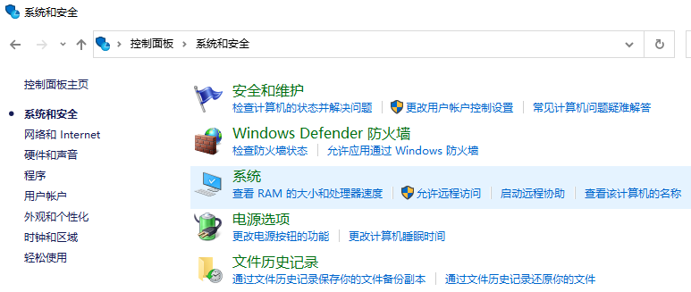
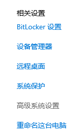
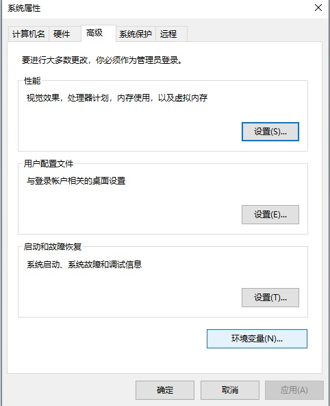
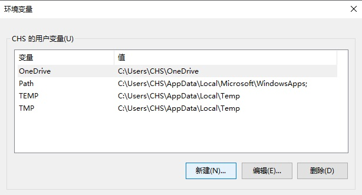
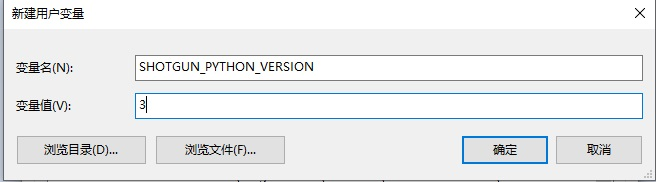
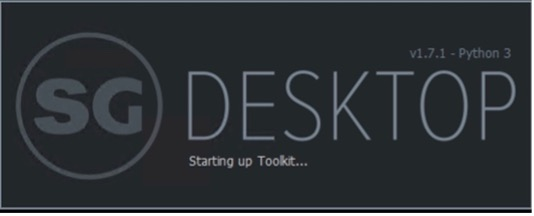

# 将  Desktop 中的默认 Python 版本设置为 Python 2

**Note:** Python 2 is getting removed by November 1st 2022. You can find the notification [here](https://community.shotgridsoftware.com/t/important-notice-upcoming-removal-of-python-2-7-and-3-7-interpreter-in-shotgrid-desktop/15166).

- [Windows](#windows)
- [MacOS](#macos)
- [CentOS 7](#centos-7)

## Windows

### 在 Windows 上手动将 `SHOTGUN_PYTHON_VERSION` 环境设置为 2

- 在 Windows 任务栏上，右键单击 Windows 图标，然后选择**“系统”**，导航到**“控制面板”/“系统和安全”/“系统”**。



- 在此位置，选择**“高级系统设置”**。



- 接下来，在“系统属性”中选择**“环境变量”**。



- 在**“环境变量”**窗口中，可以通过选择**“新建…”**来添加/编辑路径。



- 对于**“变量名”**，添加 `SHOTGUN_PYTHON_VERSION`，并将**“变量值”**设置为 `2`。



- 重新启动  Desktop 应用程序。现在，您应该会看到运行的 Python 版本已更新为 Python 2。




## MacOS

### 在 MacOS 上将 `SHOTGUN_PYTHON_VERSION` 环境设置为 2

- 在 `~/Library/LaunchAgents/` 下创建名为 `my.startup.plist` 的属性文件

```
$ vi my.startup.plist
```

- 将以下内容添加到 `my.startup.plist` 并**保存**：

```
<?xml version="1.0" encoding="UTF-8"?>
<!DOCTYPE plist PUBLIC "-//Apple//DTD PLIST 1.0//EN" "http://www.apple.com/DTDs/PropertyList-1.0.dtd">
<plist version="1.0">
<dict>
  <key>Label</key>
  <string>my.startup</string>
  <key>ProgramArguments</key>
  <array>
    <string>sh</string>
    <string>-c</string>
    <string>launchctl setenv SHOTGUN_PYTHON_VERSION 2</string>
  </array>
  <key>RunAtLoad</key>
  <true/>
</dict>
</plist>
```

- 重新启动 Mac 后，新环境变量将保持活动状态。

- 重新启动  Desktop 应用程序。现在，您应该会看到运行的 Python 版本已更新为 Python 2。


## CentOS 7

### 在 CentOS 7 上将 `SHOTGUN_PYTHON_VERSION` 环境设置为 2

- 将以下内容添加到 `~/.bashrc` 文件：

```
export SHOTGUN_PYTHON_VERSION="2"
```

- 通过运行以下命令重新启动操作系统：

```
$ sudo reboot
```

- 重新启动  Desktop 应用程序。现在，您应该会看到运行的 Python 版本已更新为 Python 2。


