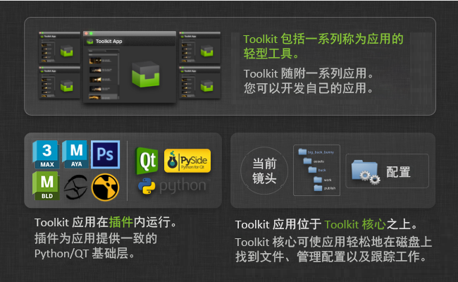
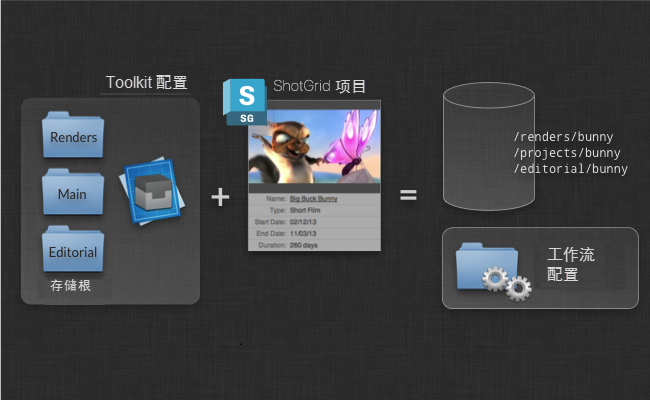
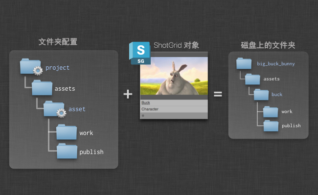
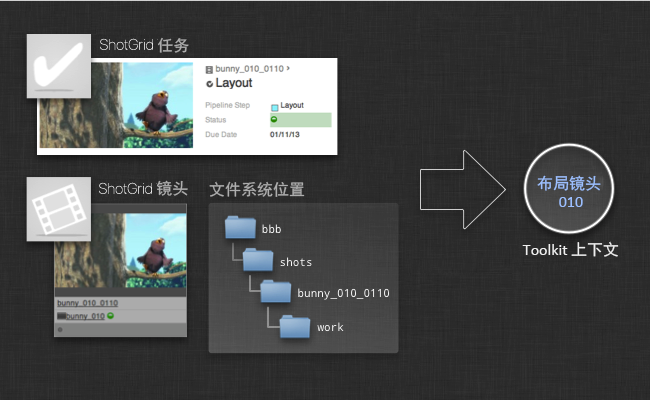
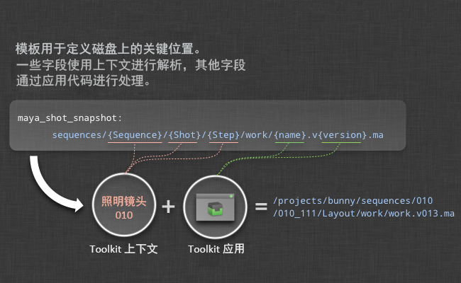
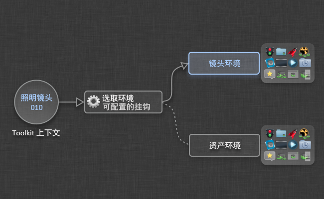
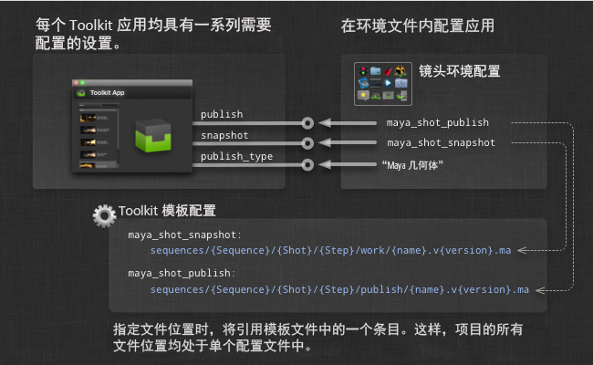
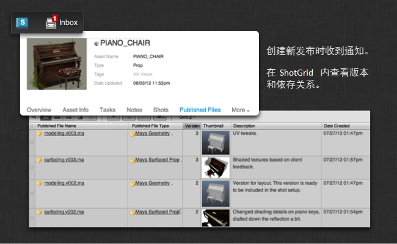

# Toolkit 概述


# 简要介绍  Pipeline Toolkit 中的各种概念。

在本文中，我们将详细介绍各种主要概念，其中包括：应用和插件的工作方式、Toolkit 如何启动和管理当前上下文（工作区）、如何在磁盘上创建文件夹等。我们建议参与配置或开发的所有人都从此处开始。

_请注意，本文档介绍仅当控制 Toolkit 配置时可用的功能。有关详细信息，请参见 [ 集成管理员手册](https://developer.shotgridsoftware.com/zh_CN/8085533c/)。_

# 简介

本文档将更深入地为您讲解一些主要功能。通过讲解、示例和简短的演示，我们将带您全面了解 Toolkit。如果您想熟悉 Toolkit，或者想了解 Toolkit 如何为您的工作室带来价值，从本文档开始是个不错的选择。读完本文档后，您将很好地掌握一些主要概念以及它们在实践中的应用。



下面是 Toolkit (SGTK) 的简要说明：

- Toolkit 是一个基于  平台的 _工作流工具包_ ，通过它可以更轻松地为工作室编写和安装各种工具。
- Toolkit 基于文件系统 - 它可以帮助您组织管理各种内容在磁盘上的存储，让磁盘内容井井有条。
- Toolkit 是得力的助手 - 它并不会试图接管您工作流中的数据或对它们进行抽象，而是为艺术家提供强大的工具，帮助他们更轻松地查找信息和避免错误。
- Toolkit 通过将所有发布存储在  中来帮助您共享工作。Toolkit 使您可以在制作过程中轻松共享更新和正在进行的工作。

在接下来的部分中，我们将深入了解 Toolkit 以及它的工作方式。

# 项目和配置

在 Toolkit 中，一切都以项目为中心。项目通常从  内开始生命周期，经过投标和前期制作阶段，然后，为内容创建阶段做好准备后，即可将 Toolkit 用于该项目。



在设置新项目时，您需要使用 _模板配置_。这是一个预定义配置，其中包含插件和应用、文件系统配置和其他设置。如果您是刚刚开始接触 Toolkit，可以先使用我们的示例配置，以此为出发点开始探索。如果您已在另一个项目中使用 Toolkit，建议以那个项目的配置为基础开始新项目。这样，您将逐步形成并发展出一个工作室配置，然后针对每个新项目优化该配置。当然，也可以单独维护一个工作室配置，将它用作所有新项目的模板。

每个配置都定义了一些 _“存储点”_。对于标准示例配置 `tk-config-default`，我们定义了一个称为 _“primary”_ 的存储点。 这意味着您的所有制作数据将位于一个文件系统项目根目录下。您也可以设置具有多个文件系统根目录的配置。我们将这类配置称为 _“多存储配置”_。例如，当您为渲染和剪辑等内容分别设置了单独的存储时，就需要使用多存储配置。每个存储点在  中需要以 _本地文件存储_ 的形式存在 - 您可以在“站点偏好设置”(Site Preferences)中的 _“文件管理”(File Management)_ 选项卡下设置这些。

Toolkit 会将实际项目配置安装在您喜欢的任意位置。通常，这将转到磁盘上的 _软件安装_ 区域，而不是项目数据区域本身。

## 逐步发展您的工作室配置

设置新项目时，您可以使用现有项目作为基础。Toolkit 会将该项目的配置文件夹复制到您的新项目。这意味着，新项目将获得与它基于的项目完全相同的应用和插件版本、相同的设置和相同的自定义。如果您想逐步 _发展完善自己的工作流_ ，并利用现有制作中所做的改进和调整，此功能非常有用。

或者，如果您对某个项目的设置满意，也可以直接选择该项目的配置文件夹，将它另存到别处的某个集中位置。随后可以将此配置用作工作室模板，每次创建新项目时以此配置为基础。如果需要，您甚至可以使用诸如 Git 等修订控制系统控制此工作室模板配置的源代码，并能简单、透明地跟踪工作流配置模板如何随时间逐步完善。每当您想要更新模板时，只需复制一个项目的配置并提交更改即可。

有关配置管理的详细信息，请查看我们的详细文档：

[管理您的项目配置。](https://developer.shotgridsoftware.com/zh_CN/60762324/)

## 每个项目各有一个工作流配置

每当您为项目设置 Toolkit 时，都会创建一个工作流配置。此配置包含项目需要的所有设置和文件。配置有一个专用的 `tank` 命令，当您想直接处理该项目时，可以在 Shell 中运行此命令（另外还有一个适用于所有项目的全局 tank 命令）。在  中，工作流配置已注册为一个特殊的工作流配置实体，以易于跟踪项目配置在磁盘上的位置。

除了设置项目时创建的主配置外，您还可以为项目创建另外的配置。当您想更改配置但又不想影响项目的所有用户时，这种做法通常很有用。要创建另外的配置，可以在  中导航到一个工作流配置，单击鼠标右键并选择克隆该配置即可。这将会基于另一个工作流配置为项目创建一个新配置。使用这个新配置，您可以在不影响其他用户的情况下安全地测试新应用。

请注意，项目的主配置需要命名为 `Primary`。如果您重命名、修改或删除主配置，项目可能无法正常工作。存储在  中的工作流配置不是手动操纵的，而是通过各种特定的 `tank` 管理命令来操纵。

示例：

[如何克隆配置](https://developer.shotgridsoftware.com/zh_CN/60762324/#cloning-your-configuration)

## 检查更新

与其他应用商店类似，Toolkit 应用商店会经常发布新版本的应用和插件。这些新版本可能包含重要的错误修复或有趣的新功能。升级应用和插件并不是强制性的要求。这个过程通常很快，升级脚本在进行任何更改前都会提示您。同样，如果您意外安装了不满意的版本，回退也很简单直接。

一个命令控制整个升级过程。只需运行位于项目配置文件夹中的 `tank` 命令，并添加 `updates` 参数：

```shell
/software/shotgun/bug_buck_bunny/tank updates
```

运行此命令时，如果不添加任何参数，将检查所有环境、插件和应用。这可能需要花费很长时间，但您也可以对一部分已安装的应用和插件运行更新程序。

一般语法：

```shell
tank updates [environment_name] [engine_name] [app_name]
```

可以使用特殊关键词 `ALL` 表示一个类别中的所有项。

示例：
- 检查所有内容：  `tank updates`
- 检查镜头环境：  `tank updates Shot`
- 检查所有环境中的所有 Maya 应用：  `tank updates ALL tk-maya`
- 检查镜头环境中的所有 Maya 应用：  `tank updates Shot tk-maya`
- 确保所有地方的加载器应用保持更新：  `tank updates ALL ALL tk-multi-loader`
- 确保 Maya 中的加载器应用保持更新：  `tank updates ALL tk-maya tk-multi-loader`

除了检查应用商店，此脚本还会检查其他所有注册的位置。因此，它可能会查询您本地的 Git、GitHub 库、磁盘上的文件和应用商店，具体取决于各个应用的部署位置。

请注意，新版本的应用可能会引入应用配置方面的更改。例如，某项新功能可能会需要新的配置参数。这种情况下，`tank` 升级脚本会提示您键入这些参数的值。

## 检查核心 API 的更新

有时，我们会发布新版本的 Toolkit 核心 API。有一个单独的命令用来更新核心 API。在本例中，该命令为 `tank core`。

# 在磁盘上创建文件夹

为项目设置 Toolkit 后，可以使用它帮助您创建一致的文件夹结构。可以通过在磁盘上的工作流配置中创建文件系统模板，来配置此文件夹结构。在此文件夹结构中，某些路径是动态路径。例如，您可以用一个名为 `asset` 的文件夹来表示  资产实体。这些动态文件夹可以与  查询和许多其他对象相连。



Toolkit 提供多种不同类型的动态文件夹，用来应对不同的设置和情况。设置文件夹创建方式时，您可以使用标准  API 查询语法。您可以组织文件系统，将不同类型的资产归入文件系统上的不同文件夹。

有关如何操作的详细介绍，请参见管理员手册：

[管理  Pipeline Toolkit](https://developer.shotgridsoftware.com/zh_CN/425b1da4/)

Toolkit 的文件夹创建操作分为两个过程 - 一个是直接过程，任何人在任何时间都可以运行；另一个是延迟过程，通常由艺术家在应用程序临启动前运行。延迟过程完全自动，并可用来设置应用程序特定的文件夹和用户沙盒。

# 当前上下文

创建文件系统结构后，Toolkit 会知道磁盘上的文件夹与派生该文件夹的  对象之间的关系。这一点很重要，因为这样 Toolkit 才能很容易地在发布、加载或解析路径时将  中的对象与磁盘上的文件夹或文件相关联。另外，它还与我们所说的 _“上下文”_ 或 _“当前工作区”_ 有关。上下文对象是 Toolkit 核心的一部分，可跟踪记录当前正在处理的内容。这是 Toolkit 解析文件系统路径时的一个中心机制。



我们可以从任务、资产或镜头等  对象创建上下文，也可以从磁盘路径创建上下文。应用在运行时始终可以访问上下文，这让构造应用变得很容易，您不需要了解文件系统的命名约定，也不必知道应用是用在资产工作流中还是镜头工作流中。所有这些全部由 Toolkit 核心 API 和上下文处理。

# 文件系统模板

Toolkit 核心包含一个处理文件路径的系统。我们称之为 _“模板系统”_。由于 Toolkit 基于文件系统，因此每当应用需要在磁盘上读取或写入数据时，都需要解析文件路径。应用对文件系统结构不了解，这意味着它们不知道文件系统的组织结构。模板系统负责为它们处理这一切。

在模板系统的核心，有一个 _模板配置文件_。此文件包含项目的所有重要文件系统位置。_模板_ 与下面类似：

```yaml
maya_shot_publish: 'shots/{Shot}/{Step}/pub/{name}.v{version}.ma'
```

模板本质上定义了一个包含一些动态字段的路径。每个字段都可以配置验证和键入内容，例如您可以定义上面模板中的 `{version}` 字段是一个填充三个零的整数（例如 `001`、`012`、`132`）。每当应用需要在磁盘上写入或读取数据时，都会向模板文件中添加一个描述该位置的模板。由于应用通常会构成一个工作流，因此一个应用（例如发布应用）的输出模板往往是另一个应用（例如加载应用）的输入模板。这就是所有文件系统位置都保留在一个文件内的原因。

模板 API 让您可以在一系列字段值和路径之间跳转：

```python
# get a template object from the API
>>> template_obj = sgtk.templates["maya_shot_publish"]
<SGTK Template maya_asset_project: shots/{Shot}/{Step}/pub/{name}.v{version}.ma>

# we can use the template object to turn a path into a set of fields...
>>> path = '/projects/bbb/shots/001_002/comp/pub/main_scene.v003.ma'
>>> fields = template_obj.get_fields(path)

{'Shot': '001_002',
 'Step': 'comp',
 'name': 'main_scene',
 'version': 3}

# alternatively, we can take a fields dictionary and make a path
>>> template_obj.apply_fields(fields)
'/projects/bbb/shots/001_002/comp/pub/main_scene.v003.ma'
```

请注意，上述路径和模板具有两种不同类型的字段。`Shot` 和 `Step` 字段是高级字段，在  中具有等效对象（镜头和工作流工序），而 `name` 和 `version` 字段则特定于此特定类型的模板。如果我们想描述一个资产（而非镜头）的发布路径，仍然会有 `name` 和 `version` 字段，因为这是所有发布都需要的，无论数据类型如何。但是，将不会有 `Shot` 和 `Step` 字段。相反，可能会有 `Asset` 和 `Step` 字段，其中的 asset 字段会与  中的某个资产相关联。

在开发用于发布类操作的应用时，很显然我们不想使用单独的应用分别执行镜头发布和资产发布。我们更希望开发一个可以应对任何发布情景的发布应用，无论要发布的是场、镜头、资产还是其他任何内容。



这时就需要用到 _Toolkit 上下文_。Toolkit 上下文让我们可以将模板字段分为两个不同的组；上下文字段（`Shot`、`Step`、`Asset` 等）是我们想确保在应用外部解析的字段 - 这样应用逻辑就不必包含专门用于处理镜头和资产这类概念的代码。应用只需填充与应用的特定 _业务逻辑_ 直接关联的字段。在我们的发布应用示例中，业务逻辑由 `name` 和 `version` 字段组成。因此，如上图所示，Toolkit 会将字段解析分为两个不同阶段：一些字段由上下文填充，另一些字段则由应用内部的业务逻辑填充。这样，应用的设计便可不局限于特定的文件系统布局。我们认为这是构建良好工作流工具的一个重要方面。

处理路径解析的应用代码通常如下所示：

```python
# start with an empty fields dictionary
fields = {}

# first let the context populate all its fields
fields.update( self.context.as_template_fields( publish_template_obj ) )
# fields is now {'Shot': '001_002', 'Step': 'comp' }

# now the app can add its business logic
fields["name"] = "main_scene"
fields["version"] = 234

# and finally the app can produce the path it needs in
# order to save out the file
path = publish_template_obj.apply_fields(fields)
```
有关您可以如何配置和使用模板 API 的更多详细信息，请参见以下内容：

[文件系统配置参考](https://developer.shotgridsoftware.com/zh_CN/82ff76f7/)

[核心 API 参考](https://developer.shotgridsoftware.com/tk-core/core.html#)

# 选择要运行的插件和应用

Toolkit 核心的另一个重要作用是决定 _应向用户显示哪些应用_。如果您在处理角色装配工作并启动了 Maya，可能会需要一套与进行镜头照明工作时不同的应用。此外，应用的配置可能会因您需要的操作方式而异。因此，同一个审核应用，用于装配时可能会生成一个转台，而当动画设计师运行它时，则会使用镜头摄影机播放动画预览。

为了实现这种灵活性，Toolkit 项目配置包含一系列 _环境_。一个环境就是一个配置文件，用来定义一套应用和插件，以及它们的所有配置参数。

Toolkit 启动时，需要决定对 _哪个_ 环境进行初始化。这通过一段称为“挂钩”的 Python 代码来实现，__您可以在其中添加自己的业务逻辑。_上下文_ 对象将传递到这段代码中，这通常用于确定要使用哪个环境。



这样，您便可以为工作流的不同环节配置一组单独的应用。此外，您还可以独立更新它们，甚至安排不同的主管分别管理它们。

## 默认配置中的环境

为了给您一个实际示例来说明环境的工作方式和结构，我们来看一下默认配置随附的环境：

- `project.yml` - 当上下文仅包含项目时要运行的应用和插件。
- `shot_and_asset.yml` - 当上下文包含镜头或资产时要运行的应用和插件。
- `shot_step.yml` - 当上下文包含镜头和工作流工序时要运行的应用和插件。
- `asset_step.yml` - 当上下文包含资产和工作流工序时要运行的应用和插件。

默认配置基于工作流工序来组织其文件系统。这意味着在某个镜头位置下，您可以看到针对建模和装配等的文件夹。实际上，您所执行的每个工作流工序都有一个对应的文件夹。每个文件夹在磁盘上都有自己的工作区和发布区。这意味着发布模板可能如下所示：

```yaml
maya_shot_publish: 'sequences/{Sequence}/{Shot}/{Step}/pub/{name}.v{version}.ma'
```

为了使用此模板，上下文需要同时包含一个实体和一个工作流工序。对于父场 `ABC` 下的镜头 `1122` 和 `Modeling` 这个工作流工序，上面的模板将解析为 `sequences/ABC/1122/Modeling/...`。这意味着，一个包含镜头但不包含工作流工序的上下文并不足以填充上面的模板。您无法为仅镜头上下文启动 Maya，并使用上述模板。为使其正常运行，需要一个工序。

这样我们就得出了上面所示的环境细分。由于默认配置中定义的文件系统结构以工序为中心，因此所有主要应用都需要在一个定义了工序的上下文中运行。我们在默认配置中定义了两个这样的环境：`asset_step.yml` 文件和 `shot_step.yml` 文件。每个文件都包含针对多个 DCC（例如 Maya、Nuke、3ds Max、MotionBuilder、Photoshop 等）的插件。当您从  内的任务启动 Maya 时，选取环境挂钩将选择 `shot_step` 环境，启动 Maya 并加载 Maya 应用配置。

有时候，直接从  内的镜头对象启动 Maya 也是有用的。更重要的是，能在控制台中键入 `tank Shot 1122 launch_maya` 真的是一项非常实用的功能。这时就需要用到 `shot` 和 `asset` 环境。当您为 Maya 加载一个包含镜头或资产但不包含工作流工序的上下文时，它将会加载其中一个环境。由于文件系统结构都是按工作流工序组织的，因此如果我们的上下文中缺少该信息，实际上不能进行任何加载或发布。Maya 会使用一个空配置启动，其中仅包含 _Workfiles_ 应用。此应用用于选择要处理的任务。选取任务后，Toolkit 会为您切换上下文并重新启动插件，还会为 `shot_step` 环境加载全套应用。

同样，`project` 环境是一个适合所有情况的备选方案，它也只包含 _Workfiles_ 应用。这使您几乎可以从项目内的任何地方启动 Maya，它会对 Toolkit 进行最小程度的初始化，让您可以使用 _Workfiles_ 应用跳转到有效的工作区。

# 配置应用

每个应用都有一些需要指定的配置参数。当您安装或升级某个应用时，Toolkit 会确保您指定了所有必需的设置。

简单的设置值（如字符串或整数值）直接在环境配置中指定。各个模板是不同的，由于 Toolkit 要将所有模板保存在一处，因此环境文件只是指向模板文件中定义的模板。每个应用在其配置中使用的模板需要的字段各不相同。在前面的示例中，发布应用在磁盘上创建输出文件时，使用一个包含 `name` 和 `version` 字段的模板。因此，该应用的一项配置设置需要使用包含 `name` 和 `version` 字段的模板。



如果您配置应用时尝试使用的模板包含比 `name` 和 `version` 上下文字段更多的字段，应用将不知道如何填充这些额外的字段，也无法根据该模板生成路径。同样，如果您提供的模板缺少其中某个字段，会导致结果混淆。在我们的示例中，将不会为应用写出版本号。因此，Toolkit 会在启动时验证配置，确保您为所有模板提供了必要的字段。Toolkit 还支持几种使用默认值和可选字段的方式。

有关完整参考，请查看以下链接：

[应用和插件配置参考](https://developer.shotgridsoftware.com/zh_CN/162eaa4b/)

[文件系统配置参考](https://developer.shotgridsoftware.com/zh_CN/82ff76f7/)

## 挂钩

除了使用模板的应用设置外，Toolkit 还支持称为 _挂钩_ 的概念。挂钩是小段的 Python 代码片段，让您可以在配置中自定义应用的各个部分。

下面我们来介绍它是如何工作的，以及为什么它非常有用。

应用之所以强大，是因为它们可以在多个插件和项目中重复使用。但是，应用往往需要一些特定于插件逻辑的小段代码。例如，如果我们要构建一个可同时在 Nuke 和 Maya 中运行的加载器应用，就需要有处理 _实际文件加载_ 操作的代码，而这些代码在 Nuke 和 Maya 中必然是不同的。不仅如此，我们还希望此应用最好能用于任何插件！不同工作室向场景中加载内容项的方式也有所不同，有些工作室可能需要支持自定义的 Maya 引用节点，有些则只要执行导入即可。

在 Toolkit 中，这种情况可以使用 _挂钩_ 来解决。挂钩是一段可自定义的代码。应用随附一个默认挂钩，其中包含一个基础执行，这意味着应用可以开箱即用。但是，如果您想自定义行为，可以将默认挂钩文件复制到您的配置中，Toolkit 会改为使用该代码。

[阅读《管理员手册》了解有关使用挂钩的详细信息。](https://developer.shotgridsoftware.com/zh_CN/425b1da4/#hooks)

# 从  和 Shell 运行

安装 Toolkit 之后，您可以从几个主要的入口点访问它：

-  内的右键单击菜单上将显示  动作
-  Desktop 应用中的项目将显示启动图标
- 您可以在控制台中使用 `tank` 命令。
- 在应用程序内和 Shell 中均可使用 Toolkit 的 Python API。

从  内运行 Toolkit 是一种启动应用程序和执行任务的常见方式。 将使用  Desktop 与计算机本地安装的 Toolkit 进行通信，并使用本地 Python 执行 Toolkit 命令。这意味着您可以直接从  内运行创建文件夹等本地操作。

您还可以从 Shell 访问 Toolkit。每个项目配置随附属于自己的 `tank` 命令。您只需导航到项目配置的根目录，在其中执行 `./tank` 命令即可。

最后，您可以直接将 Toolkit API 添加到 `PYTHONPATH` 环境变量，然后将其导入。使用 API 非常简单直接。如果您想在 Maya 内手动启动 Toolkit，或者想将它作为现有工作室启动系统的一部分，那么可以不使用  Desktop，只需执行几个简单的命令即可。

# 正在发布

当您想与其他人共享自己正在处理的文件时，可以发布这些文件。这意味着将在  中创建一个 `PublishedFile` 实体，其他用户可以使用 Toolkit 的加载器应用导入该实体。



这种做法对于数据管理（数据在磁盘上的存储位置、文件包含的内容等）到底意味着什么，交给处理实际工作的应用去考虑。Toolkit API 为开发人员提供了各种方法，让他们可以轻松在  内创建发布，并将这些发布链接到正确的对象，以确保  可以直接将通知推送给所有合适的人员。我们还提供一个默认的发布应用，它不仅功能灵活多样，而且可配置程度很高，但这并不是使用 Toolkit 执行版本控制的唯一途径。因为 Toolkit 可扩展，所以如果需要，您可以使用 Toolkit 打造自己的自定义版本控制和发布系统。

但是一开始，建议您使用我们的发布应用：

[默认的 Multi Publish 应用。](https://developer.shotgridsoftware.com/tk-multi-publish2/)

# 构建可重用的应用

Toolkit 不止是一套应用和插件。它还是一个框架，您可以用它开发自己的工具和技术！我们已在 Toolkit 中包含了大量功能，将它打造成一个功能丰富的工作室开发平台。有了 Toolkit 作为基础，您可以专注于解决手中的问题，而不必花费精力自己构建基础平台。我们努力让开发人员可以在不意外打断艺术家工作流的前提下轻松构建、评估和发布软件。

- 插件将确保无论底层基础是什么，开发人员都可以使用 Python 和 Qt (PySide/PySide2) 编写应用。这意味着，有些插件非常简单，而有些插件较为复杂，具体取决于其提供的 API。因此，工作室有一种直观、一致的方式来开发工具。根据我们的经验，Python 和 Qt 是工作室常用的开发环境，许多技术总监都熟悉它们。
- 插件层还有一个好处，那就是应用只需编写一次，便可在多种环境中部署。我们将开发的标准应用套件称为 _多应用_ ，意思是同一个应用适用于所有插件。当然，难免会有些特定的代码需要定制后才能用于每个 DCC 应用程序公开的特定 API，但是这些代码通常包含在一个或多个挂钩中，这让重用应用变得很简单。能够创建这种多应用的另一个好处是，在开发新插件的过程中，很容易就可以配置所有标准应用来支持新插件。
- 通过工作流配置和克隆，我们可以轻松创建开发沙盒，让开发人员能够在制作环境中工作，同时又不会干扰日常的制作活动。工具做好部署准备后，轻松即可更新主项目配置，然后将工具部署给所有艺术家。
- 应用在插件内运行，因此重新加载很容易。不必每次测试新的代码更改时都重新启动 Nuke 或 Maya，只需单击 Toolkit 中的重新加载按钮，即可加载最新代码。

有关应用开发方面的更详尽介绍，请参见以下文档：

[Toolkit 应用开发简介。](https://developer.shotgridsoftware.com/zh_CN/2e5ed7bb/)

[Toolkit API 参考](https://developer.shotgridsoftware.com/tk-core/)

[应用和插件配置参考](https://developer.shotgridsoftware.com/zh_CN/162eaa4b/)
