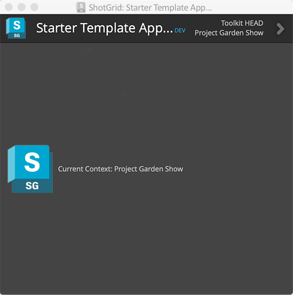
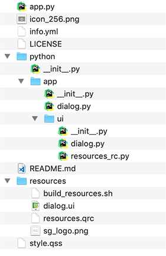
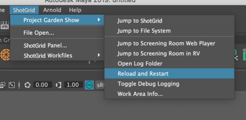
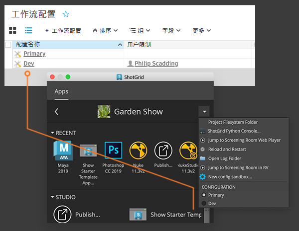

# 开发自己的应用

## 简介

本手册概述了什么是 Toolkit 应用，说明了如何创建应用，并介绍了有关应用开发的一些基础知识。 Pipeline Toolkit 不仅是  Software 维护的一套应用和插件，还是一个可用来轻松快速构建自定义工作流工具的开发平台！

- [什么是 Toolkit 应用？](#what-is-a-toolkit-app)
- [创建自己的应用](#creating-your-own-app)

步骤：
1. [创建开发沙盒](#part-1-creating-a-development-sandbox)
2. [Fork 或下载入门应用库](#part-2-forking-or-downloading-the-starter-app-repository)
3. [将应用添加到配置](#part-3-adding-the-app-to-your-config)
4. [开发应用](#part-4-developing-the-app)
   - [模板入门应用剖析](#anatomy-of-the-template-starter-app)
   - [配置设置](#configuration-settings)
   - [框架](#frameworks)
   - [重新加载更改](#reloading-your-changes)
5. [测试](#part-5-testing)
6. [准备第一个版本发布](#part-6-preparing-your-first-release)

附加信息：
- [修改现有应用](#modifying-an-existing-app)
   - [贡献](#contributing)

## 什么是 Toolkit 应用？

Toolkit 应用可定义如下：

- 通常由最终用户使用  集成运行的工具。
- 这些应用通常具有图形用户界面，用户可以使用该界面来指导应用的操作，但这不是必需的。应用也可以是向集成注册的命令，由用户从宿主软件中的  菜单触发。
- 它们可以包含 API/公共方法，其他流程或应用可以通过这些方法进行交互。
- 它们可以支持多平台且与软件无关。
- 可以将它们设置为根据[环境](https://developer.shotgridsoftware.com/zh_CN/487a9f2c/?title=Environment+Configuration+Reference#what-is-an-environment)进行不同配置。
- 它们可以支持上下文感知。例如，应用可以识别用户正在处理的任务，并执行相应的动作。
- 只能从 Toolkit 插件运行它们。

Toolkit 应用由 Toolkit 插件初始化。[插件](https://developer.shotgridsoftware.com/tk-core/platform.html#engines)设计为在特定软件环境中运行，它们在其中提供用于运行 Toolkit 应用的界面。插件消除了需要从应用处理各种软件环境的复杂性。这意味着，应用只需专注于提供实现其用途的功能，无需考虑其他方面，例如，处理窗口父子关系、跟踪用户的上下文或提供用于启动本身的快捷方式。

## 创建自己的应用。
 Software 维护和发布的应用和插件全部开源，可从 [GitHub](https://github.com/shotgunsoftware) 获取它们。

本部分介绍如何使用我们的入门模板创建新应用。
我们假设您熟悉 GitHub 和 Git 工作流。但是请注意，即使您不使用 Git 作为源代码管理解决方案，也可以进行 Toolkit 开发。


## 第 1 部分：创建开发沙盒
在进行其他任何操作之前，建议您先[通过克隆项目配置来设置一个开发沙盒](../getting-started/installing_app.md#clone-the-pipeline-configuration-you-want-to-add-an-app-to)。
这将创建一个单独的配置，您可以在其中开发代码并测试更改，而不会影响参与制作的其他任何人。

## 第 2 部分：Fork 或下载入门应用库
我们提供了[模板入门应用](https://github.com/shotgunsoftware/tk-multi-starterapp)，您可以在此基础上创建自己的应用。使用此应用，所有的标准 Toolkit 样板代码都已为您设置好，还提供了一个基本示例 GUI。



要使用它，您可以 Fork Git 库，然后将其克隆到磁盘上的本地开发区域；或者如果您不想在此阶段使用 Git 源代码管理工具，只需以 zip 文件形式从 GitHub 下载文件，并在本地解压缩（以后随时可以设置 Git 库）。无论哪种情况，目标都是获得入门应用代码的本地副本，以便可以开始进行更改。

## 第 3 部分：将应用添加到配置
建议阅读“[添加应用](../getting-started/installing_app.md)”手册，此手册详细介绍了如何将应用添加到配置。

在将应用添加到配置时，需要考虑应用的使用位置，即，可能只在 Nuke 中、在多个不同的软件中或与  Desktop 分开单独使用。

此外，还需要考虑应用将依赖的上下文。
例如，您的应用仅在您知道用户正在处理的任务时才能运行，还是只要知道项目就可以运行？
了解这一点将决定需要向哪些环境 YAML 和插件添加应用设置。

如果您现在不确定，建议先将其添加到项目环境中的 `tk-shell` 插件。
这样，您就可以[从 IDE 运行它](./sgtk-developer-bootstrapping.md)，或者通过命令行使用 tank 命令运行它（如果您有[集中式配置](https://developer.shotgridsoftware.com/tk-core/initializing.html#centralized-configurations)）。从而可以更快地进行开发。

首先，使用 [dev 描述符](https://developer.shotgridsoftware.com/tk-core/descriptor.html#pointing-to-a-path-on-disk)设置应用位置。

```yaml
tk-multi-starterapp:
  location:
    type: dev
    path: /path/to/source_code/tk-multi-starterapp
```
此设置指示 Toolkit 直接从磁盘的给定位置加载应用代码，对于需要不停更改代码的开发工作来说，这种做法非常方便。
以后，当您将应用添加到制作配置时，可能希望使用其他描述符。

现在，您已将应用添加到环境中；您应该能够继续操作并启动它。应用的启动方式取决于在其中定义它的插件和环境。

## 第 4 部分：开发应用

现在，您已准备好开始开发您的应用！

### 模板入门应用剖析

[模板入门应用](https://github.com/shotgunsoftware/tk-multi-starterapp)包含以下基本结构：



- **app.py** - 应用入口点和菜单注册信息可在 `app.py` 文件中找到。通常在这里设置类、进行初始化和注册菜单项。
- **info.yml** - 也称为清单文件。它定义此应用安装时所需的所有不同设置，以及相应的默认值（如果提供）。当您需要可重用的应用、不想以硬编码方式向应用本身写入任何值时，这些设置通常非常有用。
- **python/app/dialog.py** - 此文件包含逻辑和事件回调等，这些用于生成主应用窗口。
- **python/app/ui** - 此文件夹包含自动生成的 UI 代码和资源文件。您不是直接编辑此文件夹，而是编辑 `resources` 文件夹中的 Qt UI 文件。
- **resources/** - 在 resources 文件夹中，`dialog.ui` 文件是一个 Qt Designer 文件，您可以打开并使用它快速设计和定义应用的外观。进行更改后，您需要执行 `build_resources.sh` 脚本，将 UI 文件转换为 Python 代码并将其存储为 `/python/app/ui/dialog.py`。
- **style.qss** - 您可以在此文件中定义 UI 的 QSS（Qt 样式表）。



### 配置设置
在清单文件中，应该有一个可用于定义应用设置的 `configuration` 部分。

通过在清单文件中定义设置，您可以在环境 YAML 文件中为应用配置不同的设置值。如果应用需要根据其所在环境呈现不同的行为，这很有用。

例如，您可能希望有一个设置用于定义保存文件时使用的模板。
```yaml
save_template:
    type: template
    default_value: "maya_asset_work"
    description: The template to use when building the path to save the file into
    allows_empty: False
```
为此创建设置意味着您不必在应用代码中对模板名称进行硬编码，而是可以从 `info.yml` 中默认定义或环境 YAML 文件设置中的覆盖定义的设置[获取值](https://developer.shotgridsoftware.com/tk-core/platform.html#sgtk.platform.Application.get_setting)。

```python
template = app.get_setting("save_template")
```
这意味着您可以将应用配置为根据应用的运行环境使用不同的模板。

有关配置设置的详细信息，请参见[参考文档](https://developer.shotgridsoftware.com/tk-core/platform.html#the-configuration-section)。

### 框架

如果您知道将要使用框架，可以将其添加到清单文件中。

例如，如果您计划为应用使用 Qt 控件和  实用程序框架，请将以下内容添加到 `info.yml` 中：

```python
# the frameworks required to run this app
frameworks:
    - {"name": "tk-framework-shotgunutils", "version": "v2.x.x"}
    - {"name": "tk-framework-qtwidgets", "version": "v1.x.x"}
```

#### 框架版本最低要求
如果框架具有最低版本要求，可以在 `info.yml` 中使用 minimum_version 设置：

```python
# the frameworks required to run this app
frameworks:
    - {"name": "tk-framework-shotgunutils", "version": "v2.x.x"}
    - {"name": "tk-framework-qtwidgets", "version": "v1.x.x", "minimum_version": "v1.5.0"}
```

上面的代码将确保应用可以使用 `v1.5.0` 版本的 `tk-framework-qtwidgets`。
如果这个版本不可用，应用将不会在启动时加载，并在控制台显示错误。
当使用 `tank updates` 更新应用时，所有不符合最低版本要求的已配置框架都将随应用一起自动更新。

有关框架及其用途的详细信息，请参见以下链接：

- [Qt 控件框架](https://developer.shotgridsoftware.com/tk-framework-qtwidgets/)
- [ 实用程序框架](https://developer.shotgridsoftware.com/tk-framework-shotgunutils/)

### 重新加载更改

如果您在 Maya 等软件中测试应用，那么只要您的配置中有一个或多个开发项，Toolkit 就会自动将**“Reload and Restart”**选项添加到  菜单中。

单击此选项将重新加载配置和代码，然后重新启动插件。这意味着您可以快速进行迭代：只需启动 Maya 一次，之后每次做出所需的代码或配置更改时，只需单击**“Reload and Restart”**按钮，即可调入这些更改。



## 第 5 部分：测试
当您想要测试代码时，可以轻松邀请其他用户访问您的开发沙盒，方法是将他们添加到  中 `PipelineConfiguration` 实体的 `User Restrictions` 字段中。

添加用户后，他们随即就会在  Create 中自己的菜单和浏览器动作中看到新条目，以及一个用于在  Desktop 中选取配置的选项。





## 第 6 部分：准备第一个版本发布

在[第 3 部分](#part-3---adding-the-app-to-your-config)中，已使用 dev 描述符将配置设置为指向应用。对于发布的软件，您希望确保应用可供所有用户访问，并且对内容进行版本控制，以便安全、轻松地升级。

 提供的所有应用均使用 Toolkit 应用商店跟踪更新和版本发布，它们带有一个类似如下的 location 标记：

```yaml
location:
   name: tk-multi-setframerange
   type: app_store
   version: v0.1.7
```
通过该标记，Toolkit（例如 `tank updates` 命令）可以检查更新何时可用，并以一种非常安全的方式更新和维护配置。
每当运行更新命令以及有新版本可用时，Toolkit 都会下载代码，将其放在磁盘上的一个本地“缓存”中，并确保用户可以访问它。

有几个不同的选项可用于为应用版本提供来源。

- [Git](https://developer.shotgridsoftware.com/tk-core/descriptor.html#tracking-against-tags-in-git) 和 [GitHub](https://developer.shotgridsoftware.com/tk-core/descriptor.html#tracking-against-releases-on-github)
- [ 上传](https://developer.shotgridsoftware.com/tk-core/descriptor.html#pointing-at-a-file-attachment-in-shotgun)
- [本地路径](https://developer.shotgridsoftware.com/tk-core/descriptor.html#pointing-to-a-path-on-disk)

在您的制作配置中，可以添加应用，并转为使用符合您的需求的描述符。

### 基于 Git 的描述符

我们建议开始使用源代码管理工具以确保跟踪更改，无论您是否要使用 Git 描述符都是如此。

Toolkit 支持即时使用 Git (http://git-scm.com/)，在对配置运行 `tank updates` 时，它可以检查您的 Git 库中的最新版本，并更新配置，就像使用应用商店描述符一样。

此项的要求如下：

- 您的 Git 库需要仅包含一个应用
- 您的 Git 库的结构应该与[入门应用库](https://github.com/shotgunsoftware/tk-multi-starterapp)相同。
- 创建标记时使用[语义版本控制](https://semver.org/lang/zh-CN/)。Toolkit 将使用这些版本号来尝试确定哪个版本是最新版本，版本号遵循 `vX.Y.Z` 约定形式。

当您在 Git 中创建好第一个标记后（例如 `v1.0.0`），就可以将配置设置为使用指向您的标记的 Git 描述符。然后，您就可以直接运行 `tank updates`，如果已创建新标记，程序将提示您是否要升级。
此时，整个工作流便与官方应用商店的流程完全相同。



## 修改现有应用
有时，我们并不会使用空白的入门模板从头创建应用，而是需要为现有应用（例如  Software 的某个标准应用）添加一项小功能。

处理修改版的应用时，您通常会想要比照源应用，确保定期下载更改和错误修复。

当您进行这类开发时，首先是提取父代码，然后应用自己的更改，再将此版本发布到您的工作流中。
您发布的版本实际上由应用的基础版本和您应用的本地更改组成。
我们建议您为现有版本号添加版本后缀。
这种做法非常适合 Toolkit，并且看起来相对直观。
下面的工作流说明了整个操作：

- 您对父应用执行 Fork 操作，并创建自己的库。通过 Fork 操作，您获得所有 Git 标记。
   假定最新的标记名为 `v0.2.12`，主分支基本上与此标记中的内容相同。
- 您应用自己的更改，并提交至主分支。这时得到的是 `v0.2.12` 加上您的更改。
   将此版本发布到生产环境时，您需要创建一个标记。将该标记命名为 `v0.2.12.1`，以表示您的代码基于 `v0.2.12`，并且是第一个版本发布。
- 现在有人发现您的修改中有一个错误。您修复此错误、更新标记并发布 `v0.2.12.2`。
- 父库中发布了多项重要的错误修复。
   您将它们下载到您的库。由于父库中发布了若干个版本，最新标记现在为 `v0.2.15`。
   将您的更改合并到主分支，并进行测试。这时得到的基本上是父应用 `v0.2.15` 与您的更改合并后的结果。更新标记为 `v0.2.15.1`。

上面概述的标记方案可保证 Toolkit 更新能够正确工作，并且便于您快速了解 Fork 中每个标记基于哪些代码。

### 贡献
我们欢迎大家提出 Pull 请求！如果您觉得自己的更改对其他人有益，请随时以 Pull 请求的形式反馈给我们。
我们随后可以将更改合并到应用的主版本中。
或者，在我们的[路线图页面](https://www.shotgunsoftware.com/roadmap/)上添加有关新想法的建议。

如果您开发了完整的应用并愿意与社区共享，请在[论坛](https://community.shotgridsoftware.com/)上告诉大家！
