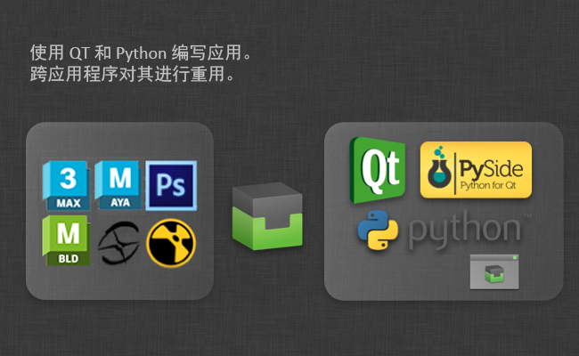

# 集成开发人员手册

## 面板

有关面板操作的示例，请参见 [https://github.com/shotgunsoftware/tk-multi-shotgunpanel/tree/master/hooks](https://github.com/shotgunsoftware/tk-multi-shotgunpanel/tree/master/hooks)。

### 配置显示的内容

详细信息区域和列表中的值都可以通过 `shotgun_fields` 挂钩进行配置。您可以为此挂钩创建子类，并更改执行，以便显示您需要的值。

**模板系统**

此挂钩支持简单的模板语言，可提供出色的灵活性。它还支持 Qt 所支持的 HTML 子集，因此您可以控制显示的值的颜色、字体大小、粗细等。

模板语言用法如下：

-    的值括在 `{brackets}` 中，例如 `<b>Description:</b> {description}`。此模板呈现时，`{description}` 部分将替换为 description 字段的值。
    
-   如果您想为值添加一个仅当值不为空时才显示的可选前缀或后缀，可使用 `{[Prefix]sg_field[suffix]}` 语法。对于模板 `{[Start: ]start_date} {[End: ]end_date}`，如果同时填充了两个值，将显示 `Start: 12 July 2009 End: 14 July 2012`，如果未设置结束日期，则显示 `Start: 12 July 2009`。
    
-   您可以定义回退机制，在某些值未设置的情况下进行回退。对于  版本而言，`artist` 字段优先于 `created_by` 字段，这是为了支持由制片代表艺术家提交版本的工作流。在这种情况下，版本将由制作人员创建，但 `artist` 字段会设置为美工人员。不过，情况并非总是如此。有时，在由美工人员自己提交工作的工作流中，artist 字段会留空。因此，在显示版本时，能够首先检查 `artist` 字段是一项有用的功能，如果发现此字段未设置，则回退到 `created_by` 字段。我们使用 `{field1|field2}` 语法实现这个机制，例如：`Created By: {artist|created_by}`。您可以将此字段与可选字段结合使用，例如 `{[Created By: ]artist|created_by}`。

此挂钩包含以下方法：

**控制列表中显示的列表项**

`get_list_item_definition()` 方法接受  实体类型，会返回一个词典，该词典控制各种列表中列表项的外观。它返回的词典具有 `top_left`、`top_right` 和 `body` 键，例如：

```python
{
 "top_left": "<big>{code}</big>",
 "top_right": "{updated_at}",
 "body": "By: {created_by}<br>Description: {description}"
}
```

**控制顶部详细信息区域**

`get_main_view_definition()` 方法接受  实体类型，会返回一个具有 `title` 和 `body` 键的词典。这些值控制详细信息区域中对象的外观，例如：

```python
{
 "title": "{type} {code}",
 "body": "By: {created_by}<br>Description: {description}"
}
```

**控制“信息”(Info)选项卡中显示的字段**

`get_all_fields()` 方法返回给定实体在“信息”(Info)选项卡上呈现时要显示的字段列表。

### 配置动作

动作是对一段  数据执行操作的代码片段。例如：

-   一个为给定  版本启动 RV 的动作
-   一个让用户可指派自己执行给定任务的动作
-   一个将  发布加载到 Maya 中作为 Maya 参考的动作。

动作的实际负载在_动作挂钩_中定义。定义动作逻辑后，您可以在应用配置中将该动作映射到  对象。这些动作的映射关系可能类似如下：

```yaml
action_mappings:
  PublishedFile:
  - actions: [reference, import]
    filters: {published_file_type: Maya Scene}
  - actions: [texture_node]
    filters: {published_file_type: Rendered Image}
  Task:
  - actions: [assign_task]
    filters: {}
  Version:
  - actions: [play_in_rv]
    filters: {}
```

在上面的示例中，我们使用了 `reference`、`import`、`texture_node`、`assign_task` 和 `play_in_rv` 动作。然后，我们将这些动作映射到各种  对象和条件。例如，我们让所有 Maya 场景类型的发布都显示 `import` 动作。

将对象加载到面板中时，会读入并分析上面的动作配置。确定适合当前对象的动作的列表，并执行 `generate_actions()` 挂钩方法。给定实体的  数据将在此时传递给挂钩，以便挂钩代码判断是否可以为此特定  对象运行该动作。这种方法让每个挂钩可在显示前运行检查。例如，`play_in_rv` 挂钩可能只有在本地有可用媒体时才有意义 - 配置中设置的动作映射会告诉面板为给定  实体启用哪些动作，但是这些动作可能不会全部显示，因为 `generate_actions()` 方法可能会判定某些动作不适合这个给定对象。

`generate_actions()` 方法返回的动作将显示在动作菜单上，当用户单击该菜单时，会调用 `execute_acton()` 挂钩方法运行动作。

对于面板支持的每个应用程序，都有一个动作挂钩来执行合适的动作。例如，在 Maya 这样的应用程序中，默认挂钩将执行 `reference`、`import` 和 `texture_node` 动作，每个动作执行特定的 Maya 命令，将发布导入当前的 Maya 场景中。与所有挂钩一样，我们完全可以改写和更改这些设置，还可根据内置挂钩创建派生挂钩，这样不必复制大量代码就能轻松向内置挂钩中添加其他动作。

面板使用 Toolkit 第二代挂钩界面，具有更强的灵活性。此挂钩的格式采用经过改进的语法。您可以在默认配置设置中查看，语法类似如下：

```yaml
actions_hook: '{self}/tk-maya_actions.py'
```

`{self}` 关键字指示 Toolkit 在应用的 `hooks` 文件夹中查找挂钩。如果您要使用自己的执行改写此挂钩，请将值更改为 `{config}/panel/maya_actions.py`。这将指示 Toolkit 使用您的配置文件夹中称为 `hooks/panel/maya_actions.py` 的挂钩。

有关详细信息，请参见应用随附的挂钩文件。挂钩还会利用继承性，这意味着您不需要改写挂钩中的所有内容，而是可以更轻松地用各种方式对默认挂钩进行扩展或补充，使挂钩更易于管理。

[单击此处详细了解第二代挂钩格式。](https://developer.shotgridsoftware.com/zh_CN/6d10dedf/)

通过在挂钩中运用继承性，您可以像下面这样向默认挂钩中添加附加动作：

```python
import sgtk
import os

# toolkit will automatically resolve the base class for you
# this means that you will derive from the default hook that comes with the app
HookBaseClass = sgtk.get_hook_baseclass()

class MyActions(HookBaseClass):

    def generate_actions(self, sg_data, actions, ui_area):
        """
 Returns a list of action instances for a particular object.
 The data returned from this hook will be used to populate the 
 actions menu.

 The mapping between  objects and actions are kept in a different place
 (in the configuration) so at the point when this hook is called, the app
 has already established *which* actions are appropriate for this object.

 This method needs to return detailed data for those actions, in the form of a list
 of dictionaries, each with name, params, caption and description keys.

 Because you are operating on a particular object, you may tailor the output 
 (caption, tooltip etc) to contain custom information suitable for this publish.

 The ui_area parameter is a string and indicates where the publish is to be shown. 

 - If it will be shown in the main browsing area, "main" is passed. 
 - If it will be shown in the details area, "details" is passed.

 :param sg_data:  data dictionary with all the standard publish fields.
 :param actions: List of action strings which have been defined in the app configuration.
 :param ui_area: String denoting the UI Area (see above).
 :returns List of dictionaries, each with keys name, params, caption and description
 """

        # get the actions from the base class first
        action_instances = super(MyActions, self).generate_actions(sg_data, actions, ui_area)

        if "my_new_action" in actions:
            action_instances.append( {"name": "my_new_action",
                                      "params": None,
                                      "caption": "My New Action",
                                      "description": "My New Action."} )

        return action_instances

    def execute_action(self, name, params, sg_data):
        """
 Execute a given action. The data sent to this be method will
 represent one of the actions enumerated by the generate_actions method.

 :param name: Action name string representing one of the items returned by generate_actions.
 :param params: Params data, as specified by generate_actions.
 :param sg_data:  data dictionary with all the standard publish fields.
 :returns: No return value expected.
 """

        if name == "my_new_action":
            # do some stuff here!

        else:
            # call base class implementation
            super(MyActions, self).execute_action(name, params, sg_data)
```

然后，我们可以在配置中将这个新动作绑定到一组发布类型：

```yaml
action_mappings:
  PublishedFile:
  - actions: [reference, import, my_new_action]
    filters: {published_file_type: Maya Scene}
  Version:
  - actions: [play_in_rv]
    filters: {}
```

按上面所示从挂钩派生的自定义挂钩代码只需要包含实际添加的业务逻辑，因此维护和更新起来更加简单。

## 发布器

发布应用可以采用挂钩形式进行高度自定义，控制如何将内容项呈现给艺术家以供发布以及稍后如何处理这些内容项。

有关发布器应用的完整开发人员文档，请参见 [Toolkit 开发人员站点](https://developer.shotgridsoftware.com/tk-multi-publish2)。

有关如何使用发布应用的详细信息，请参见[用户手册](https://developer.shotgridsoftware.com/zh_CN/d587be80/#the-publisher)。 

## 加载器

有关加载操作的示例，请参见 [https://github.com/shotgunsoftware/tk-multi-loader2/tree/master/hooks](https://github.com/shotgunsoftware/tk-multi-loader2/tree/master/hooks)。

## 高级功能

## 使用  Toolkit 可轻松开发工具

我们有没有提到您可以编写自己的应用？每个插件都基于 Python 和 PySide 公开了一个一致的接口，因此您可以编写一个适用于 Nuke、Photoshop 和 3dsmax 应用。有了核心 API 功能，开发资源可以专注于解决生产问题，而无需为工作室构建大型工作流堆栈。通过 Toolkit 可以在项目之间轻松地重用工具 - 如果文件命名约定或其他要求发生改变，只需重新配置应用即可。通过 Toolkit 的内置 Git 和 Github 支持可安全地推出工具，并在开发时快速地热加载代码。您只需在自己的 Dev Sandbox 中工作，并邀请 TD 和早期采用者测试您的代码，而不必将其展示给项目的每个参与者。

