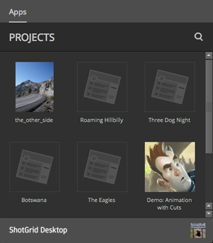

# 配置快速入门

完成本手册后，您将获得以下方面的基础知识：将项目信息添加到配置中、将该配置与您的项目关联起来、准备要自定义的工作流配置。

## 关于本手册

本手册介绍如何使用  Desktop 中的**高级项目设置向导**为数字内容制作工作流创建配置。您将很快熟悉配置工具，了解如何使用向导，并有机会了解更多信息。使用向导为项目创建工作流配置，并准备对其进行编辑和扩展，以便支持工作流中的每个工序。配置控制 UI 的各个方面、 应用以及支持制作工作流所需的各种工具。使用向导只是扩展配置的方法之一。除了为工作流中的每个工序添加特定设置外，它还将添加与软件应用程序的集成。在本手册中，我们将根据 Toolkit 默认配置来配置项目。

本手册假定用户：

1. 从未使用过高级项目设置向导
2. 对如何使用  有基本的了解
3. 是  Toolkit 新手

### 使用本文档

要使用本手册并为项目创建可自定义的配置，需要以下内容：

1. 有效的  站点。您可以[在此处注册 ](https://www.shotgridsoftware.com/signup/?utm_source=autodesk.com&utm_medium=referral&utm_campaign=creative-project-management) 并获取 30 天试用版以开始探索。
2.  桌面。 如果未安装 Desktop，则可以[单击此链接开始。](https://support.shotgunsoftware.com/hc/zh-cn/articles/115000068574#Installation%20of%20Desktop)
3. 可用于存储项目文件和工作流配置的文件系统的访问权限。在该 Shotgun 管理的文件系统上，创建一个名为 `Shotgun` 的文件夹，其中包含两个文件夹 `projects` 和 `configs`。

## 关于高级项目设置向导

 Desktop 中的“高级项目设置向导”会根据默认配置生成工作流配置。默认配置可以为构建提供坚实基础，其中带有支持工作流的可自定义设置、应用和 UI 元素。它会创建一个配置，您可以对其进行编辑和扩展来满足项目的工作流需求。

默认配置包含：
* 基本文件系统数据结构和模板，用于确定文件在磁盘上的位置
* 所有支持的[软件集成](https://support.shotgunsoftware.com/hc/zh-cn/articles/219039798)，允许直接在用户的软件应用程序内与  和工作流功能进行交互。

只要您敢于突破想象，勤于思考，充分运用自己的编程知识，或者善于借用  社区集思广益，就会发现 Toolkit 自定义的无限可能。

### 创建配置

每个项目都需要一个配置。第一次通过  Desktop 访问项目时，将下载并配置基本配置。此基本配置会自动检测用户在其系统上安装的受支持的内容创建软件，并将配置与项目相关联。工作流配置中的设置监管受支持软件应用程序中的集成。[面板](https://support.shotgunsoftware.com/hc/zh-cn/articles/219033098)应用显示  的项目信息，并使艺术家可以回复注释和查看版本，而无需退出其工作会话。[Publisher](https://support.shotgunsoftware.com/hc/zh-cn/articles/219032998) 应用允许艺术家将其作品提供给团队中的其他人，通过 [Loader](https://support.shotgunsoftware.com/hc/zh-cn/articles/219033078) 应用，艺术家可以加载其队友发布的文件。基本配置不包括文件系统管理设置，也不支持文件或者目录命名的模板开发。它也不会像配置默认配置那样，需要添加大量的应用工具。它是一个简单的配置，允许在不对配置文件进行任何手动编辑的情况下运行 Toolkit。向导将基本配置替换为默认配置。它提供了更多的应用和软件集成，以支持您开始工作。虽然也可以编辑基本配置，但只有在您拥有高级设置后，才能设置项目以进行自定义。

### 基本配置和默认配置之间的差异

| 功能 | 基本配置 | 默认配置 |
| ------- | ------------------- | --------------------- |
| 下载 | 访问项目时自动下载 | 通过“高级设置”向导创建 |
| 可访问性 | 存储在系统位置 | 可手动编辑的文件 |
| 更新 | 自动更新 | 手动更新 |
| 文件系统支持 | 不支持文件系统数据结构 | 包含用于支持文件夹结构和文件命名标准的工具 |
| 软件集成 | 3ds Max、Houdini、Maya、Nuke、Photoshop、Flame | 基本 + Hiero、Motionbulder、Mari |
| Toolkit 应用 |  面板、发布器、加载器 | 基本 + 工作文件、快照、场景细分、Nuke 写入节点、Houdini Mantra 节点等 |

在本手册中，您将使用  Desktop 中的向导，根据默认配置为项目生成工作流配置。生成此配置将使您能够进行支持专用制作工作流所需的自定义。

## 开始练习

### 准备使用默认配置

**步骤 1：**在  中创建一个名为“the_other_side”的新项目。

**步骤 2：**启动  Desktop 应用，并使用  站点的用户名和密码登录。

**步骤 3：**选择项目缩略图，点击跳转到需要运行“高级项目设置向导”的项目页面。



### 访问默认配置

Desktop 在加载项目页面时，自动下载和配置基本配置，并自动检测和添加 Publish 应用，以及系统中已安装的受支持的软件包。基本配置完成后，Publish 应用和已安装软件会被自动添加到  Desktop 的**“应用”(Apps)**窗格中。

**步骤 4：**加载项目后，在屏幕右下角选择您的个人资料**头像**。在弹出菜单中，选择**“Advanced project setup...”**以启动向导。

此时将显示一个对话框，其中包含四个选项，“ Default”处于选中状态。此时，除了默认选择的“Shotgun Default”，您还可以选择根据现有其他项目的配置、Git 库配置或从磁盘路径选择配置文件来配置该项目的工作流。

对于本练习，我们将选择**“ Default”**。此选项将根据  默认配置为您的项目创建工作流配置。

**步骤 5：**选择**“继续”(Continue)**。

此时将显示一个对话框，其中包含两个选项，**“默认”(Default)**处于选中状态。此时，有一个用于选择旧版默认配置设置的选项。此配置设置来自旧版 ，适用于仍使用相应版本的工作室。我们将在本练习中使用“默认”(Default)。

**步骤 6：**选择**“继续”(Continue)**。

### 定义项目文件的存储位置

此时将显示一个对话框，在 `Storage:` 一词旁边将显示一个下拉菜单

**步骤 7：**标识此项目的项目数据的存储位置。从对话框顶部的下拉列表中选择**“+ 新建”(+ New)**，并在字段中键入 **projects**。

 Toolkit 支持三种操作系统：Linux、Mac 和 Windows。

**步骤 8：**选择用于存储项目数据的操作系统旁边的字段。选择文件夹图标，并导航到在本练习之前在 Shotgun 管理的文件系统上创建的项目文件夹。

此设置使  只能访问您标识用于存储制作数据的文件夹。在准备本练习时，您在  根目录中添加了一个 `projects/` 目录。`projects/` 目录是 Toolkit 用于存储任何本地项目相关信息的位置。

**步骤 9：**选择**“保存”(Save)**以将项目文件夹标识为项目数据的存储位置。

操作系统路径会自动更新，以标识项目数据的存储路径。

**步骤 10：**选择**“继续”(Continue)**。

### 命名项目文件夹

将显示一个对话框，其中包含填充文本字段的项目名称。该名称是使用项目信息自动填充的，路径将自动更新。

Toolkit 既适用于分布式设置，又适用于集中式设置。在分布式设置中，工作流配置上传到  并在本地为每个用户缓存；在集中式设置中，用户可以在磁盘上的共享位置访问单个配置。对于本练习，我们将使用集中式设置。您可以[在此处了解有关分布式设置的详细信息](https://developer.shotgridsoftware.com/tk-core/initializing.html#distributed-configurations)。

最后一步生成创建特定于项目的配置所需的相应文件夹、文件和数据。

**步骤 11：**在相应的操作系统下，选择**“浏览...”(Browse...)**并导航到您在准备本练习时创建的配置文件夹 `configs`，然后输入项目名称 **the_other_side**。这将创建存储项目配置的文件夹。选择**“Run Setup”**并等待设置完成。

**步骤 12：**选择**“完成”(Done)**以显示填充项目窗口的新图标。

**提示：**将应用固定到菜单栏以便快速访问  Desktop：选择您的**头像**并选择**“Pin to Menu”**。

完成上述任务；项目设置已完成。现在，根据默认配置，在指定的位置为您的项目提供了 Toolkit 工作流配置，您可以开始进行自定义。

查看 `configs` 文件夹，您会发现几个文件夹和文件。可以看一看里面的内容。

现在，真正有趣的事情开始了：了解通过配置可以执行的所有任务。下面是一些要探索的高级主题。

## 高级主题

 Toolkit 提供了许多便利的方法来编辑、克隆或接管配置。扩展现有配置可以节省时间，并使您可以访问网络中其他人创建的所有炫酷素材。您可以利用内容丰富的  [社区](https://groups.google.com/a/shotgunsoftware.com/forum/?fromgroups&hl=zh-CN#!forum/shotgun-dev)，其中可能包含您需要的精确配置。 社区是一个共享社区，应该与人为善，心怀感恩，赞赏创建了配置并帮助您完成工作的用户。对了，别忘了提供反馈，这就是我们帮助其他  用户并成为此社区一员的亮点！

下面是一些与配置相关的操作。

### 使用命令行创建默认配置

在任何项目配置中，`tank` 命令允许您从终端运行管理命令。每个项目都有自己的专用 `tank` 命令。`tank setup_project` 命令的功能类似于“高级设置向导”：它根据现有项目的配置或默认配置在磁盘上为您的项目创建一个可编辑的配置。您可以在[`tank setup_project`此处](https://support.shotgunsoftware.com/hc/zh-cn/articles/219033178#setup_project)了解有关运行的详细信息，并在[`tank`此处](https://support.shotgunsoftware.com/hc/zh-cn/articles/219033178#Using%20the%20tank%20command)了解有关命令的详细信息。

### 编辑制作活动中的配置

有时，您想要修改当前处于制作活动中的配置，但是不想在艺术家使用该配置时编辑它。只需几个命令， 就能提供一种复制现有配置的方法，从而可以安全地测试您的修改，然后再将这些修改推送到制作活动中。此过程将制作配置替换为新配置，并自动备份旧配置。

您希望处理配置副本的原因是：

1. 更新配置
2. 在实施之前测试某些修改
3. 升级或添加一些应用
4. 进行开发并在测试后将其推出

要了解有关克隆配置的信息以及配置管理的其他基础知识，请参阅[“配置临时沙盒和推行应用”文档](https://support.shotgunsoftware.com/hc/zh-cn/articles/219033168#Cloning%20your%20Configuration)。

### 工作流配置的在线分布

本手册将逐步创建一个**集中式配置**：位于共享网络位置的单个工作流配置副本，供所有用户访问。但是，如果您的员工分布在不同地点和网络，则共享工作流配置的单个副本可能不太可行。Toolkit 允许这种情况，方法是提供**分布式配置**选项，即工作流配置上传到 ，并且每次用户访问项目时，配置都会在本地下载并缓存。您可以在我们的[核心 API 开发人员文档](https://developer.shotgridsoftware.com/tk-core/initializing.html#distributed-configurations)中了解有关分布式配置的详细信息。

### 使用多个根文件夹

理想情况下，您的设施需要针对特定任务进行优化。您可以使用多个根文件夹来优化事务，例如在一台服务器上进行样片视频播放，在另一台服务器上进行交互式处理。Toolkit 允许您使用多个存储根，以便于实现上述工作流。了解如何[从单存储配置转换为多存储配置](../../../quick-answers/administering/convert-from-single-root-to-multi.md)。

现在，已经为您的项目进行了工作流配置，可以开始编辑它了！跳转到下一个手册[编辑工作流配置](editing_app_setting.md)，以了解操作方法。
