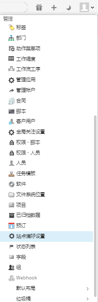
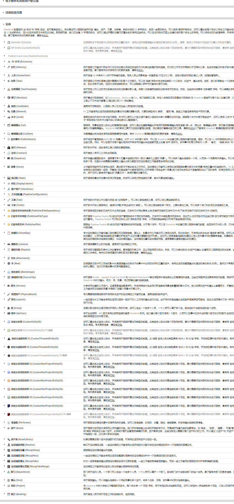
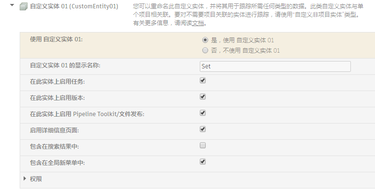
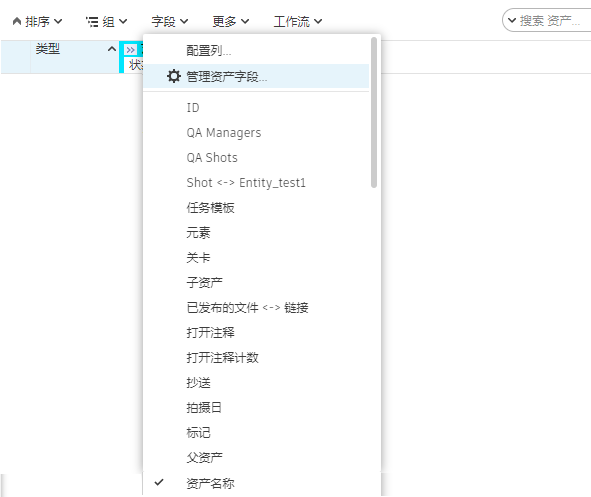
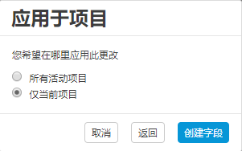
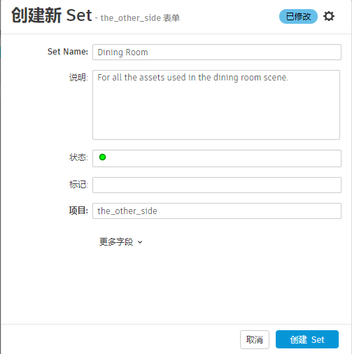
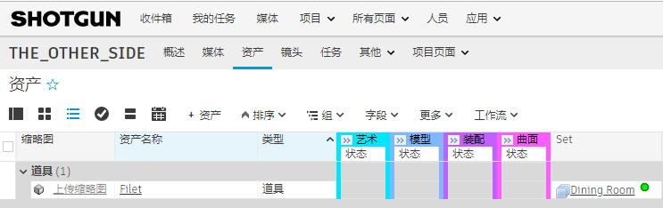
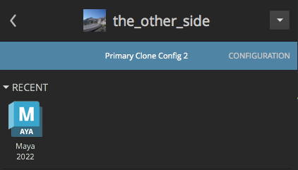

# 动态文件系统配置

在本手册中，您将学习如何修改 Toolkit 工作流配置来自定义您的制作文件夹结构和文件命名。

## 关于本手册

管理工作流的难点之一是跟踪将要创建的众多文件。Toolkit 工作流可通过以下方法实现文件系统管理自动化：基于 Shotgun 中的数据和配置的文件夹结构创建文件夹，然后将文件自动写入到正确的位置并使用标准化的命名，艺术家可以专注于内容创建。工作流配置带有一组默认文件夹和文件命名约定，但制作人员通常会对其进行自定义。本手册将提供进行这些自定义设置所需的知识。

在默认配置中，资产按照某种文件夹结构进行管理，如 `asset_type/asset/pipeline_step`。在本手册中，我们将使用名为“Set”的自定义实体，按使用每个资产的制作集进行进一步组织。我们将首先在 Shotgun 中设置自定义实体，然后使用它来管理为任意指定集创建的资产，使文件夹结构类似于 `set/asset_type/asset/pipeline_step`。

我们可以举例演示按集组织资产背后的理念：假设您有一个项目，其中某些场景发生在车库中，其他场景发生在餐厅中。借助我们的设置，资产文件（如“wrench”、“oilcan”或“workbench”）在“garage”文件夹中组织，而“plate”、“winebottle”或“tablecloth”在“dining_room”文件夹中组织。在我们的示例中，我们将要确保鲜美多汁的“filet”资产已正确放置在餐厅。

在示例中，我们还将编辑项目的文件命名模板，以使资产的 Maya 工作文件在其名称中包含集。动态生成的文件名可区分餐厅的文件与其他集中使用的文件。

### 本手册分三个部分

* 在 Shotgun 中创建一个名为“Set”的**自定义实体**，您将使用它来关联艺术家正在创建的餐厅元素。
* 编辑文件夹**数据结构**，使 Toolkit 包含一个基于文件夹结构中的当前集来动态命名的文件夹。
* 编辑用于命名资产工作文件的**模板**，使 Toolkit 在文件名中包含关联集的名称。

### 先决条件

要使用本手册，需要满足以下条件：

1. 有效的 [Shotgun](https://www.shotgunsoftware.com/zh-cn/signup/) 站点。您应该拥有至少已创建一个资产的项目。资产应具有模型任务。
2. 对如何使用 Shotgun 站点管理资产具有基本了解
3. 在系统上安装 [Shotgun Desktop](https://support.shotgunsoftware.com/hc/zh-cn/articles/115000068574#Installation%20of%20Desktop)。
4. 已标识项目的克隆工作流配置，或者完成[配置快速入门](./advanced_config.md)手册并克隆在该练习中创建的配置。
5. 基本熟悉 YAML。
6. 为存储工作流配置的文件系统设置适当的读取和写入权限。
7. 已设置适当的读取和写入权限，以允许 Toolkit 读取和写入到制作文件系统。
8. Maya 的有效固定期限的使用许可。获取 [Maya](https://www.autodesk.com.cn/products/maya/free-trial) 的 30 天试用版



### 关于文件数据结构和模板

Toolkit 工作流配置中的数据结构和模板使您能够充分利用您的 Shotgun 数据来管理磁盘上的制作文件。默认配置中的数据结构包括**镜头**、**镜头序列**、**资产**、**资产类型**等实体。可以添加其他实体，例如**关卡**、**剧集**、**季**，在我们的示例中，添加的是**集**这样的自定义实体。

Toolkit 平台允许您使用**数据结构**来动态构建您的文件夹结构，数据结构是在构建实际制作文件系统时用作模板的制作文件夹结构的微型版本。数据结构是动态创建文件夹的明确指导，它使用 YAML 文件为动态创建的文件夹定义规则。默认配置包含预配置的数据结构，它支持资产和镜头工作流的文件夹创建。您将修改数据结构的一部分，它支持创建资产文件夹结构 `/assets/<asset_type>/<asset>/<step>`，以增加对您正在创建的新 **Set** 实体的支持。

**模板**允许您使用数据结构中的 Shotgun 数据和信息，在创建文件时对其进行动态命名和保存。默认配置提供一组入门模板，您可以对其进行编辑以符合您的工作流需求。



## 开始练习

通过自定义数据结构和模板，您可以动态管理在创建餐厅集时生成的文件：地点设置、热气腾腾的菲力牛排、一瓶 1951 年的奔富葛兰许、千层焗薯茸、柠檬蒜芦笋等。餐厅集中使用的资产将与“餐厅”集实体相关联，使您能够更轻松地管理它们。集不是默认配置中的标准实体类型，因此您需要启用[自定义实体](https://support.shotgunsoftware.com/hc/zh-cn/articles/114094182834)并将其命名为 Set，然后再扩展数据结构和模板才能使用它。

### 启用自定义实体

**步骤 1：**在浏览器中打开 Shotgun 站点。单击您的头像并转至“管理 > 站点偏好设置”(ADMIN > Site Preferences)。在出现的页面上，展开**“实体”(Entities)**部分。



显示的是 Shotgun 中可用的实体类型列表。下图中列表的顶部是为当前 Shotgun 站点配置的某些实体类型。这些实体类型下方是尚未配置或启用的几个**自定义实体**。

### 选择其中一个自定义实体类型，对其进行配置，然后将其启用。



**步骤 2：**选择箭头以打开显示为灰色的已禁用自定义实体上的设置。选择**“是，使用自定义实体…”(Yes, use Custom Entity…)**旁边的单选按钮，将**“显示名称”(Display name)**更改为 **Set**，然后滚动到窗口顶部并选择“保存更改”(Save Changes)。



这样做可以使此自定义实体在 Shotgun 中处于活动状态，并将显示名称设置为 *Set*。实际上，您正在创建自定义实体的别名，因为实体的系统名称仍为 `CustomEntity01`。在此示例中，我们将使用 `CustomEntity01`；您可能会使用不同的自定义实体。



### 添加数据字段以将资产与集关联

通过将数据字段添加到资产实体，我们可以将资产链接到新实体。艺术家为餐厅创建的资产将与**餐厅**集实体关联。

**步骤 3：**选择页面顶部的**“项目”(Projects)**下拉列表，打开将用于该练习的项目。

**步骤 4：**在项目菜单栏中选择**“资产”(Assets)**以转到“资产”(Assets)页面。在“资产”(Assets)菜单中，选择**“字段 > 管理资产字段…”(Fields > Manage Asset Fields…)**



此动作将显示资产字段管理器。


选择**“+ 添加新的字段”(+ Add a new field)**。

为新字段选择参数。

在**“新建字段名称”(New Field Name)**中，键入“Set”。在**“常规”(GENERAL)**菜单的**“字段类型”(Field Type)**下，选择**“实体”(Entity)**，然后向下滚动以将**类型限制**为**“集”(Set)**。选择**“下一步”(Next)**。


在本手册中，将其应用到**“仅当前项目”(Only the current project)**并选择**“创建字段”(Create Field)**。

Shotgun 将配置新字段。



已应用您的更改，您可以选择**“完成”(Done)**。

### 创建**餐厅**集实体

**步骤 5：**选择资产的新**“集”(Set)**字段并开始键入“Dining Room”。将显示一个对话框，指出**“未找到匹配项。创建‘Dining Room’”(No matches found. Create “Dining Room”)**


选择**“创建‘Dining Room’”(Create “Dining Room”)**。



选择**“创建集”(Create Set)**。

在资产的“集”(Set)字段中添加**“Dining Room”**将会创建与餐厅集实体的[关联](https://support.shotgunsoftware.com/hc/zh-cn/articles/115000010973)。



**步骤 6：**将 **filet** 资产上的模型任务分配给您自己，以便您能够轻松找到它以进行测试。

### 设置数据结构

现在，您已启用“集”自定义实体，已创建一个名为“Dining Room”的集实体，并且已将“资产”实体链接到“Dining Room”集。您已获得 Shotgun 站点中的所有要素，现在可以修改您的文件夹结构。美工人员开始处理某个任务时，Toolkit 会使用关联的 Shotgun 数据来确定要在文件系统中创建的文件夹。将根据工作流配置的数据结构自动创建并命名新文件夹。

现在，您需要定义随着艺术家逐步完成制作工作流，您希望 Toolkit 动态生成的文件夹结构。可以通过编辑数据结构来完成此操作。

{% include info title="注意" content="建议在*克隆的*配置中测试配置，确保不影响活动的制作配置。克隆过程将创建配置的*副本*，您可以在将更改推送到活动配置之前安全地编辑该副本。您可以在[配置临时沙盒和推行应用](https://support.shotgunsoftware.com/hc/zh-cn/articles/219033168#Cloning%20your%20Configuration)文档中找到有关克隆配置的详细信息。" %}

**步骤 7：**导航至您的工作流配置。向下导航到 schema 文件夹 `<pipeline_configuration_root>/config/core/schema`，然后打开 `project` 文件夹。


当前数据结构，如下所示：

`<project>/assets/<asset_type>/<asset>/<step>`

支持动态创建此文件夹结构：

`the_other_side/assets/prop/filet/model`

而我们需要以下结构：

`the_other_side/assets/Dining-Room/Prop/filet/model`

要实现此目的，您需要设置如下所示的数据结构：

`<project>/assets/<CustomEntity01>/<asset_type>/<asset>/<step>`

“集”实体表示为 `CustomEntity01`。我们已在 Shotgun 中为 CustomEntity01 指定*显示名称* Set，但在我们的配置中，我们将始终按其系统名称 `CustomEntity01` 对其进行引用。

### 数据结构如何使用 YAML 文件

数据结构中可能包含静态和动态文件夹。如果您的数据结构中有一个名为“assets”的静态文件夹，它将对应于制作文件系统中名为“assets”的单个文件夹。另一方面，您的数据结构中可能有一个名为“asset”的动态文件夹，这表示项目中每个资产均有一个文件夹。每个动态文件夹的旁边均具有一个对应的 YAML 文件，且其名称与文件夹相同（例如 `asset/` 和 `asset.yml`），用于定义如何根据数据结构文件夹生成制作文件夹的规则。

### 为“集”实体创建新的文件夹和 YAML 文件

数据结构的 `project` 文件夹中包含与 Shotgun 跟踪的不同实体相关的文件夹。您正在添加新的资产实体 CustomEntity01，使 Shotgun 能够跟踪集中的项。这些项是资产，因此您将编辑资产下的文件夹和 YAML 文件。

同样，我们的目标是从 `asset_type/asset/step` 文件夹结构转入 `set/asset_type/asset/step`。因此，我们要添加一个文件夹来表示数据结构中的集，还有一个对应的 YAML 文件。由于我们需要对自定义实体使用系统名称，因此我们将创建 `CustomEntity01/` 文件夹和 `CustomEntity01.yml`。

**步骤 8：**在数据结构的 `project/assets` 文件夹中添加 `CustomEntity01` 文件夹。


**步骤 9：**在 `CustomEntity01` 文件夹旁边创建一个名为 `CustomEntity01.yml` 的文件，该文件内容如下：

```yaml
type: "shotgun_entity"

name: "code"

entity_type: "CustomEntity01"

filters:
    - { "path": "project", "relation": "is", "values": [ "$project" ] }
```

YAML 文件将向 Toolkit 提供有关如何为 `CustomEntity01` 文件夹命名的说明。在这种情况下，我们将创建一个 `shotgun_entity` 类型的文件夹，这意味着它对应于 Shotgun 查询。`entity_type` 字段告诉我们查询 Shotgun 中的 `CustomEntity01` 实体，`name` 字段告诉我们查询实体上的哪个*字段* – 在本例中，我们将从 `CustomEntity01` 获取 `code` 字段。

`filters` 字段限制了应该创建此动态文件夹的情况。

**步骤 10：**将 `asset_type/` 和 `asset_type.yml` 移到 `CustomEntity01` 文件夹中

我们希望我们的文件夹结构类似于 `Dining-Room/Prop/filet`，因此 `asset_type` 文件夹在层次结构中应位于 `CustomEntity01` 文件夹*下方*。将 `asset_type/` 和 `asset_type.yml` 移到 `CustomEntity01` 文件夹中。


### 编辑 asset.yml 文件

`filters` 字段限制了在指定时间为哪些实体创建了文件夹。在当前状态下，`asset.yml` 中的过滤器字段如下所示：

```yaml
filters:
    - { "path": "project", "relation": "is", "values": [ "$project" ] }
    - { "path": "sg_asset_type", "relation": "is", "values": [ "$asset_type"] }
```

当我们决定为资产创建文件夹时，我们需要确保我们位于正确的 project 文件夹和正确的 asset_type 文件夹中。现在，我们已经添加了一个集文件夹，我们还将添加第三个过滤器。如果没有它，我们最后将得到如下所示的文件夹，当然这可能不正确：

```
assets/Dining-Room/Prop/spoon
assets/Garage/Prop/spoon
assets/Classroom/Prop/spoon
```
为避免这种情况，我们将添加第三个过滤器，这将确保仅在正确集的文件夹中创建资产的文件夹。

**步骤 11：**修改 `asset.yml` 中的 `filters` 字段，使其如下所示：

```yaml
filters:
    - { "path": "project", "relation": "is", "values": [ "$project" ] }
    - { "path": "sg_asset_type", "relation": "is", "values": [ "$asset_type"] }
    - { "path": "sg_set", "relation": "is", "values": [ "$CustomEntity01" ] }
```


## 测试文件夹创建

现在，您已成功修改了数据结构，使其按集自定义实体组织资产。现在，我们来对其进行测试。

将在 Toolkit 工作流中的几个时间点创建文件夹：

* **应用程序启动程序**：每次用户为任务启动 DCC 时，Toolkit 都将为该任务创建目录（如果尚未创建）。由于启动 DCC 往往是用户通过 Toolkit 执行的第一个操作，因此这是创建目录的常规方式。这可以通过 Shotgun 中的右键单击菜单执行，也可从 Shotgun Desktop 或 Create 应用执行。
* **Shotgun 菜单**：为任务创建文件夹最直接的方法是在 Shotgun 中，在其上单击鼠标右键，然后选择“创建文件夹”(Create Folders)菜单项。
* **Toolkit API**：您可以通过 Toolkit API 直接触发目录创建逻辑。这可以用于将 Toolkit 插入到自定义启动程序中，也可用于工作流的事件触发器，您希望在其中为镜头自动创建目录，就像在 Shotgun 中创建一样。
* **tank 命令**：与 Shotgun 中的菜单项类似，`tank folders` 终端命令也可以为任务创建文件夹。

我们将使用 `tank` 命令进行测试。

**步骤 12：**在 `filet` 资产上运行 `tank folders`。从终端运行以下命令：

```
> cd <pipeline_configuration_root_folder>
>  ./tank Asset Filet folders
```

输出摘要：

```
----------------------------------------------------------------------
Command: Folders
----------------------------------------------------------------------

Creating folders, stand by...

The following items were processed:
 - /Users/michelle/Documents/Shotgun/projects/the_other_side
. . .
 - /Users/michelle/Documents/Shotgun/projects/the_other_side/assets/Dining-Room
 - /Users/michelle/Documents/Shotgun/projects/the_other_side/assets/Dining-Room/Prop
 - /Users/michelle/Documents/Shotgun/projects/the_other_side/assets/Dining-Room/Prop/Filet/
 - /Users/michelle/Documents/Shotgun/projects/the_other_side/assets/Dining-Room/Prop/Filet/model
 - /Users/michelle/Documents/Shotgun/projects/the_other_side/assets/Dining-Room/Prop/Filet/model/publish
. . .

In total, 23 folders were processed.
```

最终的结构与预期相符，Toolkit 非常智能，它甚至在 Dining 与 Room 之间添加了一个短横线。

`/the_other_side/assets/Dining-Room/Prop/Filet/model`


### 用于读取和写入文件的 Toolkit 模板

现在，我们已经设置了文件夹结构，下一步是编辑*模板*，以便在创建制作文件后对其进行恰当命名并放入正确的文件夹。

### Toolkit 应用如何使用模板

您首先创建了一种在 Shotgun 中将资产与集关联的方法，即启用 CustomEntity01 来表示集，然后向资产实体添加一个链接字段，以表示资产与集之间的链接。在资产与集之间建立关系后，您可设置文件夹数据结构以使用此关联，将所有资产*文件夹*放置在关联集的文件夹中。现在，您将创建一种方法，以动态命名*文件*并允许 Toolkit 应用自动管理文件。

随着艺术家开始处理项目中的任务，将生成必要的文件夹结构。然后，当他们启动 Workfiles 应用的**“File Save”**动作时，文件将自动命名。使用通过 Toolkit 的 Workfiles 应用访问的模板对该文件命名。渲染应用（如 Nuke Write 节点和 Houdini Mantra 节点）使用模板来命名和保存渲染的文件，与已发布文件的 Publisher 应用一样。

使用 Workfiles 的**“File Open”**动作访问文件时，它将使用模板来查找要加载的相应文件。Publisher、Loader 和 Nuke Studio Export 应用也会使用模板来查找和管理文件。美工人员不必担心文件名或位置；Toolkit 完全根据模板和正在执行的任务对其进行管理。

模板通过配置文件 `/<pipeline_configuration_root>/config/core/templates.yml` 进行管理。在前面的两个手册中，您管理和创建了工作环境特定的设置。数据结构和模板设置存储在 `config/core` 文件夹中，并非特定于环境。由于所有模板均存储在单个文件中，因此在不同环境配置文件的应用设置中，都将从该文件对其进行引用。例如，`template_work` 是 Workfiles 应用的设置，指定要将 `templates.yml` 中的哪个模板用于工作文件。根据配置 Workfiles 的环境和插件，您可能会使用此配置设置，指向 `templates.yml` 中的 `maya_shot_work` 模板或 `houdini_asset_work` 模板。

**步骤 13：**在工作流配置中打开 `config/core/templates.yml`。

此文件分为三个部分：

* **Keys：**用于构建模板的一组令牌（如 `{version}`、`{Asset}` 等）。在实际使用模板时，它们将替换为实际值。每个键都有必需的名称和类型及其他可选参数。
* **Paths：**使用键表示磁盘上的文件夹和文件路径的命名字符串。请注意，`paths` 部分中的模板已经过验证，必须实际存在于磁盘上。
* **Strings：**与 paths 部分相似，但这些是任意文本的模板。paths 部分中的项已经过验证，必须与磁盘上的实际路径对应，而字符串可用于存储您希望在 Toolkit 工作流中引用的任何文本数据。

### 为集实体添加模板键

首先要做的就是使用实体的系统名称，为集实体定义一个新的键。

**步骤 14：**将以下行添加到 `templates.yml` 的 `keys` 部分，注意正确缩进：

```yaml
       CustomEntity01:
           type: str
```

### 修改模板

由于模板定义了 Toolkit 读取和写入文件的位置，因此我们在此处定义的路径必须与数据结构中定义的文件夹结构保持一致，这一点至关重要。毕竟，制作文件应该进入我们正在创建的文件系统。因此，我们将要修改所有资产相关模板，以匹配我们在数据结构中定义的新文件夹结构。

然后，我们将修改 Maya 中资产步骤上工作文件的模板，使其在文件名中也包含集。在默认配置中，相关模板是 `maya_asset_work`，我们将从此处开始。



**步骤 15：**打开 `templates.yml` 并搜索 `maya_asset_work`。

```yaml
   maya_asset_work:
        definition: '@asset_root/work/maya/{name}.v{version}.{maya_extension}'
```

`maya_asset_work` 的 `definition` 值以 `@asset_root` 开头。`@` 符号表示 `@asset_root` 的值在其他位置定义。



由于每个集成、应用和环境可能使用不同设置，您可以想象路径的第一部分可能用于 `templates.yml` 内的多个不同位置。对配置进行设置，使其可以使用单个变量来存储常用根路径，然后在模板中引用该变量。当您可以引用公共根时，不必更改路径生成设置的每个实例。

默认配置有三个常用根变量：`@shot_root`、`@sequence_root` 和 `@asset_root`。我们将修改 `@asset_root`，这一单个更改将影响与资产相关的每个模板。

### 编辑模板使其匹配文件系统数据结构中的路径

**步骤 16：**在 `templates.yml` 的 `paths` 部分顶部搜索 `asset_root`。在默认配置中，它类似如下：

`asset_root: assets/{sg_asset_type}/{Asset}/{Step}`

将 `CustomEntity01` 添加到 `asset_root` 路径中以匹配数据结构修改：

`asset_root: assets/{CustomEntity01}/{sg_asset_type}/{Asset}/{Step}`

### 将集添加到文件名中

我们已更改文件的文件夹结构，以反映我们的数据结构更改，现在文件将读取和写入到合适的位置。现在，我们来修改 Maya 资产工作文件模板的文件*名*，使其也包括集。

再次查找 `maya_asset_work` 模板定义。在当前状态下，文件*名*为

`{name}.v{version}.{maya_extension}`

`{name}` 模板键是表示 Workfiles 应用的“File Save”动作中的用户输入的特殊键。我们来修改模板，使其不包含任何用户输入，而是仅包含当前集和资产。

**步骤 17：**修改 `maya_asset_work` 模板定义，使其类似如下：

```yaml
    maya_asset_work:
        definition: '@asset_root/work/maya/{CustomEntity01}_{Asset}.v{version}.{maya_extension}'
```

此动作允许您在文件名中使用 Dining-Room 实体的专有名称。结果将类似于 `Dining-Room_Filet.v1.mb`。

现在，您已经修改 `templates.yml` 以反映制作文件夹结构中的新集文件夹，并且在 Maya 中资产任务的工作文件中包含集名称。让我们来检验所做的更改。

### 测试

**步骤 18：**从 Shotgun Desktop 启动 Maya。



在 Maya 中，转到**“Shotgun > File Open”**，然后在出现的对话框中，选择您已在 Shotgun 中为其指定集的资产的任务。


选择**“+New File”**

您可以创建简单的三维对象，也可以使用**“Shotgun > File Save”**保存文件。


成功！

请注意，**“File Save”**对话框使用模板中的新设置显示**“Preview: Dining-Room_scene.v001.ma”**。

**“Work Area:”**显示 **.../Shotgun/projects/the_other_side/assets/Dining-Room/Prop/Filet/model/work/maya** 作为 Workfiles 保存文件的位置的路径。

## 高级主题

### 扩展示例

在此示例中，我们修改了一个模板，但对于文件系统配置还有更多工作可以做。在真实的示例中，您可能会更改*所有*与资产相关的文件，使其采用相同的文件命名约定。您可以根据其他实体（季、剧集、关卡等）进行修改、创建用户文件夹、根据使用正则表达式操纵的 Shotgun 数据对文件夹命名，等等。您可以在[文件系统配置参考](https://support.shotgunsoftware.com/hc/zh-cn/articles/219039868)中了解有关所有 Toolkit 文件夹和数据结构选项的信息。

### 路径缓存

在创建文件夹时，将在磁盘上的文件夹与 Shotgun 实体之间创建映射。这些映射将存储为 Shotgun 中的 FilesystemLocation 实体，并缓存在用户计算机上的 SQLite 数据库中。要详细了解路径缓存的工作方式及其使用方式，请参见[此文档](../../../quick-answers/administering/what-is-path-cache.md)。


### 其他资源

* [文件系统配置参考](https://support.shotgunsoftware.com/hc/zh-cn/articles/219039868)
* [Toolkit 配置简介网络讲座视频](https://www.youtube.com/watch?v=7qZfy7KXXX0&t=1961s)

