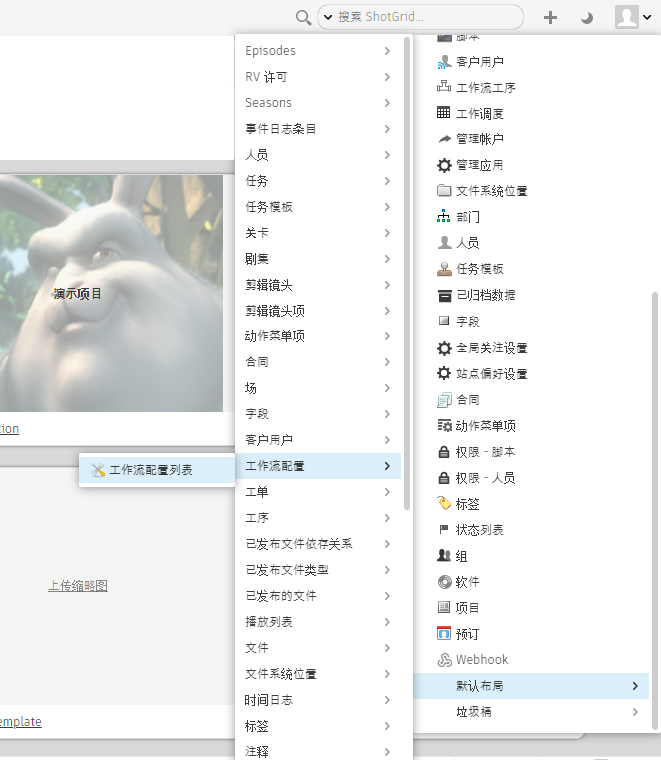
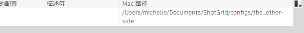
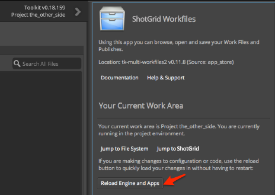

# 编辑工作流配置
完成本手册后，您将掌握以下基础知识：

* 查找特定 Toolkit 应用的配置设置
* 编辑设置
* 探索配置设置可以扩展的其他功能。

## 关于本手册

本手册介绍如何编辑现有工作流配置中的设置，以满足项目工作流的需求。第一个手册**[配置快速入门](./advanced_config.md)**介绍了如何准备工作流配置以进行编辑。如果您不熟悉如何为项目创建可编辑的配置，请先完成**配置快速入门**，然后再继续。

通过扩展默认配置，Shotgun Toolkit 允许自定义工作流中的任务。在一个或多个软件包内的 Toolkit 应用中启用或禁用按钮就是简单的自定义示例，它可以更改用户与 Toolkit 功能进行交互的方式。Toolkit 允许使用专用配置，通过创建自定义工作流、自动执行重复和单调的任务、修改挂钩甚至添加基于 Toolkit 平台的自定义工具，让您可以更智能和更快速地工作。遗憾的是，它只能通过 Shotgun 软件集成进行访问，还不能用于像洗衣服这样的日常任务。

本手册中的练习将向您讲解如何查找哪些配置设置控制应用软件中 Shotgun 应用的动作，设置所在的位置以及如何对其进行编辑。举个具体的例子，我们可以通过编辑“Workfiles”应用下的设置，禁止艺术家用 Maya 的**“+New Task”**按钮创建新任务。

## 使用本文档

要使用本手册并对工作流配置执行编辑，需要以下内容：

1. 有效的 [Shotgun](https://www.shotgunsoftware.com/zh-cn/signup/?utm_source=autodesk.com&utm_medium=referral&utm_campaign=creative-project-management) 站点。
2. 包含至少一个资产的项目。您可以将资产添加到在第一个手册中创建的 the_other_side 项目。您可以在[配置快速入门](./advanced_config.md)手册中查看如何为项目创建资产。
3. 已标识项目的工作流配置，或者完成[配置快速入门](./advanced_config.md)手册并使用在该练习中创建的配置。
4. 为存储工作流配置的文件系统设置适当的读取和写入权限。
5. 在系统上安装 Shotgun Desktop。
6. Maya 的有效固定期限的使用许可。在[此处](https://www.autodesk.com.cn/products/maya/free-trial)获取 Maya 的 30 天试用版



## 关于工作文件应用

工作文件应用监管 Shotgun 软件集成中的文件管理，并控制对浏览、打开和保存工作文件功能的访问。**“+New Task”**按钮是工作文件应用的一个动作，允许用户添加任务，而无需转到 Shotgun 执行此操作。配置分解为每个环境的文件。这样，您可以管理相对于工作流中不同阶段的功能，从而控制用户何时可以创建、命名和保存文件、执行任务或执行某些功能。这与工作文件应用中的所有功能相关，也适用于修改任何应用或插件的设置。请在本文档末尾的[高级主题](#advanced-topics)中查找更多详细信息。

## 熟悉配置文件

使用 Shotgun 中的“工作流配置列表”(Pipeline Configuration List)查找为您正在处理的项目存储工作流配置的位置。如果您知道它的存储位置，则可以跳到<a href="#step5">步骤 5</a>。

## 查找工作流配置

**步骤 1：**打开管理您将用于此练习的项目的 **Shotgun 站点**。

**步骤 2：**通过从**“项目”(Projects)页面**中选择项目，从 **Shotgun 站点**访问该项目。


**步骤 3：**选择右上角的**头像**以显示**“管理”(ADMIN)**菜单，并向下滚动以选择**“默认布局 > 工作流配置 > 工作流配置列表”(Default Layouts > Pipeline Configuration > Pipeline Configuration List)**。



**步骤 4：**显示**“工作流配置列表”(Pipeline Configuration List)**后，选择列标题最右侧的 **+** 号以添加另一列。在下拉列表中，为您的操作系统选择适当的路径。


路径将显示在新字段中。



**步骤 5：**在终端或文件管理器中，浏览到存储项目工作流配置的文件夹，并打开该文件夹。

Toolkit 配置根文件夹中有三个子文件夹：**cache**、**config** 和 **install**。打开 **config** 文件夹，在其中您会发现几个子文件夹和一些文件。


**env** 文件夹存储支持艺术家的工作环境的集成设置。环境文件允许工作流中的不同阶段具有自定义配置。默认配置带有一组预定义的环境文件，但如果工作流需要一组更精细的环境文件，则可以对这些环境文件进行修改。

**步骤 6：**打开 **env** 文件夹。

Toolkit 使用 YAML 文件来配置功能。之所以选择 YAML 作为配置的语言，是因为它允许 Toolkit 中的文件以易于读取和自定义的轻量级方式设置格式。您可以在[此处](https://yaml.org/) 了解有关 YAML 的更多信息。配置由嵌套的 YAML 文件组成，这些文件提供标识符插件、应用和框架。它是一个路线图，指导您对一组特定的代码包进行编辑，以便控制您需要自定义的动作。

## 编辑配置文件

Shotgun Toolkit 允许对集成在各种软件包中的应用进行更改。工作文件应用的一个功能是**“+New Task”**按钮，该按钮允许用户在**“File Open”**对话框中添加新任务。默认情况下，在项目的每个阶段为每个用户启用此功能。但是工作室可能希望限制此功能，例如，如果他们拥有特定的命名约定，或者想要将任务创建限制到项目的制作管理团队。在这种情况下，他们会为艺术家在 Maya 中工作时使用的工作流中的所有点禁用**“+New Task”**按钮。

## 为 Maya 中的项目禁用“+New Task”按钮

**步骤 7：**打开 **Shotgun Desktop**。

**步骤 8：**选择您要编辑其配置的项目。


**步骤 9：**从 Shotgun Desktop 启动 Maya。


等待 **Shotgun** 菜单完全加载。如果您的 Internet 连接速度较慢，可以利用运行配置的时间来享用表面带有适量棕红色泡沫的浓缩咖啡。

一旦完全加载 Maya 和 Shotgun，就会自动打开**“File Open”**对话框。当从 Shotgun Desktop 启动 Maya 时，您将在**项目**环境中进入 Maya；Toolkit 工作流的配置将由 `config/env/project.yml` 文件驱动。默认配置中标识的环境包括 `project`、`sequence`、`shot`、`shot_step`、`asset`、`asset_step`。

**步骤 10：**在**“File Open”**对话框的左窗格中选择**“资产”(Assets)**选项卡。在搜索结果中显示的文件夹内选择任何资产。


此时将启用**“+New Task”**按钮。

## 查找控制“+New Task”按钮的设置

Toolkit 工作流配置用于自定义环境以满足您的工作流需求。工作流配置可以覆盖默认 Shotgun 集成设置，根据需要或多或少会有所不同，以满足项目工作流的需求。这种结构允许采用轻量级配置，从而仅添加与 Shotgun 核心代码中的默认值不同的设置。在本练习中，我们希望关闭工作文件应用的**“+New Task”**按钮，但在这样做之前，我们需要确定哪个配置设置控制它。

**步骤 11：**选择**“File Open”**窗口右上角**“Project (项目名称)”**旁边的 **>**。

此参考框显示有关控制**“File Open”**窗口功能的配置设置的详细信息。Toolkit 中的某些应用具有参考框，以显示该应用使用的设置以及默认设置。请注意，**“Location:”**标识符是 **tk-multi-workfiles2**。这是创建 Workfiles 应用的代码包的标识符。在搜索工作流配置时，此名称将标识应用的设置所在位置。有一个[“应用和插件”页面](https://support.shotgunsoftware.com/hc/zh-cn/articles/219039798)，其中列出了 Shotgun 集成中可用的工作流的所有配置设置、应用和插件。


在**“Configuration”**标题下查看以查找此特定环境的设置。




向下滚动到 **Setting allow_task_creation**。此设置的默认值为 **True**，使用户能够在处于 Maya 项目环境中时创建新任务。


当搜索设置时，要考虑以下几点：

* 您正在运行的软件应用程序。
* 您正在处理的文件以及使用的工作环境。可以在应用的参考框中找到这些信息。
* 特定设置的名称。可以在应用的参考框或[“应用和插件”页面](https://support.shotgunsoftware.com/hc/zh-cn/articles/219039798)上找到这些信息。
* 要扩展的 YAML 文件。YAML 文件中详细说明了标识符和路线图，以将您指引到设置所在的位置。
* YAML 文件中要扩展的特定块。这在路线图中进行标识。
* YAML 文件中使用的标识符和符号。
* 最重要的是，当前项目的配置存储位置。

可以在工作流配置内的多个位置使用一个设置。决定在哪个位置使用该设置的因素是：您希望影响的软件集成，以及您希望在工作流中的哪个阶段影响更改。

## 查找设置 `allow_task_creation` 的值的位置

**步骤 12：**显示 Maya 主窗口。

**步骤 13：**在 Maya 窗口的右上角找到**“Shotgun”**菜单项。


**提示：**如果此菜单不可见，则会显示 **>>** 以表明某些菜单项处于隐藏状态。选择 **>>** 以显示“Shotgun”菜单，或者您可以加宽 Maya 窗口。

**步骤 14：**在菜单右上角选择**“Shotgun > Project the_other_side > Work Area Info…”**。


**“Work Area Info”**对话框显示后台内容，以及有关当前工作区的详细信息。这包括您当前的工作环境，以及指向设置所在的环境配置文件的路径。

**步骤 15：**在**“Your Current Work Area”**对话框中，选择底部的**“环境”(Environment)**选项卡。

第一项标识正在使用的插件。插件推动了将 Shotgun 工具集成在特定软件应用程序中的能力。它包含特定于每个软件集成的逻辑。窗口中显示的第二项显示当前项目环境所在的路径。


最后两个文件夹是 `config/env/` 后跟 `project.yml`。`project.yml` 文件是路线图的开头，它将您指引到当前环境的设置所在的位置。

**步骤 16：**通过您喜欢的文本编辑器打开 `project.yml`。

```yaml
description: Apps and Engines when launching with a project only context.

################################################################################

includes:
- ./includes/frameworks.yml
- ./includes/settings/tk-3dsmaxplus.yml
- ./includes/settings/tk-desktop.yml
- ./includes/settings/tk-flame.yml
- ./includes/settings/tk-houdini.yml
- ./includes/settings/tk-mari.yml
- ./includes/settings/tk-maya.yml
- ./includes/settings/tk-motionbuilder.yml
- ./includes/settings/tk-nuke.yml
- ./includes/settings/tk-photoshopcc.yml
- ./includes/settings/tk-shell.yml
- ./includes/settings/tk-shotgun.yml

################################################################################
# configuration for all engines to load in a project context

engines:
  tk-3dsmaxplus: "@settings.tk-3dsmaxplus.project"
  tk-desktop: "@settings.tk-desktop.project"
  tk-flame: "@settings.tk-flame.project"
  tk-hiero: "@settings.tk-nuke.hiero.project"
  tk-houdini: "@settings.tk-houdini.project"
  tk-mari: "@settings.tk-mari.project"
  tk-maya: "@settings.tk-maya.project"
  tk-motionbuilder: "@settings.tk-motionbuilder.project"
  tk-nuke: "@settings.tk-nuke.project"
  tk-nukestudio: "@settings.tk-nuke.nukestudio.project"
  tk-photoshopcc: "@settings.tk-photoshopcc.project"
  tk-shell: "@settings.tk-shell.project"
  tk-shotgun: "@settings.tk-shotgun.project"

################################################################################
# reference all of the common frameworks

frameworks: "@frameworks"

```

<!---->

在 `project.yml` 中，description 下面有三个部分：`includes`、`engines` 和 `frameworks`。`includes` 部分是*引用*配置中其他 YAML 文件的文件指针的列表。默认配置的架构利用嵌套文件，并使用指针作为保持文件轻量级的另一种方法。在 **includes** 之后，您将逐个浏览文件，直到找到要查找的配置设置。这有点儿像俄罗斯套娃：您打开一个娃娃，里面嵌套着另一个娃娃，直到您找到合适的配置设置。

每个插件标识为 `tk-<name of software application>`。您知道您想要影响 Maya 中的设置，因此我们要查找的标识符是 `tk-maya`。

在 `project.yml` 文件的 `includes:` 部分下查看，并找到 `./includes/settings/tk-maya.yml` 这一行。这一行表示，控制 Maya 插件 `tk-maya` 的**设置**的配置嵌套在 **settings** 文件夹内的 **includes** 文件夹中。

在 `engines:` 部分中，找到 `tk-maya` 值。

`tk-maya: "@settings.tk-maya.project"`

`@` 表明值源自一个包含文件。

`settings` 和 `project` 引用表明它是项目的设置。它们是默认配置中的命名约定，有助于为您提供指导。

这一整行告诉我们在包含文件中查找 `settings.tk-maya.project` 块，以找到 Maya 插件 `tk-maya` 的配置设置。

Shotgun Toolkit 会在 YAML 文件中使用简单的术语，来指示设置的名称以及引导您找到它们的路径。通过在 Maya**“File Open”**参考框中查看，我们已经知道，控制**“+New Task”**按钮执行方式的代码包是由 `tk-multi-workfiles2` 标识的。在 YAML 文件中使用这些标识符引用 Toolkit 包。“tk-multi-workfiles2”是 Workfiles 应用代码包的标识符，**“+New Task”**按钮是 Workfiles 应用的一个功能。

在 tk-maya.yml 中查找 Workfiles 应用设置

**步骤 17：**在文件浏览器中，浏览到 **env/includes/settings** 文件夹并打开 `tk-maya.yml`。


**步骤 18：**在 `project.yml` 中的 include 之后，在 `tk-maya.yml` 文件中搜索 `settings.tk-maya.project`。您明确希望在特定项目的项目环境中禁用**“+New Task”**按钮。您处于该项目的配置中，并在项目环境中时获得了位置信息。

```yaml
# project
settings.tk-maya.project:
  apps:
    tk-multi-about:
      location: "@apps.tk-multi-about.location"
    tk-multi-screeningroom: "@settings.tk-multi-screeningroom.rv"
    tk-multi-shotgunpanel: "@settings.tk-multi-shotgunpanel"
    tk-multi-workfiles2: "@settings.tk-multi-workfiles2.launch_at_startup"
  menu_favourites:
  - {app_instance: tk-multi-workfiles2, name: File Open...}
  location: "@engines.tk-maya.location"
```

<!---->

在 `settings.tk-maya.projects` 下，`tk-multi-workfiles2` 应用设置列为

`tk-multi-workfiles2: "@settings.tk-multi-workfiles2.launch_at_startup"`

`@` 符号告诉我们，`tk-multi-workfiles2` 的值来自一个包含文件。在 `includes` 部分 `tk-maya.yml` 的顶部，我们看到以下内容：

```yaml
includes:
...
- ./tk-multi-workfiles2.yml
```

我们应该在 `tk-multi-workfiles2.yml` 文件（位于与当前文件 `config/env/includes/settings` 的同一目录下）中查找 `settings.tk-multi-workfiles2.launch_at_startup`。

**步骤 19：**打开 `tk-multi-workfiles2.yml` 文件并搜索 `settings.tk-multi-workfiles2.launch_at_startup`。

```yaml
# launches at startup.
settings.tk-multi-workfiles2.launch_at_startup:
  launch_at_startup: true
  entities:
```

<!---->

Maya 参考框指示 `allow_task_creation` 设置的默认值为 `true`。最佳实践是，工作流配置中不反映默认设置。这允许使用**稀疏**格式，从而仅将与默认代码不同的设置添加到配置中。如果未明确提供设置，则访问该设置的任何调用都将收到默认值。当 Toolkit 读取配置并构建环境时，在该环境中运行的应用、插件和框架将使用该项目的工作流配置设置，并根据配置中的内容覆盖任何默认设置。

**步骤 20：**在 `tk-multi-workfiles2.yml` 中，在 `settings.tk-multi-workfiles2.launch_at_startup:` 下添加 `allow_task_creation` 并将值设置为 `false`

```yaml
# launches at startup.
settings.tk-multi-workfiles2.launch_at_startup:
  allow_task_creation: false
  launch_at_startup: true
  entities:
```

<!---->

**注意：**Toolkit 默认配置设置按字母顺序排列，是查找特定设置的简单方法。如果保持这种约定，由于配置变得更重量级，因此让您的工作轻松很多。

**步骤 21：**保存文件。

## 重新加载配置

**步骤 22：**在 Maya 的**“File Open”**对话框中，打开参考框，然后选择**“Reload Engines and Apps”**。



这将重新加载配置设置。

## 查看您所做的更改

**步骤 23：**导航到**“File Open”**对话框，然后选择资产。


请注意，**“+New Task”**按钮不可见。

您已修改 Workfiles 应用的配置设置，更改了项目环境中按钮的行为。由于您只在项目环境中修改了该设置，因此，如果您开始在其他环境中工作，则**“+New Task”**按钮的设置仍将处于活动状态。在实际制作示例中，我们可能会对*所有*环境进行在此处所做的更改。

## 更改环境

**步骤 24：**在资产搜索结果下，打开一个文件夹并选择要处理的资产。


**步骤 25：**选择**“+New File”**

通过选择**“+New File”**，您开始处理新资产，并在 Maya 中加载 `asset_step` 环境。当美工人员选择资产任务并创建新文件或打开现有文件时，将会自动加载 `asset_step` 环境，从而显示为工作流中的该阶段配置的工具和功能。

## 了解您的工作环境

**步骤 26：**在 Maya 菜单的右上角，选择**“Shotgun”**。


**“Art, Asset Text Overlay”**告知您正在处理资产以及您所在的环境。

**步骤 27：**选择**“Art, Asset Text Overlay > Work Area Info…”**以显示当前工作区中的参数。

**步骤 28：**选择底部的**“环境”(Environment)**选项卡。


每个环境都会显示确定设置在工作流配置中所在位置所需的信息。要禁止美工人员添加新任务，必须为美工人员的每个工作环境禁用**“+New Task”**按钮。对于每个环境，请使用上面概述的相同步骤来适当地编辑配置。

注意：每个环境都是独立的，一个项目具有专用的配置，加载项目时软件集成仅从工作流配置中读取其特定软件的设置。

您现在已经编辑了工作流配置，对应用的设置进行了更改。现在，真正有趣的事情开始了：学习使用 Shotgun Toolkit 环境可以执行的所有任务。下面是一些要探索的高级主题。

## 高级主题

在本手册中，我们在单个插件 `tk-maya` 和单个环境 `project` 中对应用的配置设置进行了简单的更改。您了解到，Toolkit 按环境进行组织，每个环境对于每个软件执行都是唯一的，项目和任务专注于环境，允许您在工作流的已定义点为艺术家提供特定功能。您可以概括我们的简单更改，以便对 Toolkit 工作流配置进行丰富的自定义。

### 其他插件

Workfiles 应用的系统名称是 `tk-multi-workfiles2`，名称中的 `multi` 表明它是一个**多应用**。多应用与软件无关，即，无论您是在 Maya、Nuke、Houdini 还是其他任何受支持的应用中运行它们，它们的特性和功能都是相同的。如果要在所有软件包中禁用 Workfiles 中的任务创建，则应按照本手册中针对每个**插件**（`tk-nuke`、`tk-houdini` 等）的步骤进行操作。

### 其他环境

我们在项目环境中禁用了任务创建，但在实际的工作室环境中，您可能希望在艺术家的所有工作环境中禁用它。要执行此操作，您应该按照本手册中的步骤进行操作，但不是从 `project.yml` 开始，而是从 `asset_step.yml`、`shot_step.yml` 等开始。

### 创建自定义环境

默认配置附带了一组预定义的工作流工序：`project`、`sequence`、`shot`、`shot_step`、`asset` 和 `asset_step`。但是，工作室可能需要为工作流的每个阶段（即 `asset_step_rig`、`asset_step_model`、`shot_step_anim`、`shot_step_light` 等）使用不同的配置设置。Toolkit 支持自定义环境。有关详细信息，请参见[“环境配置参考”的“自定义环境”部分](../../../toolkit/env_config_ref.md#custom-environments)。

### 视频资源

* [Toolkit 配置简介](https://www.youtube.com/watch?v=7qZfy7KXXX0&t=1961s)（来源：SIGGRAPH 2018 Developer Day）
* [揭秘默认配置网络讲座](https://www.youtube.com/watch?v=eKHaC1dZCeE)

现在您已了解如何修改应用配置设置，请尝试[将应用添加到 Toolkit 配置](installing_app.md)。
