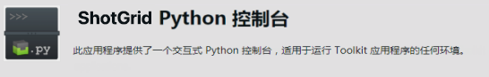
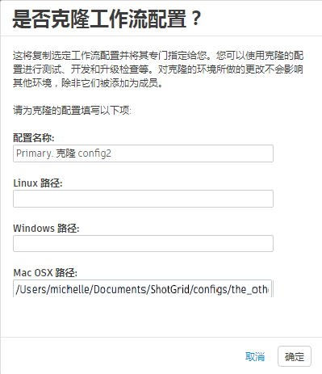
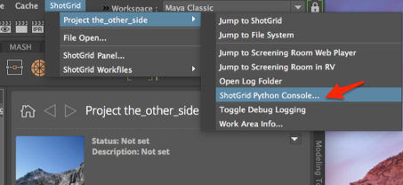

# 添加应用

通过完成本手册，您将很快熟悉 Toolkit 中的配置管理工具，并学会如何：

* 安全地创建使用中的工作流配置的副本
* 将应用添加到配置
* 添加在特定环境中使用该应用所需的设置
* 将更改同步回使用中的工作流配置

## 关于本手册

本手册将演示如何将  Toolkit 应用添加到现有的工作流配置。您将很快熟悉配置管理工具。

我们要添加的应用是  Python 控制台应用。Maya 具有其自己的 Python 控制台，但是 Toolkit 应用中有一些功能在 Maya 控制台中不存在。

本手册利用我们在[编辑工作流配置](./editing_app_setting.md)手册中创建的工作流配置。如果您尚未完成此手册，则可以使用现有的工作流配置，并在其中添加该应用。

## 使用本文档

要使用本手册并安装 Toolkit 应用，需要以下内容：

1. 活动的 [](https://www.shotgridsoftware.com/signup/) 站点。
2. 用于已标识项目的工作流配置，或完成[配置快速入门](./advanced_config.md)手册，并使用在该练习中创建的配置。
3. 为存储工作流配置的 Shotgun 管理的文件系统设置适当的读取和写入权限。
4. 在系统上安装  Desktop。
5. Maya 的有效固定期限的使用许可。在[此处](https://www.autodesk.com.cn/products/maya/free-trial) 获取 Maya 的 30 天试用版。



## 关于  Toolkit 应用

### Toolkit 应用工作方式

工作流配置中引用的应用可以来自不同的位置。默认配置中的标准应用来自  应用商店。工作流配置中的文件指定  集成如何访问应用，有点像询问 Toolkit，“您能在小黑本中查找 Python 控制台应用的地址吗？”工作流配置文件告知 Toolkit 在何处可以找到用于特定应用的代码包。

Toolkit 应用的“地址”列在默认配置的 `config/env/includes/app_locations.yml` 文件中，并指定如何查找代码。这些“地址”称为[描述符](https://developer.shotgridsoftware.com/tk-core/descriptor.html)。不仅需要告诉  集成如何查找应用的代码包，还需要告诉它在哪些环境中使用该应用。

下面概念性概述了如何安装应用以及如何告知  集成在何处使用它。 它概述了扩展配置的步骤，要求 Toolkit 查找描述符，并告知  在何处使用该应用。 本手册详细介绍了这些步骤：

1. 确定要添加的应用的描述符。
2. 复制要将应用描述符添加到的活动工作流配置。
3. 确定该应用的描述符在配置中是否存在，如果不存在，则添加它。
4. 使用空格而不是制表符进行缩进，从而正确设置 YAML 文件的格式。
5. 确定要在哪些环境中使用该应用。
6. 在这些环境中，添加允许  使用该应用的设置。
7. 测试新配置。
8. 使扩展配置生效。

### 查找 Python 控制台应用的位置描述符

**步骤 1：**打开[应用和插件页面](https://support.shotgunsoftware.com/hc/zh-cn/articles/219039798#tk-maya)，并在 Maya 下查找  Python 控制台的信息。选择标题。



这将显示[应用的信息](https://support.shotgunsoftware.com/hc/zh-cn/articles/219033108)，其中包括小黑本所需的所有内容。


**应用插件名称**是主标识符：`tk-multi-pythonconsole`。您还需要**最新版本**：v1.1.2。

### 确认在 Maya 的项目环境中没有 Python 控制台应用

**步骤 2：**启动 Maya 并选择  菜单**“ > 项目 the_other_side”(ShotGrid > Project the_other_side)**，您会看到可用于项目环境中该项目的应用列表。


## 扩展配置

要编辑处于制作阶段的配置，您需要先创建一个副本，然后编辑该副本。这样，您不会影响实时配置，可以先创建一个安全空间进行测试，然后再使其生效。通过创建临时沙盒，您可以使用当前在制作中使用的工作流配置的副本。在沙盒中，您对配置副本进行更改，测试这些更改，然后再使其在制作中生效。

克隆工作流配置可自动执行以下过程：创建副本，构建可以在其中使用副本的沙盒，然后再将新配置推送到实时制作中。

## 克隆要将应用添加到的工作流配置

### 转到工作流配置列表。

**步骤 3：**打开 ，在右上角选择**“管理”(Admin)菜单（您的头像）>“默认布局 > 工作流配置 > 工作流配置列表”(Default Layouts > Pipeline Configuration > Pipeline Configuration List)**。


此动作将显示  站点的所有工作流配置的详细列表。

**步骤 4：**显示“工作流配置列表”(Pipeline Configuration List)后，选择列标题最右侧的 **+** 号，然后添加**“项目”(Projects)**列。


### 查看项目配置所在的位置

**步骤 5：**此外，针对您的操作系统添加适当的**路径**字段。


这会显示配置文件的路径。


**步骤 6：**在**“主要”(Primary)**行项旁边的空白区域中**单击鼠标右键**，然后在上下文菜单中选择**“克隆此配置…”(Clone this Configuration…)**。


**步骤 7：**在配置列表中命名配置，然后在目录中分别命名文件：“Primary Clone Config 2”和“the_other_side_clone2”。选择**“确定”(OK)**。



等待  复制配置中的所有文件和文件夹，并为应用创建缓存。 现在就可以使用应用，让您可以一边喝着香浓咖啡，一边享用羊角面包。


完成后，将使用有关克隆配置的信息更新配置列表，并且将在本地 config 文件夹中添加新配置。



## 将克隆的配置与项目相关联

**步骤 8：**打开  Desktop，并选择您为其创建克隆配置的项目。 选择右上角的**向下箭头**以显示与此项目关联的配置，然后选择刚创建的 **Primary Clone Config 2**。


 Desktop 现在正在使用此项目的克隆配置。

## 编辑工作流配置

**步骤 9：**在文件系统中，在创建克隆配置时指定的路径中查找克隆配置。查看 `config/env/includes/app_locations.yml` 文件。


`app_locations.yml` 文件是默认配置的小黑本，应用的描述符列在此文件中。此文件指向应用所在的位置，并允许您为该应用创建设置。

如果您要使用的应用未在小黑本中引用，则需要告知 Toolkit 在哪里找到它。

## 告知 Toolkit 在哪里找到应用

**步骤 10：**在此文件中搜索 `pythonconsole`。如果为项目使用了默认配置，您会发现此文件中列出了 Python 控制台应用的描述符。它应该与我们开始配置时查看的 Maya 应用[列表](https://support.shotgunsoftware.com/hc/zh-cn/articles/219039798) 中的描述相匹配。检查以确保版本与我们在 Maya 应用列表中查看的内容相匹配。

```yaml
apps.tk-multi-pythonconsole.location:
	type: app_store
	name: tk-multi-pythonconsole
	version: v1.1.2

```



所有应用和插件都有描述符。您可以在[核心 API 文档的“描述符”部分](https://developer.shotgridsoftware.com/tk-core/descriptor.html#descriptor-types)中阅读有关描述符工作方式以及如何设置 `type:` 的内容。

## 告知 Toolkit 使用描述符

现在，我们需要告知 Toolkit 使用描述符来查找 Python 控制台应用，并在我们处于 Maya 的项目环境中时使用它。

**步骤 11：**打开克隆配置中的 `config/env/project.yml` 文件，并找到 `tk-maya` 插件的设置。

```yaml
# configuration for all engines to load in a project context

engines:
  tk-3dsmaxplus: "@settings.tk-3dsmaxplus.project"
  tk-desktop: "@settings.tk-desktop.project"
  tk-flame: "@settings.tk-flame.project"
  tk-hiero: "@settings.tk-nuke.hiero.project"
  tk-houdini: "@settings.tk-houdini.project"
  tk-mari: "@settings.tk-mari.project"
  tk-maya: "@settings.tk-maya.project"
  tk-motionbuilder: "@settings.tk-motionbuilder.project"
  tk-nuke: "@settings.tk-nuke.project"
  tk-nukestudio: "@settings.tk-nuke.nukestudio.project"
  tk-photoshopcc: "@settings.tk-photoshopcc.project"
  tk-shell: "@settings.tk-shell.project"
  tk-shotgun: "@settings.tk-shotgun.project"

```

使用 `@settings` 的 `tk-maya: “@settings.tk-maya.project”` 行表明这些设置位于包含文件中。`tk-maya` 标识 Maya 插件，`project` 标识环境。

### YAML 文件

 Toolkit 工作流配置使用 [YAML](https://yaml.org/spec/1.2/spec.html) 文件中的简单术语来标识应用和插件的位置及其设置。

对于此特定块：

* `settings` 是为默认配置选择的作为对 settings 文件夹的引用的字符串
* `project` 是为默认配置选择的作为对项目环境的引用的字符串
* `tk-maya` 是 Toolkit 的 Maya 插件的标识符
* `@` 是 Toolkit 术语，用于表示设置值来自包含文件

YAML 文件是  集成的窗口，可以更轻松地配置满足您的工作流需求的工作环境。

### 配置如何引用 Toolkit 包

 集成的代码被组织成应用、插件和框架的包。 在 Toolkit 的 YAML 文件中使用 `tk-maya`、`tk-multi-pythonconsole` 等标识符对这些包进行引用。每个包的相应 YAML 块都包含用于控制如何访问和使用所标识包的设置。

## 在何处放置 Python 控制台的设置

对于默认配置中的此特定块，“tk-maya.project”是项目环境中 Maya 插件的标识符。我们的目标是将 Python 控制台应用代码包添加到项目环境中的 Maya 插件。根据所使用的术语，可以肯定的是 `tk-maya.yml` 是项目环境设置所在的 YAML 文件的名称。在 `tk-maya.yml` 文件中查找 `apps` 的 `settings.tk-maya.project`。

**步骤 13：**要查找该文件，在 engines 上方的 includes 部分中查找 `tk-maya.yml`。

`./includes/settings/tk-maya.yml`

**步骤 14：**在克隆配置中，在文本编辑器中打开 `config/env/includes/settings/tk-maya.yml`，并搜索 `settings.tk-maya.project`。


**步骤 15：**在以下部分的下方添加位置描述符

```yaml
settings.tk-maya.project:
  apps:
```

使用 `about` 应用 `tk-multi-about:`，作为如何添加位置描述符的指南，然后保存该文件。



```yaml
# project
settings.tk-maya.project:
  apps:
    tk-multi-about:
      location: "@apps.tk-multi-about.location"
    tk-multi-pythonconsole:
      location: "@apps.tk-multi-pythonconsole.location"
    tk-multi-screeningroom: "@settings.tk-multi-screeningroom.rv"
    tk-multi-shotgunpanel: "@settings.tk-multi-shotgunpanel"
    tk-multi-workfiles2: "@settings.tk-multi-workfiles2.launch_at_startup"
```

您会注意到，**审片室、 面板和 Workfiles 2** 应用的位置标识符列在不同的包含文件中，并且以不同于**关于**应用的方式进行访问。 为了保持整洁，这些应用被拆分到包含的 settings 文件夹，因为它们具有其他设置。



## 查看 Maya 中的更改

**步骤 16：**打开  Desktop，选择正在处理的项目，并确认您使用的是克隆配置。

在项目名称下，将出现一个蓝色条，其中包含您创建的克隆的名称。




**步骤 17：**从 Desktop 启动 Maya，然后选择菜单**“ > 项目 > …”(ShotGrid > Project > …)**

如果：

* 您使用的是刚编辑的克隆配置
* 克隆配置已正确扩展
* 您保存了扩展文件
* 您选择将项目与克隆配置相关联
* 您从  Desktop 重新启动了 Maya

Python 控制台应用将在 Maya 中可用。


## 将更改推送到制作中

在确认正确添加了 Python 控制台应用后，您就可以使更改生效了。

**步骤 18：**打开终端，并浏览到存储克隆配置的位置。从克隆配置的根文件夹中，运行以下命令：

在 Linux 或 Mac 上：

`./tank push_configuration`

在 Windows 上：

`tank.bat push_configuration`

按照提示操作，并键入项目主要配置（您要将更改推送到的配置）的 ID。

```

$ ls
cache		config		install		tank		tank.bat
$ ./tank push_configuration

Welcome to the Shotgun Pipeline Toolkit!
For documentation, see https://support.shotgunsoftware.com
Starting Toolkit for your current path
'/Users/michelle/Documents/Shotgun/configs/the_other_side_clone2'
- The path is not associated with any Shotgun object.
- Falling back on default project settings.
- Running as user 'Michelle'
- Using configuration 'Primary Clone Config 2' and Core v0.18.159
- Setting the Context to Project the_other_side.
- Running command push_configuration...


----------------------------------------------------------------------
Command: Push configuration
----------------------------------------------------------------------

This command will push the configuration in the current pipeline configuration
('Primary Clone Config 2') to another pipeline configuration in the project.
By default, the data will be copied to the target config folder. If pass a
--symlink parameter, it will create a symlink instead.

Your existing configuration will be backed up.

The following pipeline configurations are available to push to:
 - [1] Primary (/Users/michelle/Documents/Shotgun/configs/the_other_side)

Please type in the id of the configuration to push to (ENTER to exit):

```

将出现一个可以将克隆配置推送到的可用工作流配置的列表。输入您要为其更新配置的项目的主要工作流配置的 ID。




输入 ID 后， 将：

* 备份主要配置
* 复制克隆配置
* 将复制的克隆配置与项目相关联，使克隆保持不变
* 显示保存主要配置的位置
* 检查是否有任何需要下载和缓存的应用

```
Please type in the id of the configuration to push to (ENTER to exit): 1
Hold on, pushing config…
Your old configuration has been backed up into the following folder:
/Users/michelle/Documents/Shotgun/configs/the_other_side/config.bak.20190118_111627
Checking if there are any apps that need downloading…

Push Complete!
```

## 查看在主要配置中所做的更改

**步骤 19：**在  Desktop 中，单击右上角的箭头，并在**“配置”(CONFIGURATION)**列表中选择**“主要”(Primary)**。


**步骤 20：**从 Desktop 启动 Maya，并查看菜单**“ > 项目 > …”(ShotGrid > Project > …)**以查找“ Python 控制台...”(ShotGrid Python Console...)



Python 控制台应用已添加到所选项目的项目环境中。我们在第二个手册[编辑配置](./editing_app_setting.md)中讨论过，每个环境都是独立的，每个项目都有专用配置，软件集成在加载项目时从工作流配置中收集设置。为使 Python 控制台在环境中可用，该环境需要使用一些指令以便在 `app_locations.yml` 文件中查找位置描述符。考虑到这一点，在工作流中您希望使用 Python 控制台应用的任何阶段，都需要“在此处使用 Python 控制台应用”设置。

## 高级主题

###  开发人员社区

Toolkit 的一个奇妙之处在于，任何人都可以创建 Toolkit 应用。应用可以保持专有，也可以在 [ 社区](https://support.shotgunsoftware.com/hc/zh-cn/articles/219039828)中分享，并添加到  库。如果您已经在  区页面上创建了真正想要共享的主要应用，请访问[支持站点](https://knowledge.autodesk.com/contact-support)以获取帮助。

在 **[-dev Google 组](https://groups.google.com/a/shotgunsoftware.com/forum/?fromgroups#!forum/shotgun-dev)**中对标准 Toolkit 应用和由充满爱心的  社区创建的应用进行了热烈的讨论。随着  社区内容日益丰富，知识和工具库将不断壮大。

### 研究如何扩展配置

您可能已经注意到，当我们选择要用于项目的配置时， Desktop 下拉菜单中提供了 Python 控制台应用。


如果有一个环境正在使用您要添加到工作流配置的应用，则可以使用少量检测工作来查找将该应用添加到配置所需的信息。通过在使用该应用的环境中查看配置文件，您可以确定如何添加应用位置描述符和设置。

Desktop 应用会在项目环境中打开，因此在 `project.yml` 文件中查找 `tk-desktop`。

打开 `config/env/project.yml`。

{% include info title="注意" content='在插件块中，`tk-desktop` 指向包含的内容：

```yaml
includes:
  - ./includes/settings/tk-desktop.yml

engines:
  tk-desktop: "@settings.tk-desktop.project"
```

在包含内容之后，打开 `config/env/includes/settings/tk-desktop.yml` 并查找 `settings.tk-desktop.project` 块。在该块中，您会看到以下内容：<br/><br/>

```yaml
apps:
  tk-multi-pythonconsole:
  location: "@apps.tk-multi-pythonconsole.location"
```

在项目工序中，这些块将 Python 控制台应用添加到 Desktop 插件。

在此之后，进一步包含 `../includes/app_locations.yml`，并搜索 `apps.tk-multi-pythonconsole.location` 以查找以下内容：<br/><br/>

```yaml
# pythonconsole
apps.tk-multi-pythonconsole.location:
  type: app_store
  name: tk-multi-pythonconsole
  version: v1.1.2
```' %}

每个应用、插件和框架都有位置描述符，用于告知 Toolkit 在何处访问特定的包。许多应用描述符都位于 `app_locations.yml` 文件中，但可能无法在所需的位置引用它们，正如我们在 Python 控制台应用中看到的那样。所有标准应用和插件都列在[应用和插件页面](https://support.shotgunsoftware.com/hc/zh-cn/articles/219039798-Integrations-Apps-and-Engines) 中。

您可以将任何应用添加到 ShotGrid 支持的任何适当的软件集成中，也可以将您自己的专有应用添加到 Toolkit 库中。所有受支持的软件应用程序也列在集成[应用和插件页面](https://support.shotgunsoftware.com/hc/zh-cn/articles/219039798-Integrations-Apps-and-Engines) 中。

如果找不到您要查找的确切应用，则可以创建一个。其他 ShotGrid 用户很有可能需要同样的功能，因此分享新应用是回馈 ShotGrid 社区的一种方式。

在下一个手册中，您将了解[如何自定义 production 文件夹结构，以呈现您的设施的构造方式](./dynamic_filesystem_configuration.md)。


