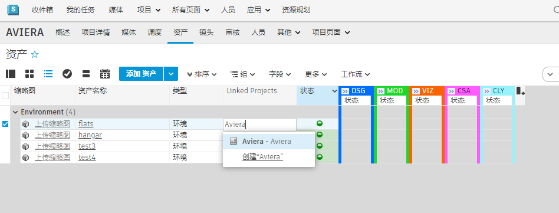

# 跨项目工作流

## 最佳设计体验

通过  中的跨项目工作流，您可以跨多个项目重用、共享和处理资产。最常见的重用资产方法是将单个“资产库”项目用作源项目。尽管我们仍建议使用单个“库”项目来保持其简捷性，但  也允许您跨任意活动项目链接资产。

有两种主要方法来重用资产。较为灵活的方法是“按原样”重用源资产（直接引用）。但是，因项目和工作流的不同，可能会存在一些制约或局限，因此也可以选择将源资产复制到项目中（“复制”或“派生”）。

* **直接引用** - 按原样重用源资产。如果该资产发生更改，可以保留您的版本或更新到最新版本。
* **复制或派生** - 从另一项目导入源资产（断开与源资产的所有连接），以在其上构建或控制资产并保存到您的当前项目中。

# 跨项目/库项目工作流
本教程将介绍如何使用  Toolkit 跨多个项目重用资产，并构建一个便于工作室艺术家访问的资产库。我们来介绍三个主要步骤，以便快速入门。

1. **跨项目链接 ShotGrid 资产** - 使用**“链接的项目”(Linked Projects)**字段在资产和项目之间进行链接
2. **将资产加载/引用到场景中** - 使用加载器中的一个动态选项卡
3. **保持资产为最新** - 使用场景细分应用

## 第 1 步 - 链接资产

重用资产的第一步是让  了解您还想要在哪些项目中使用源资产。

在源项目（包含您要重用的原始资产）中，导航到“资产”(Assets)页面。将**“链接的项目”(Linked Projects)**字段添加到“资产”(Assets)页面（如果尚未显示）。然后，指定要重用资产的项目。

*有关详细文档，请单击*[此处](https://help.autodesk.com/view/SGSUB/CHS/?guid=SG_Administrator_ar_site_configuration_ar_cross_project_asset_linking_html)。

## 第 2 步 - 加载资产
通过**“链接的项目”(Linked Projects)**字段正确链接资产后，您便可以在加载器中使用便捷的动态选项卡来显示您工作室链接的可重用资产。这有助于艺术家和创意团队轻松地跨多个项目重用资产。

正确链接资产后：
* 启动您选择的内容创建软件（Maya、Houdini、Alias 等）
* 通过打开或保存工作场景来设置上下文
* 设置场景上下文后，从  菜单启动加载器
* 现在，您将看到**“资产链接”(Assets - Linked)**选项卡，通过该选项卡可以跨项目访问资产的已发布文件。

*有关将此选项卡添加到加载器配置中的详细说明，请单击[此处](https://developer.shotgridsoftware.com/zh_CN/2088a677/)。*

在这里，您可以利用内容创建软件加载器动作来执行诸多操作，例如导入（如果您计划复制或派生资产，则会断开与其源资源的所有连接），或者引用资产（持续连接到当前版本和该资产的所有后续版本）。

## 第 3 步 - 更新资产
如果选择通过保持与源资产的连接来引用资产，您可能想要查看对源资产所做的更新和更改。在这种情况下，通常会有另一个团队继续迭代源资产，而您则需要最新版本。

在配置中使用场景细分 2 应用将使您能够查看场景中当前引用的所有项。当这些引用中的任何内容更新时，场景细分将显示冲突，共享有关更改内容的已发布文件注释，并允许您更新到已发布文件的最新版本或任何其他版本。

*注意：仅当使用高级配置时，才会应用资产更新。如果您的工作室使用的是基本配置，您将无权访问此场景细分应用。*

