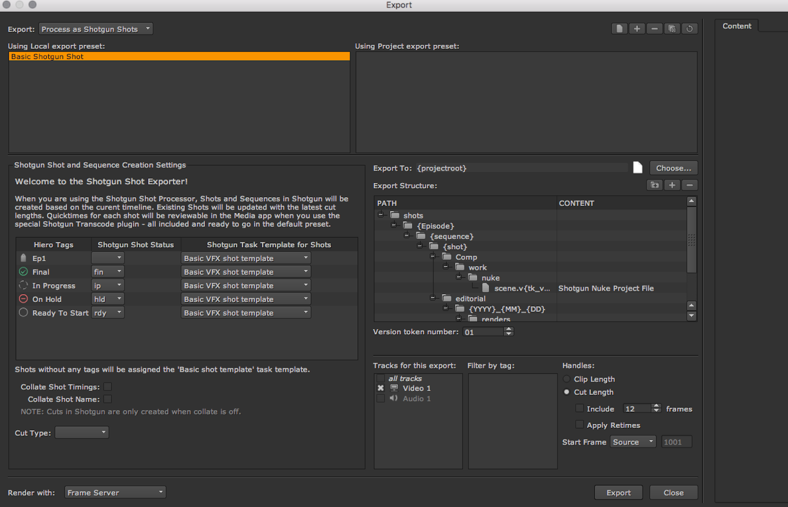

# Nuke Studio 中的剧集工作流


## 简介和准备工作


本文介绍如何在 Nuke Studio 或 Hiero 中通过我们的 `tk-hiero-export` 应用设置并运行您的剧集工作流。请注意，这并没有一个精准方法，根据您所需的工作流，方法会略有不同。对于本文示例，我们将做以下假设：

* 您的目标是设置一个三层的层次结构：`Episode > Sequence > Shot`
* 您将先阅读并完成[文件系统配置手册](https://developer.shotgridsoftware.com/zh_CN/82ff76f7/)中的步骤。
* 您将使用 `Episode` 实体类型（而不是 `CustomEntity02`，这两者的使用方式相同，只是名称不同。）
* `Sequence` 实体具有一个名为 `episode` 的实体字段。
* 您将使用 Nuke Studio，但过程与 Hiero 相同。
* 您将先在 Toolkit 项目中使用[默认配置](https://github.com/shotgunsoftware/tk-config-default2)。

在开始之前，您还要做出一个决定，即如何解析 `Episode`。现有的  Hiero/Nuke Studio 导出流程会根据 Nuke Studio 项目内容在  站点上创建 `Sequence` 和 `Shot` 实体。因此，与在 Maya 中使用 Toolkit 时的情况（要求您已创建资产和任务）不同，在 Nuke Studio 中，不要求您已创建 `Episodes`、`Sequences` 或 `Shots`。虽然如此，您仍需决定如何在 Nuke Studio 中定义 `Episode`。下面是几种可能的方式：

* 提前在  中创建剧集，并配置 Nuke Studio Toolkit 集成以在剧集上下文中使用，以便在导出时您可以从当前场景上下文中获得 `Episode` 实体。
* 假定尚未创建 `Episode` 实体，并要利用 Nuke Studio 的标记功能以剧集名称标记场，以及在导出时使用相应信息来解析 `Episode`。

可能有更适合您的工作流的其他方法，例如，从 Nuke Studio 场或镜头名称中提取剧集名称（例如，从名为 ep1_s01 的场中提取 ep1 部分）。或者，可以使用导出应用的 [hiero_customize_export_ui.py](https://areadownloads.autodesk.com/wdm/shotgrid/tu-episodic-nuke.zip) 挂钩添加一个用于将导出与剧集相链接的 GUI。

对于此示例，我们采用第二种方式：场标记解决方案。

*请注意，此方式用于实施三层层次结构 (`Episode > Sequence > Shot`)。如果直接将 `Sequence` 实体类型替换为 `Episodes` 实体类型 (`Episode > Shot`)，过程更简单。在本手册结束前，我们将简要介绍此情况，但仍有必要阅读其余部分以便深入了解相关信息。*

## 数据结构和模板


如前所述，此示例假定您已[更新您的数据结构和模板](https://developer.shotgridsoftware.com/zh_CN/82ff76f7/#how-can-i-add-a-new-entity-type-to-my-file-structure)。请确保您还在 templates.yml 中更新了 `hiero_plate_path` 和 `hiero_render_path` 路径值，以在正确的位置包含剧集项。

## 挂钩和设置


为了使  导出流程正确处理 `Episode`，需要修改其中一些导出挂钩。本文假定您知道[挂钩](https://developer.shotgridsoftware.com/zh_CN/312b792f/#using-frameworks-from-hooks)是什么，并了解如何覆盖基本实施。

有两个导出挂钩可帮助您启用剧集。

* `hiero_get_shot.py`
* `hiero_resolve_custom_strings.py`

注意：另外有一个名为 `hiero_translate_template.py` 的挂钩。此示例中不使用该挂钩，但如果您希望将场替换为剧集并维持一个两层的层次结构，则需要使用该挂钩。在本文结尾处，我们将稍微介绍此内容。

修改 `hiero_get_shot.py`，以便查找剧集，并在  中为其创建一个实体，同时修改 `hiero_resolve_custom_strings.py`，以便 Nuke Studio 了解向路径中的 {Episode} 项提供何值。下面是更加详细的步骤：

### 1. 添加剧集字段

现在，模板中有一个名为 `Episode` 的新项，您需要告诉 `tk-hiero-export` 应用如何解析此项。在 `<pipeline_configuration>/config/env/includes/settings/tk-hiero-export.yml` 文件中修改 `custom_template_fields`，使其如下所示：

```
 settings.tk-hiero-export:  
    custom_template_fields: [{keyword: Episode, description: The episode name}]  
 ...
```

这将向 Hiero 导出器中添加一个名为 `{Episode}` 的有效导出令牌。

### 2. hiero_get_shot 挂钩

现在，需要使用 `hiero_get_shot.py` 挂钩告诉导出流程如何查找剧集名称并在  中创建 `Episode`。

[默认的挂钩版本 (hiero_get_shot.py)](https://areadownloads.autodesk.com/wdm/shotgrid/tu-episodic-nuke.zip) 将从  返回名称与 TrackItem 相同的 `Shot`。还必须将 `Shot` 链接到名称与 Nuke Studio 场项相同的 `Sequence`。如果  中不存在 `Sequence` 或 `Shot`，该挂钩将创建它们。您将为该层次结构添加另一层，因此您需要告诉挂钩，如果 `Episode` 不存在，还要创建它。

由于 `Sequence` 已链接到 `Episode`，您应将其关联到查找 `Sequence` 的代码（`get_shot_parent()` 方法）。

在配置的 hooks 文件夹中创建 `hiero_get_shot.py` 文件，并将 `hook_get_shot: '{config}/hiero_get_shot.py'` 添加到 `tk-hiero-export.yml` 设置中，即如下所示：

```
 settings.tk-hiero-export:  
    custom_template_fields: [{keyword: Episode, description: The episode name}]  
    hook_get_shot: '{config}/hiero_get_shot.py'
```

下面是 `hiero_get_shot.py` 挂钩的完整代码。将此代码添加到您创建的挂钩中：

```
from sgtk import Hook

class HieroGetShot(Hook):
    """
    Return a    Shot dictionary for the given Hiero items
    """

    def execute(self, task, item, data, **kwargs):
        """
        Takes a hiero.core.TrackItem as input and returns a data dictionary for
        the shot to update the cut info for.
        """

       # get the parent entity for the Shot
       parent = self.get_shot_parent(item.parentSequence(), data, item=item)

       # shot parent field
       parent_field = "sg_sequence"

       # grab shot from  
       sg = self.parent.shotgun
       filter = [
           ["project", "is", self.parent.context.project],
           [parent_field, "is", parent],
           ["code", "is", item.name()],
        ]

       # default the return fields to None to use the python-api default
       fields = kwargs.get("fields", None)
       shots = sg.find("Shot", filter, fields=fields)
       if len(shots) > 1:
           # can not handle multiple shots with the same name
           raise StandardError("Multiple shots named '%s' found", item.name())
       if len(shots) == 0:
           # create shot in {{ akn_product_name_lower }}
           shot_data = {
               "code": item.name(),
               parent_field: parent,
               "project": self.parent.context.project,
           }
           shot = sg.create("Shot", shot_data, return_fields=fields)
           self.parent.log_info("Created Shot in   : %s" % shot_data)
       else:
           shot = shots[0]

       # update the thumbnail for the shot
       upload_thumbnail = kwargs.get("upload_thumbnail", True)
       if upload_thumbnail:
           self.parent.execute_hook(
               "hook_upload_thumbnail",
               entity=shot,
               source=item.source(),
               item=item,
               task=kwargs.get("task")
           )

       return shot

    def get_episode(self, data=None, hiero_sequence=None):
        """
        Return the {{ akn_product_name_lower }} episode for the given Nuke Studio items.
        We define this as any tag linked to the sequence that starts
        with 'Ep'.
        """

       # If we had setup Nuke Studio to work in an episode context, then we could
       # grab the episode directly from the current context. However in this example we are not doing this but here
       # would be the code.
       # return self.parent.context.entity

       # stick a lookup cache on the data object.
       if "epi_cache" not in data:
           data["epi_cache"] = {}

       # find episode name from the tags on the sequence
       nuke_studio_episode = None
       for t in hiero_sequence.tags():
           if t.name().startswith('Ep'):
               nuke_studio_episode = t
               break
       if not nuke_studio_episode:
           raise StandardError("No episode has been assigned to the sequence: %s" % hiero_sequence.name())

       # For performance reasons, lets check if we've already added the episode to the cache and reuse it
       # Its not a necessary step, but it speeds things up if we don't have to check {{ akn_product_name_lower }} for the episode again
       # this session.
       if nuke_studio_episode.guid() in data["epi_cache"]:
           return data["epi_cache"][nuke_studio_episode.guid()]

       # episode not found in cache, grab it from  
       sg = self.parent.shotgun
       filters = [
           ["project", "is", self.parent.context.project],
           ["code", "is", nuke_studio_episode.name()],
       ]
       episodes = sg.find("Episode", filters, ["code"])
       if len(episodes) > 1:
           # can not handle multiple episodes with the same name
           raise StandardError("Multiple episodes named '%s' found" % nuke_studio_episode.name())

       if len(episodes) == 0:
           # no episode has previously been created with this name
           # so we must create it in {{ akn_product_name_lower }}
           epi_data = {
               "code": nuke_studio_episode.name(),
               "project": self.parent.context.project,
           }
           episode = sg.create("Episode", epi_data)
           self.parent.log_info("Created Episode in   : %s" % epi_data)
       else:
           # we found one episode matching this name in {{ akn_product_name_lower }}, so we will resuse it, instead of creating a new one
           episode = episodes[0]

       # update the cache with the results
       data["epi_cache"][nuke_studio_episode.guid()] = episode

       return episode

    def get_shot_parent(self, hiero_sequence, data, **kwargs):
        """
        Given a Hiero sequence and data cache, return the corresponding entity
        in    to serve as the parent for contained Shots.

        :param hiero_sequence: A Hiero sequence object
        :param data: A dictionary with cached parent data.

        .. note:: The data dict is typically the app's `preprocess_data` which maintains the cache across invocations of this hook.        

        """
        # stick a lookup cache on the data object.
        if "parent_cache" not in data:
            data["parent_cache"] = {}

        if hiero_sequence.guid() in data["parent_cache"]:
            return data["parent_cache"][hiero_sequence.guid()]

        episode = self.get_episode(data, hiero_sequence)

        # parent not found in cache, grab it from    

        sg = self.parent.shotgun filter = [
            ["project", "is", self.parent.context.project],
            ["code", "is", hiero_sequence.name()],
            ["episode", "is", episode],
            ]

        # the entity type of the parent.
        par_entity_type = "Sequence"

        parents = sg.find(par_entity_type, filter)
        if len(parents) > 1:
            # can not handle multiple parents with the same name
            raise StandardError(
                "Multiple %s entities named '%s' found" % (par_entity_type, hiero_sequence.name())
                )

        if len(parents) == 0:
            # create the parent in {{ akn_product_name_lower }}
            par_data = {
                "code": hiero_sequence.name(),
                "project": self.parent.context.project,
                "episode": episode,
                }

            parent = sg.create(par_entity_type, par_data)
            self.parent.log_info(
                "Created %s in   : %s" % (par_entity_type, par_data)
                )
        else:
            parent = parents[0]

        # update the thumbnail for the parent
        upload_thumbnail = kwargs.get("upload_thumbnail", True)

        if upload_thumbnail:
            self.parent.execute_hook(
                "hook_upload_thumbnail", entity=parent, source=hiero_sequence, item=None
            )

        # cache the results
        data["parent_cache"][hiero_sequence.guid()] = parent
        return parent
```

#### 获取场

在上面的代码中，我们修改了 `get_shot_parent()` 方法。现在，在查找和创建 `Sequence` 时，它使用新 `get_episode()` 方法返回的 `Episode`。现在，在  数据库中检查是否存在 `Sequence` 时，它会按 `episode</code< field` 进行过滤、创建 `Sequence` 以及使用 `get_episode()` 返回的 `Episode` 填充场的 `episode` 字段。


#### 获取剧集

如何获取剧集？`get_episode()` 方法代码与 `get_shot_parent()` 方法非常相似，但已修改为检索 `Episode` 而不是 `Sequence`。

在本手册中，您将使用标记在 Nuke Studio 中分配剧集。例如，您可以在 Nuke Studio 中创建一个名为 Ep01 的标记。然后，在 Nuke Studio 中将该标记应用于场。

`get_episode()` 方法在较高级别查找在 Nuke Studio 中应用于场项的所有标记，如果找到以字符串 Ep 开头的标记，则假定它就是定义剧集名称的标记。随后，该方法将从  查找并返回匹配的 `Episode`，如果尚不存在，则会创建它。该方法还将缓存此信息，因此，无需再次执行成本高昂的查找调用。

*如果您希望以其他方式获取剧集（例如，从上下文中获取，或通过提取场或镜头名称的第一个部分来获取），请在此方法使用相应逻辑。*


#### 获取镜头

hiero_get_shot 挂钩的主要用途是从  返回镜头数据。实际上，您不需要设置用于获取镜头的逻辑，只需修改 `Sequence` 获取父对象的方式。如果您还希望通过一个自定义字段将 `Shot` 与 `Episode` 链接，则还需要在执行方法中修改相应代码。从 `Sequence`（如 `parent[“episode”]`）访问 `Episode`，然后将其链接到创建调用中的镜头。


### 3. Hiero_resolve_custom_strings.py

您需要利用的第二个挂钩是 `hiero_resolve_custom_strings.py`。它用于为 Nuke Studio 导出解析路径。同样，您需要在 hooks 文件夹中创建该挂钩，并将设置 `hook_resolve_custom_strings: {config}/hiero_resolve_custom_strings.py` 添加到您的 `tk-hiero-export.yml` 文件中。

在步骤 1 中添加的自定义项 `{Episode}` 将传递给此挂钩，导出应用要求返回已解析的文件夹名称。该挂钩需要检查传递的项是否为 `{Episode}`，如果是，它将在 `hiero_get_shot.py` 挂钩中重复使用 `get_episode()` 方法以获取 `Episode` 实体。获取 `Episode` 后，相应代码可以提取剧集的名称以生成相应的文件夹。

下面是该挂钩的完整代码：

```
from sgtk import Hook


class HieroResolveCustomStrings(Hook):
    """Translates a keyword string into its resolved value for a given task."""
    # cache of shots that have already been pulled from {{ akn_product_name_lower }}
    _sg_lookup_cache = {}

    def execute(self, task, keyword, **kwargs):
        """
        The default implementation of the custom resolver simply looks up
        the keyword from the {{ akn_product_name_lower }} shot dictionary.

        For example, to pull the shot code, you would simply specify 'code'.
        To pull the sequence code you would use 'sg_sequence.Sequence.code'.
        """

        if keyword == "{Episode}":
            episode_entity = self.parent.execute_hook_method(
                "hook_get_shot",
                "get_episode",
                data=self.parent.preprocess_data,
                hiero_sequence=task._item.parentSequence(),
            )
            # hard coded to return the name of the episode
            # if however your folder for the episode in the schema, is not just made up from the code field
            # you need to get it to return what ever string value the folder would normally be created with.
            return episode_entity['code']

        shot_code = task._item.name()

        # grab the shot from the cache, or the get_shot hook if not cached
        sg_shot = self._sg_lookup_cache.get(shot_code)
        if sg_shot is None:
            fields = [ctf['keyword'] for ctf in self.parent.get_setting('custom_template_fields')]
            sg_shot = self.parent.execute_hook(
                "hook_get_shot",
                task=task,
                item=task._item,
                data=self.parent.preprocess_data,
                fields=fields,
                upload_thumbnail=False,
            )

            self._sg_lookup_cache[shot_code] = sg_shot

        self.parent.log_info("_sg_lookup_cache: %s" % (self._sg_lookup_cache))

        if sg_shot is None:
            raise RuntimeError("Could not find shot for custom resolver: %s" % keyword)

        # strip off the leading and trailing curly brackets
        keyword = keyword[1:-1]
        result = sg_shot.get(keyword, "")

        self.parent.log_debug("Custom resolver: %s[%s] -> %s" % (shot_code, keyword, result))
        return result

```

请注意，如果您的数据结构剧集文件夹名称是基于 `code` 字段以外的内容生成的，您需要将该名称复制到此处。

更准确但更复杂的方法是在 templates.yml 中添加 `episode_root` 模板，然后从该模板获取字段。这意味着返回的文件夹名称始终匹配数据结构，即使在数据结构中更改了剧集文件夹名称也是如此。此方法如下所示：

```
ctx = tk.context_from_entity("Episode", episode_entity[id])
my_template = tk.templates["episode_root"]
fields = my_template.get_fields(ctx.filesystem_locations[0])
return fields["Episode"]

```

## 总结


现已完成设置！接下来就是测试所做更改是否可以正常使用。

在启动 Nuke Studio、创建项目并为其填充场和序列后，现在可以测试导出流程。首先，创建剧集标记。请注意，您之前将挂钩编码为在场上查找以 `Ep` 开头的标记，因此必须将标记命名为 `Ep…`


现在向场添加标记。

  


完成该操作后，从标记的场导出镜头。


检查导出结构的层次结构是否匹配我们的数据结构的层次结构。如果不匹配，则可能需要[刷新结构](#tip-refresh).




单击“导出”(Export)后，应该会在您的  站点上创建剧集、场和镜头，以及在磁盘上创建文件夹结构。如果在此过程中遇到问题，请在 Nuke Studio 脚本编辑器或 [ 日志 (tk-nukestudio.log)](https://developer.shotgridsoftware.com/zh_CN/38c5c024/) 中检查是否存在您可能遇到的任何错误。

上文就是本手册介绍的方法。当然，这只是用于处理剧集的多种方法之一，您可以自行找到最适合您的工作室的方法和结构。

## 用场交换剧集


如上文简要介绍的那样，如果您希望直接将默认的场/镜头层次结构交换为剧集/镜头层次结构，可以将 Nuke Studio 场项用作剧集名称的来源。

1. 设置数据结构和模板以处理剧集/镜头结构。

2. 利用默认的 `hiero_get_shot.py` 挂钩，如上所示。但此时将 `parent_field` 变量值更改为 `sg_episode`（确保您的镜头实体上有剧集字段），将 `par_entity_type` 变量值更改为 `variable value to``Episode`。

3. 利用 `hiero_translate_template.py` 挂钩，并在挂钩文件中更改映射：

```
 mapping = {
   "{Episode}": "{sequence}",
   "{Shot}": "{shot}",
   "{name}": "{clip}",
   "{version}": "{tk_version}",
}

```


将使用 Nuke Studio 场项的值解析剧集项。

> **提示：**<a id="tip-refresh"></a>如果您在进行这些更改之前打开了 Hiero/Nuke Studio 项目，或者您在测试的同时进行了更改，则可能需要重置导出路径。当您打开“导出”(Export)对话框时，Nuke Studio 会缓存导出树，因此，如果您希望重新加载对数据结构所做的更改，您需要按刷新按钮以重新构建导出树。