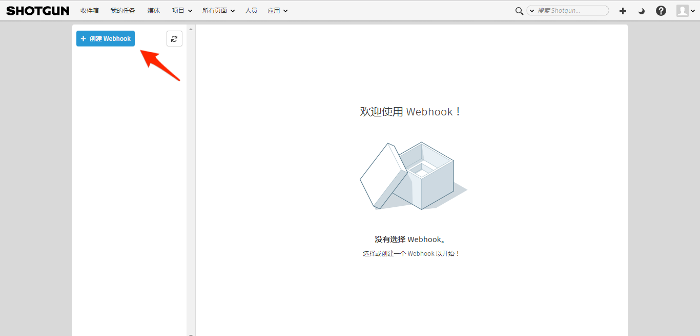
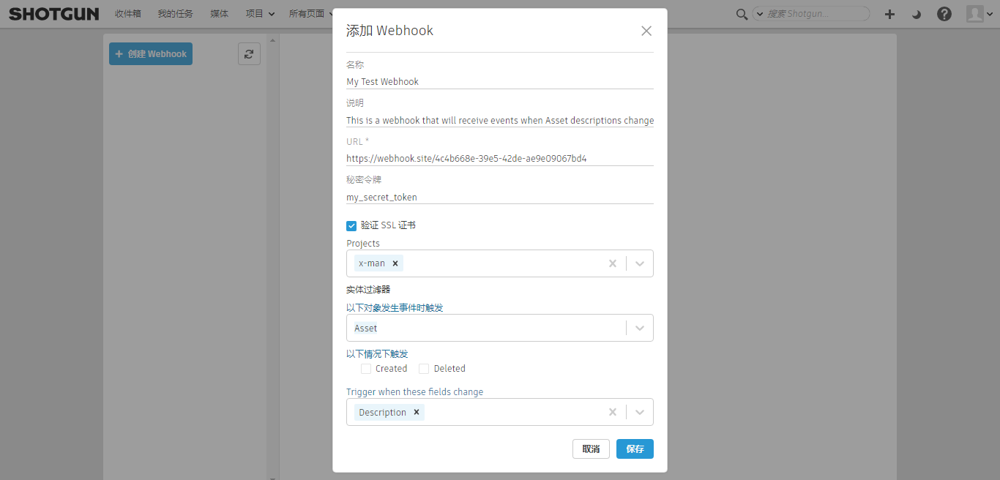
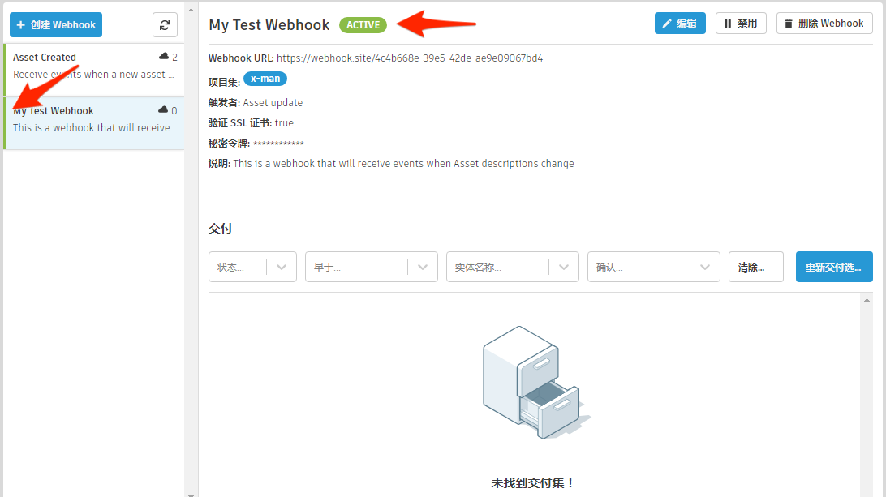
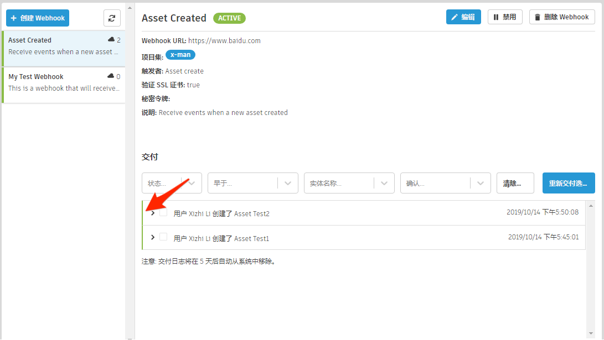
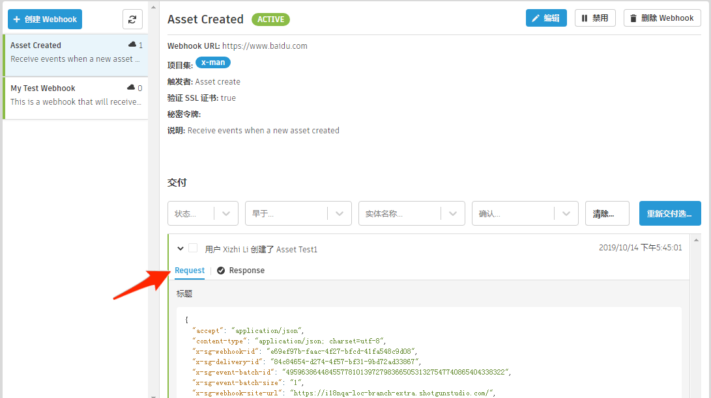

# Webhook



Webhook 允许向您控制的服务通知  中发生的事件。当您创建 Webhook 时，需指定感兴趣的事件类型，并告诉  在该事件触发后要将数据发送至哪个 URL。 中发生相关事件后，会将描述事件的数据的有效负载发送到 Webhook 的 URL。这样就可以构建与  的紧密集成并使工作流的某些部分实现自动化。

## 有哪些示例说明 Webhook 的用法？

我们提供了很多 Webhook 用例。本文档中概述了一些我们认为非常吸引人的用例，但其用途并不仅限于这些示例。

### 创建实体后在磁盘上创建目录结构

我们看到重复出现多次的一个工作流就是，在  中创建新实体后需要在磁盘上创建目录结构。为何不提前准备，确保在  中创建新镜头后即可自动供艺术家使用？

### 状态管理自动化

当动画团队完成工作后，为何不提前准备，更改同一镜头中下游任务的状态，以指示可以开始执行更多工作？这样，您就可以自动通知不同领域的指定艺术家一切都已准备就绪！

另一个说明如何自动进行状态管理的示例是，在创建新的 `Note` 后触发 `Task` 实体状态更改。这是一种很好的方法，可以告知艺术家和制作团队，主管在审核会话后已请求更改或修复当前作品。

## 何时应使用 Webhook，而不是  事件进程？

Webhook 和 [ 事件进程](https://github.com/shotgunsoftware/shotgunEvents/wiki)提供类似的功能，但存在一些关键区别。事件进程要求您运行、监视和维护自己的服务。您的所有代码都必须使用 Python 编写，并且允许您启动自己的  连接。相反，Webhook 会应答连接，并且可以使用任何编程语言编写。它们可以在无服务器环境中托管，例如 [AWS Lambda](https://aws.amazon.com/cn/lambda)，也可以触发任何在线提供的自动化平台，例如 [Zapier](https://zapier.com) 和 [IFTTT](https://ifttt.com)。如果您的用例用到 Webhook，这应该是首选解决方案。

## 创建 Webhook

要开始创建 Webhook，请转到 Webhook 页面，然后导航至 Webhook 列表上方的按钮。对 Webhook 的访问通过“高级 > 显示 Webhook”(Advanced > Show Webhooks)权限进行控制。对于默认管理员和经理角色会启用此权限。



接下来是填写创建新 Webhook 所需的信息。



### 秘密令牌

为 Webhook 指定秘密令牌是可选的。如果提供，任何发送至 Webhook URL 的请求都会使用该令牌进行签名。令牌值作为名为 `X-SG-SIGNATURE` 的标题随请求一起发送。使用 HMAC 与 SHA1 计算签名，并且签名的消息是请求的 JSON 主体。

#### 标题格式

`<algorithm>=<signature>`

#### 为何使用秘密令牌？

尽管不是严格要求，但提供秘密令牌可以对发送到 Webhook URL 的有效负载进行签名。这允许使用者服务验证数据是否来自预期的源，并且有效负载在传输过程中没有发生任何改变。

#### 签名验证

下面使用 Python 举例说明如何验证有效负载的签名。

```
>>> import hmac
>>> import hashlib
>>> body | `<json body>'
>>> token | `mytoken'
>>> 'sha1=' + hmac.new(token, body, hashlib.sha1).hexdigest()  == 'sha1=32824e0ea4b3f1ae37ba8d67ec40042f3ff02f6c'
True
```

### 验证 SSL 证书

验证 SSL 证书是一项可选功能，该功能可帮助确保到 Webhook 的使用者 URL 的任何连接的安全性。如果启用，则向 Webhook 的 URL 交付内容时， 将使用 OpenSSL 的证书验证例程来验证证书。

## Webhook 状态

一个 Webhook 可以有以下几种不同的状态，以指示其运行状况和继续接收交付内容的能力。



| 状态(Status) | 示例 | 说明 |
|--------|:-------:|:-----------:|
| 活动 |  | Webhook 运行稳定。在过去 24 小时内，向此 Webhook 的使用者 URL 进行的交付都已到达其目的地。 |
| 不稳定 |  | Webhook 运行不稳定。在过去 24 小时内，某些交付未能到达其目的地，但不足以导致  将 Webhook 视为终止。 |
| 失败 |  | Webhook 被视为终止，且不会再尝试交付。这是因为在短时间内出现太多交付失败，且系统已确定不应再将 Webhook 视为可行。**如果在过去 24 小时内出现 10 次交付失败，Webhook 将被视为失败**。 |
| 禁用 |  | Webhook 处于禁用状态，并且在重新启用之前，不会再尝试进行任何交付。 |

## 交付

在 Webhook 列表中选择一个 Webhook 将显示七天以来向该 Webhook 发起的所有交付。



### 交付状态

交付状态指示是否已成功交付到 Webhook 的 URL。



### 交付详细信息

交付可展开以显示有关发送到此 Webhook URL 的请求以及对此请求的响应的详细信息。



#### 请求有效负载

发送到 Webhook URL 的有效负载包含描述在  中发生的事件及其触发者的信息。它以 JSON 格式提供。



##### 有效负载示例

```json
{
  "data": {
    "id": "95.0",
    "meta": {
      "type": "attribute_change",
      "entity_id": 758,
      "new_value": "This is the newest description ever!!",
      "old_value": "This is the old description!",
      "entity_type": "Asset",
      "attribute_name": "description",
      "field_data_type": "text"
    },
    "user": {
      "id": 113,
      "type": "HumanUser"
    },
    "entity": {
      "id": 758,
      "type": "Asset"
    },
    "project": {
      "id": 65,
      "type": "Project"
    },
    "operation": "update",
    "created_at": "2019-07-12 21:14:36.598835",
    "event_type": "Shotgun_Asset_Change",
    "session_uuid": "07473c00-a4ea-11e9-b3b8-0242ac110006",
    "attribute_name": "description",
    "event_log_entry_id": 248249
  }
}
```

##### 会话 UUID

事件有效负载的一部分是在  中触发事件的 `session_uuid`。此值可以提供给 [ 的 Python API](https://developer.shotgridsoftware.com/python-api/reference.html?highlight=session_uuid#shotgun_api3.shotgun.Shotgun.set_session_uuid)，这将导致具有该 session_uuid 的任何已打开浏览器会话为 API 生成的事件显示更新。

### 响应交付

Webhook 使用者服务必须响应交付，这样系统才会将其视为已成功交付。



系统会记录每个交付的处理时间，您可以在“响应详细信息”(Response details)选项卡中查看该时间。

#### 限制

您的使用者响应交付的时间将影响您站点的 Webhook 吞吐量。
每个站点允许的响应时间为 1 分钟。因此，如果某个站点的所有已配置使用者端点都需要整整 6 秒时间来响应，则该站点的 Webhook 交付限制为每分钟 10 个。

如果需要较高的整体吞吐量，则应根据以下模型设计使用者端点：
1. 接收请求
2. 生成另一个进程/线程以按所需方式对其进行处理
3. 立即回答确认 200

#### 状态代码

| 状态(Status) | 代码 | 说明 |
|--------|:----:|:-----------:|
| 成功 | < 400 | 交付已接收并成功处理。 |
| 错误 | >= 400 | 交付已接收，但未成功处理。 |
| 重定向 | 3xx | 交付已接收，但应重定向到其他 URL。 |

### 确认

可以更新交付，使其包含确认。进行交付后，标题将作为请求的一部分提供。标题中包含交付记录的 ID（存储在 `x-sg-delivery-id` 键中）。此 ID 可以用于更新交付记录，以使用 [ REST API](https://developer.shotgridsoftware.com/rest-api) 包含确认。



#### 标题示例

```json
{
  "accept": "application/json",
  "content-type": "application/json; charset=utf-8",
  "x-sg-webhook-id": "30f279a0-42a6-4cf2-bb5e-6fc550d187c8",
  "x-sg-delivery-id": "dea7a71d-4896-482f-b238-b61820df8b65",
  "x-sg-event-batch-id": "1",
  "x-sg-event-batch-size": "4",
  "x-sg-webhook-site-url": "http://yoursite.shotgunstudio.com/",
  "x-sg-event-batch-index": "3"
}
```

#### 确认有什么用途？

确认允许在带外详细报告对 Webhook URL 已成功接收的交付的处理是成功还是失败。这会将从  接收交付的状态与此次交付的关联事件处理成功还是失败分开。通过这种方式，成功交付的事件可以包含其他信息以用于调试。一个很好的示例是在创建 `Asset` 实体时触发的 Webhook。如果该 Webhook 的职责是为每个新 `Asset` 在磁盘上创建目录结构，则 Webhook URL 可以成功接收交付，但由于磁盘或网络故障无法创建关联的目录。然后它可以使用详细的错误消息更新交付记录，说明未创建目录结构及其原因。

## 测试 Webhook

您可以使用任何在线免费提供的 Webhook URL 生成器进行测试。这些服务专门用于测试 Webhook 和其他类型的 HTTP 请求。这是快速了解 Webhook 的好方法，无需在自己的网络上设置任何基础设施。

### 使用 webhook.site

我们建议使用 [webhook.site](https://webhook.site)。它提供了可复制并粘贴到 Webhook 的唯一 URL，并且向您实时显示向该地址执行的交付。可以自定义页面，以便对具有特定状态代码和正文的交付做出响应，这意味着您可以测试交付是成功还是失败。

webhook.site 服务存在严格的速率限制。这意味着，最后很容易出现某些交付被拒绝，从而导致 Webhook 不稳定或失败的情况。在测试时，建议您使用已知且可控制的项目环境，而不是生产环境中的实时数据。


