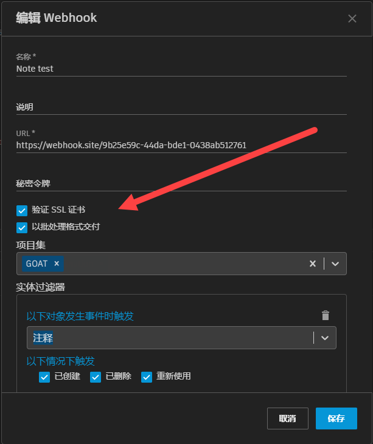

# 批量交付

## 启用批量交付

您可以选择将您的 Webhook 配置为使用批处理有效负载格式发出请求，方法是选中“以批处理格式交付”(Deliver in Batched Format)选项。
如果启用此选项，则在发出每个请求时，它将在其有效负载中最多批处理 50 个待处理交付。

这有助于管理对因在很短时间内生成许多 SG 事件而突然出现的大量交付进行的处理。在典型的系统操作下，当订阅的事件生成频率超过 2 秒一次时，将出现每个有效负载多个交付的情况。



## 响应交付

如果启用批量交付，建议将您的接收服务设计为保证响应的速度远快于每个事件 1 秒。否则，在批较大时，超时和 Webhook 失败的风险将会增大。



#### 非批量交付 Webhook

- 允许的超时上限为每个交付 6 秒。即 Webhook 端点必须在 6 秒内响应每个请求。

#### 批量交付 Webhook

- 允许的超时上限为每个批 6 秒或批中每个事件 1 秒（以最大值为准）。
- 仍存在以下限制：所有 Webhook 中每个 ShotGrid 站点 Webhook 端点响应时间为 1 分钟。

## Webhook 交付格式比较

#### 非批量交付 Webhook 消息正文（始终为 1 个交付）：

```json
{
  "data": {
    "id": "119.110.0",
    "event_log_entry_id": 479004,
    "event_type": "Shotgun_Asset_Change",
    "operation": "update",
    "user": { "type": "HumanUser", "id": 24 },
    "entity": { "type": "Asset", "id": 1419 },
    "project": { "type": "Project", "id": 127 },
    "meta": {
      "type": "attribute_change",
      "attribute_name": "code",
      "entity_type": "Asset",
      "entity_id": 1419,
      "field_data_type": "text",
      "old_value": "Cypress test asset for Webhooks deliveries",
      "new_value": "Revised test asset for Webhooks deliveries"
    },
    "created_at": "2021-02-22 17:40:23.202136",
    "attribute_name": "code",
    "session_uuid": null
  },
  "timestamp": "2021-02-22T17:40:27Z"
}
```

#### 批量交付 Webhook 消息正文（可能包含 1 到 50 个交付）

启用了批处理时，将始终显示 `deliveries` 键，即使批中只有 1 个事件也是如此。其值是单个事件交付数据数组，此处为每个交付提供的信息与非批处理模式相同。

```json
{
  "timestamp": "2021-02-22T18:04:40.140Z",
  "data": {
    "deliveries": [
      {
        "id": "170.141.0",
        "event_log_entry_id": 480850,
        "event_type": "Shotgun_Asset_Change",
        "operation": "update",
        "user": { "type": "HumanUser", "id": 24 },
        "entity": { "type": "Asset", "id": 1424 },
        "project": { "type": "Project", "id": 132 },
        "meta": {
          "type": "attribute_change",
          "attribute_name": "code",
          "entity_type": "Asset",
          "entity_id": 1424,
          "field_data_type": "text",
          "old_value": "Cypress test asset for Webhooks deliveries",
          "new_value": "Revised test asset for Webhooks deliveries"
        },
        "created_at": "2021-02-22 18:04:39.198641",
        "attribute_name": "code",
        "session_uuid": null
      },
      {
        "id": "170.141.1",
        "event_log_entry_id": 480851,
        "event_type": "Shotgun_Asset_Change",
        "operation": "update",
        "user": { "type": "HumanUser", "id": 24 },
        "entity": { "type": "Asset", "id": 1424 },
        "project": { "type": "Project", "id": 132 },
        "meta": {
          "type": "attribute_change",
          "attribute_name": "description",
          "entity_type": "Asset",
          "entity_id": 1424,
          "field_data_type": "text",
          "old_value": null,
          "new_value": "Some other *description*"
        },
        "created_at": "2021-02-22 18:04:39.212032",
        "attribute_name": "description",
        "session_uuid": null
      }
    ]
  }
}
```
