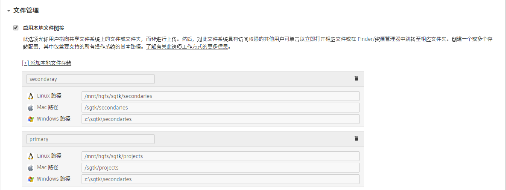

# 如何将我的配置修改为使用多个存储根目录？

我们提供的默认配置设置为使用单个本地存储根目录（即，所有项目文件都存储在单个根目录点下，如 `/sgtk/projects`）。您可能需要添加新的存储根来存储您的部分项目文件。例如，磁盘空间不足或者某些媒体需要位于更快的存储上时，经常会出现这种情况。
假设您想要添加另一个名为“secondary”的根。以下是您需要执行的步骤：

## 在  中添加本地存储

- 在  中，导航到**“管理 > 站点偏好设置”(Admin > Site Preferences)**页面
- 打开**“文件管理”(File Management)**部分
- 单击**“[+] 添加本地文件存储”([+] Add Local File Storage)**
- 填写名称（“secondary”）以及存储根在所有相关平台上的路径。*如果您使用的不是特定平台，只需将其留空。*
- 单击页面顶部或底部的**“保存页面”(Save Page)**按钮

## 将新存储根添加到工作流配置中

Toolkit 在 `config/core/roots.yml` 文件中缓存工作流配置中使用的本地存储相关信息。编辑此文件以添加刚刚在  中创建的新 **secondary** 存储根：

    primary: {
        linux_path: /mnt/hgfs/sgtk/projects,
        mac_path: /sgtk/projects,
        windows_path: 'z:\sgtk\projects'
    }
    secondary: {
        linux_path: /mnt/hgfs/sgtk/secondaries,
        mac_path: /sgtk/secondaries,
        windows_path: 'z:\sgtk\secondaries'
    }



## 修改数据结构以使用新的本地存储根

您已定义新存储根并且 Toolkit 基本上了解了该存储根，现在，您需要决定如何在您的目录结构中使用该存储根。本例中，假设您希望将所有资产工作转到 secondary 存储中，而所有镜头工作转到 primary 存储中。您可能会在 `config/core/schema` 中将您的数据结构设置为如下所示：

**config/core/schema/project.yml**

    # the type of dynamic content
    type: "project"

    # name of project root as defined in roots.yml
    root_name: "primary"

**config/core/schema/secondary.yml**

    # the type of dynamic content
    type: "project"

    # name of project root as defined in roots.yml
    root_name: "secondary"

您还需要修改其过滤器中引用根的任何 YAML 文件。
例如，如果您的 secondary 文件夹下某处存在 asset.yml，则需要更新过滤器，以使其根据 secondary 文件夹值过滤项目。

    filters:
        - { "path": "project", "relation": "is", "values": [ "$secondary" ] }
        - { "path": "sg_asset_type", "relation": "is", "values": [ "$asset_type"] }

## 更新模板路径以指定要使用的存储根

最后，您将更新1在 `config/core/templates.yml` 文件中定义的路径以指定要使用的存储根，同时根据需要更新任意路径。请记住，您的模板路径与数据结构形影不离，它们需要匹配。如果定义的模板路径与数据结构中定义的路径未正确匹配，将会出现错误。

例如，由于我们希望所有资产工作保存在 secondary 存储上，因此为了更新 maya_asset_work 模板路径，我们需要将其修改为如下所示：

    maya_asset_work:
        definition: '@asset_root/work/maya/{name}.v{version}.ma'
        root_name: 'secondary'

您应该对 `config/core/templates.yml` 文件中的每个模板路径采用与此相同的模式。为每个路径指定正确的 `root_name`（**primary** 或 **secondary**）。



1 *值得注意的是，更新路径可能并不理想，因为一旦设置新值，Toolkit 将无法访问使用先前值创建的旧文件（例如，更改旧工作文件的模板路径后，Toolkit 将找不到这些文件）。如果您担心这一点，可以使用新位置创建新模板（例如，houdini_shot_publish_v2）并升级您的应用以使用该新版本。并非所有应用都会处理诸如此类的回退概念，但这将支持某些应用识别旧文件。这不会影响发布，因为它们始终链接到其在  中的发布。*
