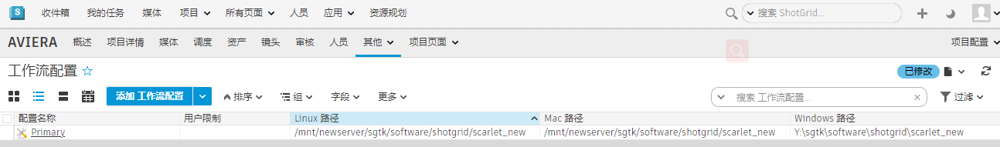

# 如何将我的工作流配置移动到新位置？



要将工作流配置移动到新位置，最简单的方法是使用 `tank move_configuration` 命令。该命令将移动文件，更新 ，并更新配置文件以指向新位置。

以下情况下此命令也非常有用：您仅移动单个操作系统的位置，或者以前未使用某个操作系统，但现在想添加该操作系统。Toolkit 将检测需要移动或添加的内容以及不需要移动或添加的内容，同时还会向您显示即将执行的操作，以便您在继续操作之前进行确认。

- [使用 tank move_configuration 命令](#using-the-tank-move_configuration-command)
- [手动移动工作流配置](#manually-moving-your-pipeline-configuration)



## 使用 tank move_configuration 命令：

        $ cd /sgtk/software/shotgun/scarlet
        $ ./tank move_configuration

        Welcome to the  Pipeline Toolkit!
        For documentation, see https://toolkit.shotgunsoftware.com
        Starting Toolkit for your current path '/sgtk/software/shotgun/scarlet'
        - The path is not associated with any  object.
        - Falling back on default project settings.
        - Using configuration 'Primary' and Core v0.15.22
        - Setting the Context to Scarlet.
        - Running command move_configuration...

        ----------------------------------------------------------------------
        Command: Move configuration
        ----------------------------------------------------------------------

        Syntax: move_configuration linux_path windows_path mac_path

        This will move the location of the given pipeline configuration.
        You can also use this command to add a new platform to the pipeline
        configuration.

        Current Paths
        --------------------------------------------------------------

        Current Linux Path:   '/mnt/hgfs/sgtk/software/shotgun/scarlet'
        Current Windows Path: 'z:\sgtk\software\shotgun\scarlet'
        Current Mac Path:     '/sgtk/software/shotgun/scarlet'

        You typically need to quote your paths, like this:

        > tank move_configuration "/linux_root/my_config" "p:\configs\my_config"
        "/mac_root/my_config"

        If you want to leave a platform blank, just just empty quotes. For example, if
        you want a configuration which only works on windows, do like this:

        > tank move_configuration "" "p:\configs\my_config" ""

### 示例：

        $ cd /sgtk/software/shotgun/scarlet
        $ ./tank move_configuration "/mnt/hgfs/sgtk/software/shotgun/scarlet_new" "z:\sgtk\software\shotgun\scarlet_new" "/sgtk/software/shotgun/scarlet_new"

        Welcome to the  Pipeline Toolkit!
        For documentation, see https://toolkit.shotgunsoftware.com
        Starting toolkit for path '/sgtk/software/shotgun/scarlet'
        - The path is not associated with any  object.
        - Falling back on default project settings.
        - Using configuration 'Primary' and Core v0.15.22
        - Setting the Context to Scarlet.
        - Running command move_configuration...

        ----------------------------------------------------------------------
        Command: Move configuration
        ----------------------------------------------------------------------

        Current Paths
        --------------------------------------------------------------
        Current Linux Path:   '/sgtk/software/shotgun/scarlet'
        Current Windows Path: 'z:\sgtk\software\shotgun\scarlet'
        Current Mac Path:     '/sgtk/software/shotgun/scarlet'

        New Paths
        --------------------------------------------------------------
        New Linux Path:   '/mnt/hgfs/sgtk/software/shotgun/scarlet_new'
        New Windows Path: 'z:\sgtk\software\shotgun\scarlet_new'
        New Mac Path:     '/sgtk/software/shotgun/scarlet_new'

        The configuration will be moved to reflect the specified path changes.

        Note for advanced users: If your configuration is localized and you have other
        projects which are linked to the core API embedded in this configuration,
        these links must be manually updated after the move operation.

        Are you sure you want to move your configuration? [Yes/No] yes
        Copying '/sgtk/software/shotgun/scarlet' -> '/sgtk/software/shotgun/scarlet_new'
        Copying /sgtk/software/shotgun/scarlet/cache...
        Copying /sgtk/software/shotgun/scarlet/config...
        Copying /sgtk/software/shotgun/scarlet/config/core...
        Copying /sgtk/software/shotgun/scarlet/config/core/hooks...
        Copying /sgtk/software/shotgun/scarlet/config/core/schema...
        Copying /sgtk/software/shotgun/scarlet/config/env...
        Copying /sgtk/software/shotgun/scarlet/config/env/includes...
        Copying /sgtk/software/shotgun/scarlet/config/hooks...
        Copying /sgtk/software/shotgun/scarlet/config/icons...
        Copying /sgtk/software/shotgun/scarlet/install...
        Copying /sgtk/software/shotgun/scarlet/install/apps...
        Copying /sgtk/software/shotgun/scarlet/install/apps/app_store...
        Copying /sgtk/software/shotgun/scarlet/install/core...
        Copying /sgtk/software/shotgun/scarlet/install/core/python...
        Copying /sgtk/software/shotgun/scarlet/install/core.backup...
        Copying /sgtk/software/shotgun/scarlet/install/core.backup/20150518_143244...
        Copying /sgtk/software/shotgun/scarlet/install/core.backup/20150518_143940...
        Copying /sgtk/software/shotgun/scarlet/install/engines...
        Copying /sgtk/software/shotgun/scarlet/install/engines/app_store...
        Copying /sgtk/software/shotgun/scarlet/install/frameworks...
        Copying /sgtk/software/shotgun/scarlet/install/frameworks/app_store...
        Updating cached locations in /sgtk/software/shotgun/scarlet_new/config/core/install_location.yml...
        Updating  Configuration Record...
        Deleting original configuration files...

        All done! Your configuration has been successfully moved.

## 手动移动工作流配置



如果您已经开始手动移动数据，但遇到了困难，请按照以下说明，了解您需要更改的内容，以确保 Toolkit 此时继续在新位置使用您的工作流配置。

1. 将您的工作流配置文件移动到新位置

        $ mv /sgtk/software/shotgun/scarlet /mnt/newserver/sgtk/software/shotgun/scarlet_new

2. 编辑 `install_location.yml`，以帮助 Toolkit 找到工作流配置所在的位置：

        $ vi /mnt/newserver/sgtk/software/shotgun/scarlet_new/config/core/install_location.yml

   更新此文件中的路径，以指向工作流配置在所有适用平台上的新位置。如果您未使用平台，请输入空字符串 `''`

        #  Pipeline Toolkit configuration file
        # This file was automatically created by setup_project
        # This file reflects the paths in the primary pipeline

        # configuration defined for this project.
        Windows: 'Y:\sgtk\software\shotgun\scarlet_new'
        Darwin: '/mnt/newserver/sgtk/software/shotgun/scarlet_new'
        Linux: ''

        # End of file.

3. 在  中找到与此项目对应的 PipelineConfiguration 实体，并修改“Linux 路径”(Linux Path)、“Mac 路径”(Mac Path)和“Windows 路径”(Windows Path)字段值，以匹配您在上面所做的更改。

现在，您的工作流配置应该会在新位置按预期工作。

