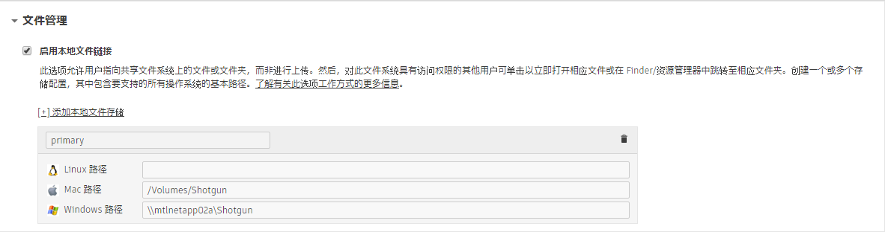

# 如何将我的项目目录移动到新的本地存储根目录？



有时，需要将项目文件（场景文件、渲染等）移动到新的根存储位置（例如，从 `/mnt/smalldrive` 移动到 `/mnt/bigdrive/foo`）。无论您使用的单存储配置还是多存储配置，都可以执行此操作。例如，假设要移动名为**“asset_storage”**的存储：

- 将项目文件从旧位置复制（或移动）到新位置。
- 在  中，导航到**“管理 > 站点偏好设置”(Admin > Site Preferences)**页面并打开**“文件管理”(File Management)**部分。

   
- 将含有每个平台路径的“primary”本地文件存储更新为项目文件的新存储。如果您使用的不是特定平台，请将其留空。
- 单击页面顶部或底部的**“保存更改”(Save Changes)**按钮。
- 更新项目配置中的 `config/core/roots.yml` 文件以匹配刚刚在  中保存的新路径值。

Toolkit 将发布路径保存为存储根的相对路径。因此，使用旧存储根时，路径展开为如下所示：

    [asset_storage]/assets/Character/betty => /mnt/smalldrive/assets/Character/betty

使用新存储根定义时，该路径将展开为如下所示：

    [asset-storage]/assets/Character/betty => /mnt/bigdrive/foo/assets/Character/betty

我们不需要担心在  或 Toolkit 中更新任何其他发布信息！



## 参考

如果您的任何场景文件中含有指向旧路径的参考，您将需要自行更新这些参考，或者创建符号链接，以确保系统对其进行正确解析。

## 版本(Versions)

如果  中的版本实体在受此更改影响的“影片路径”(Path to Movie)或“帧路径”(Path to Frames)字段中存储信息，也需要对这些字段进行更新以指向新位置，因为这些字段是包含媒体绝对路径的字符串字段。