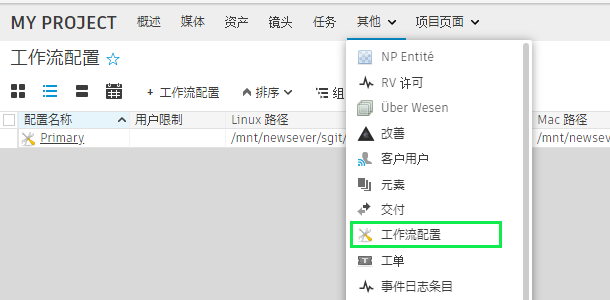
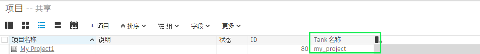

# 如何使用  Desktop 来重新设置 Toolkit 项目？

如果您已为某个项目设置 Toolkit 配置并且需要重新开始， Desktop 中的“高级设置向导”将不允许您重新设置项目，除非已删除以前设置的配置。

以下介绍了如何手动删除这些设置：

1. 在  中删除链接到项目的任何 `PipelineConfiguration` 实体。    
2. 在  中将 `Project` 实体上的 `Tank Name` 字段设置为空白值。    
3. 删除磁盘上的任何相应工作流配置目录。
4. 在  Desktop 中选择您想设置的项目。如果您已经在查看项目，跳出到项目列表视图，然后再回到您的项目。\*\*
5. 现在，可以再次运行项目设置过程。

**替代方法**

如果您习惯使用命令行通过 `tank setup_project` 命令来设置您的项目，您可以在命令结尾添加 `--force` 参数。这样您无需遵循上述手动步骤即可设置以前设置过的项目。

    tank setup_project --force"
