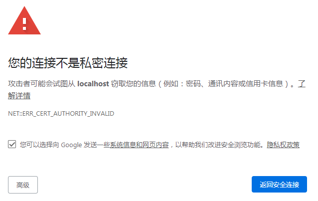
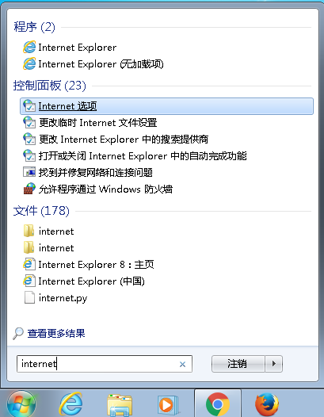
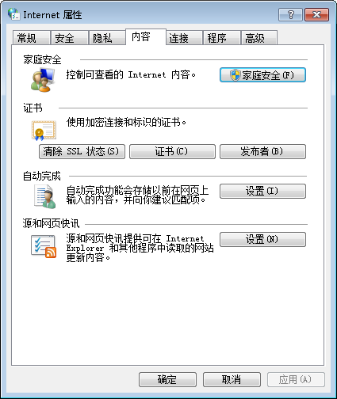
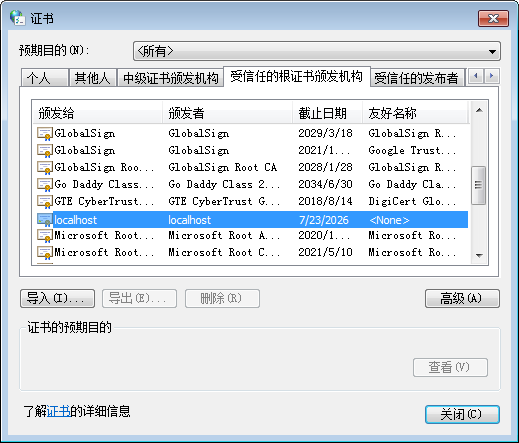
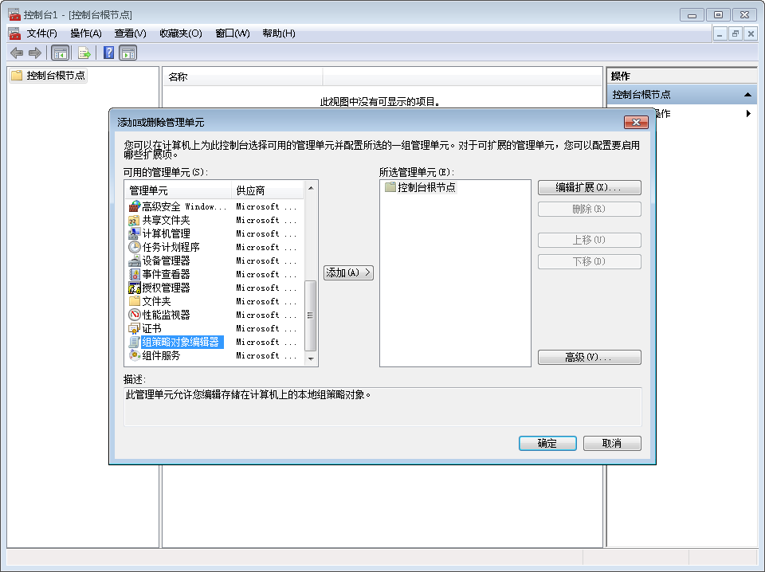
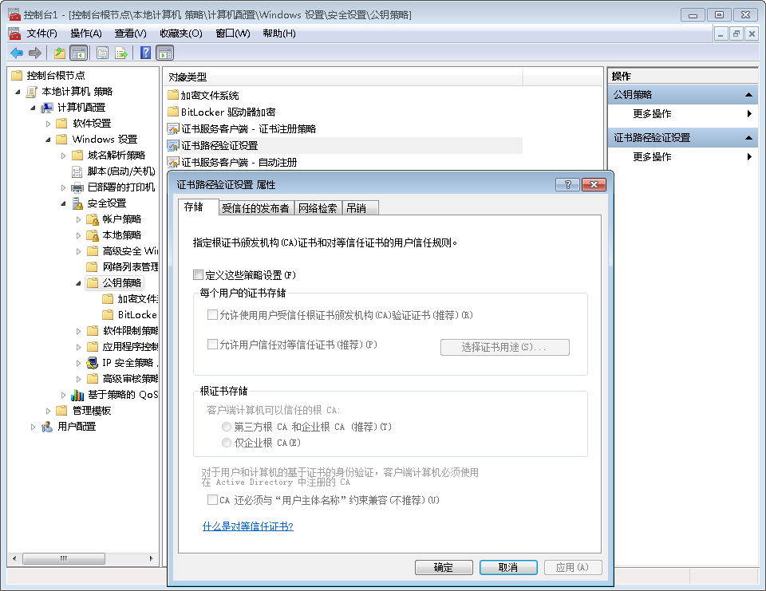

# 我无法通过 Chrome 使用本地文件链接和启动 Toolkit 应用程序

## 概述

在 Shotgun 中，动作菜单有时不显示可用 Toolkit 应用程序的列表，或者在使用本地文件链接时有时会出错，即使 Shotgun Desktop 正在运行中。 这是 Chrome 中的 Shotgun Desktop 浏览器集成的疑难解答手册，希望对您有所帮助。我们为 [Firefox](./cant-use-file-linking-toolkit-app-firefox.md) 提供单独手册。

- [诊断问题](#diagnosing-the-issue)
- [如何快速修复证书问题](#how-to-quickly-fix-certificate-issues)
- [修复所有平台上的 ERR_CERT_COMMON_NAME_INVALID 或 ERR_SSL_SERVER_CERT_BAD_FORMAT](#fixing-neterr_cert_common_name_invalid-and-err_ssl_server_cert_bad_format-on-all-platforms)
- [修复 Windows 上的 ERR_CERT_AUTHORITY_INVALID](#fixing-neterr_cert_authority_invalid-on-windows)

## 诊断问题

### Shotgun Desktop 是否正在运行？

是的，我们知道。您可能已经检查过了，但我们必须要问一下。:)

### Shotgun Desktop 启动后，您是否重新启动了 Chrome？

如果在允许 Shotgun Desktop 注册证书之前便已启动 Chrome（这种情况仅在首次启动 Shotgun Desktop 时发生，之后将不再出现此问题），Chrome 将会使用过期的证书副本并拒绝连接到 Shotgun Desktop。关闭所有选项卡不一定会关闭 Chrome，因此建议您在地址栏中键入 [chrome://restart](chrome://restart/) 并按 Enter 键。这将确保所有 Chrome 相关进程都会终止，之后 Chrome 便会重新启动。

### 您是否正在使用防火墙软件？

确保没有防火墙软件阻止与 localhost 的连接或端口 9000 上的连接。

### Chrome 是否拒绝证书？

您可以浏览到 https://localhost:9000 来确认 Chrome 是否接受证书，这是 Shotgun 网站为了执行本地文件链接和启动 Toolkit 应用程序而尝试访问的网址。您通常会看到以下消息：

另一方面，如果您看到下列消息之一，则表示证书注册过程有问题： 

## 如何快速修复证书问题

规避这些问题的最简单方法就是单击**“高级”(ADVANCED)**和**“Proceed to localhost (unsafe)”**。 这样，Chrome 便会知道您还是接受了证书，并允许 Shotgun 网站与 Shotgun Desktop 通信。





## 修复所有平台上的 NET::ERR_CERT_COMMON_NAME_INVALID 和 ERR_SSL_SERVER_CERT_BAD_FORMAT

Chrome 会定期升级其自签名证书的安全性，这些更新有时会破坏我们的浏览器集成。 遗憾的是，这些类型的问题只能通过重新生成证书的 certificate_path 来修复。

要重新生成证书，可在 Shotgun Desktop 用户菜单的**“高级”(Advanced)**部分下选取**“Regenerate Certificates”**选项。（如果您未看到此选项，请确保更新 `tk-desktop` 插件，以解除对此选项的锁定。）

确认您要重新生成证书后，将会弹出一系列对话框，就像您首次生成证书一样。在 Windows 和 macOS 上，系统将提示您更新 Windows 证书存储或 macOS 密钥链两次：一次用来删除旧证书，一次用来注册新证书。在 Linux 上，注册以静默方式完成。 完成后，重新启动 Shotgun Desktop。

Shotgun Desktop 完成启动并处于运行状态后，建议您在地址栏中键入 [chrome://restart](chrome://restart/) 来重新启动 Chrome，确保已完全关闭 Chrome 并清空其证书缓存。

如果您的计算机未连接到 Internet，无法下载更新，请联系 support@shotgunsoftware.com。

## 修复 Windows 上的 NET::ERR_CERT_AUTHORITY_INVALID

在某些情况下，Windows 将报告证书已成功导入，但不会将其用于需要它的应用程序。访问 Windows 上的证书对话框可以验证此情况。要访问该对话框，请点击 Windows 键并键入**“Internet 选项”**。在**“Internet 属性”**对话框上，切换到**“内容”**选项卡，然后单击**“证书”**按钮。最后，单击**“受信任的根证书颁发机构”**并查找 **localhost**。

如果没有此条目，则表明您的 Windows 域或本地计算机可能存在组策略问题。如果存在此条目，建议您联系我们的[支持团队](https://support.shotgunsoftware.com/hc/requests/new)。

此时，建议您与管理贵组织 Windows 计算机的人员沟通，并向其询问是否有可能已设置为指示 Windows 不信任自签名证书的组策略。

## 调查组策略问题

如果您的计算机在域中，管理员可以尝试[此 StackExchange 帖子](https://superuser.com/questions/145394/windows-7-will-not-install-a-root-certificate/642812#642812)中详述的步骤。

如果您的计算机不在域中，可能是计算机仍被管理员锁定。执行以下步骤时需要 Windows 管理员帐户。

点击 Windows 键，键入 **MMC**，然后按 Enter 键。此时将启动 **Microsoft 管理控制台**。在应用程序中，单击**“文件”**菜单并选择**“添加/删除管理单元”**。此时将显示**“添加或删除管理单元”**对话框。在左侧，搜索**“组策略对象编辑器”**，然后单击**“添加 >”**。将出现一个新对话框，可单击**“完成”**将其关闭。最后，单击**“添加或删除管理单元”**对话框上的**“确定”**。

最后，在主对话框的左侧，导航到**“本地计算机策略/计算机配置/Windows 设置/安全设置/公钥策略”**。选定后，双击中央窗格中的**“证书路径验证设置”**。

在下一个对话框中，确保**“定义这些策略设置”**处于未选中状态。如果选中，请确保**“允许使用用户受信任根证书颁发机构(CA)验证证书(推荐)”**处于选中状态。完成之后，单击**“确定”**，系统会保存这些设置。

此时，需要关闭所有 Chrome 窗口并重新启动 Chrome。建议像前面的操作那样，使用 [chrome://restart](chrome://restart) 执行此操作。必须执行此操作，所做更改才能生效。如果您浏览到证书列表，此时应显示 **localhost** 证书。

如果在上述更改之后使用浏览器集成时仍遇到问题，或者设置在一开始就是正确的，请联系我们的[支持团队](https://support.shotgunsoftware.com/hc/requests/new)。

## 其他操作系统的疑难解答

如果您在其他操作系统上有关于 Shotgun Desktop 集成的问题，请联系我们的[支持团队](https://support.shotgunsoftware.com/hc/zh-cn/requests/new)，以便我们可以为您提供帮助并更新此文章。